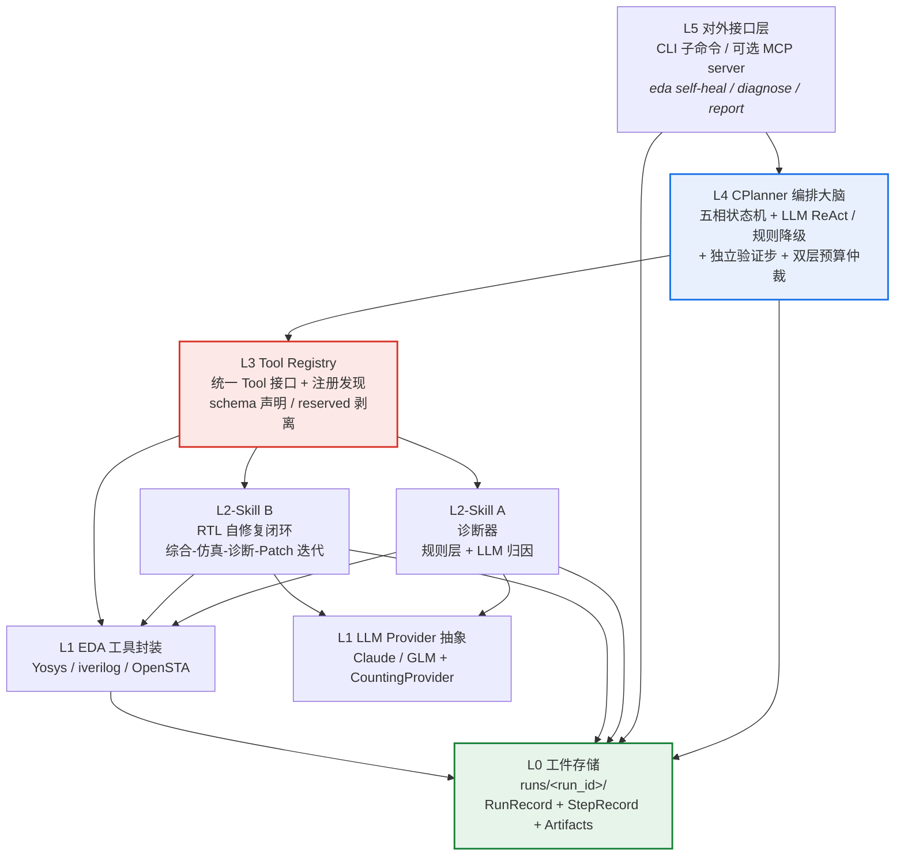
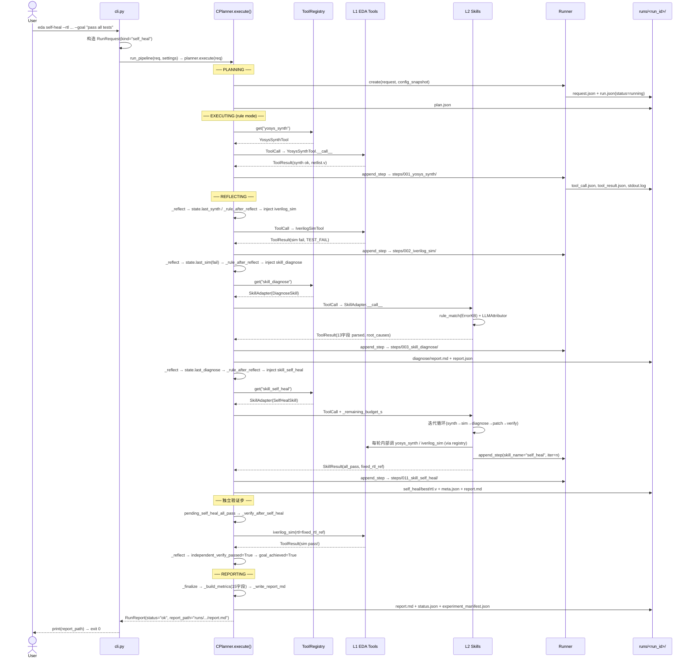
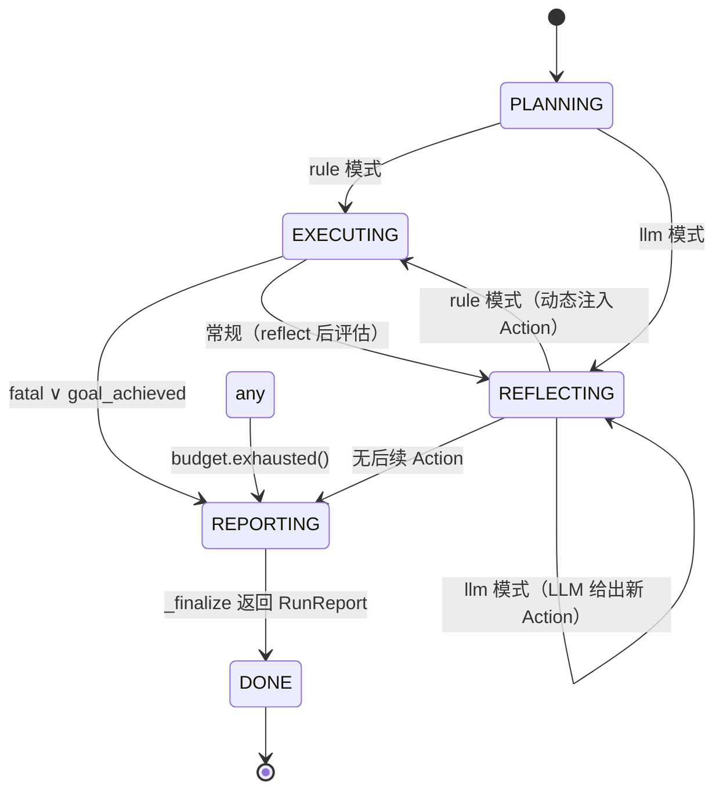

# Agentic EDA Agent System

> Agentic EDA Infra — LLM 驱动的 RTL 自愈流水线（diagnose → patch → 验证 → 归档）
> 团队:2 人核心(AI/Agent/系统) + 1 人非技术(数据/文档/演示)
> 环境:Win11 + RTX3060 Laptop | EDA 工具跑 WSL2 Ubuntu-24.04(yosys 0.33 / iverilog 12.0) | LLM 用智谱 GLM(glm-5.2)

---

## 1. 项目概览

本项目把**芯片设计流程变成可执行闭环**:让 AI 智能体接入 EDA 工具链(Yosys 综合 / iverilog 仿真 / OpenSTA 时序),完成 设计生成 → 仿真验证 → 综合评估 → 错误分析 → 迭代优化 的全自动迭代,而非一次性脚本。

给定一段带 bug 的 RTL 代码和测试激励,系统能自主发现问题、生成修复补丁、验证修复效果,直到通过所有测试或耗尽预算。它不是一个"会循环的 wrapper",而是一个可被反复调用、可追溯每一次实验轨迹的 Agent 流水线,落地为三个核心组件合成的可调用接口(C/A/B),围绕四条工程目标设计:

| 工程目标 | 本项目落点 |
|---|---|
| (1) 真实可跑组件 | A 诊断器 + B 自修复闭环 + Yosys/iverilog/OpenSTA 三 Tool 真跑通(WSL2) |
| (2) 清晰可调用接口 | CLI(`eda self-heal`/`diagnose`/`report`) + Python SDK(`run_pipeline`) + MCP(可选) |
| (3) 实验证据与指标对比 | `runs/` 轨迹 + `experiment_manifest` + `experiment_summary` + baseline 对比 |
| (4) Agentic 充分 | C 默认 LLM planner + B 内部迭代 + patch 回退 + C 独立验证步 |

> 详见 [项目概览与价值定位](docs/wiki/01_项目概览与价值定位.md)。

---

## 2. 五层架构

系统采用严格的**五层分层架构(L0-L5)**,每层只依赖下层公开接口,绝不反向依赖——这一约束写入 `contracts.py` 的 Protocol 定义、`registry.py` 的查找隔离、`skills/base.py` 的 `as_tool` 适配、`c_planner.py` 的构造注入。L0 工件存储不计入业务层,对外统一称"五层"。



| 层 | 职责一句话 |
|---|---|
| **L5 对外接口层** | 把人类一句话需求翻译成系统调用,把产物翻译成报告 |
| **L4 CPlanner(大脑)** | 接到任务后分解成 plan,从 Registry 取 Tool 执行,五相状态机迭代直到目标达成或预算耗尽 |
| **L3 Tool Registry(手脚)** | 所有可被调用的能力(EDA 工具 + Skill)统一注册在此,C 只认 Tool 接口 |
| **L2 Skills** | A 诊断器和 B 自修复闭环是高级技能,内部可调多个 Tool 并自主迭代,但对外仍是单一 Tool |
| **L1 基座** | 具体 EDA 工具的子进程封装 + LLM 调用的 provider 抽象 |
| **L0 工件存储** | 每次运行一个目录,记录完整轨迹(`runs/<run_id>/`) |

> 详见 [五层分层架构总览](docs/wiki/05_五层分层架构总览.md)。

---

## 3. 端到端数据流

下图追踪一次完整的 `self-heal` 请求从 CLI 入口到 `report.md` 落盘的全过程:用户输入解析为 `RunRequest` → CPlanner 五相状态机编排 L1 EDA 工具与 L2 智能 Skill → 自修复闭环内部迭代多轮综合-仿真-诊断-Patch → 独立验证步 → 终态报告与 `experiment_manifest.json`。



> 详见 [端到端数据流与修复报告](docs/wiki/06_端到端数据流与修复报告.md)。

---

## 4. 三大核心组件 C / A / B

### C(CPlanner / Tool-Use 层,L4)— 编排大脑

任务分解 + 工具编排(默认 LLM ReAct)+ 五相状态机(PLANNING → EXECUTING → REFLECTING → REPORTING → DONE)+ 迭代控制 + 独立验证步 + 对外接口(CLI / SDK / MCP)。注意 C **不是 Tool**,不注册进 Registry。实现:`src/eda_agent/planner/c_planner.py`。状态机相位转移逻辑见下节图。

> 详见 [五相状态机:PLANNING 到 DONE](docs/wiki/09_五相状态机Planning到Done.md) 与 [LLM ReAct 回环工具决策](docs/wiki/10_LLMReAct回环工具决策.md)。

### A(EDA 诊断器,L2 skill_diagnose)— 日志归因 + 修复建议

规则层(ErrorKB 正则模式匹配)优先,LLM 归因按需触发,产出 13 字段 `parsed` 结构(根因 / 置信度 / `needs_rtl_patch` / `used_layers`)。**不修复不迭代**:`iterations=1`、`best_iter=-1`,注册为 Tool(skill_diagnose)。实现:`src/eda_agent/skills/diagnose.py`。

> 详见 [EDA 诊断器组件 A 规则层](docs/wiki/14_EDA诊断器组件A规则层.md)。

### B(RTL 自修复闭环,L2 skill_self_heal)— 综合-仿真-诊断-Patch 迭代

主循环 `for iter_n in range(max_iter)`,每轮执行 synth → sim → (sta) → diagnose → patch → re-verify。三策略升级(diff → full_rewrite → diagnose_only)+ 版本栈回退防退化 + 双层预算仲裁 + 五种收敛原因(`all_pass` / `max_iter` / `regression` / `budget` / `none`)。收尾落 `self_heal/best/{rtl.v, meta.json}`,注册为 Tool(skill_self_heal)。实现:`src/eda_agent/skills/self_heal.py`。

> 详见 [RTL 自修复闭环组件 B](docs/wiki/15_RTL自修复闭环组件B.md) 与 [三策略 LLM Patch](docs/wiki/16_三策略LLMPatch.md)。

L2 Skill 通过 `as_tool` 适配层([Skill 到 Tool 适配层](docs/wiki/18_Skill到Tool适配层.md))注册进 L3 Registry,C 在 L4 看来与 L1 的 EDA 工具完全等价。

---

## 5. CPlanner 五相状态机

CPlanner 的 `execute()` 由一个 `while phase != "DONE"` 循环驱动,扁平 dispatch 使所有转移条件在同一处可见,不存在隐式回调或异步状态跳转。循环顶部有预算守卫(`budget.exhausted()` 强制跳转 REPORTING,但 REPORTING 自身豁免),整个循环被 `try/except Exception` 包裹,任何未预期异常由 `_emergency_report` 捕获返回 `status="failed"` 的 RunReport,不向调用方抛出。



> 详见 [五相状态机:PLANNING 到 DONE](docs/wiki/09_五相状态机Planning到Done.md)、[双层预算仲裁与迭代上限](docs/wiki/13_双层预算仲裁与迭代上限.md)、[独立验证步第三方校验](docs/wiki/12_独立验证步第三方校验.md)。

---

## 6. 快速开始

```bash
# 前置:WSL2 Ubuntu-24.04 装好 yosys/iverilog(opensta 可选,未装则 STA 降级)
# LLM key 写入 .env 的 GLM_API_KEY(智谱开放平台 key,key 不进 git)

git clone <repo> && cd eda-agent-system
pip install -e .
cp .env.example .env  # 填入 GLM_API_KEY

# 跑一个 inject bug 的自修复(端到端)
eda self-heal \
    --rtl data/examples/counter_bitwidth/rtl.v \
    --tb  data/examples/counter_bitwidth/tb.v \
    --goal "pass all tests"
# → 打印 runs/<run_id>/report.md 路径,退出码 0=ok / 1=failed / 2=budget_exhausted

# 单点演示 A 诊断器
eda diagnose --rtl data/examples/counter_bitwidth/rtl.v --tb data/examples/counter_bitwidth/tb.v

# 渲染已有 run 的报告
eda report <run_id>      # 退出码 64 = report 不存在

# Python SDK 一行调
python -c "from eda_agent import run_pipeline; from eda_agent.contracts import RunRequest; \
    r = run_pipeline(RunRequest(kind='self_heal', goal='pass all tests', \
    rtl_path='data/examples/counter_bitwidth/rtl.v', \
    tb_path='data/examples/counter_bitwidth/tb.v', max_iter=5), None); print(r.report_path, r.status)"
```

**退出码体系**:`eda self-heal` / `diagnose` → 0=ok / 1=failed / 2=budget_exhausted;`eda report` → 64=report 不存在。

> 详见 [环境搭建与首次运行](docs/wiki/02_环境搭建与首次运行.md) 与 [三子命令 CLI 与退出码](docs/wiki/03_三子命令CLI与退出码.md)。

---

## 8. 文件导航

| 文件 | 角色 | 读者 |
|---|---|---|
| **README.md**(本文件) | 项目目标 + 五层架构 + 数据流 + 组件 + 快速开始 + 已裁决决策 + 进度 | 所有人先读 |
| **ARCHITECTURE.md** | 项目总览(分层 + 端到端数据流 + 契约精华 + 目录树 + Phase 排期 + 风险) | 所有人 |
| **CONTRACTS.md(宪法,权威)— 冲突时以此为准** | 全部 dataclass / Tool/Skill 接口 / 错误码 / 工件协议 | 实现者必读 |
| 验收标准.md | 验收项汇总(可勾选表)+ 验收流程 | 验收者 + 贡献者 |
| 组件A_诊断器.md | A(skill_diagnose)设计文档 — 日志归因 + 修复建议 | A 实现者 |
| 组件B_自修复闭环.md | B(skill_self_heal)设计文档 — RTL 自修复迭代闭环 | B 实现者 |
| 组件C_Planner_ToolUse.md | C(CPlanner)设计文档 — Planner / Tool-Use 层 + CLI/MCP | C 实现者 |
| **docs/wiki/INDEX.md** | zread 自动生成的 31 页深度 wiki 入口(架构 / 状态机 / Tool / Skill / 测试 等) | 深度阅读者 |

代码结构见 ARCHITECTURE.md §4 完整目录树(与 CONTRACTS.md §4 唯一对齐)。

---

## 9. 关键设计决策(已裁决)

带 **[已裁决]** 的决策已关闭,实现者照做;完整清单见 [CONTRACTS.md](CONTRACTS.md) §11(裁决) + §12(minor)与各组件文档 §12。核心裁决项:

1. **planner_mode 默认 `llm`**(rule 仅作降级):LLM 不可用时经 `_call_llm_safe` 降级为空 tool_calls。
2. **best_iter tie-break 取最早达到 best_score 的轮**(`score = num_passed`)。
3. **自修复通过率门槛** = 分组最小通过率 >= 0.50 且 bitwidth 类 >= 1 个 all_pass。
4. **C 在 B 报 `all_pass` 后必须追加独立 `iverilog_sim` 验证步**(B 自报成功 ≠ C 信任,第三方校验通过才置 `goal_achieved`)。
5. **inject bug 由偏 AI 成员写**(非技术成员只标注),`healable=true` 才进 50% 门槛集。
6. **needs_rtl_patch 按 severity 判**(error/fatal → True)。
7. **namespace 表含 diagnose(A)+ heal(B)**,C 按 namespace 聚类读 error_code(二段式 `namespace.code`)。
8. **inject bug RTL 统一放 `data/examples/`**(唯一权威路径)。

关键开放项(不阻塞 MVP,后续迭代定):ErrorKB 是否拆 seed/grown 两文件;Top-1 命中率是否引入 LLM-as-judge;LLM planner 是否支持并行多 tool_calls;MCP server / OpenAICompat 是否后续做。

---

## 10. 实现进度与实验证据

- **Phase 0-6 全完成**:契约 → L1 工具 → L2 Skill → L4 CPlanner → CLI/SDK → 实验/验收,逐步推进每步带 pytest 验证。
- **200+ 单测全绿**,标记策略 `needs_eda`(WSL2 工具) / `needs_llm`(真实 LLM key)。
- **GLM-5.2 e2e 真跑通**:8 个注入 bug 全量实验,总体通过率 87.5%(7/8),分组最小通过率 50% ≥ 50% 门槛,bitwidth 类 2/2 all_pass ≥ 1 门槛 → **S1 硬门槛达标 + 良好线**(综合通过率 0.875)。
- **实验快照**:`runs/eval_snapshot/verdict.md` 汇总 T54 全量 8 bug 结果,聚合规则与通过率门槛见 [实验聚合通过率门槛 S1](docs/wiki/28_实验聚合通过率门槛S1.md)。
- **失败案例透明化**:`tiny_fsm_comb` 与 `tiny_fsm_reset` 标注 `healable=false`(FSM 状态转移自动修复当前 MVP 可靠性不足),系统诚实记录边界。

> 详见 [故障注入清单与基准实验](docs/wiki/27_故障注入清单与基准实验.md) 与 ARCHITECTURE.md §7。

---

## 11. 版本与联系

- **契约版本**:`CONTRACT_VERSION = "0.1.0"`([CONTRACTS.md](CONTRACTS.md) 锚点,`contracts.py` 常量)。
- **文档版本**:本 README 对齐 CONTRACTS.md v1.2 与 docs/wiki/ 深度页(zread 版本 id=2026-07-06-180551)。
- **问题排查顺序**:先 **[CONTRACTS.md](CONTRACTS.md)(权威,冲突时以此为准)** → ARCHITECTURE.md(总览) → 对应组件文档 → docs/wiki/INDEX.md(深度页)。
