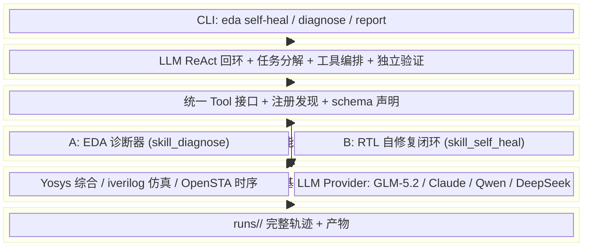
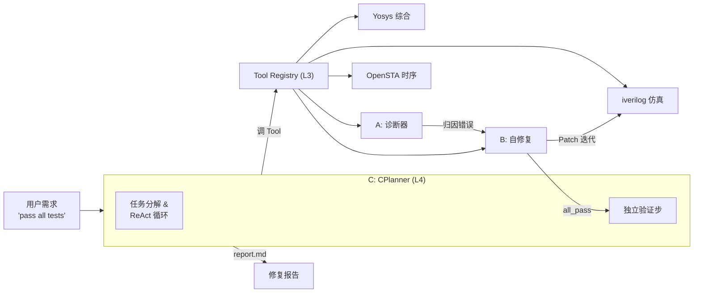

本文档是 Agentic EDA Agent System 的入门起点。你将了解这个系统**是什么**、**为什么存在**、**核心架构如何分层**，以及**从哪里开始阅读后续文档**。无论你是新加入的开发者还是评审者，这里都是理解全貌的第一站。

---

## 一句话定位

**Agentic EDA Agent System 是一个让 AI 智能体接入芯片设计 EDA 工具链、自动完成"综合 → 仿真 → 诊断 → 修复"全闭环的系统。** 它不是一次性脚本，而是一个可被反复调用、可追溯每一次实验轨迹的 Agent 流水线——给定一段带 bug 的 RTL 代码和测试激励，系统能自主发现问题、生成修复补丁、验证修复效果，直到通过所有测试或耗尽预算。

Sources: [README.md](../../README.md)

---

## 项目背景与比赛定位

本项目是 **Agentic4Systems 暑期学校 Hackathon** 的参赛作品，赛道为 Track 01 — Agentic EDA Infra。比赛由北大、中科院计算所、复旦等机构联合发起，核心命题是：**让智能体接入 EDA 工具链，把芯片设计流程变成可执行闭环**——从设计生成、仿真验证、综合评估到错误分析和迭代优化，全程自动化。

比赛设有完赛奖（3000 元，最基础档），评审标准聚焦四个硬指标：**真实可跑的组件、清晰可调用的接口、可复现的实验证据、充分体现 Agentic 特性的设计**。本项目对每一条指标都有明确的落点和验收方式。

| 完赛奖硬指标 | 本系统落点 | 验收方式 |
|---|---|---|
| ① 真实可跑组件 | A 诊断器 + B 自修复闭环 + Yosys/iverilog/OpenSTA 三工具真跑通 | `tests/test_*_tool.py`（`needs_eda` 标记） |
| ② 清晰可调用接口 | CLI（`eda self-heal` / `diagnose` / `report`）+ Python SDK（`run_pipeline`） | 直接命令行调用，退出码 0/1/2 |
| ③ 实验证据与指标对比 | `runs/` 轨迹 + `experiment_manifest.json` + baseline 对比 | `scripts/summarize_eval.py` 聚合产出 |
| ④ EDA 三赛道且 Agentic | C 默认 LLM ReAct planner + B 内部迭代 + patch 回退 + C 独立验证步 | 端到端 e2e 测试必过 |

Sources: [ARCHITECTURE.md](../../ARCHITECTURE.md), [README.md](../../README.md)

---

## 五层分层架构总览

系统采用严格的**五层分层架构**（L0-L5），每层只依赖下层接口，绝不反向依赖。这种设计保证了关注点分离——你可以在任何一层做修改而不波及其他层。

各层职责一句话概括：

- **L5 对外接口层**：把人类一句话需求翻译成系统调用，把产物翻译成报告。
- **L4 CPlanner（大脑）**：接到任务后分解成 plan，从 Registry 取 Tool 执行，迭代直到目标达成或预算耗尽。
- **L3 Tool Registry（手脚）**：所有可被调用的能力（EDA 工具 + Skill）统一注册在此，C 只认 Tool 接口。
- **L2 Skills**：A 诊断器和 B 自修复闭环是高级技能，内部可调多个 Tool 并自主迭代，但对外仍是单一 Tool。
- **L1 基座**：具体 EDA 工具的子进程封装 + LLM 调用的 provider 抽象。
- **L0 工件存储**：每次运行一个目录，记录完整轨迹。

Sources: [ARCHITECTURE.md](../../ARCHITECTURE.md), [CONTRACTS.md](../../CONTRACTS.md)

---

## 三大核心组件：A / B / C

系统由三个核心组件构成，代号简洁但角色分明。理解 A、B、C 的分工，是理解整个系统的关键。

| 代号 | 角色 | Registry 名称 | 实现文件 | 核心能力 |
|---|---|---|---|---|
| **C** | Planner / Tool-Use 层 | （非 Tool） | [planner/c_planner.py](../../src/eda_agent/planner/c_planner.py) | 任务分解 + 工具编排 + 迭代控制 + 对外接口 |
| **A** | EDA 诊断器 | `skill_diagnose` | [skills/diagnose.py](../../src/eda_agent/skills/diagnose.py) | 日志归因 + 修复建议，从 ToolResult 提取 ErrorItem |
| **B** | RTL 自修复闭环 | `skill_self_heal` | [skills/self_heal.py](../../src/eda_agent/skills/self_heal.py) | 综合 → 仿真 → 诊断 → LLM Patch 迭代，带版本回退 |

**一次端到端自修复的数据流**：用户输入 RTL + 测试激励 → CLI 解析为 `RunRequest` → CPlanner 创建 `RunRecord` 并进入 plan-execute 循环 → 依次调用 Yosys 综合、iverilog 仿真 → 若失败，调 A 诊断归因 → 调 B 自修复（LLM 生成 Patch → 重新仿真 → 版本回退保护） → B 报 `all_pass` 后 C 追加**独立验证步**确保可信 → 落盘 `report.md`。

Sources: [README.md](../../README.md), [CONTRACTS.md](../../CONTRACTS.md), [ARCHITECTURE.md](../../ARCHITECTURE.md)

---

## 技术栈速览

系统在设计上刻意保持轻量——不依赖 LangChain/LangGraph 等重框架，所有 Agent 循环逻辑自研。

| 维度 | 技术选型 | 说明 |
|---|---|---|
| **语言** | Python ≥ 3.10 | Agent 层纯 Python，无 GPU 依赖 |
| **EDA 工具** | Yosys ≥ 0.30 / iverilog ≥ 12.0 / OpenSTA ≥ 2.3 | 运行在 WSL2 Ubuntu-24.04 |
| **LLM 主力** | 智谱 GLM-5.2（Coding Plan） | OpenAI 兼容端点，思考模式 + max 推理 |
| **LLM 备用** | Anthropic Claude (claude-sonnet-4) | 经 provider 抽象可热切换 |
| **LLM 扩展** | Qwen-Plus / DeepSeek（加分项） | OpenAICompatProvider 适配 |
| **CLI 框架** | argparse（标准库） | 三子命令：`self-heal` / `diagnose` / `report` |
| **Schema 校验** | jsonschema ≥ 4 | args schema 校验，reserved 字段豁免 |
| **配置** | TOML（settings.toml）+ 环境变量 | API key 不进文件、不进 git |
| **测试** | pytest，200+ 单测 | `needs_eda` / `needs_llm` 标记策略 |

Sources: [pyproject.toml](../../pyproject.toml), [settings.toml](../../settings.toml), [settings.py](../../src/eda_agent/settings.py#L29-L66)

---

## 项目目录结构一览

```mermaid
graph TD
    Root["eda-agent-system/"]
    Root --> SRC["src/eda_agent/ — 核心代码"]
    Root --> DATA["data/ — 实验数据"]
    Root --> TESTS["tests/ — 200+ 单测"]
    Root --> SCRIPTS["scripts/ — 实验脚本"]
    Root --> RUNS["runs/ — 运行产物"]
    Root --> DOCS["docs/ — 测试/验证报告"]

    SRC --> CONTR["contracts.py — 契约(宪法)"]
    SRC --> CLI["cli.py — CLI 入口"]
    SRC --> REG["registry.py — Tool 注册中心"]
    SRC --> RUNNER["runner.py — 工件存储 L0"]
    SRC --> SETTINGS["settings.py — 配置"]
    SRC --> ERRORS["errors.py — 错误码 namespace"]
    SRC --> LLM["llm/ — Provider 抽象层"]
    SRC --> TOOLS["tools/ — EDA 工具封装"]
    SRC --> SKILLS["skills/ — A 诊断器 / B 自修复"]
    SRC --> PLANNER["planner/ — C CPlanner + 降级"]

    DATA --> EX["examples/ — 8 个注入 bug"]
    DATA --> KB["error_kb.json — 错误知识库"]
    DATA --> FM["fault_manifest.json — 故障清单"]
    DATA --> CORPUS["logs_corpus/ — 诊断语料"]
```

Sources: [ARCHITECTURE.md](../../ARCHITECTURE.md), [目录结构](../../src/eda_agent)

---

## 实验成果与关键指标

系统已用智谱 **GLM-5.2 Coding Plan** 完成全量 8 个注入 bug 的端到端实验，达到完赛奖 S1 达标线。

| 指标 | 数值 | 达标线 | 状态 |
|---|---|---|---|
| **总体通过率** | 87.5%（7/8） | — | ✅ |
| **分组最小通过率** | 50.0%（comb_logic 组） | ≥ 50% | ✅ 达标 |
| **bitwidth 类全通过** | 2/2 all_pass | ≥ 1 个 all_pass | ✅ 达标 |
| **单测数量** | 200+ | — | ✅ 全绿 |

按故障类型分组详情：

| 故障类型 | 总数 | 通过 | 通过率 | 平均迭代 | 平均最佳轮 |
|---|---|---|---|---|---|
| bitwidth（位宽错误） | 2 | 2 | 100% | 5.0 | 2.0 |
| syntax（语法错误） | 2 | 2 | 100% | 5.0 | 2.0 |
| timing_reset（复位错误） | 2 | 2 | 100% | 5.0 | 2.0 |
| comb_logic（组合逻辑） | 2 | 1 | 50% | 5.0 | 0.5 |

> **失败案例**：`tiny_fsm_comb` 和 `tiny_fsm_reset` 两个 FSM 相关的 bug 被标注为 `healable=false`。这不是系统缺陷，而是设计选择——FSM 状态转移逻辑的自动修复在当前 MVP 阶段可靠性不足，系统诚实记录了这些边界。

Sources: [experiment_summary.json](../../experiment_summary.json), [data/fault_manifest.json](../../data/fault_manifest.json#L1-L69), [README.md](../../README.md)

---

## 设计哲学：契约驱动

本项目最突出的工程特色是**契约驱动开发**（Contract-Driven Development）。系统定义了一份"宪法"级别的文档 [CONTRACTS.md](../../CONTRACTS.md)，其中用 Python dataclass / Protocol / type hint 写死了所有核心数据结构和接口签名。三个组件 A、B、C 以及 Tool Registry、工件存储、LLM provider 抽象，都必须严格遵守这份契约。

契约的权威性体现在三个机制上：

1. **CONTRACT_VERSION 锚点**：所有结构化数据的 `parsed._schema.contract_version` 必须与常量 `"0.1.0"` 一致，任何集成方读取数据前先校验，不匹配则抛 `eda.schema_mismatch`。这让 schema 漂移可以被程序化检测。

2. **artifact_ref 工厂函数**：所有跨组件的工件引用必须由 `artifact_ref(run_id, rel_path)` 构造，禁止裸字符串路径或裸字典字面量。这消除了路径解析歧义。

3. **错误码 namespace 体系**：错误码采用二段式 `namespace.code`（如 `synth.error`、`sim.test_fail`、`heal.budget_exhausted`），CPlanner 按 namespace 聚类读取错误信息。

Sources: [CONTRACTS.md](../../CONTRACTS.md), [contracts.py](../../src/eda_agent/contracts.py#L14-L30)

---

## 建议阅读路径

作为初学者，建议按以下顺序阅读 wiki 文档：

**第一阶段 — 快速入门（本阶段）**

1. ✅ **[项目概览与价值定位](01_项目概览与价值定位.md)**（你正在这里）
2. 📌 **[环境搭建与首次运行](02_环境搭建与首次运行.md)** — 如何安装 EDA 工具、配置 LLM key、跑通第一个 `eda self-heal`
3. 📌 **[三子命令 CLI 与退出码体系](03_三子命令CLI与退出码.md)** — `self-heal` / `diagnose` / `report` 的完整用法
4. 📌 **[契约驱动开发哲学](04_契约驱动CONTRACTS权威机制.md)** — 深入理解 CONTRACTS.md 的权威机制

**第二阶段 — 系统架构（建立全局视角）**

5. 📌 **[五层分层架构总览（L0-L5）](05_五层分层架构总览.md)** — 每层的职责边界与依赖规则
6. 📌 **[端到端数据流：从用户需求到修复报告](06_端到端数据流与修复报告.md)** — 一次完整 `self_heal` 的数据流向

**第三阶段 — 深入核心组件**

7. 📌 **[EDA 诊断器（组件 A）](14_EDA诊断器组件A规则层.md)** — 规则层 + LLM 归因
8. 📌 **[RTL 自修复闭环（组件 B）](15_RTL自修复闭环组件B.md)** — 综合-仿真-诊断-Patch 迭代
9. 📌 **[五相状态机：PLANNING 到 DONE 的流转](09_五相状态机Planning到Done.md)** — CPlanner 的状态管理

建议先跑通一个 `eda self-heal` 端到端示例，再带着实际体验进入架构文档，这样理解会更深刻。

---

## 小结

Agentic EDA Agent System 的核心价值在于：**它不是一个"会循环的 wrapper"**，而是一个具备充分 Agentic 特性的系统——LLM ReAct 回环做工具决策、B 组件内部自主迭代修复、版本栈防退化、双层预算仲裁、C 在 B 报通过后追加独立验证步。这些设计决策都被写入契约，有 200+ 单测守护，并有 8 个故障注入 bug 的全量实验数据支撑。接下来的文档将带你逐步深入每一个组件的设计细节。