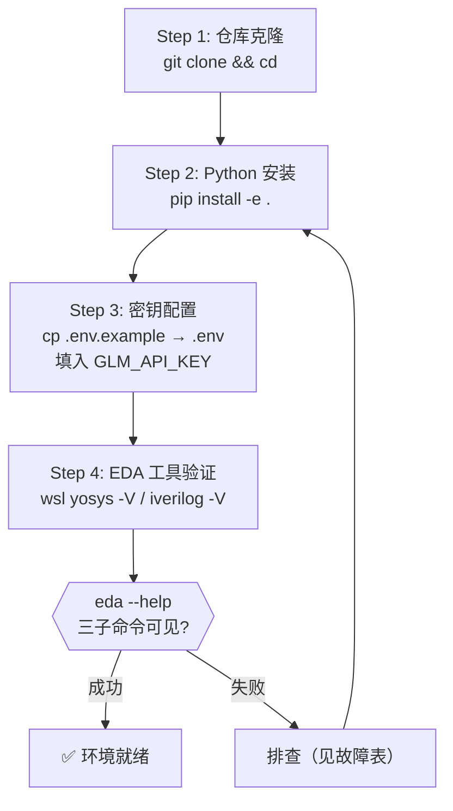
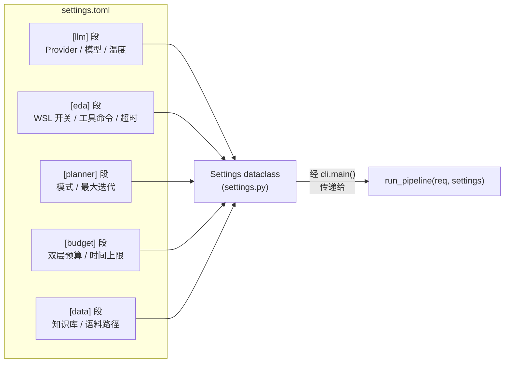
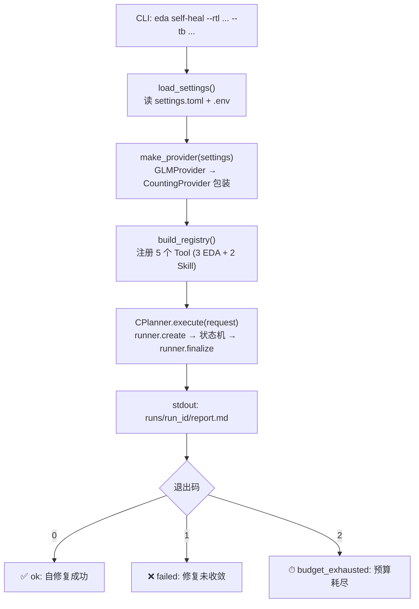

本页是 Agentic EDA 系统的零起点安装与运行指南。你将完成 **Python 环境配置 → LLM 密钥注入 → EDA 工具链就位 → 首次自修复端到端运行** 的完整闭环。整条路径刻意设计为"能跑出第一个 report.md"所需的最短链路，每一步的依赖关系清晰可见，配置参数精确可控。

Sources: [README.md](../../README.md), [pyproject.toml](../../pyproject.toml)

## 前置条件总览

Agentic EDA 系统采用 **双运行环境架构**：Python Agent 层运行在 Windows 主机，EDA 工具链（Yosys / iverilog / OpenSTA）运行在 WSL2 Ubuntu。两层通过 `wsl.exe -d Ubuntu-24.04 -e <tool>` 桥接调用，路径由系统自动从 Windows 格式转换为 WSL `/mnt/` 格式。理解这个分层前提，后续所有配置项的含义会一目了然。

Sources: [yosys_synth.py](../../src/eda_agent/tools/yosys_synth.py#L40-L52), [yosys_synth.py](../../src/eda_agent/tools/yosys_synth.py#L173-L179)

下表汇总了所有环境前置项及其用途：

| 组件 | 最低版本 | 用途 | 必须/可选 |
|---|---|---|---|
| Python | ≥3.10 | Agent 层运行时（类型注解 / tomllib 依赖 3.11+） | ✅ 必须 |
| pip + setuptools | ≥68 | `pip install -e .` 可编辑安装 | ✅ 必须 |
| WSL2 Ubuntu-24.04 | — | EDA 工具执行环境 | ✅ 必须 |
| Yosys | ≥0.33 | RTL 综合与网表生成 | ✅ 必须 |
| iverilog + vvp | ≥12.0 | RTL 功能仿真与 TB 验证 | ✅ 必须 |
| OpenSTA | — | 时序分析（未装则 STA 优雅降级） | ⬜ 可选 |
| 智谱 GLM API Key | Coding Plan | LLM 推理（ReAct 决策 + Patch 生成） | ✅ 必须 |

> **OpenSTA 降级说明**：系统设计为 OpenSTA 缺失时不崩溃——STA 工具返回 `sta.no_liberty` 或 `sta.sta_unavailable` 错误码（severity=`warn` / `error`），CPlanner 仅跳过时序分析步骤，不影响自修复主流程。

Sources: [settings.toml](../../settings.toml), [errors.py](../../src/eda_agent/errors.py#L87-L94)

## 安装流程：四步初始化

从空环境到 `eda` 命令可用，需要完成四个阶段。下方的流程图展示了每一步的输入、操作与产出，帮助你建立整体认知：



### Step 1：克隆仓库

```bash
git clone <repo-url> eda-agent-system
cd eda-agent-system
```

仓库根目录即所有命令的工作目录。`settings.toml` 中的相对路径（如 `data/error_kb.json`、`data/lib/sky130_xx.lib`）均以根目录为基准。

Sources: [settings.toml](../../settings.toml), [README.md](../../README.md)

### Step 2：Python 可编辑安装

```bash
pip install -e .
```

这条命令做了三件事：

**一**——安装全部运行时依赖（见下表），**二**——将 `src/eda_agent/` 注册为可导入包（`src layout`），**三**——注册 `eda` 命令入口点（`pyproject.toml` 中 `[project.scripts] eda = "eda_agent.cli:main"`）。

| 依赖包 | 版本约束 | 作用 |
|---|---|---|
| `anthropic` | ≥0.40 | Claude Provider 备用后端 |
| `openai` | ≥1.30 | 智谱 GLM OpenAI 兼容端点 SDK |
| `jsonschema` | ≥4 | 参数校验 |
| `python-dotenv` | ≥1.0 | `.env` 文件加载（API Key 注入） |
| `tomli` | Python<3.11 时 | TOML 解析后备库 |

安装成功后验证：

```bash
eda --help
# 输出应包含三个子命令: self-heal / diagnose / report
```

Sources: [pyproject.toml](../../pyproject.toml), [cli.py](../../src/eda_agent/cli.py#L44-L65)

### Step 3：配置 LLM 密钥

```bash
cp .env.example .env
# 编辑 .env，填入实际 key
```

`.env` 文件**不进 git**（`.gitignore` 第一行即 `.env`）。系统的密钥加载机制是**自动且静默的**：`settings.py` 在模块导入时调用 `load_dotenv()`，在任何后续代码执行前将 `.env` 中的变量注入 `os.environ`。因此，无论从 CLI 还是 Python SDK 调用，密钥都已就位。

`.env` 文件内容对照：

| 变量名 | 说明 | 获取方式 |
|---|---|---|
| `GLM_API_KEY` | 智谱 GLM API Key（**默认 provider**） | https://open.bigmodel.cn 控制台 |
| `ANTHROPIC_API_KEY` | Anthropic Claude Key（备用 provider） | https://console.anthropic.com |

> **密钥缺失的后果**：若 `GLM_API_KEY` 未设置且 provider 为默认的 `"glm"`，`GLMProvider.__init__` 会直接抛出 `RuntimeError`，携带明确的修复指引。这不是一个隐蔽的 bug，而是一个**显式 fail-fast 设计**——避免在运行中途因密钥缺失导致不可追溯的失败。

Sources: [.env.example](../../.env.example), [settings.py](../../src/eda_agent/settings.py#L18-L21), [glm_provider.py](../../src/eda_agent/llm/glm_provider.py#L33-L42), [.gitignore](../../.gitignore#L1-L2)

### Step 4：验证 EDA 工具链

EDA 工具通过 WSL2 调用，系统在构造 subprocess 命令时拼接 `["wsl.exe", "-d", "Ubuntu-24.04", "-e", <tool_cmd>, ...]`。确认 WSL2 中工具可用：

```bash
wsl -d Ubuntu-24.04 -e yosys -V        # 应输出版本号(≥0.33)
wsl -d Ubuntu-24.04 -e iverilog -V     # 应输出版本号(≥12.0)
wsl -d Ubuntu-24.04 -e sta -version    # OpenSTA(可选,失败不影响主流程)
```

WSL2 中的安装命令供参考：

```bash
# 在 WSL2 Ubuntu-24.04 内:
sudo apt update && sudo apt install -y yosys iverilog
# OpenSTA 需源码编译(可选)
```

Sources: [yosys_synth.py](../../src/eda_agent/tools/yosys_synth.py#L173-L179), [settings.toml](../../settings.toml)

## 配置系统详解：settings.toml

`settings.toml` 是系统的**非密钥配置中心**（API Key 走 `.env`，不进此文件）。`load_settings()` 函数在 CLI 启动时被调用，将 TOML 文件解析为嵌套的 `Settings` dataclass 结构。文件缺失时返回全默认值，不阻塞运行。

整个配置分为五个段，各段职责边界清晰：



### [llm] 段：LLM 后端配置

| 参数 | 默认值 | 说明 |
|---|---|---|
| `provider` | `"glm"` | LLM 后端选择：`glm`(智谱,默认) / `claude`(备用) |
| `glm_model` | `"glm-5.2"` | 智谱 GLM 模型名（支持 1M 上下文） |
| `glm_base_url` | `".../coding/paas/v4"` | **Coding Plan 专用端点**（非通用 `/api/paas/v4`，否则 429 错误） |
| `glm_thinking` | `true` | GLM-5.2 思考模式（`thinking.type=enabled`） |
| `glm_reasoning_effort` | `"max"` | 推理努力档（最高性能调度） |
| `temperature` | `0.0` | 采样温度（0.0 = 确定性输出） |
| `max_tokens` | `8192` | 最大输出 token（settings.toml 中覆盖 dataclass 默认 4096） |

> **端点陷阱**：`glm_base_url` 必须使用 Coding Plan 专用端点 `https://open.bigmodel.cn/api/coding/paas/v4`，而非通用端点 `https://open.bigmodel.cn/api/paas/v4`。误用通用端点会导致 429/1113 错误。这个区别在注释中已标注。

Sources: [settings.toml](../../settings.toml), [settings.py](../../src/eda_agent/settings.py#L30-L39), [glm_provider.py](../../src/eda_agent/llm/glm_provider.py#L43-L46)

### [eda] 段：EDA 工具配置

| 参数 | 默认值 | 说明 |
|---|---|---|
| `wsl_enabled` | `true` | 是否通过 WSL2 调用 EDA 工具 |
| `yosys_cmd` | `"yosys"` | Yosys 可执行文件名 |
| `iverilog_cmd` | `"iverilog"` | iverilog 编译器名 |
| `vvp_cmd` | `"vvp"` | vvp 仿真运行器名 |
| `opensta_cmd` | `"sta"` | OpenSTA 可执行文件名 |
| `tool_timeout_s` | `120` | 单个 EDA 工具调用超时（秒） |
| `default_lib_path` | `"data/lib/sky130_xx.lib"` | 默认 liberty 库路径（STA 用） |

Sources: [settings.toml](../../settings.toml), [settings.py](../../src/eda_agent/settings.py#L42-L50)

### [budget] 段：双层预算仲裁

| 参数 | 默认值 | 说明 |
|---|---|---|
| `planner_max_iterations` | `8` | CPlanner 外层迭代上限 |
| `skill_max_iterations` | `5` | B 自修复内部迭代上限 |
| `run_budget_s` | `600` | **总预算**：C 与所有 Skill 共享，任一 Skill 不得独占 |
| `skill_diagnose_budget_s` | `60` | A 诊断器子预算 |
| `skill_self_heal_budget_s` | `480` | B 自修复子预算（留 120s 给 C 的综合/仿真/STA） |

> 这些参数可在 CLI 中通过 `--max-iter`、`--mode`、`--run-budget` 命令行参数覆盖，实现实验级灵活调控。

Sources: [settings.toml](../../settings.toml), [cli.py](../../src/eda_agent/cli.py#L48-L58)

## 首次运行：端到端自修复

环境就绪后，我们用一个内置示例——`counter_bitwidth`（一个 8-bit 计数器的位宽被错误声明为 `[3:0]`，导致计到 15 就回绕）——跑通完整自修复闭环。



### 命令行方式（推荐首次使用）

**快速验证模式**（rule 引擎，确定性决策，约 45 秒）：

```bash
eda self-heal \
    --rtl data/examples/counter_bitwidth/rtl.v \
    --tb  data/examples/counter_bitwidth/tb.v \
    --top-module counter \
    --goal "pass all tests" \
    --mode rule
```

**默认 LLM 模式**（展示 agentic 充分性，约 500 秒）：

```bash
eda self-heal \
    --rtl data/examples/counter_bitwidth/rtl.v \
    --tb  data/examples/counter_bitwidth/tb.v \
    --top-module counter \
    --goal "pass all tests"
```

两种模式的差异在于 CPlanner 的决策路径：`--mode rule` 使用确定性规则引擎（固定 plan = `[yosys → iverilog → diagnose → self_heal]`），不消耗 LLM token；默认模式使用 LLM ReAct 回环，每一步工具选择由 GLM-5.2 自主决策。

Sources: [cli.py](../../src/eda_agent/cli.py#L73-L90), [docs/演示脚本.md](../演示脚本.md#L19-L42)

### CLI 参数完整对照

| 参数 | 适用子命令 | 必填 | 说明 |
|---|---|---|---|
| `--rtl <path>` | self-heal / diagnose | ✅ | RTL 源文件路径 |
| `--tb <path>` | self-heal / diagnose | ✅ | Testbench 源文件路径 |
| `--goal <text>` | self-heal | ✅ | 自然语言修复目标 |
| `--top-module <name>` | self-heal | ⬜ | 顶层模块名（省略则由 Yosys 推断） |
| `--lib <path>` | self-heal | ⬜ | Liberty 库路径（省略则跳过 STA） |
| `--clock <name>` | self-heal | ⬜ | 时钟信号名（省略则跳过 STA） |
| `--max-iter <n>` | self-heal | ⬜ | 覆盖 B 自修复迭代上限 |
| `--mode rule\|llm` | self-heal | ⬜ | 覆盖 planner 模式 |
| `--run-budget <s>` | self-heal | ⬜ | 覆盖总预算秒数 |
| `<run_id>` | report | ✅ | 已落盘的 run_id |

Sources: [cli.py](../../src/eda_agent/cli.py#L44-L65), [contracts.py](../../src/eda_agent/contracts.py#L38-L48)

### Python SDK 方式

```python
python -c "from eda_agent import run_pipeline; from eda_agent.contracts import RunRequest; \
    r = run_pipeline(RunRequest(kind='self_heal', goal='pass all tests', \
    rtl_path='data/examples/counter_bitwidth/rtl.v', \
    tb_path='data/examples/counter_bitwidth/tb.v', max_iter=5), None); print(r.report_path, r.status)"
```

`run_pipeline` 是 SDK 核心入口，接受 `RunRequest` 和可选的 `Settings`（传入 `None` 时调用 `load_settings()` 读取 `settings.toml`）。内部完成 provider 构造 → runner 初始化（含僵尸 run 清理） → registry 构建 → CPlanner 执行的全链条组装。

Sources: [cli.py](../../src/eda_agent/cli.py#L30-L41), [README.md](../../README.md)

### 运行产物

每次运行在 `runs/<run_id>/` 下生成完整轨迹，目录结构如下：

```
runs/20260715_103022_a3f1/     ← run_id 格式: YYYYmmdd_HHMMSS_<4hex>
├── run.json                   ← RunRecord（请求/状态/步骤/指标）
├── request.json               ← 原始 RunRequest 快照
├── status.json                ← 终态标记（仅终态写）
├── report.md                  ← 人类可读修复报告
├── experiment_manifest.json   ← 实验清单（14 字段,CLI 不生成,脚本模式才写）
└── steps/
    ├── 0_yosys_synth/
    │   ├── tool_call.json
    │   ├── tool_result.json
    │   ├── stdout.log
    │   └── stderr.log
    ├── 1_iverilog_sim/
    └── ...
```

> `runs/` 目录在 `.gitignore` 中被排除（`runs/*`），但 `runs/eval_snapshot/` 作为评审替代证据被保留。

Sources: [runner.py](../../src/eda_agent/runner.py#L42-L45), [runner.py](../../src/eda_agent/runner.py#L107-L154), [.gitignore](../../.gitignore#L13-L15)

## 退出码体系

CLI 的退出码是脚本化集成的关键契约，直接对应 `RunReport.status`：

| 退出码 | 含义 | 触发条件 |
|---|---|---|
| `0` | ok | 自修复收敛（含独立验证步通过） |
| `1` | failed | 修复未收敛（迭代耗尽 / 持续退化 / 测试失败） |
| `2` | budget_exhausted | 时间预算耗尽（C + Skill 共享 600s 上限） |
| `64` | report 不存在 | `eda report <run_id>` 指定的 run_id 未找到 |

Sources: [cli.py](../../src/eda_agent/cli.py#L26-L27), [docs/演示脚本.md](../演示脚本.md#L87-L89)

## 验证安装：测试套件

系统使用 pytest 标记策略区分测试依赖级别。了解这些标记能帮你快速判断哪些测试在你的环境下能跑：

| 标记 | 含义 | 无该环境时行为 |
|---|---|---|
| `@pytest.mark.needs_eda` | 需要 WSL2 中 yosys/iverilog/opensta | 自动 skip |
| `@pytest.mark.needs_llm` | 需要 `GLM_API_KEY` 可用 | 自动 skip |
| 无标记 | 纯 Python 逻辑测试 | 始终运行 |

快速运行：

```bash
# 全量测试（EDA/LLM 测试自动 skip 或实跑）
pytest

# 仅跑纯逻辑测试（无外部依赖）
pytest -m "not needs_eda and not needs_llm"

# 契约合规检查（AST 级别,无运行时依赖）
python scripts/check_no_subprocess.py
```

> **评审机无 EDA 工具时**：`@pytest.mark.needs_eda` 自动 skip 真跑测试，`runs/eval_snapshot/` 提供替代证据。stub e2e 测试（`test_e2e_stub`）无 EDA 也能跑通，保证可行性验证不依赖外部工具。

Sources: [pyproject.toml](../../pyproject.toml), [conftest.py](../../tests/conftest.py#L1-L37), [docs/演示脚本.md](../演示脚本.md#L83-L85)

## 内置示例库

`data/examples/` 下有 8 个 inject bug 示例，覆盖四类故障，是首次运行和实验验证的标准输入：

| 示例目录 | 故障类型 | 可修复 | 顶层模块 | 问题描述 |
|---|---|---|---|---|
| `counter_bitwidth` | bitwidth | ✅ | counter | 8-bit 计数器声明为 [3:0]，回绕于 15 |
| `adder_pipe_bitwidth` | bitwidth | ✅ | — | 流水加法器位宽不足 |
| `counter_syntax` | syntax | ✅ | — | 计数器语法错误 |
| `adder_pipe_syntax` | syntax | ✅ | — | 流水加法器语法错误 |
| `counter_reset` | timing_reset | ✅ | — | 计数器复位逻辑缺陷 |
| `tiny_fsm_reset` | timing_reset | ✅ | — | FSM 复位缺陷（bonus） |
| `adder_pipe_comb` | comb_logic | ✅ | — | 组合逻辑缺陷 |
| `tiny_fsm_comb` | comb_logic | ❌ | — | FSM 组合环路（合规不可修） |

每个示例包含三个文件：`rtl.v`（注入 bug 的 RTL）、`tb.v`（测试台）、`meta.json`（元数据，含 `fault_type`、`healable`、`ground_truth_patch`）。

Sources: [data/examples/counter_bitwidth/meta.json](../../data/examples/counter_bitwidth/meta.json#L1-L8), [data/examples/counter_bitwidth/rtl.v](../../data/examples/counter_bitwidth/rtl.v#L1-L13)

## 故障排查表

| 症状 | 根因 | 解决方案 |
|---|---|---|
| `RuntimeError: GLM API key 未设置` | `.env` 缺失或 `GLM_API_KEY` 为空 | `cp .env.example .env`，填入实际 key |
| `429 / 1113` API 错误 | 使用了通用端点而非 Coding Plan 端点 | 确认 `settings.toml` 中 `glm_base_url` 为 `.../coding/paas/v4` |
| EDA 工具超时（120s） | WSL2 未安装 / 发行版名不匹配 | 确认 `wsl -d Ubuntu-24.04 -e yosys -V` 可执行 |
| `eda: command not found` | 未执行 `pip install -e .` 或 PATH 未更新 | 重新安装，或用 `python -m eda_agent.cli` 替代 |
| `tomllib` ImportError | Python < 3.11 且未装 `tomli` | `pip install tomli`（pyproject 已声明此依赖） |
| OpenSTA 报 `sta.no_liberty` | 未提供 liberty 库文件 | 传入 `--lib data/lib/sky130_xx.lib`（STA 为可选项，不影响主流程） |
| `run_id not found`（退出码 64） | `eda report` 指定的 run_id 不存在 | 检查 `runs/` 目录下的 run_id 列表 |

Sources: [glm_provider.py](../../src/eda_agent/llm/glm_provider.py#L37-L42), [settings.toml](../../settings.toml), [cli.py](../../src/eda_agent/cli.py#L101-L107), [errors.py](../../src/eda_agent/errors.py#L87-L94)

## 下一步

环境就绪后，建议按以下路径深入：

- 了解 **CLI 三子命令的完整参数体系与退出码语义** → [三子命令 CLI 与退出码体系](03_三子命令CLI与退出码.md)
- 理解 **配置系统的分层 dataclass 与 `settings_hash` 可复现性** → [配置系统与 settings.toml 结构](08_配置系统与settings结构.md)
- 深入 **系统五层架构与端到端数据流** → [五层分层架构总览（L0-L5）](05_五层分层架构总览.md)
- 学习 **如何用脚本批量跑 8 bug 实验并聚合** → [故障注入清单与基准实验对比](27_故障注入清单与基准实验.md)