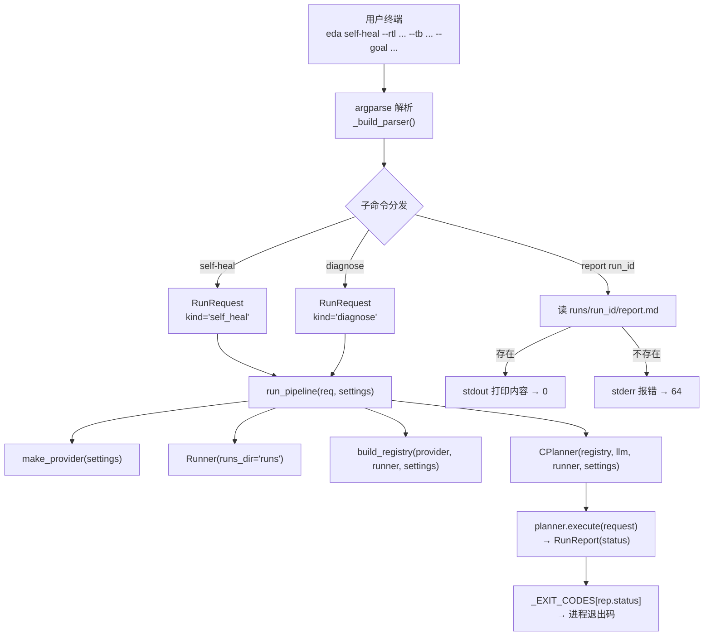
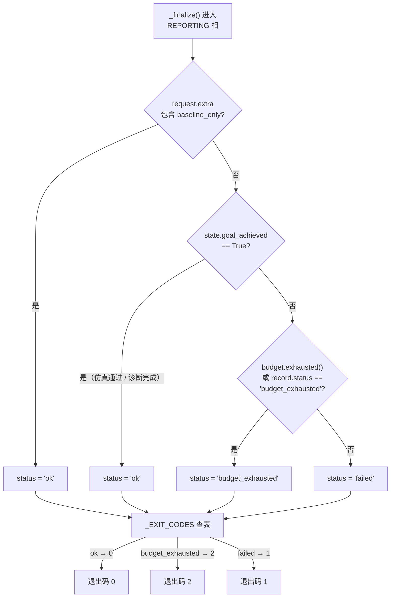

`eda` 命令行是整个 Agentic EDA 系统的 **L5 对外接口层**——它是人类用户与 CPlanner 编排大脑之间唯一的交互入口。本文档系统解析三个子命令（`self-heal`、`diagnose`、`report`）的参数签名、运行时参数覆盖机制，以及四值退出码体系的设计原理与派生路径。无论你是首次运行系统的新手，还是需要编写自动化脚本集成 CLI 的开发者，理解这套接口层的契约对于正确调用和解读结果至关重要。

---

## CLI 在系统架构中的定位

在五层分层架构中，CLI 位于最顶层 L5，承担两项核心职责：将用户的一句话需求**翻译**为结构化的 `RunRequest`，以及将 CPlanner 产出的 `RunReport` **翻译**回可读的报告路径和语义化退出码。CLI 本身不包含任何业务逻辑——它是一个纯粹的薄壳层，所有编排决策都委托给下层组件。



CLI 的入口注册在 `pyproject.toml` 的 `[project.scripts]` 段中，`pip install -e .` 安装后 `eda` 命令全局可用，直接映射到 `main()` 函数。

Sources: [pyproject.toml](../../pyproject.toml), [cli.py](../../src/eda_agent/cli.py#L68-L113)

---

## 三子命令总览

三个子命令各自对应不同的流水线深度：`self-heal` 触发完整的 C+A+B 自修复闭环，`diagnose` 仅执行 C+A 诊断（不修复），`report` 则是纯文件读取操作，不启动任何流水线。

| 子命令 | 触发组件 | 核心语义 | 输出 | 典型耗时 |
|---|---|---|---|---|
| `eda self-heal` | C + B（含 A） | 综合 → 仿真 → 诊断 → Patch 迭代，直到仿真通过或预算耗尽 | `runs/<run_id>/report.md` 路径 | rule 模式 ~45s；LLM 模式 ~500s |
| `eda diagnose` | C + A | 产出诊断报告（错误根因归因 + 修复建议），**不修改 RTL** | `runs/<run_id>/diagnose/report.md` 路径 | ~10s |
| `eda report <run_id>` | 无（纯 I/O） | 打印已落盘的 `report.md` 全文 | report.md 内容 | 即时 |

Sources: [cli.py 文档字符串](../../src/eda_agent/cli.py#L1-L9), [CONTRACTS.md L5 层](../../CONTRACTS.md)

---

## `eda self-heal`：自修复闭环命令

`self-heal` 是系统的**主路径命令**，它构造一个 `kind="self_heal"` 的 `RunRequest` 并通过 `run_pipeline()` 完整执行 CPlanner 的五相状态机。命令支持丰富的可选参数覆盖，允许用户在不修改 `settings.toml` 的情况下按需调整 Planner 模式和预算。

### 参数详解

| 参数 | 类型 | 必填 | 默认值 | 说明 |
|---|---|---|---|---|
| `--rtl` | 文件路径 | ✅ | — | RTL 源文件（绝对或相对项目根） |
| `--tb` | 文件路径 | ✅ | — | Testbench 源文件 |
| `--goal` | 自然语言 | ✅ | — | 修复目标，如 `"pass all tests"` |
| `--top-module` | 字符串 | ❌ | 由 Yosys 推断 | 顶层模块名，如 `counter` |
| `--lib` | 文件路径 | ❌ | settings 中的 `default_lib_path` | liberty 文件（`.lib`），缺失则 STA 跳过 |
| `--clock` | 字符串 | ❌ | 无 | 时钟信号名，缺失则 STA 跳过面积/时序分析 |
| `--max-iter` | 整数 | ❌ | `skill_max_iterations`（默认 5） | 覆盖 B 自修复的迭代上限 |
| `--mode` | `rule` \| `llm` | ❌ | `llm`（settings 中设定） | 覆盖 Planner 决策模式 |
| `--run-budget` | 整数 | ❌ | `600`（settings 中设定） | 覆盖 Run 级时间预算（秒） |

### `--mode` 与 `--run-budget` 的覆盖机制

`main()` 函数在构造 `RunRequest` **之前**，将 `--mode` 和 `--run-budget` 的值直接写入 `Settings` 对象。这意味着覆盖发生在配置层面，而非运行时动态参数传递，整个流水线读取的都是覆盖后的统一配置。

```python
# cli.py L73-L77 —— 覆盖逻辑（伪代码缩略）
if args.mode:
    settings.planner.mode = args.mode       # 覆盖 planner.mode
if args.run_budget:
    settings.budget.run_budget_s = args.run_budget  # 覆盖 budget.run_budget_s
```

`--mode rule` 指示 CPlanner 走确定性规则引擎路径：初始 plan 固定为综合 + 仿真 + 可选 STA，后续通过 `_rule_after_reflect` 动态注入 skill 调用。`--mode llm`（默认）则让 CPlanner 通过 ReAct 回环向 LLM 请求每一步的 tool_call 决策。

Sources: [cli.py 参数解析](../../src/eda_agent/cli.py#L48-L57), [cli.py 覆盖逻辑](../../src/eda_agent/cli.py#L73-L77), [settings.py PlannerSettings](../../src/eda_agent/settings.py#L54-L56)

### 典型用法

```bash
# rule 模式：确定性决策，快速验证（~45s）
eda self-heal \
    --rtl data/examples/counter_bitwidth/rtl.v \
    --tb  data/examples/counter_bitwidth/tb.v \
    --top-module counter \
    --goal "pass all tests" \
    --mode rule

# LLM 模式：agentic 充分性演示，默认模式（~500s）
eda self-heal \
    --rtl data/examples/counter_bitwidth/rtl.v \
    --tb  data/examples/counter_bitwidth/tb.v \
    --top-module counter \
    --goal "pass all tests"
```

Sources: [cli.py](../../src/eda_agent/cli.py)

---

## `eda diagnose`：纯诊断命令

`diagnose` 命令构造一个 `kind="diagnose"` 的 `RunRequest`，其语义是 **"产出诊断报告"而非"通过测试"**。CPlanner 的 `_rule_after_reflect` 中有一条专门判定：当 `request.kind == "diagnose"` 且 `state.last_diagnose is not None`（诊断结果已产出）时，立即将 `goal_achieved` 设为 `True`，直接进入 REPORTING 相——这意味着 `diagnose` 命令在诊断器 A 产出报告后即返回 `status="ok"`，退出码 0，**不论 RTL 是否实际存在 bug**。

该命令仅需两个必填参数 `--rtl` 和 `--tb`，不支持 `--mode` / `--run-budget` 等覆盖参数（因为诊断路径固定）。输出的 `parsed` 包含 13 个字段：`root_causes`、`confidence`、`needs_rtl_patch`、`fix_hints` 等。

```bash
eda diagnose --rtl data/examples/counter_syntax/rtl.v --tb data/examples/counter_syntax/tb.v
```

Sources: [cli.py diagnose 分支](../../src/eda_agent/cli.py#L91-L100), [c_planner.py diagnose goal 判定](../../src/eda_agent/planner/c_planner.py#L316-L320)

---

## `eda report`：报告渲染命令

`report` 是最简单的子命令——它不启动任何流水线，仅检查 `runs/<run_id>/report.md` 是否存在，存在则打印全文并返回 0，不存在则向 `stderr` 输出错误信息并返回 64。该命令接受一个位置参数 `run_id`（格式为 `YYYYmmdd_HHMMSS_<4hex>`，如 `20260715_103022_a3f1`）。

```bash
eda report 20260715_103022_a3f1    # 打印该 run 的 report.md
```

退出码 64 的选择遵循 POSIX 惯例（`EX_USAGE = 64`），表示命令参数指向的资源不存在。该值与流水线的三态退出码（0/1/2）在语义上完全解耦，避免与 `status="failed"` 的退出码 1 混淆。

Sources: [cli.py report 分支](../../src/eda_agent/cli.py#L101-L107), [runner.py run_id 格式](../../src/eda_agent/runner.py#L42-L45)

---

## 退出码体系

退出码是 CLI 向调用方（终端、Shell 脚本、CI/CD pipeline）传递运行结果的**唯一结构化信号**。系统采用四值退出码，前三值对应 `RunReport.status` 的三态映射，第四值为 `report` 命令的专用资源缺失码。

### 退出码映射表

| 退出码 | 含义 | 触发条件 | 哪些子命令可产生 |
|---|---|---|---|
| **0** | `ok` | CPlanner 判定 `goal_achieved == True`（仿真通过 / 诊断完成） | `self-heal`、`diagnose`、`report` |
| **1** | `failed` | 目标未达成且预算未耗尽；或执行过程中抛出未捕获异常 | `self-heal`、`diagnose` |
| **2** | `budget_exhausted` | 时间预算 `run_budget_s` 耗尽（`Budget.exhausted()` 返回 True） | `self-heal`、`diagnose` |
| **64** | `report_not_found` | `runs/<run_id>/report.md` 文件不存在 | `report` |

退出码的映射定义在模块级常量中，而非散落在各分支：

```python
_EXIT_CODES: dict[str, int] = {"ok": 0, "failed": 1, "budget_exhausted": 2}
_EXIT_NOT_FOUND = 64
```

`self-heal` 和 `diagnose` 子命令通过 `_EXIT_CODES[rep.status]` 从 `RunReport.status` 直接查表获得退出码；`report` 子命令使用独立的 `_EXIT_NOT_FOUND`。

Sources: [cli.py 退出码常量](../../src/eda_agent/cli.py#L25-L27), [cli.py 退出码使用](../../src/eda_agent/cli.py#L88-L107)

### 退出码的派生链路：从 status 到 exit code

`RunReport.status` 的值并非由 CLI 层决定，而是由 CPlanner 的 `_finalize()` 方法在 REPORTING 相计算得出。理解这条派生链路对于调试"为什么退出码是 2 而不是 1"至关重要。



特别需要注意的是**异常兜底路径**：CPlanner 的 `execute()` 方法用 `try-except` 包裹整个状态机循环，任何未捕获异常都会被拦截，状态设为 `"failed"` 并通过 `_emergency_report()` 生成带完整 traceback 的紧急报告。这意味着 CLI 层永远不会因为内部异常而抛出 Python traceback——它总是返回一个语义化退出码。

Sources: [c_planner.py _finalize status 判定](../../src/eda_agent/planner/c_planner.py#L623-L631), [c_planner.py 异常兜底](../../src/eda_agent/planner/c_planner.py#L157-L162), [budget.py exhausted()](../../src/eda_agent/planner/budget.py#L33-L35)

### 预算耗尽（exit code 2）的触发原理

当 `monotonic()` 时钟测量的已耗时间超过 `run_budget_s`（默认 600 秒）时，CPlanner 在每次 phase 切换前调用 `Budget.exhausted()` 进行检查。一旦返回 True，状态机直接跳转到 REPORTING 相并设置 `record.status = "budget_exhausted"`。这条路径与 `_finalize()` 中的 `budget.exhausted()` 判定形成**双重保险**——即使预算在 phase 内部耗尽，也不会导致额外的不必要工具调用。

`--run-budget` 参数允许用户为单次运行临时调低预算（例如 `--run-budget 300`），这对快速测试特别有用。

Sources: [c_planner.py budget 检查](../../src/eda_agent/planner/c_planner.py#L103-L105), [budget.py Budget 类](../../src/eda_agent/planner/budget.py#L13-L35)

---

## `run_pipeline()`：流水线构造函数

三个子命令中，`self-heal` 和 `diagnose` 都通过 `run_pipeline()` 构造并执行完整流水线。该函数是一个**依赖注入编排器**，按固定顺序实例化四个核心组件，最终委托给 CPlanner 的 `execute()` 方法。

| 步骤 | 组件 | 构造方式 | 依赖 |
|---|---|---|---|
| 1 | **LLM Provider** | `make_provider(settings)` | settings.llm（provider/model/api_key） |
| 2 | **Runner**（L0 工件存储） | `Runner(runs_dir="runs", settings=settings)` | settings（预算阈值） |
| 3 | **僵尸 Run 清理** | `runner.scavenge_zombies(settings.run_budget_s)` | 扫描 `runs/*` 目录 |
| 4 | **Tool Registry**（L3） | `build_registry(provider=..., runner=..., settings=...)` | provider + runner + settings |
| 5 | **CPlanner**（L4） | `CPlanner(registry, llm, runner, settings)` | 全部组件注入 |
| 6 | **执行** | `planner.execute(request)` | 返回 `RunReport` |

步骤 3 的 `scavenge_zombies` 是一个防御性操作：进程启动时扫描 `runs/` 目录，将任何状态为 `running` 但超时的遗留目录标记为 `failed` 并写入 `status.json`。这确保上次崩溃留下的"僵尸 Run"不会干扰当前执行。

Sources: [cli.py run_pipeline](../../src/eda_agent/cli.py#L30-L41), [runner.py 文档字符串](../../src/eda_agent/runner.py#L1-L13)

---

## 测试覆盖与验证

退出码体系由 `tests/test_cli_exit_codes.py` 中的 6 个测试用例完整覆盖，采用 `monkeypatch` 替换 `make_provider`、`build_registry`、`CPlanner`、`load_settings`，避免真实 LLM 调用和 EDA 工具依赖，使用 Fake Planner 返回可控的 `RunReport`。

| 测试函数 | 验证内容 | 预期退出码 |
|---|---|---|
| `test_cli_self_heal_ok_returns_0` | status="ok" | 0 |
| `test_cli_self_heal_failed_returns_1` | status="failed" | 1 |
| `test_cli_self_heal_budget_exhausted_returns_2` | status="budget_exhausted" | 2 |
| `test_cli_report_existing_returns_0` | report.md 存在 | 0 |
| `test_cli_report_missing_returns_64` | run_id 不存在 | 64 |
| `test_cli_self_heal_mode_override` | `--mode rule` 和 `--run-budget 300` 正确覆盖 settings | 0（+ 验证覆盖生效） |

Sources: [test_cli_exit_codes.py](../../tests/test_cli_exit_codes.py#L1-L193)

---

## Shell 脚本中的退出码消费模式

在自动化脚本中，退出码是判断运行结果的唯一可靠信号。以下模式展示了如何在 Bash 中消费这些退出码：

```bash
eda self-heal --rtl design.v --tb tb.v --goal "pass all tests" --mode rule
rc=$?

case $rc in
    0)  echo "✅ 修复成功（仿真通过）" ;;
    1)  echo "❌ 修复失败（目标未达成）" ;;
    2)  echo "⏱️ 预算耗尽（超时）" ;;
    64) echo "📂 报告不存在（仅 report 命令）" ;;
    *)  echo "💥 未知错误" ;;
esac
```

对于 `self-heal` 和 `diagnose`，`stdout` 始终打印 `report.md` 的路径（如 `runs/20260715_103022_a3f1/report.md`），可以与 `eda report` 命令配合进行后续渲染。

---

## 下一步阅读

理解了 CLI 接口层后，建议按以下顺序深入系统内部：

1. **[契约驱动开发哲学：CONTRACTS.md 权威机制](04_契约驱动CONTRACTS权威机制.md)** — 了解 `RunRequest` / `RunReport` 等数据结构背后的契约约束哲学
2. **[五相状态机：PLANNING 到 DONE 的流转](09_五相状态机Planning到Done.md)** — 深入 CPlanner `execute()` 内部的状态机流转细节
3. **[双层预算仲裁与迭代上限保护](13_双层预算仲裁与迭代上限.md)** — 理解 `budget_exhausted` 退出码背后的预算仲裁机制
4. **[配置系统与 settings.toml 结构](08_配置系统与settings结构.md)** — `--mode` 和 `--run-budget` 覆盖的 settings 层完整结构