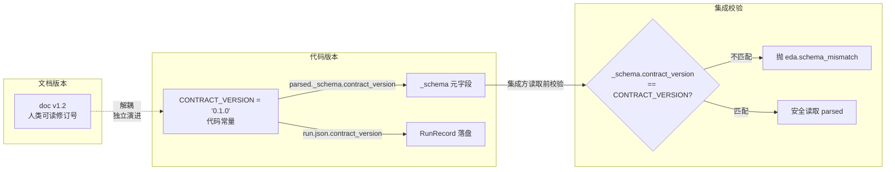
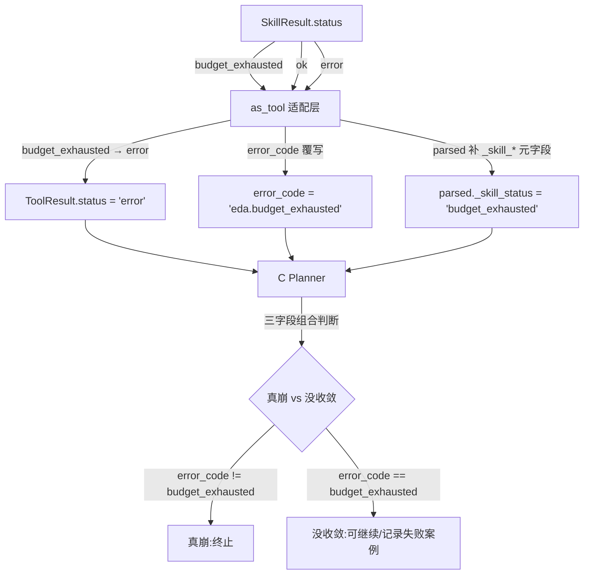
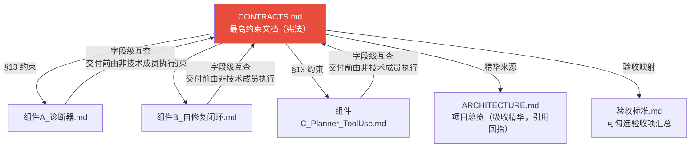

CONTRACTS.md 是整个 Agentic EDA 系统的**最高约束文档**——一份 1296 行的"宪法"，用 Python dataclass、Protocol 和 type hint 将所有跨组件数据结构与接口签名钉死。它不是事后补写的 API 文档，而是先于代码存在的设计契约：A（诊断器）、B（RTL 自修复闭环）、C（Planner / Tool-Use 层）三组件以及 Tool Registry、工件存储、LLM provider 抽象，都必须严格遵守其中定义的结构。本文深入剖析这套契约驱动机制的哲学基础、技术实现与治理体系，帮助你理解为何"先写契约、再写实现"能在一个 2 人 9 天的 Hackathon 项目中消除集成断点。

Sources: [CONTRACTS.md](../../CONTRACTS.md), [contracts.py](../../src/eda_agent/contracts.py#L1-L8)

## 设计哲学：为什么需要一份"宪法"

### 核心问题：多组件并行的集成地狱

一个典型 Agent 系统由多个独立开发的组件组成。当 A、B、C 三组件分别由不同人开发时，最危险的不是某一组件内部的 bug，而是**组件间接口的不一致**——字段名拼错、类型隐式变更、错误码语义漂移、工件路径格式不统一。这些问题在集成阶段才暴露，修复成本极高。

CONTRACTS.md 通过三条原则解决这一问题：

| 原则 | 含义 | 具体体现 |
|------|------|----------|
| **单一权威** | 所有数据结构的唯一定义来源 | `from eda_agent.contracts import ...`，禁止组件各自重新定义同名结构 |
| **版本锚定** | 每个结构化输出携带版本元数据 | `parsed._schema.contract_version` 必须等于 `CONTRACT_VERSION` |
| **可检测漂移** | 集成方读数据前先校验版本 | 不匹配抛 `eda.schema_mismatch`，不静默读 None |

Sources: [CONTRACTS.md](../../CONTRACTS.md), [contracts.py](../../src/eda_agent/contracts.py#L1-L8)

### 开闭原则的契约级兑现

契约不仅定义"有什么"，更定义"如何扩展"。系统的扩展性通过两个机制写入契约：Tool Registry 的 `category` 采用开放 `str`（而非 `Literal` 枚举），新增 `pnr`/`layout` 等 category 只需在新 Tool 文件里写 `category="pnr"`，核心 `contracts.py` 零改动；错误码采用二段式 `namespace.code`，新工具自带 namespace 不改核心表。这是**开闭原则（加新 EDA 工具 / 加新 skill 不改核心）在数据结构层面的硬性兑现**。

Sources: [CONTRACTS.md](../../CONTRACTS.md), [registry.py](../../src/eda_agent/registry.py#L25-L26)

## 版本锚点机制：CONTRACT_VERSION 常量

### 双轨版本治理

CONTRACTS.md 实行一套精巧的双轨版本体系，消除 v1.1 时期的版本号歧义：

**CONTRACT_VERSION**（常量值 `"0.1.0"`）是代码层面的契约版本锚点，存在于 `parsed._schema.contract_version` 与 `run.json.contract_version` 两处。任何组件引用它必须 `from eda_agent.contracts import CONTRACT_VERSION`，**禁止裸字符串**——这一禁令有测试守护，`errors.py` 源码中不得出现 `"0.1.0"` 字面量。

**文档版本**（如 `doc v1.2`）是人类可读的修订号，与 CONTRACT_VERSION 解耦。doc v1.2 代表在 CONTRACT_VERSION=0.1.0 基础上的第 5 次修订，包含大量集成断点修复。

Sources: [CONTRACTS.md](../../CONTRACTS.md), [contracts.py](../../src/eda_agent/contracts.py#L18), [test_contracts.py](../../tests/test_contracts.py#L52-L55)

### 版本引用的强制性与测试守护

版本引用的禁令不是口头约定，而是由自动化测试强制执行。`test_no_bare_contract_version_in_errors_module` 通过 `inspect.getsource()` 扫描 `errors.py` 全部源码，断言其中不出现裸 `'0.1.0'` 字符串：

Sources: [test_contracts.py](../../tests/test_contracts.py#L252-L258)

## 核心抽象契约全景

### 契约定义的十大数据结构

contracts.py 作为契约的实现层，严格对齐 CONTRACTS.md §2，导出以下核心结构。每个结构都有对应的字段完整性测试：

| 数据结构 | 职责 | 关键设计 |
|----------|------|----------|
| `RunRequest` (frozen) | CLI/MCP 入参 | 不可变，防止运行中被篡改 |
| `RunReport` | CLI/MCP 出参 | 携带标准 metrics 字段集 |
| `ToolCall` (frozen) | 工具调用描述 | 含 `llm_tool_call_id` 关联回环 |
| `ToolResult` | 工具执行结果 | 三态 `ok/error/timeout`，杜绝 warning 模糊态 |
| `Tool` (Protocol) | 工具统一接口 | `runtime_checkable`，运行时可校验 |
| `SkillResult` | Skill 执行结果 | 携带 B 智能性证据字段 |
| `Skill` (Protocol) | Skill 统一接口 | 含 `as_tool()` 适配方法 |
| `RunRecord` | 单次 run 完整轨迹 | 含 `contract_version` + `config_snapshot` |
| `StepRecord` | 单步执行记录 | 含 `skill_name`/`iter` 隶属标记 |
| `ErrorItem` | 结构化错误 | 二段式 `namespace.code` + severity |

Sources: [contracts.py](../../src/eda_agent/contracts.py#L38-L252), [test_contracts.py](../../tests/test_contracts.py#L70-L175)

### ToolResult 的 _schema 元字段协议

每个 `ToolResult.parsed` 必须携带 `_schema` 元字段，这是版本锚点机制的运行时载体：

    parsed = {
        "_schema": {
            "name": "yosys_synth",           # 产生该 parsed 的 Tool 名
            "version": "0.1.0",              # 该 Tool parsed 的局部版本
            "contract_version": CONTRACT_VERSION  # 契约整体版本(常量引用)
        },
        ...业务字段...
    }

集成方读取 `parsed` 前必须校验 `_schema.name` 与 `_schema.contract_version`，不匹配抛 `eda.schema_mismatch`。这一机制使得 schema 漂移能在集成边界被**即时检测**，而非在下游产生难以追踪的 None 值。

Sources: [CONTRACTS.md](../../CONTRACTS.md), [contracts.py](../../src/eda_agent/contracts.py#L90-L98)

### artifact_ref 工厂函数

跨组件工件引用是集成中最容易出错的环节。契约将工件引用统一为工厂函数：

    def artifact_ref(run_id: str, rel_path: str) -> dict[str, str]:
        """构造跨组件工件引用 dict。
        所有 ToolResult.artifacts 与 SkillResult.artifacts 的元素必须由本函数构造
        （禁止裸 str 路径，禁止裸 dict 字面量）。
        实际路径 = runs/<run_id>/<rel_path>。"""
        return {"run_id": run_id, "rel_path": rel_path}

这一设计在 v1.2 中被显式定义为**工厂函数**（而非 dict 字面量），消除了 v1.1 时期"函数 vs dict"的三处矛盾。所有 `ToolResult.artifacts` 与 `SkillResult.artifacts` 的元素必须由 `artifact_ref(...)` 构造。

Sources: [CONTRACTS.md](../../CONTRACTS.md), [contracts.py](../../src/eda_agent/contracts.py#L24-L30), [test_contracts.py](../../tests/test_contracts.py#L57-L60)

## 三态协议与错误命名空间

### ToolResult 的三态设计

契约严格规定 `ToolResult.status` 只有三个值：`ok`、`error`、`timeout`。**杜绝 `warning` 这种模糊态**——warning 一律归 `ok` 并写入 `parsed`。对于 Skill 的 `budget_exhausted` 状态，经 `as_tool` 适配后在 ToolResult 三态中塌缩为 `error`，但 `error_code` 覆写为 `eda.budget_exhausted`，同时 `parsed._skill_status` 保留原值。这使得 C（Planner）可以区分"真崩"与"没收敛但没崩"：

Sources: [CONTRACTS.md](../../CONTRACTS.md), [skills/base.py](../../src/eda_agent/skills/base.py#L62-L107)

### 二段式错误码 namespace.code

错误码体系是契约驱动设计中最能体现"可扩展不破核心"原则的部分。错误码采用二段式 `namespace.code` 格式：前缀是工具/领域 namespace，后缀是具体错误。**namespace 登记表**正式包含 9 个领域：

| Namespace | 领域 | 登记版本 |
|-----------|------|----------|
| `eda` | 框架级 + 13 个 MVP 核心码（别名） | v1.1 |
| `synth` | Yosys 综合领域 | v1.1 |
| `sim` | iverilog 仿真领域 | v1.1 |
| `sta` | OpenSTA 时序领域 | v1.1 |
| `drc` | KLayout DRC（加分项） | v1.1 |
| `pnr` | nextpnr 布局布线（加分项） | v1.1 |
| `llm` | LLM 调用领域 | v1.1 |
| **`diagnose`** | A 诊断器领域 | **v1.2 登记** |
| **`heal`** | B 自修复领域 | **v1.2 登记** |

severity 与 code 的对应关系被**锁定为查表**（而非 LLM 自由判断），降低 LLM 自由度，提升跨 run 可比性。未登记的码默认 severity 为 `error`（保守归错策略）。

Sources: [CONTRACTS.md](../../CONTRACTS.md), [errors.py](../../src/eda_agent/errors.py#L17-L95), [test_contracts.py](../../tests/test_contracts.py#L200-L223)

### alias 解析方向：消除 C 的早停/重试漏判

v1.2 锁定了别名解析方向，解决了一个关键的集成断点：`eda.*` 码是兼容别名，规范码是 `diagnose.*` 与 `heal.*`。C 读取 `error_code` 时**按 namespace 聚类**而非做双向字符串相等比较。namespace 属于 `{"diagnose", "heal"}` 的走各自语义，属于 `"eda"` 的走 13 码语义。这避免了因别名方向不一致导致 C 错误地早停或重试。

Sources: [CONTRACTS.md](../../CONTRACTS.md), [errors.py](../../src/eda_agent/errors.py#L1-L8)

## reserved 字段协议与 as_tool 适配

### reserved 字段：对 LLM 透明的控制通道

契约定义了一组以下划线前缀开头的 reserved 字段，它们是系统内部的**控制通道**，不进入 LLM 可见的工具 schema：

| reserved 字段 | 类型 | 处理方 | 用途 |
|---------------|------|--------|------|
| `_remaining_budget_s` | `float \| None` | `as_tool` 适配层 | 双层预算仲裁：C 调 Skill 前计算剩余预算下传 |
| `_artifact_ref` | `dict[str,str]` | C 的 `_resolve_args` | 工件注入：把上游 artifact_ref 注入到本 ToolCall 的参数 |

`registry.to_llm_tools()` 在生成 LLM 可见的工具描述时，通过 `_strip_reserved_schema()` 剥离所有下划线前缀字段（处理 `properties` 与 `required` 两个键），确保 LLM 永远看不到这些控制字段。

Sources: [CONTRACTS.md](../../CONTRACTS.md), [registry.py](../../src/eda_agent/registry.py#L57-L93)

### SkillAdapter：SkillResult → ToolResult 的映射

`as_tool` 适配层（`skills/base.py`）是契约 §2.3 的实现，它把任意 Skill 包装成 Tool。映射过程中执行五个关键操作：浅拷贝 args 避免 dict 污染；拆包 `_remaining_budget_s` 与 `run_id`；调用 `skill.run`；将 SkillResult 的六个智能性字段（status/iterations/trajectory/patch_source/convergence_cause/best_iter）注入 parsed 作为 `_skill_*` 元字段；将 budget_exhausted 映射为 error + 特定 error_code。

Sources: [CONTRACTS.md](../../CONTRACTS.md), [skills/base.py](../../src/eda_agent/skills/base.py#L24-L115)

## 契约的治理体系

### 文档权威层级

CONTRACTS.md 建立了严格的文档权威层级，任何冲突时**以契约为准**：

ARCHITECTURE.md 吸收契约精华做系统级呈现，不重复完整契约正文，引用时回指 CONTRACTS.md。三份组件文档的接口签名、dataclass 字段、错误码、artifact 路径必须与契约严格对齐。

Sources: [CONTRACTS.md](../../CONTRACTS.md)

### §11 裁决机制：意见冲突的取舍依据

CONTRACTS.md §11 记录了 9 项设计裁决，每项都附有取舍理由。这些裁决不是事后文档，而是开发过程中真实发生的设计冲突的**决策记录**：

| 冲突 | 裁决 | 核心理由 |
|------|------|----------|
| Skill 基类去留 | **保留** | 复用迭代控制/预算管理/落盘逻辑 |
| OpenSTA 是否 MVP | **上调 MVP** | EDA 三赛道要求 |
| CLI 子命令数 | **3 个** | diagnose 单点 demo 对评委加分显著 |
| 错误码封闭 vs 开放 | **二段式 + 13 码别名** | 开闭原则 + 向后兼容 |
| provider 多实现 | **MVP 只 Claude** | 可行性保底 |
| stdout/stderr 裁剪 | **头32KB + 尾32KB + 落盘** | 不丢诊断证据 |
| planner_mode 默认 | **默认 llm** | 避免"会循环的 wrapper"判定 |
| 通过率门槛 | **单一硬门槛** | 消除双口径分叉 |
| needs_rtl_patch 口径 | **按 severity 判** | 消除 namespace 前缀恒 False 断路器 |

Sources: [CONTRACTS.md](../../CONTRACTS.md)

### v1.2 变更摘要：集成断点修复

doc v1.2 相对 v1.1 的全部变更都是 **blocker/major 级集成断点修复**。每一项变更都对应一个真实的集成断点——从 `artifact_ref` 的"函数 vs dict"三处矛盾，到 `needs_rtl_patch` 按 namespace 前缀判导致恒 False 的隐性断路器，再到 B 的 goal/lib/clock 参数永不触发的死路。这些修复不是功能增强，而是**让系统真正能跑通的最小必要改动**。

Sources: [CONTRACTS.md](../../CONTRACTS.md)

## 契约测试：用代码守护契约

### 测试覆盖策略

`test_contracts.py` 覆盖契约的三个维度：**结构完整性**（每个 dataclass 的字段集精确匹配）、**语义正确性**（默认值、frozen 约束、工厂函数输出形状）、**集成一致性**（namespace 登记表含 diagnose/heal、severity 映射表、裸版本字符串禁令）。

一个典型的结构测试直接断言 dataclass 的字段集合：

    def test_run_request_fields():
        assert _field_names(RunRequest) == {
            "kind", "goal", "rtl_path", "tb_path", "top_module",
            "lib_path", "clock_name", "max_iter", "extra",
        }

如果任何人给 RunRequest 加了字段却忘了更新契约（或反过来），这个测试会立即失败。

Sources: [test_contracts.py](../../tests/test_contracts.py#L70-L75)

### runtime_checkable Protocol 校验

`Tool` 和 `Skill` 两个 Protocol 都标注为 `runtime_checkable`，这意味着可以用 `isinstance()` 在运行时校验一个对象是否满足契约接口。测试验证了任意满足 Protocol 结构的类能通过校验，而不满足的对象被正确拒绝：

Sources: [contracts.py](../../src/eda_agent/contracts.py#L101-L107), [test_contracts.py](../../tests/test_contracts.py#L116-L125)

## 接口稳定性与版本演进

### parsed schema 演进规则

契约为 parsed schema 的演进制定了明确的语义化版本规则：字段改名/删字段必须 bump `parsed_schema_ref.version`（破坏性改 major，加字段改 minor）。`contract_version` 与 `parsed_schema_ref.version` 是两个独立的版本维度——前者是契约整体版本，任何 §2 数据结构破坏性改动都要 bump；后者是单个 Tool parsed 的局部版本，可独立演进。`run.json` 落盘时同时记录两者，使得任何一次 run 的数据都能与当时的契约版本精确对应。

Sources: [CONTRACTS.md](../../CONTRACTS.md)

## 阅读导航

本文聚焦于 CONTRACTS.md 的**权威机制本身**。契约中定义的具体数据结构与组件行为，在其他页面有更深入的展开：

- 想了解契约如何串联成端到端数据流 → [端到端数据流：从用户需求到修复报告](06_端到端数据流与修复报告.md)
- 想了解契约定义的五层架构 → [五层分层架构总览（L0-L5）](05_五层分层架构总览.md)
- 想了解版本锚点在工件引用中的体现 → [版本锚点与工件引用协议](07_版本锚点与工件引用协议.md)
- 想了解 Tool Registry 如何兑现开闭原则 → [统一工具注册中心与开闭原则](19_统一工具注册中心.md)
- 想了解契约的配置落地 → [配置系统与 settings.toml 结构](08_配置系统与settings结构.md)