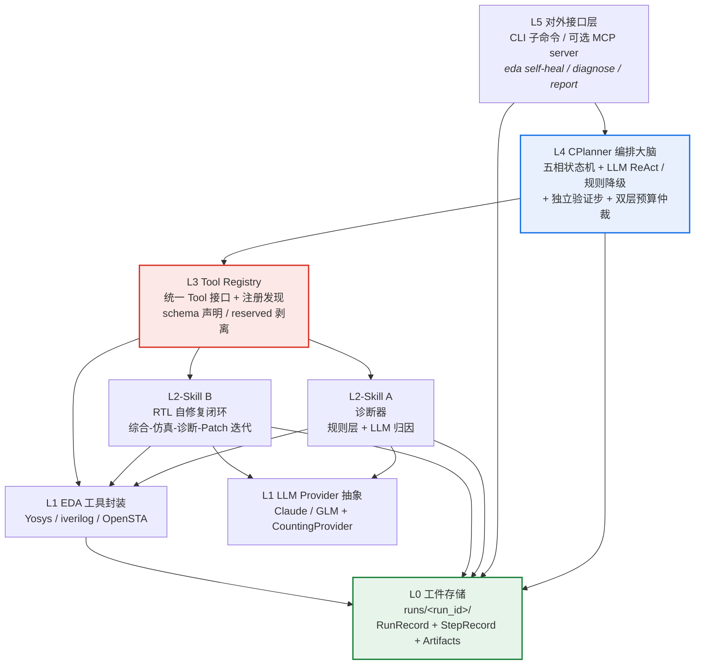

Agentic EDA 系统采用严格自底向上的六层分层架构——L0 工件存储到 L5 对外接口——每一层只依赖下层公开接口，禁止反向引用。这个设计决策不是文档层面的装饰，而是写入 `contracts.py` 的 **Protocol 定义**、`registry.py` 的 **查找隔离**、`skills/base.py` 的 **as_tool 适配**和 `c_planner.py` 的 **构造注入**中的硬约束。本文为读者建立全局心智模型：每层的职责边界、关键类型契约、以及层间的依赖规则。

Sources: [ARCHITECTURE.md](../../ARCHITECTURE.md)

---

## 架构全景图

下面的 Mermaid 图展示了六层的垂直依赖关系。箭头方向表示"依赖"——上层使用下层接口，绝无反向调用。需要特别注意的是，L2 的两个 Skill 组件（A 诊断器、B 自修复）通过 `as_tool` 适配层注册进 L3 Registry 后，在 L4 看来与 L1 的 EDA 工具完全等价——CPlanner 只通过 `registry.get(name)` 取 Tool，**不直接 import 任何具体实现**。

图中标注了三个核心组件代号：**A = skill_diagnose（L2）**、**B = skill_self_heal（L2）**、**C = CPlanner（L4，注意 C 不是 Tool）**。L1 EDA 工具只持有 `settings`（不持 provider），而 L2 Skill 持有 `provider` + `runner`——这一注入差异由 `build_registry` 工厂统一管理。

Sources: [ARCHITECTURE.md](../../ARCHITECTURE.md), [tools/bootstrap.py](../../src/eda_agent/tools/bootstrap.py#L37-L94)

---

## L0 — 工件存储层

L0 是整个系统的物理地基。每一次 `RunRequest` 都会分配一个全局唯一的 `run_id`（格式 `YYYYmmdd_HHMMSS_<4hex>`），并在 `runs/` 目录下创建对应的工件目录。`Runner` 类负责 RunRecord 的创建、增量落盘、StepRecord 追加以及僵尸 run 自愈——所有上层组件通过 `runner.append_step()` 或 `runner.create()` / `runner.finalize()` 与 L0 交互，**不直接操作文件系统**。

| 职责 | 实现位置 | 关键行为 |
|------|---------|---------|
| run_id 生成 | `runner.new_run_id()` | 时间戳 + 4 位 hex，保证唯一性 |
| RunRecord 落盘 | `Runner.create()` / `Runner._persist()` | 每次状态变更增量写 `run.json` |
| StepRecord 追加 | `Runner.append_step()` | 按 `NNN_<tool>` 命名，含 ToolCall/Result JSON + stdout/stderr 裁剪日志 |
| stdout/stderr 裁剪 | `runner.clip_io()` | ≤64KB 原样；>64KB 头 32KB + 尾 32KB + 中段标记，完整版落 `.full.log` |
| 僵尸自愈 | `Runner.scavenge_zombies()` | 进程启动扫描 `running` 态超时 run，标记 `failed` 并写 `status.json` |
| 配置快照 | `runner.make_config_snapshot()` | 记录 LLM/EDA 版本、contract_version、settings_hash，用于实验复现 |

一个关键设计：B 自修复的内部迭代**不生成独立 run_id**。每一步通过 `append_step(..., skill_name="self_heal", iter=n)` 追加到父 RunRecord 的 `steps` 列表，序号全局递增。这意味着一次 self_heal 运行的完整轨迹——综合、仿真、诊断、每次 patch——全部在同一个 `runs/<run_id>/` 目录下可追溯。

Sources: [runner.py](../../src/eda_agent/runner.py#L1-L14), [runner.py](../../src/eda_agent/runner.py#L107-L184), [runner.py](../../src/eda_agent/runner.py#L198-L300), [contracts.py](../../src/eda_agent/contracts.py#L167-L206)

---

## L1 — EDA 工具封装与 LLM Provider 抽象

L1 包含两条平行的基础设施线：**EDA 工具封装**和 **LLM Provider 抽象**。两者都实现 `Tool` Protocol（EDA 工具）或 `LLMProvider` Protocol（LLM），但面向完全不同的下游消费者。

### EDA 工具封装（subprocess 边界）

三个 EDA 工具——Yosys 综合工具、iverilog 仿真工具、OpenSTA 时序分析工具——每个都封装外部命令行程序，解析其输出为结构化 `parsed` dict，并产出符合契约的 `ToolResult`。它们只持有 `settings`（工具路径、超时配置），**不持有 provider 或 runner**。这是整个架构中唯一允许调用 `subprocess` 的层级——CPlanner 明确禁止直接调子进程（由 `scripts/check_no_subprocess.py` 用 `ast.walk` 扫描强制）。

| 工具 | 封装文件 | 输出解析方式 | category |
|------|---------|-------------|----------|
| Yosys 综合 | `tools/yosys_synth.py` | stat-json 块提取（`text.find("{")` + `raw_decode`） | `synth` |
| iverilog 仿真 | `tools/iverilog_sim.py` | TB 打印协议（`TEST_PASS` / `TEST_FAIL`） | `sim` |
| OpenSTA 时序 | `tools/opensta_timing.py` | WNS/TNS 解析，优雅降级 | `sta` |

### LLM Provider 抽象

LLM 层由四个模块构成：`base.py`（Protocol 定义，re-export 自 contracts）、`claude_provider.py` / `glm_provider.py`（具体后端实现）、`counting.py`（CountingProvider 计数装饰器）、`factory.py`（工厂函数 `make_provider`）。`LLMProvider` Protocol 只定义一个方法 `chat(messages, tools, temperature, max_tokens) -> LLMResponse`——所有上层（CPlanner 的 ReAct 回环、A 的 LLM 归因、B 的 Patch 生成）都通过这个统一接口调用 LLM，**不直接 import 任何 SDK**。

`CountingProvider` 是一个透明装饰器：它包裹任意 `LLMProvider` 实现，在每次 `chat` 透传后累加 `llm_calls` / `tokens_in` / `tokens_out` 三项计数。工厂函数 `make_provider` **强制**返回 `CountingProvider` 包装后的实例——这是契约硬规则，确保 `RunRecord` 的 LLM 计数字段始终被填充。

Sources: [contracts.py](../../src/eda_agent/contracts.py#L101-L107), [contracts.py](../../src/eda_agent/contracts.py#L232-L249), [yosys_synth.py](../../src/eda_agent/tools/yosys_synth.py#L1-L13), [llm/counting.py](../../src/eda_agent/llm/counting.py#L1-L50), [llm/factory.py](../../src/eda_agent/llm/factory.py#L20-L29)

---

## L2 — 智能技能层：诊断器（A）与自修复闭环（B）

L2 是系统的智能核心。两个 Skill 都实现 `Skill` Protocol——其 `run()` 方法接受 `run_id`、`inputs` dict 和 `remaining_budget_s`（C 下传的剩余预算），返回 `SkillResult`。`SkillResult` 比 `ToolResult` 多出四个智能证据字段：`patch_source`、`convergence_cause`、`best_iter`、`budget_used_s`——这些字段是系统"agentic 充分性"的契约级证据，防止被判定为"会循环的 wrapper"。

| 组件 | 代号 | 文件 | 核心能力 | 恒定语义 |
|------|------|------|---------|---------|
| 诊断器 | A | `skills/diagnose.py` | 规则层（ErrorKB 正则）+ 按需 LLM 归因，产出根因/置信度/修复建议 | 不修复不迭代：`iterations=1`，`best_iter=-1` |
| 自修复闭环 | B | `skills/self_heal.py` | 综合→仿真→诊断→Patch 迭代，三策略升级 + 版本栈回退 | 收尾落 `best/` 目录，`best_iter` 可 -1 |

### as_tool 适配层

Skill 与 Tool 是两个独立的 Protocol——Skill 有 `run()`，Tool 有 `__call__()`。`skills/base.py` 中的 `as_tool()` 函数和 `SkillAdapter` 类负责桥接：它把任意 Skill 包装成满足 Tool Protocol 的对象。适配器在 `__call__` 时执行三项关键操作：

1. **拆包 reserved 字段**：`_remaining_budget_s` 和 `run_id` 从 `call.args` 中 `pop` 出来，前者作为 `skill.run` 的位置参数下传（双层预算仲裁的核心通道），后者用于 Skill 内部 `append_step` 追溯父 RunRecord。
2. **SkillResult → ToolResult 映射**：status `ok→ok`，其余→`error`；`budget_exhausted` 的 error_code 覆写为 `eda.budget_exhausted`。
3. **补六个 `_skill_*` 元字段**：将 `patch_source`、`convergence_cause`、`best_iter` 等智能证据注入 `parsed` dict，供 CPlanner 的 `_reflect` 读取决策。

`_artifact_ref` 等其他 reserved 字段保留给 Skill 自身使用。**reserved 字段不进 LLM 可见 schema**——registry 的 `_strip_reserved_schema` 会剥离所有下划线前缀字段，防止 LLM 在 schema 中看到内部传递参数。

Sources: [contracts.py](../../src/eda_agent/contracts.py#L135-L159), [skills/base.py](../../src/eda_agent/skills/base.py#L24-L107), [diagnose.py](../../src/eda_agent/skills/diagnose.py#L1-L13), [self_heal.py](../../src/eda_agent/skills/self_heal.py#L1-L11)

---

## L3 — 统一工具注册中心

L3 的 `ToolRegistry` 是进程级单例，是**开闭原则的物理实现**。所有 Tool——无论 L1 的 EDA 子进程工具还是 L2 的 Skill 适配器——都在进程启动时由 `build_registry()` 工厂显式注册进去。CPlanner 只通过 `registry.get(name)` 按 name 取 Tool，找不到返回 `None`，由 CPlanner 构造 `eda.tool_not_found` 的 ToolResult 回灌 LLM——**绝不抛异常中断流程**。

`ToolEntry` 是注册的基本单元，包含五个字段：`tool`（可调用对象）、`name`（唯一标识）、`category`（开放分类，如 `synth`/`sim`/`sta`/`skill`）、`schema`（LLM 可见的 JSON Schema）、`parsed_schema_ref`（`{"name": ..., "version": "0.1.0"}`）。注册采用"重名覆盖"策略（后注册者赢），便于测试替换。

`registry.to_llm_tools()` 是一个关键方法：它把所有注册 Tool 的 schema 转成 LLM provider 接受的工具描述列表，输出元素形状为 `{"name", "description", "input_schema"}`（provider 无关中间格式）。在转换过程中，`_strip_reserved_schema` 会剥离 `properties` 和 `required` 中所有下划线前缀字段——这就是为什么 LLM 永远看不到 `_remaining_budget_s` 等内部参数。

| 方法 | 职责 | 调用方 |
|------|------|--------|
| `register(entry)` | 显式注册，重名覆盖 | `build_registry()` |
| `get(name)` | 按 name 取 Tool，找不到返回 None | CPlanner `_execute_action` |
| `get_entry(name)` | 取完整 ToolEntry（需 schema 时） | CPlanner `_args_match_schema` |
| `list(category)` | 列全部或按 category 过滤 | 调试 / 报告渲染 |
| `to_llm_tools()` | 转 LLM 工具描述（剥离 reserved） | CPlanner `_llm_next_action` |

Sources: [registry.py](../../src/eda_agent/registry.py#L15-L93), [bootstrap.py](../../src/eda_agent/tools/bootstrap.py#L24-L96)

---

## L4 — CPlanner 编排大脑

L4 的 `CPlanner` 是系统的编排中枢——但注意，它**不是 Tool**，不注册进 Registry。它的职责是驱动五相状态机（PLANNING → EXECUTING → REFLECTING → REPORTING → DONE）、管理双层预算、执行独立验证步，并决定何时调用哪个 Tool。

CPlanner 通过构造注入获得四个依赖：`registry`、`llm`（LLMProvider）、`runner`、`settings`。`run_id` 和 `budget` 在 `execute()` 内部生成——每次 `RunRequest` 独立，不走构造参数。这种设计确保 CPlanner 实例可跨请求复用，同时保证每次执行的隔离性。

CPlanner 有两条决策路径：

- **LLM 模式（默认）**：每步经 `_llm_next_action()` 调用 LLM 获取 tool_call，先经 `registry.get` 校验工具存在性（防幻觉），再经 `_args_match_schema` 校验参数（下划线前缀豁免），执行后 ToolResult 回灌 LLM 历史——构成完整的 ReAct 回环。
- **规则模式（降级）**：`_rule_after_reflect` 根据上游 ToolResult 动态注入下一步（synth → sim → sta → diagnose → self_heal），不依赖 LLM。LLM 不可用时通过 `_call_llm_safe` 降级。

无论哪条路径，CPlanner 都在 `_execute_action` 中统一执行：解析参数（`ARTIFACT_FROM_STATE` 占位替换）、注入 `run_id`、构造 `ToolCall`、调用 Tool、`append_step` 落盘、`state.iteration += 1`（单一计数出口）。B 报 `all_pass` 后，CPlanner 不会立即置 `goal_achieved`——它设置 `pending_self_heal_all_pass` 标志，强制追加一次 `iverilog_sim` 独立验证步，**只有独立验证通过才置 goal_achieved**。这是第三方可信度的核心设计。

Sources: [c_planner.py](../../src/eda_agent/planner/c_planner.py#L1-L14), [c_planner.py](../../src/eda_agent/planner/c_planner.py#L67-L156), [c_planner.py](../../src/eda_agent/planner/c_planner.py#L330-L352), [c_planner.py](../../src/eda_agent/planner/c_planner.py#L455-L511), [c_planner.py](../../src/eda_agent/planner/c_planner.py#L537-L558)

---

## L5 — 对外接口层

L5 是用户与系统的唯一交互入口。CLI 定义三个子命令，对应三种使用场景，并通过退出码体系传递运行结果。`run_pipeline()` 是 SDK 级别的统一入口——它按固定顺序构造 provider → runner → registry → planner 四件套，是整个依赖注入链条的起点。

| 子命令 | 触发组件链 | 用途 | 退出码 |
|--------|-----------|------|--------|
| `eda self-heal` | C + A + B | 执行自修复闭环，落 `runs/<run_id>/report.md` | 0=ok, 1=failed, 2=budget_exhausted |
| `eda diagnose` | C + A | 单点诊断（不修复） | 同上 |
| `eda report <run_id>` | L0 读取 | 打印已落盘的 report.md | 64=report 不存在 |

`run_pipeline` 的执行序列精确体现了六层的装配顺序：`make_provider(settings)` 构造 CountingProvider 包装的 LLM → `Runner(runs_dir, settings)` 构造 L0 存储 → `scavenge_zombies` 清理僵尸 → `build_registry(provider, runner, settings)` 构造 L3 并注册所有 L1/L2 → `CPlanner(registry, llm, runner, settings)` 构造 L4 → `planner.execute(request)` 启动五相状态机。签名三参数固定（provider/runner/settings）是契约硬规则——Phase 3 补 skill 注册时直接消费这三个参数，不改签名。

Sources: [cli.py](../../src/eda_agent/cli.py#L1-L9), [cli.py](../../src/eda_agent/cli.py#L30-L41), [cli.py](../../src/eda_agent/cli.py#L68-L109)

---

## 分层依赖规则与跨层引用

整个架构的核心约束可以用一句话概括：**每层只依赖下层接口，不反向依赖**。下表总结了各层的依赖方向和跨层通信机制：

| 依赖方向 | 通信机制 | 代码证据 |
|---------|---------|---------|
| L5 → L4 | `CPlanner.execute(request)` 调用 | [cli.py#L38-L41](../../src/eda_agent/cli.py#L38-L41) |
| L4 → L3 | `registry.get(name)` / `registry.to_llm_tools()` | [c_planner.py#L330-L331](../../src/eda_agent/planner/c_planner.py#L330-L331) |
| L3 → L2 | `build_registry` 中 `as_tool(diag)` / `as_tool(heal)` 注册 | [bootstrap.py#L56-L94](../../src/eda_agent/tools/bootstrap.py#L56-L94) |
| L3 → L1 | `build_registry` 中直接构造 L1 Tool 注册 | [bootstrap.py#L38-L52](../../src/eda_agent/tools/bootstrap.py#L38-L52) |
| L2 → L1 | B 通过 `registry` 调 yosys/iverilog；A/B 通过 `_llm` 调 LLMProvider | [bootstrap.py#L74-L85](../../src/eda_agent/tools/bootstrap.py#L74-L85) |
| L4/L5/L2 → L0 | `runner.append_step()` / `runner.create()` / `runner.finalize()` | [c_planner.py#L347-L349](../../src/eda_agent/planner/c_planner.py#L347-L349) |
| 全层 → 契约 | `from eda_agent.contracts import ...`（禁止重定义同名结构） | [contracts.py#L1-L8](../../src/eda_agent/contracts.py#L1-L8) |

所有组件——无论位于哪一层——都从 `contracts.py` 导入共享的数据结构和 Protocol。`contracts.py` 是整个系统的"宪法"实现层，严格对齐 `CONTRACTS.md` §2，定义了 `RunRequest`、`RunReport`、`ToolCall`、`ToolResult`、`Tool` Protocol、`Skill` Protocol、`SkillResult`、`RunRecord`、`StepRecord`、`Message`、`LLMResponse`、`LLMProvider` Protocol 以及 `CONTRACT_VERSION` 常量和 `artifact_ref()` 工厂函数。任何冲突以 `CONTRACTS.md` 为准。

### `artifact_ref` 跨层工件引用协议

跨层传递工件（如 netlist、修复后的 RTL）时，**禁止裸字符串路径和裸 dict 字面量**。所有 `ToolResult.artifacts` 和 `SkillResult.artifacts` 的元素必须由 `artifact_ref(run_id, rel_path)` 构造，返回 `{"run_id": ..., "rel_path": ...}` 形状。CPlanner 的 `_resolve_artifact_path` 负责将其解析为实际文件路径 `runs/<run_id>/<rel_path>`。此外，`ARTIFACT_FROM_STATE = "<from_state>"` 是 RulePlanner 的工件注入占位常量——当某个参数需要由 CPlanner 从上游 ToolResult 动态注入时，用此标记，由 `_resolve_args` 在执行前替换。

Sources: [contracts.py](../../src/eda_agent/contracts.py#L18-L30), [contracts.py](../../src/eda_agent/contracts.py#L101-L107), [contracts.py](../../src/eda_agent/contracts.py#L135-L159), [c_planner.py](../../src/eda_agent/planner/c_planner.py#L354-L391)

---

## 建议阅读路径

理解了六层架构的全貌后，建议按以下顺序深入各层细节：

1. **先看数据流**：[端到端数据流：从用户需求到修复报告](06_端到端数据流与修复报告.md)——理解一次 self_heal 从 CLI 到 report.md 的完整旅程，将六层串联起来。
2. **再看编排大脑**：[五相状态机：PLANNING 到 DONE 的流转](09_五相状态机Planning到Done.md)——深入 L4 CPlanner 的状态机内部逻辑。
3. **然后看技能层**：[EDA 诊断器（组件 A）：规则层与 LLM 归因](14_EDA诊断器组件A规则层.md) 和 [RTL 自修复闭环（组件 B）：综合-仿真-诊断-Patch 迭代](15_RTL自修复闭环组件B.md)——理解 L2 两个核心 Skill 的内部实现。
4. **最后看基础设施**：[统一工具注册中心与开闭原则](19_统一工具注册中心.md) 和 [配置系统与 settings.toml 结构](08_配置系统与settings结构.md)——理解 L3 注册机制和全局配置。