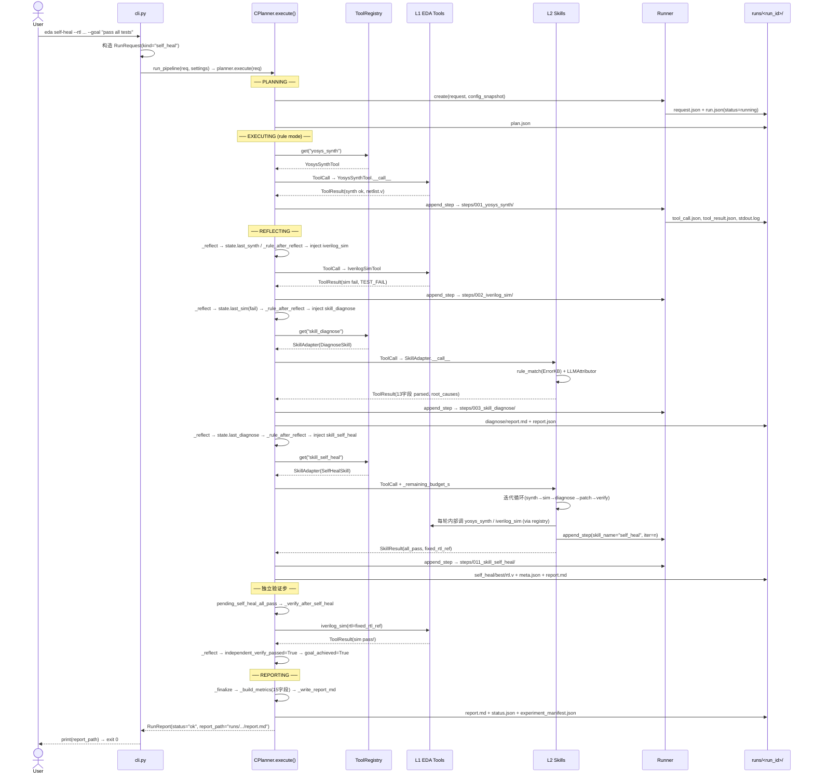
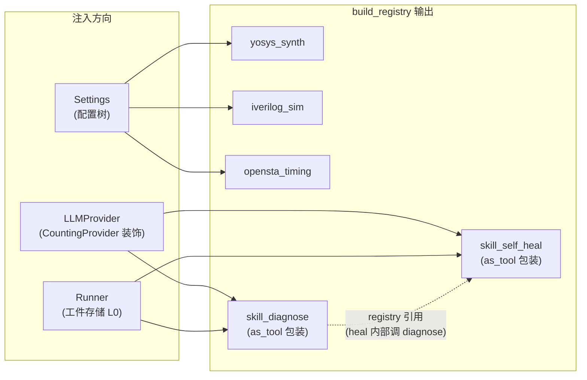
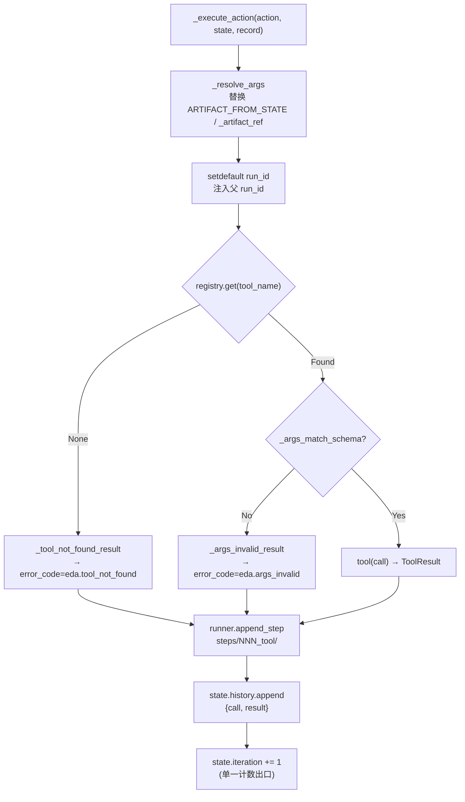
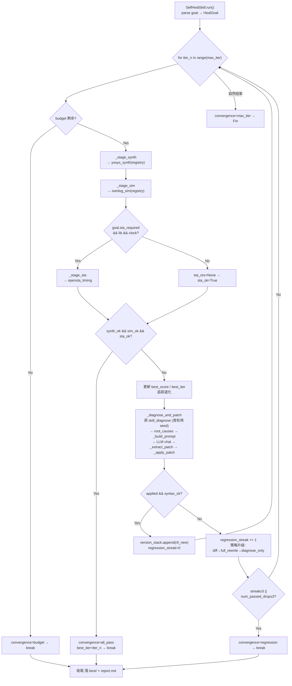

本文档追踪一条完整的请求从 CLI 入口到最终报告落盘的全过程：用户输入如何被解析为 `RunRequest`，CPlanner 五相状态机如何编排 L1 EDA 工具与 L2 智能 Skill，自修复闭环如何在内部迭代多轮综合-仿真-诊断-Patch，以及最终如何产出可供追溯的 `report.md` 与 `experiment_manifest.json`。理解此数据流是掌握整个系统行为的认知基线。

## 数据流全景：从命令行到落盘工件的七段链路

系统的数据流可以用一条线性链路概括，每一段都有明确的输入数据结构、输出数据结构和落盘工件。下面的序列图展示了一次完整的 `self-heal` 请求从发起到终态的全过程。



Sources: [cli.py](../../src/eda_agent/cli.py#L30-L41), [c_planner.py](../../src/eda_agent/planner/c_planner.py#L87-L162)

## 第一段：CLI 参数解析与 RunRequest 构造

用户通过三子命令 CLI 发起请求。`main()` 函数使用 `argparse` 解析命令行参数，根据子命令类型构造对应的 `RunRequest` dataclass。`RunRequest` 是一个 `frozen=True` 的不可变数据结构，定义了系统对外契约的入参形状——`kind` 字段（`"run"` / `"diagnose"` / `"self_heal"`）是决定后续 CPlanner 编排路径的**首要分流信号**。

| 子命令 | kind 值 | 必填参数 | 编排语义 |
|---|---|---|---|
| `eda self-heal` | `"self_heal"` | `--rtl`, `--tb`, `--goal` | C + A + B 全闭环：综合→仿真→诊断→自修复→独立验证 |
| `eda diagnose` | `"diagnose"` | `--rtl`, `--tb` | C + A：综合→仿真→诊断（不修复，产出诊断报告即收尾） |
| `eda report` | 无 | `run_id` | 不调 Pipeline，直接从磁盘读已落盘的 `report.md` |

CLI 层完成参数解析后，调用 `run_pipeline(request, settings)` 统一进入编排管线。该函数是**对象图构造的唯一入口**：按固定顺序实例化 `LLMProvider`、`Runner`、`ToolRegistry`、`CPlanner`，注入依赖后触发 `planner.execute(request)`。CLI 最终从 `RunReport` 中提取 `report_path` 打印到 stdout，并根据 `status` 字段映射退出码（`ok→0`, `failed→1`, `budget_exhausted→2`）。

Sources: [cli.py](../../src/eda_agent/cli.py#L30-L90), [contracts.py](../../src/eda_agent/contracts.py#L38-L57)

## 第二段：对象图构造与注册中心填充

`run_pipeline` 中的对象图构造遵循**显式注入、单一构造点**原则。`build_registry()` 工厂函数是 L3 注册中心的唯一填充点——它按固定顺序注册三类组件。



**关键依赖约束**：`skill_self_heal` 在构造时持有整个 `registry` 的引用（自修复内部迭代需要直接调 L1 工具和 `skill_diagnose`），因此其注册必须在 `skill_diagnose` 之后完成。L1 子进程工具仅持有 `Settings`，不依赖 `LLMProvider`——这保证了工具层与 LLM 层的**解耦边界**。

Sources: [bootstrap.py](../../src/eda_agent/tools/bootstrap.py#L24-L97), [skills/base.py](../../src/eda_agent/skills/base.py#L24-L107)

## 第三段：CPlanner 五相状态机与可变上下文

CPlanner 的 `execute()` 方法是整个系统的**控制流核心**。每次调用生成一个独立的 `run_id`、`Budget` 计时器和 `PlannerState` 可变上下文实例，三者贯穿整个生命周期。

| 相位 | 触发条件 | 核心动作 | 状态转移目标 |
|---|---|---|---|
| **PLANNING** | execute 入口 | `_make_plan`：rule 模式生成初始 plan（首步 `yosys_synth`），落 `plan.json` | → EXECUTING（rule）/ → REFLECTING（llm） |
| **EXECUTING** | rule 模式专属 | 取 `plan.actions[0]`，`_resolve_args` 解析 artifact 占位符，`_execute_action` 调 Tool | → REFLECTING |
| **REFLECTING** | EXECUTING 完成或 llm 回环 | `_reflect` 更新 state 业务字段；`_rule_after_reflect` 动态注入下一步动作 / `_llm_next_action` 取 LLM 决策 | → EXECUTING（rule 有下一步）/ → REFLECTING（llm 继续）/ → REPORTING |
| **REPORTING** | goal_achieved / fatal / 预算耗尽 / 无下一步 | `_finalize`：写 `report.md` + `status.json`，落 `experiment_manifest.json` | → DONE |
| **DONE** | REPORTING 完成 | 退出 while 循环，返回 `RunReport` | （终态） |

`PlannerState` 是状态机运转的**单一可变上下文**。它持有关键业务字段：`iteration`（工具调用计数，单一递增出口在 `_execute_action` 末尾）、`history`（每次执行的 `ToolCall`+`ToolResult` 对）、以及 `last_synth`/`last_sim`/`last_sta`/`last_diagnose` 等阶段最新结果。`_rule_after_reflect` 方法依据这些字段的填充状态决定下一步动作——例如"仿真已跑但未诊断"就注入 `skill_diagnose`，"已诊断且 kind=self_heal"就注入 `skill_self_heal`。

Sources: [c_planner.py](../../src/eda_agent/planner/c_planner.py#L87-L156), [rule_planner.py](../../src/eda_agent/planner/rule_planner.py#L48-L80)

## 第四段：Tool 调用执行与 StepRecord 落盘

每次工具调用（无论来自 rule planner 还是 LLM 决策）都经过统一路径：`_execute_action` 方法。该方法完成四个步骤——解析参数、构造 `ToolCall`、调 `registry.get(name)` 取 Tool 实例并 `__call__`、调 `runner.append_step` 落盘。参数解析（`_resolve_args`）处理两种 artifact 占位符：`ARTIFACT_FROM_STATE`（`"<from_state>"`）标记"从上游 ToolResult 的 artifacts 中取"，以及 `_artifact_ref` dict 直接携带的工件引用。



`append_step` 将每次调用的完整快照落盘到 `runs/<run_id>/steps/<NNN>_<tool_name>/` 目录，包含 `tool_call.json`、`tool_result.json`、`stdout.log`/`stderr.log`（裁剪版，头尾各 32KB），以及超过 64KB 时的 `.full.log` 完整版。`StepRecord` 携带 `skill_name` 和 `iter` 字段——C 直接调的工具传 `None`，B 自修复内部迭代的子步传 `skill_name="self_heal"` + `iter=N`，两类步骤共享同一个全局序号空间。

Sources: [c_planner.py](../../src/eda_agent/planner/c_planner.py#L323-L352), [runner.py](../../src/eda_agent/runner.py#L198-L249)

## 第五段：诊断器（组件 A）的数据流

当 CPlanner 发现仿真未通过时，`_rule_after_reflect` 注入 `skill_diagnose` 动作。C 将此前所有上游 ToolResult 收集为 `tool_results` 列表（通过 `_collect_upstream_results` 从 `state.history` 抽取），作为 Skill 的核心输入。诊断器内部执行 9 步流程：

诊断器采用**规则层优先、LLM 归因按需触发**的两级架构。`_collect_logs` 方法优先从磁盘读取 `steps/<idx>_<tool>/<tool>.full.log` 完整日志（而非内存中的裁剪版 stdout），确保诊断信息不因 64KB 裁剪而丢失。规则层（`rule_match`）用 ErrorKB 中的正则模式扫描日志文本，产出 `ErrorItem` 列表。仅当规则层未命中（`len(errors)==0` 且有失败 tool）或跨工具失败时，才触发 LLM 归因（`LLMAttributor`）。最终产出 13 字段 `parsed` 结构，落盘到 `runs/<run_id>/diagnose/report.{md,json}`。

| 诊断输出字段 | 类型 | 语义 |
|---|---|---|
| `root_causes` | `list[ErrorItem]` | 结构化根因列表（code/severity/message/evidence/fix_suggestion） |
| `root_cause_summary` | `str` | 一行根因总结 |
| `confidence` | `float` | 写死公式：`0.5 + 0.1×min(evidence,5) - 0.2×contradiction` |
| `used_layers` | `str` | `"rule"` / `"llm"` / `"rule+llm"` |
| `needs_rtl_patch` | `bool` | severity 含 error/fatal 时为 True |
| `kb_hits` | `list[str]` | 命中的 KB pattern code 列表 |

Sources: [diagnose.py](../../src/eda_agent/skills/diagnose.py#L571-L740), [c_planner.py](../../src/eda_agent/planner/c_planner.py#L514-L534)

## 第六段：自修复闭环（组件 B）的内部数据流

`skill_self_heal` 是系统中最复杂的数据流单元。CPlanner 在 `_rule_after_reflect` 中注入自修复动作时，通过 `_remaining_budget_s` 下传剩余 Run 预算（双层预算仲裁）。SkillAdapter 拆包该 reserved 字段后传入 `SelfHealSkill.run()`。B 的主循环是一个 `for iter_n in range(max_iter)` 的迭代器，每轮执行完整的综合→仿真→(STA)→诊断→Patch→重验证闭环。



**版本栈机制**是自修复的核心防退化策略。`version_stack` 是一个 RTL 文本列表，每轮 patch 成功后 `append` 新版本，退化时保留旧版本不弹出。`best_score` 和 `best_iter` 追踪历史最佳轮（`score = num_passed`）。收敛原因有五种：`all_pass`（成功）、`max_iter`（达到迭代上限）、`regression`（连续退化或 patch 连续失败）、`budget`（预算耗尽）、`none`（不应出现）。收敛后落盘 `self_heal/best/{rtl.v, meta.json}` 和 `self_heal/report.md`，`SkillResult` 携带 `fixed_rtl_ref`（artifact_ref 形状）返回给 C。

Sources: [self_heal.py](../../src/eda_agent/skills/self_heal.py#L363-L660), [budget.py](../../src/eda_agent/planner/budget.py#L13-L36)

## 第七段：独立验证步与终态报告生成

当自修复 Skill 返回 `convergence_cause="all_pass"` 时，CPlanner **不会立即**判定 `goal_achieved`。`_reflect` 将 `state.pending_self_heal_all_pass` 置为 `True`，在下一轮 `_rule_after_reflect` 中优先触发 `_verify_after_self_heal`——用 B 产出的 `fixed_rtl_ref`（`best_rtl_ref`）替换原始 RTL，对原始 TB 执行一次独立的 `iverilog_sim`。这是**第三方校验**机制：B 内部的仿真通过不等于 C 的独立验证通过。只有独立验证的 `sim.passed=True` 时，`goal_achieved` 才置为 `True`。

终态报告由 `_finalize` 方法一次性生成，包含三个工件：

| 工件文件 | 写入者 | 内容 | 写入时机 |
|---|---|---|---|
| `runs/<run_id>/report.md` | `_write_report_md` | 运行报告：status/goal/steps 表格/关键 metrics | REPORTING 相位 |
| `runs/<run_id>/status.json` | `runner.finalize` | `{"run_id": ..., "status": "ok"/"failed"/"budget_exhausted"}` | 终态（仅终态写） |
| `runs/<run_id>/experiment_manifest.json` | `_write_manifest` | 14 字段实验清单（仅 `kind=self_heal` 且非 baseline） | REPORTING 相位（report.md 之后） |

`experiment_manifest.json` 的 14 字段中，`self_heal_pass_rate` 按 convergence 决定（`all_pass→1.0`，其余→0.0），`candidates_at_best_score` 从 B 落盘的 `self_heal/best/meta.json` 读取。整个终态过程使用**原子写**（tmp 文件 + `os.replace`）保证 manifest 不会因进程崩溃而出现半截 JSON。

Sources: [c_planner.py](../../src/eda_agent/planner/c_planner.py#L454-L511), [c_planner.py](../../src/eda_agent/planner/c_planner.py#L608-L657)

## 实例追踪：一次完整 self-heal Run 的数据流还原

以真实 Run `20260706_012248_99d4`（`counter_bitwidth` 设计）为例，还原数据流中每一步的输入输出。该 Run 使用 rule 模式 + glm provider，共 5 个 planner iteration（其中第 4 步是 `skill_self_heal`，内部跑了 3 轮迭代），总耗时 105.9 秒。

**Steps 序列**（`run.json` 中 12 个 StepRecord 的前 5 个为 C 可见的高层步骤，后 7 个为 B 内部子步）：

| Step | Tool | Skill | Iter | 语义 | 关键输出 |
|---|---|---|---|---|---|
| 001 | `yosys_synth` | — | — | 基线综合 | `synth/netlist.v` + `synth/synth.json` |
| 002 | `iverilog_sim` | — | — | 基线仿真 | `passed=False`（bitwidth 错误） |
| 003 | `skill_diagnose` | — | — | 诊断根因 | `root_causes` (ErrorKB 命中 bitwidth pattern) |
| 004-010 | `yosys_synth`+`iverilog_sim`+`skill_diagnose` | `self_heal` | 0-2 | B 内部 3 轮迭代 | iter0: diff 失败; iter1: full_rewrite 通过; iter2: 验证通过 |
| 011 | `skill_self_heal` | — | — | B 返回最终结果 | `convergence=all_pass`, `best_iter=2` |
| 012 | `iverilog_sim` | — | — | C 独立验证 | `passed=True` → `goal_achieved=True` |

B 内部 trajectory 显示策略升级路径：iter 0 使用 `diff` 策略（LLM 产出 diff 但未成功应用），iter 1 升级到 `full_rewrite` 策略（LLM 整文件重写成功），iter 2 仿真通过并收敛。最终 `experiment_manifest.json` 记录 `self_heal_pass_rate=1.0`、`llm_calls=2`、`tokens_total=4198`。

Sources: [run.json](../../runs/20260706_012248_99d4/run.json#L1-L169), [experiment_manifest.json](../../runs/20260706_012248_99d4/experiment_manifest.json#L1-L16), [self_heal/report.md](../../runs/20260706_012248_99d4/self_heal/report.md#L1-L23)

## 工件目录结构总览

一次完整的 `self_heal` Run 在磁盘上产生以下工件树，每一层对应数据流中一个组件的输出：

```
runs/<run_id>/
├── request.json                     ← Runner.create (CLI 入参存档)
├── run.json                         ← Runner 增量更新 (全量步骤轨迹)
├── status.json                      ← Runner.finalize (终态标记)
├── plan.json                        ← CPlanner._save_plan (初始 plan)
├── report.md                        ← CPlanner._write_report_md (运行报告)
├── experiment_manifest.json         ← CPlanner._write_manifest (实验清单, 14字段)
│
├── steps/                           ← Runner.append_step (每步快照)
│   ├── 001_yosys_synth/
│   │   ├── tool_call.json           ← 调用参数
│   │   ├── tool_result.json         ← 完整 ToolResult
│   │   ├── stdout.log               ← 裁剪版 (≤64KB)
│   │   └── stdout.full.log          ← 完整版 (>64KB 时存在)
│   ├── 002_iverilog_sim/
│   ├── 003_skill_diagnose/
│   ├── ...
│   └── 011_skill_self_heal/         ← B 作为一个 Step (整体)
│
├── diagnose/                        ← DiagnoseSkill (组件 A 产出)
│   ├── report.md                    ← 人类可读诊断报告
│   ├── report.json                  ← 13 字段 parsed
│   └── error_kb_snapshot.json       ← KB 快照
│
├── self_heal/                       ← SelfHealSkill (组件 B 产出)
│   ├── iter_0/
│   │   ├── rtl_snapshot.v           ← 每轮 RTL 快照
│   │   └── rtl_patch.diff           ← patch 文本 (若应用)
│   ├── iter_1/
│   ├── iter_2/
│   ├── best/
│   │   ├── rtl.v                    ← 最佳 RTL (C 独立验证用)
│   │   └── meta.json                ← best_iter/num_passed/candidates
│   └── report.md                    ← B 闭环报告
│
├── synth/
│   ├── netlist.v                    ← Yosys 综合 netlist
│   └── synth.json                   ← stat-json 解析结果
└── sim/
    └── (仿真输出)
```

Sources: [runner.py](../../src/eda_agent/runner.py#L107-L153), [diagnose.py](../../src/eda_agent/skills/diagnose.py#L476-L486), [self_heal.py](../../src/eda_agent/skills/self_heal.py#L587-L647)

## 异常路径与兜底机制

数据流中存在两道**不抛异常**的兜底防线，确保任何故障都能产出结构化报告而非裸崩溃：

**第一道防线在工具调用层**：`registry.get()` 返回 `None` 时，CPlanner 不抛异常而是构造 `eda.tool_not_found` 的 `ToolResult` 回灌到 history；`_args_match_schema` 校验失败时同理构造 `eda.args_invalid`。在 LLM 模式下，这些错误 ToolResult 会作为 `role="tool"` 消息回灌给 LLM，使其有机会纠正决策。

**第二道防线在 execute 顶层**：`execute` 方法的整个 `while` 循环包裹在 `try/except Exception` 中。任何未预期异常（如 JSON 解析崩溃、文件系统故障）都会被 `_emergency_report` 捕获——它调 `runner.finalize` 将 Run 标记为 `failed`，返回一个 `status="failed"` 的 `RunReport`，`summary` 字段携带异常类型、消息和完整 traceback。调用方（CLI）收到 `RunReport` 后照常打印 `report_path` 并返回退出码 1。

Sources: [c_planner.py](../../src/eda_agent/planner/c_planner.py#L101-L162), [c_planner.py](../../src/eda_agent/planner/c_planner.py#L811-L827)

## 延伸阅读

本文档聚焦数据流的纵向追踪。以下页面提供横向深入：

- 五相状态机的完整相位转移逻辑与迭代上限保护：[五相状态机：PLANNING 到 DONE 的流转](09_五相状态机Planning到Done.md)
- LLM ReAct 回环中工具决策与历史消息构造细节：[LLM ReAct 回环：工具决策与历史回灌](10_LLMReAct回环工具决策.md)
- 诊断器的 ErrorKB 模式匹配与 LLM 归因触发条件：[EDA 诊断器（组件 A）：规则层与 LLM 归因](14_EDA诊断器组件A规则层.md)
- 自修复三策略 Patch 的 diff/full_rewrite/diagnose_only 升级路径：[三策略 LLM Patch：diff / full_rewrite / diagnose_only](16_三策略LLMPatch.md)
- B 报 all_pass 后强制独立验证步的设计动机：[独立验证步：B 报 all_pass 后的第三方校验](12_独立验证步第三方校验.md)
- RunRecord 落盘格式与跨进程轨迹追溯：[RunRecord 落盘与完整轨迹追溯](25_RunRecord落盘轨迹追溯.md)
- 双层预算仲裁中 C 下传 `remaining_budget_s` 的语义边界：[双层预算仲裁与迭代上限保护](13_双层预算仲裁与迭代上限.md)