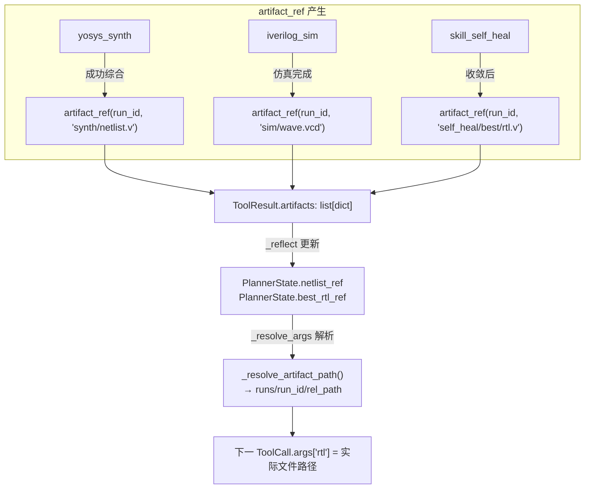
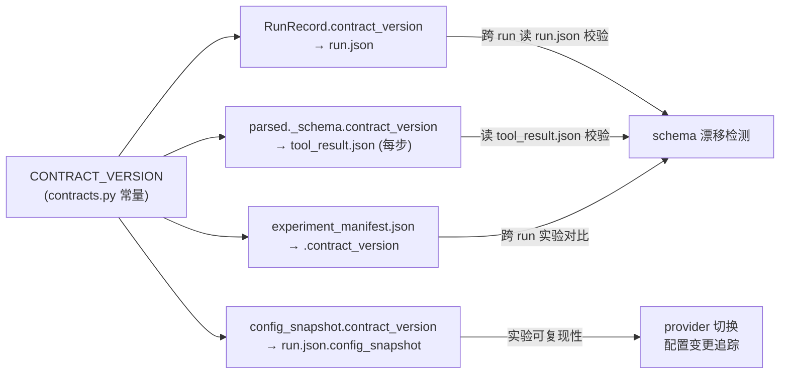

本文档深入解析 Agentic EDA 系统中两个紧密耦合的基础设施级机制：**契约版本锚点**（CONTRACT_VERSION）与**跨组件工件引用协议**（artifact_ref）。前者解决 schema 漂移的检测问题——当多组件协作时，任何一方修改了数据结构形状，其余方必须能立即感知；后者解决工件溯源问题——当一个组件产出的文件被另一组件消费时，引用必须可解析、可追溯、且格式统一。两者共同构成了系统可追溯性（实验记录）与可集成性（schema 漂移检测）的底层支柱。

## 契约版本锚点：单一常量与禁止裸字符串原则

系统的版本治理哲学是"一个常量统治一切"。`CONTRACT_VERSION = "0.1.0"` 作为语义化版本常量，是 `parsed._schema.contract_version` 与 `run.json.contract_version` 的唯一锚点。契约明确规定：任何组件引用该版本号必须通过 `from eda_agent.contracts import CONTRACT_VERSION` 导入，**禁止在代码中出现裸字符串 `"0.1.0"`**。这条规则的根本目的是消除版本号散落导致的隐性漂移——如果某组件硬编码了版本字符串，当 CONTRACT_VERSION 升级时，该组件会静默携带过期版本号，导致 schema 检测逻辑失效。

这一原则在代码审计层有硬约束：`验收 I12 / A14` 条目直接绑定该规则，静态分析工具可扫描源码中所有 `CONTRACT_VERSION` 的使用方式来执行合规检查。文档版本（`doc v1.2`）与契约版本（`CONTRACT_VERSION=0.1.0`）刻意解耦——文档修订号跟踪人类可读的设计变更，而 CONTRACT_VERSION 只在数据结构形状真正变化时才递进。

Sources: [contracts.py](../../src/eda_agent/contracts.py#L14-L30), [CONTRACTS.md](../../CONTRACTS.md)

## `_schema` 元字段：每个 ToolResult 的自描述版本指纹

每个 `ToolResult.parsed` 和 `SkillResult.final_parsed` 都必须携带一个 `_schema` 元字段，它充当该结果的**版本指纹**。其结构为固定的三键字典：

```python
parsed = {
    "_schema": {
        "name": "yosys_synth",          # 产生该结果的 Tool 名
        "version": "0.1.0",             # Tool 自身的 schema 版本
        "contract_version": CONTRACT_VERSION,  # 契约版本(唯一锚点)
    },
    # ...其余业务字段...
}
```

集成方读取 `parsed` 时，必须先校验 `_schema.name` 与 `_schema.contract_version`，不匹配则抛出 `eda.schema_mismatch` 错误码。这个设计的关键在于 `_schema` 是**自描述的**——任何一个 JSON 对象在被序列化落盘后（如 `tool_result.json`），读取方无需外部上下文即可判断它是否与当前系统的契约兼容。`_schema.name` 区分产生方（如 `yosys_synth` vs `skill_diagnose`），`_schema.version` 追踪 Tool 自身的演进，而 `contract_version` 则保证整体兼容性。

在 CPlanner 的错误兜底路径中，即使 Tool 不存在（`eda.tool_not_found`）或参数校验失败（`eda.tool_args_invalid`），返回的 ToolResult 也严格携带 `_schema` 元字段，确保回灌给 LLM 的消息体格式一致。

Sources: [contracts.py](../../src/eda_agent/contracts.py#L90-L98), [c_planner.py](../../src/eda_agent/planner/c_planner.py#L411-L452), [CONTRACTS.md](../../CONTRACTS.md)

## `artifact_ref()` 工厂函数：统一工件引用形状

`artifact_ref()` 是 v1.2 正式定义为工厂函数的核心抽象，消除了早期版本中"函数 vs dict"的三处矛盾。其签名极简：

```python
def artifact_ref(run_id: str, rel_path: str) -> dict[str, str]:
    return {"run_id": run_id, "rel_path": rel_path}
```

返回值含义明确：**实际路径 = `runs/<run_id>/<rel_path>`**。所有 `ToolResult.artifacts` 与 `SkillResult.artifacts` 的元素**必须**由此函数构造，禁止裸字符串路径，禁止裸 dict 字面量。这条规则的设计动机是：跨组件工件引用需要一个**统一的形状**，使得任何组件都能通过相同的逻辑（读 `run_id` + `rel_path` → 拼接路径）解析引用，而不需要猜测对方传的是字符串还是字典。

下面的 Mermaid 图展示了 `artifact_ref` 从产生到消费的完整生命周期：



每个 Tool 在实现中严格使用工厂函数构造 artifacts。以 `YosysSynthTool` 为例，综合成功后产出两个 artifact：网表文件和统计 JSON，均通过 `artifact_ref(str(run_id), "synth/netlist.v")` 构造。`SelfHealSkill` 收敛后产出三个 artifact：报告 markdown、最佳 RTL 文件和元数据 JSON，全部通过工厂函数构造。这种统一性使得 CPlanner 的 `_reflect` 方法可以通过 `rel_path` 后缀匹配来检索特定类型的工件——例如 `if rel.endswith("synth/netlist.v")` 来定位网表引用。

Sources: [contracts.py](../../src/eda_agent/contracts.py#L24-L30), [yosys_synth.py](../../src/eda_agent/tools/yosys_synth.py#L284-L288), [self_heal.py](../../src/eda_agent/skills/self_heal.py#L619-L647), [CONTRACTS.md](../../CONTRACTS.md)

## `ARTIFACT_FROM_STATE`：延迟绑定占位符与 `_resolve_args` 解析管线

`ARTIFACT_FROM_STATE = "<from_state>"` 是一个占位常量，用于 RulePlanner 在构造 `Action.args` 时标记"此参数的值需由 CPlanner 在运行时从状态中注入"。它解决了**计划阶段无法预知工件路径**的问题——计划生成时 yosys 还没跑，netlist 文件尚不存在。

解析发生在 CPlanner 的 `_resolve_args` 方法中，该方法在每次 `_execute_action` 调用前执行。解析管线有两个分支：

| 占位场景 | args 中的形式 | 解析条件 | 解析动作 |
|---|---|---|---|
| netlist 注入 | `{"netlist": "<from_state>"}` | `state.netlist_ref is not None` | 替换为 `_resolve_artifact_path(state.netlist_ref, record)` |
| RTL 注入（独立验证） | `{"rtl": "<from_state>", "_artifact_ref": {...}}` | `_artifact_ref` 键存在 | pop `_artifact_ref`，替换 `rtl` 为实际路径 |

`_resolve_artifact_path` 的实现是纯函数式的路径拼接：

```python
@staticmethod
def _resolve_artifact_path(art: dict[str, str], record: RunRecord) -> str:
    rel = art.get("rel_path", "")
    return str(Path("runs") / record.run_id / rel)
```

这保证了 artifact_ref 的 `run_id` 始终解析为当前 run 目录下的相对路径。当 CPlanner 在 B 报 `all_pass` 后执行独立验证步时，`_verify_after_self_heal` 构造的 Action 使用 `{"rtl": ARTIFACT_FROM_STATE, "_artifact_ref": state.best_rtl_ref, "tb": state.tb_path}`，其中 `_artifact_ref` 作为 reserved 字段携带实际的 artifact_ref dict，由 `_resolve_args` 在执行前解析为 `runs/<run_id>/self_heal/best/rtl.v`。

Sources: [contracts.py](../../src/eda_agent/contracts.py#L21-L22), [c_planner.py](../../src/eda_agent/planner/c_planner.py#L354-L391), [c_planner.py](../../src/eda_agent/planner/c_planner.py#L496-L511), [CONTRACTS.md](../../CONTRACTS.md)

## Reserved 字段体系与 LLM 可见性剥离

系统定义了两种 reserved 字段，均以下划线前缀标记，在 LLM 可见 schema 中被完全剥离：

| 字段名 | 类型 | 处理者 | 语义 |
|---|---|---|---|
| `_remaining_budget_s` | `float \| None` | `SkillAdapter.__call__` | 双层预算仲裁：C 计算剩余预算后下传 |
| `_artifact_ref` | `dict[str, str]` | `CPlanner._resolve_args` | 工件注入：携带上游 artifact_ref 供延迟解析 |
| `run_id` | `str` | `SkillAdapter.__call__` | 父 run 注入：skill 需要它 append_step 到父 RunRecord |

剥离机制在两个层级执行。首先，`ToolRegistry.to_llm_tools()` 调用 `_strip_reserved_schema` 过滤 schema 的 `properties` 和 `required` 中所有下划线前缀字段，确保 LLM 永远看不到这些内部传输字段。其次，`CPlanner._args_match_schema` 在 jsonschema 校验时显式跳过下划线前缀字段。这种双层防护确保了 reserved 字段既能安全传输，又不会干扰 LLM 的工具调用决策。

`SkillAdapter` 作为 Skill → Tool 的适配层，在 `__call__` 中消费 `run_id` 和 `_remaining_budget_s` 两个 reserved 字段，将其从 args 中 pop 出来，分别作为 `skill.run()` 的 `run_id` 位置参数和 `remaining_budget_s` 位置参数下传。剩余的 args（包括可能存在的 `_artifact_ref`）原样保留在 `inputs` dict 中，交由 Skill 内部逻辑处理。

Sources: [base.py](../../src/eda_agent/skills/base.py#L62-L107), [registry.py](../../src/eda_agent/registry.py#L57-L93), [c_planner.py](../../src/eda_agent/planner/c_planner.py#L393-L407), [CONTRACTS.md](../../CONTRACTS.md)

## 版本栈与 RTL 快照：SelfHeal 内部的工件版本管理

SelfHeal skill 内部维护一个**版本栈**（`version_stack: list[str]`），每一轮迭代的 RTL 文本作为一个快照元素入栈。这与 artifact_ref 协议形成互补：artifact_ref 解决跨组件的**外部工件引用**，版本栈解决组件内部的**历史版本管理**。

每轮迭代的 RTL 快照以**双重存储**方式落盘：一份在内存的 `version_stack` 中（用于快速回退），一份在磁盘 `runs/<run_id>/self_heal/iter_<n>/rtl_snapshot.v`（用于持久化追溯）。当 patch 应用的 RTL 在仿真中退化时，栈顶回退到上一版本；当连续退化达到阈值（`regression_streak >= 3`）时，收敛判定为 `regression`。收敛后，最佳版本被写入 `runs/<run_id>/self_heal/best/` 目录：

```
self_heal/
    iter_0/rtl_snapshot.v     # 初始 RTL（iter_0 的 rtl_patch.diff 为 None）
    iter_1/rtl_snapshot.v     # 第 0 轮 patch 后的 RTL
    iter_1/rtl_patch.diff     # 第 0 轮的 LLM patch 文本
    best/
        rtl.v                 # 历史最佳版本（best_score 最高）
        meta.json             # {best_iter, num_passed, convergence_cause, candidates_at_best_score}
    report.md                 # 人类可读报告
```

`best/meta.json` 中的 `candidates_at_best_score` 字段记录达到最佳分数的轮次数，用于实验评估中的 tie-break 复核。当 CPlanner 终态落 `experiment_manifest.json` 时，会从 `best/meta.json` 读取此值写入 manifest 的对应字段。

收敛后的 SkillResult 通过 `artifact_ref` 产出 `fixed_rtl_ref`，CPlanner 的 `_reflect` 将其存入 `PlannerState.best_rtl_ref`，随后 `_verify_after_self_heal` 用它构造独立验证步——这是 artifact_ref 协议贯穿组件边界的完整闭环。

Sources: [self_heal.py](../../src/eda_agent/skills/self_heal.py#L407-L417), [self_heal.py](../../src/eda_agent/skills/self_heal.py#L587-L647), [c_planner.py](../../src/eda_agent/planner/c_planner.py#L483-L511)

## `_reflect` 中的工件采集：从 ToolResult 到 PlannerState

CPlanner 的 `_reflect` 方法是 artifact_ref 从**被动产物**变为**主动引用**的转折点。每当一个 Tool 执行完毕，`_reflect` 检查其 `result.artifacts` 列表，通过 `rel_path` 后缀匹配将特定工件提取到 PlannerState 中：

- **yosys_synth**：扫描 artifacts 找 `rel_path.endswith("synth/netlist.v")`，存入 `state.netlist_ref`
- **skill_self_heal**：从 `parsed["fixed_rtl_ref"]` 读取，存入 `state.best_rtl_ref`

这种后缀匹配策略而非精确路径比较的设计，提供了对 Tool 内部路径约定的**容错性**——只要网表文件的 rel_path 以 `synth/netlist.v` 结尾，无论 run_id 如何变化，都能正确提取。而 `_collect_upstream_results` 方法将历史中每一步的 `run_id`（从 `ToolCall.args` 中反查）一并传给 skill_diagnose，使其能定位 `.full.log` 文件读取完整诊断证据。

Sources: [c_planner.py](../../src/eda_agent/planner/c_planner.py#L454-L494), [c_planner.py](../../src/eda_agent/planner/c_planner.py#L513-L534)

## config_snapshot 与 contract_version 的持久化传播

`contract_version` 从内存常量到磁盘持久化的传播路径有三条，每条服务于不同的可追溯目标：



`config_snapshot` 由 `make_config_snapshot()` 在 run 创建时构造，包含五组字段：LLM 配置（provider/model/temperature/max_tokens）、EDA 工具版本、contract_version、settings_hash（settings.toml 的 sha256 前 12 位）和 planner_mode。这使得两次实验可以通过 diff config_snapshot 来精确判定"是 RTL 变了还是环境变了"——如果 settings_hash 一致但 pass_rate 不同，差异只能归因于 RTL 本身或 LLM 的非确定性。

`experiment_manifest.json` 中重复记录 contract_version 保证了即使 run.json 被单独移动或归档，manifest 仍可独立验证其契约兼容性。CPlanner 的 `_write_manifest` 方法使用 `tmp + os.replace` 的原子写入策略，避免进程崩溃导致 manifest 文件损坏。

Sources: [runner.py](../../src/eda_agent/runner.py#L81-L104), [c_planner.py](../../src/eda_agent/planner/c_planner.py#L659-L706), [contracts.py](../../src/eda_agent/contracts.py#L199-L206), [CONTRACTS.md](../../CONTRACTS.md)

## 端到端工件引用流转示例

以一次完整的 self_heal 流程为例，追踪 artifact_ref 从产生到消费的完整路径：

1. **yosys_synth 执行**（StepRecord 001）：产出 `artifact_ref(run_id, "synth/netlist.v")`，落盘到 `runs/<run_id>/synth/netlist.v`
2. **`_reflect` 提取**：后缀匹配 `synth/netlist.v`，存入 `PlannerState.netlist_ref`
3. **opensta_timing 执行**（StepRecord 003）：`_resolve_args` 将 `ARTIFACT_FROM_STATE` 解析为 `runs/<run_id>/synth/netlist.v`
4. **skill_self_heal 执行**（StepRecord 005）：B 内部迭代，每轮 RTL 快照落 `self_heal/iter_<n>/rtl_snapshot.v`
5. **B 收敛 `all_pass`**：产出 `artifact_ref(run_id, "self_heal/best/rtl.v")` 作为 `fixed_rtl_ref`
6. **`_reflect` 提取**：从 `parsed["fixed_rtl_ref"]` 存入 `PlannerState.best_rtl_ref`
7. **独立验证步**（StepRecord NNN）：`_verify_after_self_heal` 构造 `{"rtl": "<from_state>", "_artifact_ref": best_rtl_ref, "tb": ...}`，`_resolve_args` 解析为 `runs/<run_id>/self_heal/best/rtl.v`
8. **iverilog_sim 执行**：读取最佳 RTL 进行第三方验证，`_reflect` 判定 `independent_verify_passed`

整个链路中，artifact_ref 的形状始终保持 `{"run_id": str, "rel_path": str}`，没有任何组件将其转换为裸字符串或自定义 dict 格式。

Sources: [c_planner.py](../../src/eda_agent/planner/c_planner.py#L354-L391), [c_planner.py](../../src/eda_agent/planner/c_planner.py#L454-L511), [self_heal.py](../../src/eda_agent/skills/self_heal.py#L619-L647), [CONTRACTS.md](../../CONTRACTS.md)

## 协议设计的第一性原则

版本锚点与工件引用协议的设计遵循三条第一性原则。**单一真实来源（Single Source of Truth）**——CONTRACT_VERSION 作为唯一常量，artifact_ref 作为唯一工厂函数，消除所有歧义。**自描述性（Self-describing）**——每个 parsed dict 携带 `_schema` 版本指纹，每个 artifact 引用携带 run_id 和 rel_path，使得任何序列化产物无需外部上下文即可被验证和解析。**延迟绑定（Lazy Binding）**——ARTIFACT_FROM_STATE 占位符允许计划阶段生成抽象 Action，执行阶段再通过 `_resolve_args` 解析为具体路径，解耦了计划的静态性与执行的动态性。

这三条原则共同保证了系统在多组件协作（A 诊断器、B 自修复、C Planner）和多 LLM 后端（Claude/Qwen/DeepSeek）切换时的**契约一致性**与**工件可追溯性**——这正是"实验记录"可追溯要求的底层技术保障。

Sources: [CONTRACTS.md](../../CONTRACTS.md), [contracts.py](../../src/eda_agent/contracts.py#L1-L30)

## 延伸阅读

- [端到端数据流：从用户需求到修复报告](06_端到端数据流与修复报告.md)：artifact_ref 在完整数据流中的位置
- [Skill 到 Tool 的适配层与 reserved 字段拆包](18_Skill到Tool适配层.md)：SkillAdapter 的详细实现
- [RunRecord 落盘与完整轨迹追溯](25_RunRecord落盘轨迹追溯.md)：StepRecord 与 run.json 的落盘机制
- [版本栈回退与防退化机制](17_版本栈回退与防退化机制.md)：SelfHeal 版本栈的回退策略详解
- [实验聚合与通过率门槛（S1 门槛规则）](28_实验聚合通过率门槛S1.md)：experiment_manifest 的聚合分析