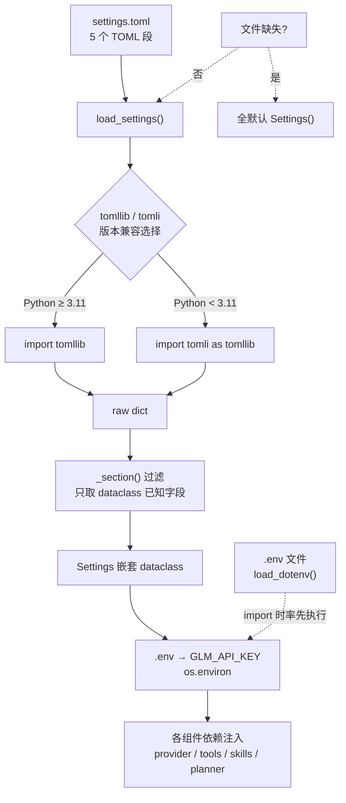
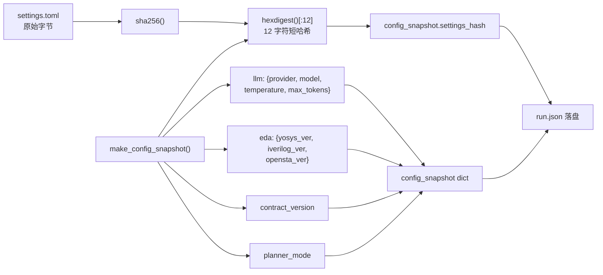
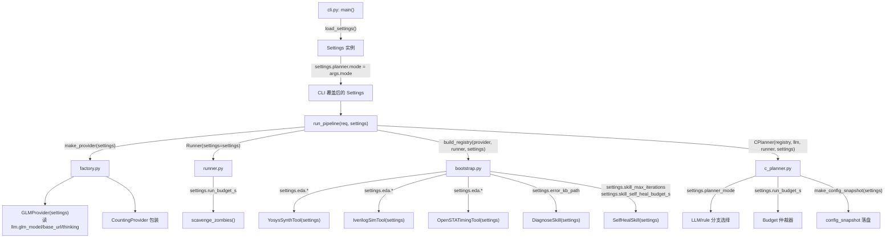

本系统的配置体系遵循 **"机密与结构分离"** 原则：API Key 等敏感凭据走 `.env` 环境变量注入，结构性参数（工具路径、预算、模型选择）集中在 `settings.toml`。`settings.py` 作为唯一入口，将 TOML 文件反序列化为嵌套 dataclass，并提供扁平便捷属性与可复现性哈希，使每一次实验运行均可精确溯源到具体的配置快照。

Sources: [settings.py](../../src/eda_agent/settings.py#L1-L157), [settings.toml](../../settings.toml)

## 配置加载架构：从 TOML 文件到运行时对象

配置加载遵循一条单向数据流：TOML 文件 → `tomllib`/`tomli` 解析 → `_section()` 防御性字段过滤 → 嵌套 dataclass → 扁平属性暴露。整个过程在进程启动时执行一次，后续所有组件通过依赖注入获取 `Settings` 实例。



`load_dotenv()` 在模块顶层执行——位于 `import tomllib` 之前——确保 `.env` 中的 API Key 在任何后续读取前已注入 `os.environ`。该调用是静默的：`.env` 不存在时不报错、不阻塞，直接回退到系统环境变量。`load_settings()` 对 `settings.toml` 同样保持优雅降级语义：文件缺失时返回全默认 `Settings()` 实例，不抛异常。

Sources: [settings.py](../../src/eda_agent/settings.py#L18-L27), [settings.py](../../src/eda_agent/settings.py#L130-L143)

### `_section()` 防御性过滤机制

`_section()` 是配置安全的核心守卫。它从原始 TOML dict 中只提取目标 dataclass 声明的字段（`cls.__dataclass_fields__`），忽略一切未知键——包括被注释掉的占位行（TOML 解析后不存在的键）和未来新增但 dataclass 尚未跟进的字段。这意味着在 `settings.toml` 中添加实验性注释行不会导致 `TypeError`。

Sources: [settings.py](../../src/eda_agent/settings.py#L122-L127)

## 五段式 TOML 结构总览

`settings.toml` 划分为五个语义段，每段映射到一个独立的 dataclass：

| TOML 段 | Dataclass | 职责范围 | 典型消费者 |
|---------|-----------|---------|-----------|
| `[llm]` | `LLMSettings` | Provider 选择、模型名、端点 URL、推理参数 | `factory.py`, `glm_provider.py`, `claude_provider.py` |
| `[eda]` | `EDASettings` | EDA 工具命令、WSL 开关、超时、默认 liberty | `yosys_synth.py`, `iverilog_sim.py`, `opensta_timing.py` |
| `[planner]` | `PlannerSettings` | 编排模式（llm/rule）、CPlanner 迭代上限 | `c_planner.py` |
| `[budget]` | `BudgetSettings` | 双层预算体系（Run 级 + Skill 子预算） | `budget.py`, `c_planner.py`, `bootstrap.py` |
| `[data]` | `DataSettings` | 知识库与故障清单路径 | `diagnose.py`, 实验脚本 |

Sources: [settings.toml](../../settings.toml), [settings.py](../../src/eda_agent/settings.py#L29-L73)

## `[llm]` 段：LLM Provider 配置

`[llm]` 段控制系统使用哪个大语言模型后端。v1.2 已将默认 provider 从 Claude 切换至智谱 GLM，并新增了 GLM 专属的思考模式与推理努力档参数。

| 字段 | 类型 | 默认值 | 说明 |
|------|------|--------|------|
| `provider` | `str` | `"glm"` | `glm`（智谱，默认）/ `claude`（备用） |
| `glm_model` | `str` | `"glm-5.2"` | GLM 模型名，裸名传 OpenAI 兼容端点 |
| `glm_base_url` | `str` | `"https://open.bigmodel.cn/api/coding/paas/v4"` | Coding Plan 兼容端点（非通用 `/api/paas/v4`） |
| `glm_thinking` | `bool` | `true` | 思考模式（`thinking.type=enabled`） |
| `glm_reasoning_effort` | `str` | `"max"` | 推理努力档，最高性能调度 |
| `claude_model` | `str` | `"claude-sonnet-4"` | 备用 Claude 模型 |
| `temperature` | `float` | `0.0` | 采样温度，0.0 保证确定性 |
| `max_tokens` | `int` | `8192`（TOML）/ `4096`（dataclass） | 最大输出 token |

> **注意**：`settings.toml` 中 `max_tokens = 8192`（GLM-5.2 支持 1M 上下文，输出放宽），但 `LLMSettings` dataclass 默认值为 `4096`。实际运行时以 TOML 文件值为准；仅在文件缺失时才回退到 dataclass 默认值。这是一个刻意的分层设计：dataclass 默认值代表"最小可用"基线，TOML 文件代表"实际部署"调优。

GLM Provider 在构造时从 `settings.llm.glm_api_key_env`（默认 `"GLM_API_KEY"`）读取环境变量名，再从 `os.environ` 获取实际 key。若未设置，立即抛出 `RuntimeError` 并给出获取指引。思考模式与推理努力档通过 OpenAI SDK 的 `extra_body` 参数透传，绕过 SDK 对非标准字段的校验。

Sources: [settings.toml](../../settings.toml), [settings.py](../../src/eda_agent/settings.py#L29-L39), [glm_provider.py](../../src/eda_agent/llm/glm_provider.py#L33-L83)

## `[eda]` 段：EDA 工具环境配置

`[eda]` 段定义三个 EDA 工具（Yosys / iverilog / OpenSTA）的运行环境。

| 字段 | 类型 | 默认值 | 说明 |
|------|------|--------|------|
| `wsl_enabled` | `bool` | `true` | 工具是否在 WSL2 中执行（Windows 开发环境） |
| `yosys_cmd` | `str` | `"yosys"` | Yosys 可执行文件名 |
| `iverilog_cmd` | `str` | `"iverilog"` | iverilog 编译器名 |
| `vvp_cmd` | `str` | `"vvp"` | vvp 仿真运行器名 |
| `opensta_cmd` | `str` | `"sta"` | OpenSTA 可执行文件名 |
| `tool_timeout_s` | `int` | `120` | 子进程统一超时（秒） |
| `default_lib_path` | `str` | `"data/lib/sky130_xx.lib"` | 默认 liberty 文件（STA 验收用） |

`wsl_enabled` 控制路径转换与命令前缀：当为 `true` 时，Windows 路径（如 `D:\x\y`）被转换为 WSL 路径（`/mnt/d/x/y`），命令前缀加 `wsl.exe -d Ubuntu-24.04 -e`。当为 `false` 时，路径和命令原样使用（适用 Linux 原生环境）。每个 EDA 工具封装在 `__init__` 中接收 `Settings` 实例（而非 `EDASettings`），通过 `self.settings.eda.xxx` 访问配置。

Sources: [settings.toml](../../settings.toml), [settings.py](../../src/eda_agent/settings.py#L42-L50), [yosys_synth.py](../../src/eda_agent/tools/yosys_synth.py#L112-L189)

## `[planner]` 段：编排模式选择

`[planner]` 段是 v1.2 新增的配置段，锁定了 CPlanner 的核心行为模式。

| 字段 | 类型 | 默认值 | 说明 |
|------|------|--------|------|
| `mode` | `str` | `"llm"` | `llm`（ReAct 主路径）/ `rule`（降级路径） |
| `max_iterations` | `int` | `8` | CPlanner 迭代上限 |

`mode = "llm"` 意味着 CPlanner 在 REFLECTING 相位通过 LLM 决策下一步工具调用（ReAct 回环）；`mode = "rule"` 则走规则引擎的固定计划路径——仅在 LLM 不可用时作为降级使用。CLI 的 `--mode` 参数可在运行时覆盖此设置，无需修改 TOML 文件。CPlanner 在构造时接收 `Settings` 实例，通过 `self._settings.planner_mode` 读取。

Sources: [settings.toml](../../settings.toml), [settings.py](../../src/eda_agent/settings.py#L53-L56), [c_planner.py](../../src/eda_agent/planner/c_planner.py#L131-L133)

## `[budget]` 段：双层预算仲裁

`[budget]` 段定义了系统最关键的资源约束——双层预算体系。这是 [双层预算仲裁与迭代上限保护](13_双层预算仲裁与迭代上限.md) 页面的配置锚点。

| 字段 | 类型 | 默认值 | 说明 |
|------|------|--------|------|
| `planner_max_iterations` | `int` | `8` | CPlanner 迭代上限（与 `planner.max_iterations` 对齐） |
| `skill_max_iterations` | `int` | `5` | Skill（B 自修复）内部迭代上限 |
| `run_budget_s` | `int` | `600` | **Run 级总预算**，C 与所有 Skill 共享 |
| `skill_diagnose_budget_s` | `int` | `60` | A 诊断器子预算 |
| `skill_self_heal_budget_s` | `int` | `480` | B 自修复子预算（留 120 给 C 的综合/仿真/STA） |

预算分配遵循一个精心设计的算术关系：`run_budget_s (600) = skill_diagnose_budget_s (60) + skill_self_heal_budget_s (480) + 120s 留给 C 直接调用的 L1 工具步骤`。`Budget` 仲裁器在 CPlanner `execute()` 入口用 `monotonic()` 初始化，每次相位切换前检查 `exhausted()`。剩余预算通过 `Action.args["_remaining_budget_s"]` 经 as_tool 适配层下传给 Skill，Skill 取 `min(self.budget_s, remaining_budget_s)` 作为实际可用预算。

Sources: [settings.toml](../../settings.toml), [settings.py](../../src/eda_agent/settings.py#L59-L65), [budget.py](../../src/eda_agent/planner/budget.py#L13-L35), [c_planner.py](../../src/eda_agent/planner/c_planner.py#L97-L98)

## `[data]` 段：知识库与语料路径

| 字段 | 类型 | 默认值 | 说明 |
|------|------|--------|------|
| `error_kb_path` | `str` | `"data/error_kb.json"` | ErrorKB 错误知识库路径 |
| `fault_manifest_path` | `str` | `"data/fault_manifest.json"` | 故障注入清单（实验基准对比） |
| `logs_corpus_path` | `str` | `"data/logs_corpus/corpus.jsonl"` | 诊断语料（一行一条 JSON） |

这些路径在 `build_registry()` 中被消费：`ErrorKB.load(settings.error_kb_path)` 加载诊断器的规则匹配模式库，`fault_manifest_path` 驱动实验脚本的批量基准对比。

Sources: [settings.toml](../../settings.toml), [settings.py](../../src/eda_agent/settings.py#L68-L72), [bootstrap.py](../../src/eda_agent/tools/bootstrap.py#L59-L63)

## 扁平便捷属性层

`Settings` dataclass 在嵌套结构之上提供了一组 `@property` 扁平访问器，使高频字段可在代码中直接 `settings.xxx` 使用，避免 `settings.budget.skill_max_iterations` 这样的冗长链式访问。

| 扁平属性 | 代理目标 | 主要消费方 |
|---------|---------|-----------|
| `settings.llm_provider` | `llm.provider` | `factory.py` |
| `settings.planner_mode` | `planner.mode` | `c_planner.py`, `make_config_snapshot()` |
| `settings.skill_max_iterations` | `budget.skill_max_iterations` | `bootstrap.py`, `c_planner.py` |
| `settings.planner_max_iterations` | `budget.planner_max_iterations` | `c_planner.py` |
| `settings.run_budget_s` | `budget.run_budget_s` | `budget.py`, `cli.py` |
| `settings.skill_self_heal_budget_s` | `budget.skill_self_heal_budget_s` | `bootstrap.py` |
| `settings.skill_diagnose_budget_s` | `budget.skill_diagnose_budget_s` | `bootstrap.py` |
| `settings.error_kb_path` | `data.error_kb_path` | `bootstrap.py` |
| `settings.fault_manifest_path` | `data.fault_manifest_path` | 实验脚本 |

Sources: [settings.py](../../src/eda_agent/settings.py#L83-L119)

## CLI 运行时覆盖

CLI 层支持在 `self-heal` 子命令中覆盖两个关键配置项，无需修改 `settings.toml`：

```
eda self-heal --rtl <path> --tb <path> --goal <text> [--mode rule|llm] [--run-budget <seconds>]
```

| CLI 参数 | 覆盖目标 | 实现方式 |
|---------|---------|---------|
| `--mode` | `settings.planner.mode` | 直接赋值 `settings.planner.mode = args.mode` |
| `--run-budget` | `settings.budget.run_budget_s` | 直接赋值 `settings.budget.run_budget_s = args.run_budget` |

覆盖发生在 `load_settings()` 之后、`run_pipeline()` 之前。由于 `Settings` 是可变 dataclass（非 frozen），覆盖直接修改实例属性，随依赖注入传播到所有下游组件。这种设计在实验场景中尤其有用：通过 `--mode rule` 快速切换到降级路径进行 baseline 对比。

Sources: [cli.py](../../src/eda_agent/cli.py#L56-L57), [cli.py](../../src/eda_agent/cli.py#L73-L78)

## 可复现性链路：settings_hash 与 config_snapshot

配置系统的另一项核心使命是 **实验可复现性**。每个 `run.json` 中的 `config_snapshot` 字段记录了本次运行的关键配置快照，其中 `settings_hash` 是 `settings.toml` 的 SHA-256 前 12 位。



`settings_hash()` 在文件缺失时返回空字符串（全默认配置无可复现哈希）。`make_config_snapshot()` 在 CPlanner `execute()` 入口被调用，将 LLM 配置（provider/model/temperature/max_tokens）、EDA 工具版本号、契约版本号、配置哈希和 planner 模式打包成一个 dict，写入 `RunRecord.config_snapshot`。这样，评委或开发者拿到一个 `run.json` 即可精确判断该次实验使用了哪套配置。

Sources: [settings.py](../../src/eda_agent/settings.py#L146-L156), [runner.py](../../src/eda_agent/runner.py#L81-L104), [contracts.py](../../src/eda_agent/contracts.py#L199-L204)

## API Key 安全边界

系统严格执行 **"密钥不进代码库"** 原则。API Key 通过 `.env` 文件注入 `os.environ`，`settings.toml` 只存储环境变量名（而非值本身）。

`.env.example` 是团队共享的模板，列出所有需要的环境变量及获取方式。开发者将其复制为 `.env`（已被 `.gitignore` 排除）并填入实际 key。`python-dotenv` 的 `load_dotenv()` 在 `settings.py` 模块顶层、所有其他 import 之前执行，确保 `os.environ.get("GLM_API_KEY")` 在任何 provider 构造时都能拿到值。

| 环境变量 | Provider | 获取来源 | settings.toml 中的引用 |
|---------|----------|---------|----------------------|
| `GLM_API_KEY` | GLM（智谱） | open.bigmodel.cn 控制台 | `llm.glm_api_key_env`（字段名，默认 `"GLM_API_KEY"`） |
| `ANTHROPIC_API_KEY` | Claude（备用） | Anthropic 控制台 | 代码硬编码 `os.environ.get("ANTHROPIC_API_KEY")` |

`glm_api_key_env` 是一个间接引用——`settings.toml` 存储 *环境变量名* 而非值。GLMProvider 在 `__init__` 中执行 `os.environ.get(settings.llm.glm_api_key_env)` 来获取实际 key，为未来支持多个 GLM 账号（如不同环境使用不同 key）保留了灵活性。

Sources: [.env.example](../../.env.example), [settings.py](../../src/eda_agent/settings.py#L18-L21), [glm_provider.py](../../src/eda_agent/llm/glm_provider.py#L33-L42), [pyproject.toml](../../pyproject.toml)

## 配置消费全景图

以下展示 `Settings` 实例从创建到被各组件消费的完整注入路径：



每一个箭头都是一次依赖注入。`Settings` 实例在整个进程生命周期内共享，但由于 `Settings` 是可变 dataclass，CLI 覆盖的值会自然传播到所有下游组件。这一设计的简洁性来自于"一处构造、全链注入"模式：只有 `cli.py` 调用 `load_settings()`，其余所有组件通过构造函数参数接收已构造好的 `Settings`。

Sources: [cli.py](../../src/eda_agent/cli.py#L30-L41), [factory.py](../../src/eda_agent/llm/factory.py#L20-L29), [bootstrap.py](../../src/eda_agent/tools/bootstrap.py#L24-L96), [c_planner.py](../../src/eda_agent/planner/c_planner.py#L74-L98)

## 后续阅读

配置系统是理解整个系统行为的入口。以下是推荐的后续阅读路径：

- **[双层预算仲裁与迭代上限保护](13_双层预算仲裁与迭代上限.md)** — 深入 `[budget]` 段如何在运行时通过 `Budget` 类和 `monotonic()` 时钟实现双层资源仲裁
- **[LLM Provider 抽象协议与多后端支持](23_LLMProvider抽象协议.md)** — 理解 `[llm]` 段如何驱动 provider 工厂的实例化与 CountingProvider 包装
- **[版本锚点与工件引用协议](07_版本锚点与工件引用协议.md)** — `settings_hash` 与 `config_snapshot` 如何融入 RunRecord 的完整可追溯链路
- **[契约驱动开发哲学：CONTRACTS.md 权威机制](04_契约驱动CONTRACTS权威机制.md)** — CONTRACTS.md §6 如何作为 `settings.toml` 结构的权威定义源