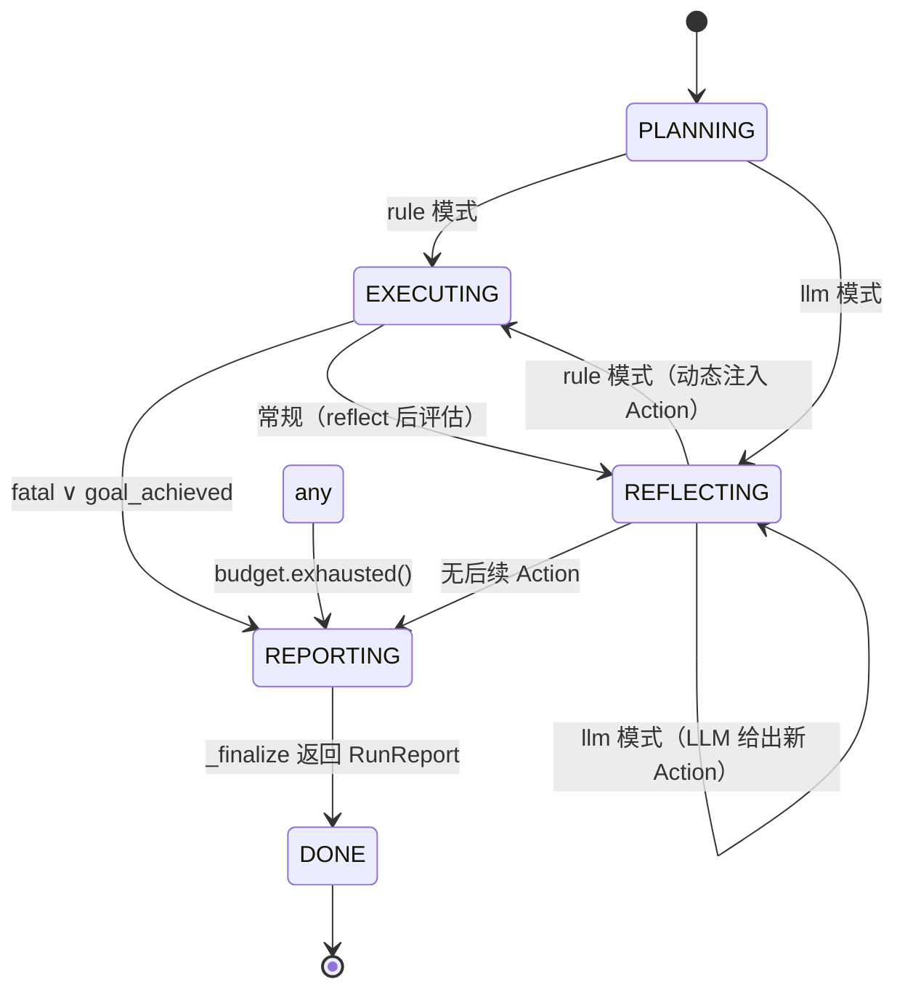

CPlanner 作为 L4 编排大脑，以一个紧凑的五相状态机驱动从用户需求到修复报告的完整流水线。五个相位——`PLANNING`、`EXECUTING`、`REFLECTING`、`REPORTING`、`DONE`——通过单循环 `while phase != "DONE"` 驱动，每个相位在退出前完成自己的确定性职责，并将控制权连同可变上下文 `PlannerState` 一同移交给下一相位。本页深入解析每个相位的内部逻辑、转移条件、双模式（rule / llm）分叉，以及预算耗尽、致命错误、独立验证等关键守卫机制。

Sources: [rule_planner.py](../../src/eda_agent/planner/rule_planner.py#L17-L18), [c_planner.py](../../src/eda_agent/planner/c_planner.py#L87-L162)

## 相位定义与类型契约

五相状态机的相位集合通过 Python `Literal` 类型编码，并非传统枚举——这种选择使相位成为字符串字面量，在 `while` 循环比较中零开销，同时仍受 mypy 静态检查约束。相位定义位于 `rule_planner.py`，与状态数据结构同模块，但所有相位转移逻辑实现于 `c_planner.py` 的 `CPlanner` 方法中。

| 相位 | 职责 | 主控方法 |
|------|------|----------|
| `PLANNING` | 根据请求和模式生成初始 `Plan` | `_make_plan` |
| `EXECUTING` | 从 Plan 取下一个 Action 并执行 | `_next_rule_action` / `_execute_action` |
| `REFLECTING` | 评估执行结果，决定下一步或收尾 | `_reflect` / `_rule_after_reflect` / `_llm_next_action` |
| `REPORTING` | 生成报告、落盘 RunReport、写 manifest | `_finalize` |
| `DONE` | 终态，退出循环 | — |

`PlannerState` 是贯穿整个 `execute` 调用的唯一可变上下文实例，承载业务字段（`last_synth`、`last_sim`、`last_sta`、`last_diagnose`）、迭代计数（`iteration`）、执行历史（`history`），以及两个关键的**门控布尔量**：`goal_achieved` 和 `fatal`。这两个字段在 `_reflect` 中被设置后，立即被主循环捕获，驱动相位向 `REPORTING` 收敛。另一个微妙字段 `pending_self_heal_all_pass` 实现了"B 报成功但 C 不信任"的独立验证协议——它阻止 `goal_achieved` 被 `_rule_after_reflect` 的常规分支过早置位。

Sources: [rule_planner.py](../../src/eda_agent/planner/rule_planner.py#L17-L18), [rule_planner.py](../../src/eda_agent/planner/rule_planner.py#L48-L81), [c_planner.py](../../src/eda_agent/planner/c_planner.py#L454-L493)

## 主循环：单 while 驱动的相位机

整个状态机的核心是一个 `while phase != "DONE"` 循环，内含四个 `elif` 分支分别对应四个活跃相位。这种"扁平 dispatch"设计的好处在于**所有转移条件在同一处可见**，不存在隐式回调或异步状态跳转。每次循环迭代恰好处理一个相位，相位之间的跳转通过 `phase = "NEXT"` 赋值实现，下一轮循环顶部重新进入。

循环顶部有一个**预算守卫**：`if budget.exhausted() and phase != "REPORTING"` 会强制跳转到 `REPORTING`。这个设计确保即使正处于 `EXECUTING` 或 `REFLECTING` 的关键中间步骤，预算一旦耗尽也不会继续消耗资源。注意 `REPORTING` 本身被豁免——报告生成是不可跳过的终态操作。

整个循环被 `try/except Exception` 包裹，任何未预期异常都会被 `_emergency_report` 捕获，返回 `status="failed"` 的 `RunReport`，**不向调用方抛出**。这保证了 CLI 层永远不会因为 CPlanner 内部崩溃而产生未处理异常。

Sources: [c_planner.py](../../src/eda_agent/planner/c_planner.py#L87-L162), [c_planner.py](../../src/eda_agent/planner/c_planner.py#L811-L827)

## PLANNING：初始计划生成

`PLANNING` 是入口相位，在 `execute` 方法开头由 `phase: PlannerPhase = "PLANNING"` 初始化。此相位调用 `_make_plan`，根据 `planner_mode` 和 `RunRequest.extra` 中的特殊标志生成初始 `Plan`，随后立即将相位转移交出。

三种分支路径由优先级控制：

| 优先级 | 条件 | 生成内容 | 下一相位 |
|--------|------|----------|----------|
| 1（最高） | `request.extra["baseline_only"]` | 固定 2 步：synth + sim | `EXECUTING` |
| 2 | `planner_mode == "llm"` | 空 Plan（`actions=[]`, `mode="llm"`） | `REFLECTING` |
| 3（默认） | `planner_mode == "rule"` | 单步 Plan：仅 `yosys_synth` | `EXECUTING` |

**rule 模式的设计哲学**值得深入理解：初始 Plan 只放第一步 `yosys_synth`，而非一次性铺开全部步骤。这是因为 rule 模式采用"跑一步 reflect 一步"的策略——`_rule_after_reflect` 在 `REFLECTING` 相位根据上一步结果**动态注入**下一步（sim、sta、diagnose、self_heal 或收尾）。`plan.actions` 每次被覆盖为单元素 list，由 `_next_rule_action` 取 `[0]`。这种"惰性规划"使 rule 引擎能根据实时结果（如仿真是否通过、诊断是否需要 patch）做出分支决策，而非盲目执行预设序列。

`baseline_only` 分支是一个实验快捷通道，只跑综合和仿真，不触发诊断或修复，用于建立基准通过率。

Sources: [c_planner.py](../../src/eda_agent/planner/c_planner.py#L180-L213), [c_planner.py](../../src/eda_agent/planner/c_planner.py#L106-L109)

## EXECUTING：动作执行与迭代计数

`EXECUTING` 相位负责从 Plan 中取出下一个 Action 并执行。进入此相位前，主循环先检查**迭代上限守卫**：`if state.iteration >= self._settings.planner_max_iterations` 则直接跳转 `REPORTING`，防止无限循环。

rule 模式下，`_next_rule_action` 简单地返回 `plan.actions[0]`。如果返回 `None` 且 `state.pending_self_heal_all_pass` 为真，则触发独立验证步 `_verify_after_self_heal`。如果仍然是 `None`，意味着所有动作已完成或无可用动作，相位转向 `REPORTING`。

执行链路 `_execute_action` 是一个关键方法，它承担五项职责：(1) 从 Registry 查找 Tool；(2) 调用 `_resolve_args` 解析 `ARTIFACT_FROM_STATE` 占位符和 `_artifact_ref` 工件引用；(3) 注入父 `run_id`；(4) 构造 `ToolCall` 并执行 `tool(call)`；(5) 通过 `Runner.append_step` 落盘 StepRecord。**迭代计数的单一出口**在此方法末尾：`state.iteration += 1`。这确保无论从哪个相位路径执行 Action，计数器只增一次，不存在重复计数。

执行完成后立即调用 `_reflect(state)` 更新业务字段，随后根据 `state.fatal or state.goal_achieved` 决定是走向 `REPORTING` 还是继续到 `REFLECTING` 评估下一步。

Sources: [c_planner.py](../../src/eda_agent/planner/c_planner.py#L110-L127), [c_planner.py](../../src/eda_agent/planner/c_planner.py#L323-L352), [c_planner.py](../../src/eda_agent/planner/c_planner.py#L215-L225)

## REFLECTING：双模式分叉的核心

`REFLECTING` 是五相状态机中**分支最复杂**的相位，也是 rule 模式和 llm 模式的真正分叉点。根据 `planner_mode` 的不同，此相位的控制流完全不同：

**rule 模式**调用 `_rule_after_reflect`，一个基于优先级的决策函数，按固定顺序检查多个条件分支，返回下一个 `Action` 或 `None`。分支检查顺序如下：

| 分支 | 条件 | 注入的 Action | 说明 |
|------|------|---------------|------|
| 0a（最高优先级） | `pending_self_heal_all_pass` | 独立验证 sim | B 报 all_pass 后强制第三方验证 |
| 0b | `baseline_only` ∧ sim 已跑 | None + `goal_achieved=True` | 基线实验短路 |
| 1 | sim passed ∧ sta ok | None + `goal_achieved=True` | 仿真通过即目标达成 |
| 2 | sim 未通过 ∧ 未诊断 | `skill_diagnose` | 注入诊断器 |
| 3 | 已诊断 ∧ kind=self_heal ∧ 未修复 | `skill_self_heal`（含预算下传） | 注入自修复闭环 |
| 4 | kind=diagnose ∧ 已诊断 | None + `goal_achieved=True` | 诊断产出即目标达成 |
| — | 补齐初始 plan | `iverilog_sim` 或 `opensta_timing` | sim 未跑则跑 sim；条件满足则跑 sta |

分支 0a 的优先级最高，确保即使在分支 1 的条件也满足时（sim passed=True），也会先执行独立验证而非直接判定目标达成。这是契约 v1.2 的关键裁决——B 报告 `all_pass` 后，C 必须强制追加一次 `iverilog_sim` 验证步，**不信任 B 的自我报告**。

**llm 模式**调用 `_llm_next_action`，将当前状态序列化为 system + user + tool history 的消息数组，连同 Registry 中所有 Tool 的 schema 一起发给 LLM，取回 `tool_calls[0]` 作为下一个 Action。如果 LLM 返回空 `tool_calls`（目标达成或降级），或者抛异常（经 `_call_llm_safe` 降级为空 `tool_calls`），则返回 `None`，相位转向 `REPORTING`。llm 模式下 `REFLECTING` 可以自循环：有 Action 就执行→reflect→回到 `REFLECTING`，直到 LLM 不再发出 tool_call 或达到上限。

Sources: [c_planner.py](../../src/eda_agent/planner/c_planner.py#L128-L152), [c_planner.py](../../src/eda_agent/planner/c_planner.py#L227-L321), [c_planner.py](../../src/eda_agent/planner/c_planner.py#L537-L558)

## _reflect：业务状态同步（不碰计数器）

`_reflect` 方法虽然名为"反思"，实际上是一个**纯状态同步函数**：它读取最近一次 `ToolResult` 的 `parsed` 字段，根据 tool 名称更新 `PlannerState` 的对应业务字段。它**不修改 `iteration`**——计数器的唯一增量出口在 `_execute_action` 末尾。

此方法通过 tool 名称的 `if/elif` 链处理五种工具结果的反射逻辑。其中 `iverilog_sim` 分支内嵌了一个**独立验证判定**：当 `best_rtl_ref is not None`（B 已产出修复版本）且 `independent_verify_passed is None`（尚未验证）时，读取 sim 结果的 `passed` 字段。若 `passed=True` 则设 `goal_achieved=True`；若 `passed=False` 则保持 `goal_achieved=False`，status 最终为 `failed`——**不静默通过**。

`skill_self_heal` 分支提取 `fixed_rtl_ref`（B 产出的修复版 RTL 工件引用）和 `convergence_cause`。当 `convergence_cause == "all_pass"` 时，**不直接设** `goal_achieved`，而是设 `pending_self_heal_all_pass = True`，将判定权交给后续的独立验证步。这是一种"延迟信任"设计：B 声称修复成功只是进入验证队列的入场券，不是终点。

最后，`_reflect` 检查 `error_code == EDA_INTERNAL` 来判定致命错误。任何工具返回 `eda.internal` 错误码都会立即将 `state.fatal` 置位，主循环在下一个相位切换点捕获后跳转 `REPORTING`。

Sources: [c_planner.py](../../src/eda_agent/planner/c_planner.py#L454-L493)

## 独立验证步：B all_pass 后的第三方校验

`_verify_after_self_heal` 实现了契约 v1.2 的关键裁决——C 在 B 报告 `all_pass` 后，必须用 B 产出的 `fixed_rtl_ref` 替换原始 RTL，强制重跑一次 `iverilog_sim`，以 C 自己的 Registry 和 TB 环境做第三方验证。

验证步的构造很精巧：它创建一个 `Action`，将 `rtl` 参数设为 `ARTIFACT_FROM_STATE`（`"<from_state>"` 占位符），同时将 B 产出的 `best_rtl_ref`（一个 `artifact_ref` dict）放入 `_artifact_ref` reserved 字段。在 `_resolve_args` 中，这两个值配合解析：`ARTIFACT_FROM_STATE` 触发 `_artifact_ref` 弹出，后者被 `_resolve_artifact_path` 转换为实际文件路径 `runs/<run_id>/<rel_path>`。这样验证步跑的是 B 修复后的 RTL 文件，而非用户原始输入。

验证通过后（`_reflect` 中 `independent_verify_passed=True`），`goal_achieved` 被置位，主循环自然收敛到 `REPORTING`。验证失败则 `goal_achieved` 保持 `False`，最终 `status=failed`。两种情况都被 E2E stub 测试覆盖：`test_e2e_self_heal_all_pass_triggers_independent_verify` 验证通过路径，`test_e2e_independent_verify_failure_keeps_failed` 验证失败不静默通过。

Sources: [c_planner.py](../../src/eda_agent/planner/c_planner.py#L496-L511), [c_planner.py](../../src/eda_agent/planner/c_planner.py#L354-L380), [test_e2e_stub.py](../../tests/test_e2e_stub.py#L67-L98), [test_e2e_stub.py](../../tests/test_e2e_stub.py#L101-L137)

## REPORTING → DONE：终态与报告生成

`REPORTING` 是最后一个活跃相位，调用 `_finalize` 完成：(1) 从 `CountingProvider` 读取 LLM 调用计量；(2) 根据 `goal_achieved`、`budget_exhausted` 等判定终态 `status`；(3) 构造 15 字段的 `metrics` 字典；(4) 写 `report.md` 到 `runs/<run_id>/`；(5) 调用 `Runner.finalize` 落终态 `run.json` + `status.json`；(6) 若是 `self_heal` kind 则额外写 `experiment_manifest.json`（14 字段）。`_finalize` 返回 `RunReport` 后，`phase` 被设为 `"DONE"`，循环退出。

终态 status 判定逻辑如下表所示：

| 优先级 | 条件 | status |
|--------|------|--------|
| 1 | `baseline_only=True` | `ok`（基线实验跑完即成功，不关心 sim pass 与否） |
| 2 | `state.goal_achieved` | `ok` |
| 3 | `budget.exhausted()` 或 `record.status == "budget_exhausted"` | `budget_exhausted` |
| 4 | 兜底 | `failed` |

整个 `execute` 方法在循环外有 `try/except Exception` 兜底：任何未预期异常触发 `_emergency_report`，它调用 `Runner.finalize` 标记 `failed` 并返回一个 `summary` 含 crash 信息的 `RunReport`（`metrics={}`）。测试 `test_emergency_report_on_crash` 通过 monkeypatch `_reflect` 抛出 `RuntimeError` 来验证此路径。

Sources: [c_planner.py](../../src/eda_agent/planner/c_planner.py#L153-L162), [c_planner.py](../../src/eda_agent/planner/c_planner.py#L607-L657), [c_planner.py](../../src/eda_agent/planner/c_planner.py#L811-L827), [test_planner_limits.py](../../tests/test_planner_limits.py#L153-L173)

## 相位转移条件汇总与守卫矩阵

以下表格系统化梳理了所有相位转移条件和触发的守卫机制，供开发者快速定位"为什么我的 Run 停在了某个相位"：

| 来源相位 | 目标相位 | 转移条件 | 守卫/备注 |
|----------|----------|----------|-----------|
| PLANNING | EXECUTING | `plan.mode == "rule"` | rule 模式固定路径 |
| PLANNING | REFLECTING | `plan.mode == "llm"` | LLM 模式跳过初始 EXECUTING |
| EXECUTING | REPORTING | `state.fatal ∨ state.goal_achieved` | 致命错误或目标达成 |
| EXECUTING | REFLECTING | 常规 | 执行后进入反思评估 |
| EXECUTING | REPORTING | `iteration >= planner_max_iterations` | 迭代上限保护 |
| REFLECTING | EXECUTING | rule 模式 + `_rule_after_reflect` 返回 Action | 动态注入下一步 |
| REFLECTING | REFLECTING | llm 模式 + `_llm_next_action` 返回 Action | LLM ReAct 自循环 |
| REFLECTING | REPORTING | Action 返回 None | 无后续动作 |
| ANY | REPORTING | `budget.exhausted() ∧ phase != REPORTING` | 预算守卫（豁免 REPORTING） |
| REPORTING | DONE | `_finalize` 返回 | 唯一终态转移 |

Sources: [c_planner.py](../../src/eda_agent/planner/c_planner.py#L101-L162), [budget.py](../../src/eda_agent/planner/budget.py#L33-L35)

## 双模式对比：rule vs llm

五相状态机在 rule 和 llm 两种模式下表现出截然不同的行为模式。以下从计划生成、决策来源、自循环能力和测试覆盖四个维度对比：

| 维度 | rule 模式 | llm 模式 |
|------|-----------|----------|
| 初始 Plan | 单步（仅 synth） | 空 Plan |
| Action 来源 | `_rule_after_reflect`（确定性规则） | `_llm_next_action`（LLM tool_call） |
| 自循环路径 | REFLECTING → EXECUTING → REFLECTING | REFLECTING → REFLECTING（跳过 EXECUTING 入口） |
| 决策确定性 | 完全确定（同输入同输出） | 依赖 LLM 随机性（temperature=0.0 降低但不消除） |
| 降级路径 | 无（已是降级路径） | LLM 异常 → 空 tool_calls → REPORTING |
| baseline_only | 短路（2 步固定） | 强制走 rule 分支（`_rule_after_reflect` 短路） |

值得注意的是，`baseline_only` 标志具有**跨模式覆盖**能力：即使 `planner_mode == "llm"`，`_make_plan` 也会优先返回 rule 模式的固定 2 步 Plan，且 `REFLECTING` 相位中 `baseline_only` 的检查放在 LLM 分支之前，确保实验脚本的确定性。

Sources: [c_planner.py](../../src/eda_agent/planner/c_planner.py#L128-L152), [c_planner.py](../../src/eda_agent/planner/c_planner.py#L181-L213), [settings.py](../../src/eda_agent/settings.py#L54-L56)

## 工件引用解析：ARTIFACT_FROM_STATE 协议

五相状态机中的工件传递使用一套占位符协议，确保跨步骤的工件引用不依赖硬编码路径。`ARTIFACT_FROM_STATE`（值为 `"<from_state>"`）是核心占位符，在 `_resolve_args` 中被解析为 `PlannerState` 中缓存的 `netlist_ref` 或 `best_rtl_ref` 的实际文件路径。

两种解析场景：(1) `netlist == ARTIFACT_FROM_STATE` 时，从 `state.netlist_ref`（yosys_synth 产出的 netlist.v 工件引用）解析为 `runs/<run_id>/synth/netlist.v`；(2) `rtl == ARTIFACT_FROM_STATE` 且 `_artifact_ref` 存在时（独立验证步场景），弹出 `_artifact_ref` 并解析为 B 产出的修复版 RTL 路径。`_artifact_ref` 作为 reserved 字段以下划线前缀豁免 schema 校验，且在 `_save_plan` 落盘时被剥离，不写入 `plan.json`。

Sources: [c_planner.py](../../src/eda_agent/planner/c_planner.py#L354-L391), [contracts.py](../../src/eda_agent/contracts.py#L21), [c_planner.py](../../src/eda_agent/planner/c_planner.py#L829-L849)

## 后续阅读

- **[LLM ReAct 回环：工具决策与历史回灌](10_LLMReAct回环工具决策.md)** — 深入 `_llm_next_action`、`_build_messages`、`_call_llm_safe` 的消息构建与降级机制
- **[规则引擎降级路径与 baseline 实验](11_规则引擎降级与baseline实验.md)** — `_rule_after_reflect` 的完整分支决策树与 baseline_only 短路逻辑
- **[独立验证步：B 报 all_pass 后的第三方校验](12_独立验证步第三方校验.md)** — `pending_self_heal_all_pass` 门控与验证步构造细节
- **[双层预算仲裁与迭代上限保护](13_双层预算仲裁与迭代上限.md)** — `Budget` 仲裁器与 `planner_max_iterations` 上限的交互
- **[版本栈回退与防退化机制](17_版本栈回退与防退化机制.md)** — B 内部迭代如何与 C 的五相状态机协作