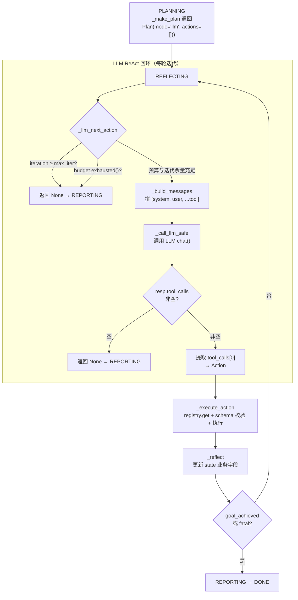
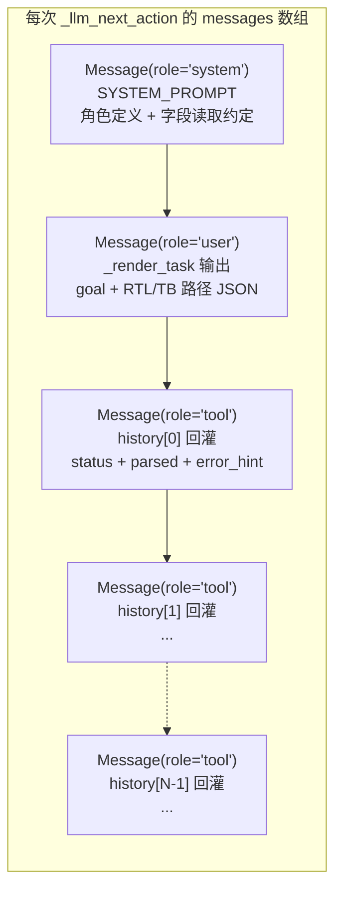
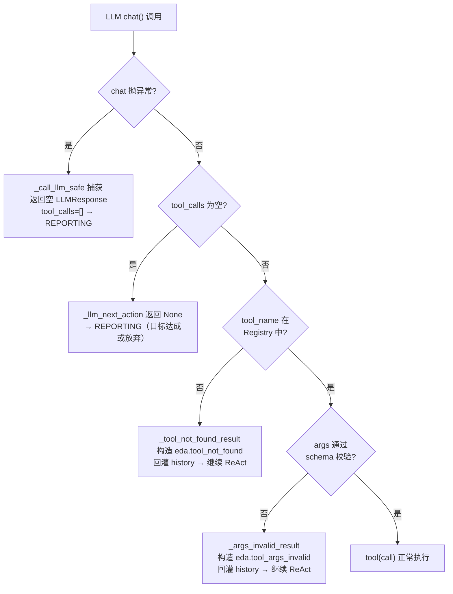

当 `planner_mode = "llm"` 时，CPlanner 的编排能力从硬编码规则让渡给大语言模型——LLM 在每一轮 **ReAct (Reason + Act)** 循环中接收全部历史工具结果作为上下文，自主决定下一步调用哪个工具、传什么参数。这一机制是整个系统从"流水线"升级为"自主 agent"的核心分水岭。本文将解构 ReAct 回环的消息构造、工具决策提取、历史回灌策略、以及关键的容错与终止条件。

## ReAct 回环在五相状态机中的嵌入

在 [五相状态机](09_五相状态机Planning到Done.md) 中，ReAct 回环**仅活跃于 REFLECTING 相位**。当 `_make_plan` 返回 `mode="llm"` 时，主循环从 PLANNING 直接跳过 EXECUTING 进入 REFLECTING，此后每一轮都由 `_llm_next_action` → `_execute_action` → `_reflect` 三步循环驱动，直到 LLM 停止发 tool_call 或触发终止保护。



这段循环的关键入口在 `execute` 方法的 REFLECTING 分支。注意 LLM 模式下 `baseline_only` 标记的短路逻辑：当 `request.extra["baseline_only"]` 为真时，即使 `planner_mode` 是 `"llm"`，也会强制走 rule 分支，以确保基线实验不依赖 LLM 决策。

Sources: [c_planner.py](../../src/eda_agent/planner/c_planner.py#L128-L155)

## 消息数组的构建：`_build_messages`

ReAct 的"上下文回灌"核心在于：**每一轮都从头重建完整的消息数组**，将历史所有工具调用结果以 `role="tool"` 消息追加在 system + user 之后。MVP 阶段不做多轮上下文压缩——这意味着第 N 轮的 LLM 调用会看到前 N-1 步的全部结构化结果。



### System Prompt：降低 LLM 自由度的关键约束

`SYSTEM_PROMPT` 不是一段泛泛的"你是助手"指令，而是一份**精确定义决策字段读取路径**的约束清单。它告诉 LLM 应该读哪些 `parsed` 子字段来判定当前状态，以及何时停止发 tool_call。

| 约束维度 | Prompt 中的对应措辞 | 目的 |
|---|---|---|
| 角色 | "你是 EDA 修复编排 agent" | 场景锚定 |
| 决策依据 | `parsed.passed` (iverilog_sim) / `parsed.success` (yosys_synth) / `parsed.wns` (opensta_timing) / `_skill_convergence_cause` (skill_self_heal) | 消除 LLM 自由发挥空间，强制读取结构化字段 |
| 行为约束 | "每次只发一个 tool_call" | 单步决策，便于追踪与回灌 |
| 终止条件 | "目标达成（仿真 passed=True 且已独立验证）后不再发 tool_call" | 防止无限循环 |

Sources: [prompts.py](../../src/eda_agent/planner/prompts.py#L16-L25)

### User Message：任务上下文的 JSON 渲染

`_render_task` 将 `PlannerState` 中的路径信息与目标渲染成一段 JSON，作为唯一的 user message。值得注意的是，**user message 不含 history**——历史信息全部走 `role="tool"` 消息回灌，职责分离。

```python
payload = {
    "run_id": record.run_id,
    "goal": state.goal,
    "rtl": state.rtl_path,
    "tb": state.tb_path,
    "top_module": state.top_module,
    "lib": state.lib_path,
    "clock": state.clock_name,
}
```

Sources: [prompts.py](../../src/eda_agent/planner/prompts.py#L28-L42), [c_planner.py](../../src/eda_agent/planner/c_planner.py#L580-L605)

### Tool 消息：历史结果的序列化

`_build_messages` 遍历 `state.history`，对每个历史条目构造一条 `role="tool"` 消息。每条 tool 消息只携带三个字段的 JSON 序列化：

| 回灌字段 | 来源 | LLM 可见信息 |
|---|---|---|
| `status` | `ToolResult.status` | `"ok"` / `"error"` / `"timeout"` 三态 |
| `parsed` | `ToolResult.parsed` | 完整结构化解析结果（含 `_schema` 元字段） |
| `error_hint` | `ToolResult.error_hint` | 一行人类可读失败提示（可为 null） |

注意 `stdout` / `stderr` / `artifacts` **不进回灌**——这避免了冗长的工具输出撑爆上下文窗口，同时 LLM 能从 `parsed` 中获取所有决策所需的结构化数据。每条 tool 消息还携带 `tool_call_id`，关联到发起该调用的 `ToolCall.llm_tool_call_id`，确保 provider 层能正确建立 tool_use → tool_result 的配对关系。

Sources: [c_planner.py](../../src/eda_agent/planner/c_planner.py#L580-L605), [contracts.py](../../src/eda_agent/contracts.py#L246-L251)

## 工具决策的提取与执行

### `_llm_next_action`：从 LLM 响应到 Action

LLM 调用返回 `LLMResponse`，其中 `tool_calls` 是一个列表，元素形状为 `{"id": str|None, "name": str, "args": dict}`。CPlanner 的处理极为保守：**只取 `tool_calls[0]`**，忽略其余。这与 System Prompt 中"每次只发一个 tool_call"的约束形成双重保险。

```python
def _llm_next_action(self, state, record, budget) -> Action | None:
    if state.iteration >= self._settings.planner_max_iterations:
        return None
    if budget.exhausted():
        return None
    messages = self._build_messages(state, record)
    tools = self._registry.to_llm_tools()
    resp = self._call_llm_safe(messages, tools, record)
    if not resp.tool_calls:
        return None
    tc = resp.tool_calls[0]
    return Action(
        tool_name=tc["name"],
        args=dict(tc.get("args", {})),
        rationale=resp.text[:200],
        llm_tool_call_id=tc.get("id"),
    )
```

`rationale` 取 LLM 返回文本的前 200 字符——这不是必须的，但便于后续审计追溯 LLM 的推理过程。`llm_tool_call_id` 贯穿整个回灌链：它从 `LLMResponse.tool_calls[0]["id"]` 流入 `Action.llm_tool_call_id`，再流入 `ToolCall.llm_tool_call_id`，最终在 `_build_messages` 回灌时填入 `Message.tool_call_id`。

Sources: [c_planner.py](../../src/eda_agent/planner/c_planner.py#L537-L558)

### 工具 Schema 的 LLM 可见化：`to_llm_tools`

Registry 的 `to_llm_tools()` 方法将所有注册工具转换成 LLM provider 可接受的中间格式。关键在于 **reserved 字段的剥离**：下划线前缀的字段（如 `_remaining_budget_s`、`_artifact_ref`）不进 LLM 可见 schema，避免 LLM 试图传入它无法正确填充的内部参数。

| 中间格式字段 | 内容 | 来源 |
|---|---|---|
| `name` | 工具唯一名，如 `"yosys_synth"` | `ToolEntry.name` |
| `description` | 自然语言描述 | `Tool.description` |
| `input_schema` | 剥离 `_` 前缀字段的 JSON Schema | `_strip_reserved_schema(entry.schema)` |

Provider 层（如 GLMProvider）再将此中间格式翻译为 OpenAI 的 `[{"type":"function","function":{"name","description","parameters"}}]` 或 Anthropic 的原生格式。

Sources: [registry.py](../../src/eda_agent/registry.py#L57-L93), [glm_provider.py](../../src/eda_agent/llm/glm_provider.py#L106-L129)

### `_execute_action`：Action 到 Tool 执行的桥梁

拿到 `Action` 后，`_execute_action` 经历五个步骤：(1) `registry.get` 查找工具 → (2) `_resolve_args` 替换 artifact 占位符 → (3) 注入 `run_id` → (4) 构造 `ToolCall` → (5) schema 校验后执行。这一过程详见 [Skill 到 Tool 的适配层](18_Skill到Tool适配层.md)，此处仅强调 ReAct 循环视角的关键点：**无论工具执行成功还是失败，结果都会追加到 `state.history`**，在下一轮 ReAct 回灌时让 LLM 看到完整的执行轨迹。

Sources: [c_planner.py](../../src/eda_agent/planner/c_planner.py#L323-L352)

## 容错降级矩阵：三层防护

ReAct 循环面对三类异常场景，每一类都有明确的降级路径——**核心原则是从不向调用方抛异常**。



三层防护的区别在于对 ReAct 循环的影响：

| 异常类型 | 处理方法 | 对 ReAct 的影响 | 测试用例 |
|---|---|---|---|
| LLM chat 异常 | `_call_llm_safe` try/except → 空 `LLMResponse` | **终止**：空 tool_calls → None → REPORTING | `test_llm_chat_exception_degrades_to_empty_tool_calls` |
| tool_calls 为空 | `_llm_next_action` 返回 None | **终止**：LLM 判定目标达成或无法继续 | `test_llm_empty_tool_calls_returns_none` |
| tool 不存在 | `_tool_not_found_result` 构造 error ToolResult | **不终止**：error 结果回灌 history，下一轮 LLM 能看到错误并纠正 | `test_llm_nonexistent_tool_returns_tool_not_found` |
| args 不匹配 schema | `_args_invalid_result` 构造 error ToolResult | **不终止**：同上，error_hint 提示 schema 失败原因 | `_args_match_schema` 逻辑覆盖 |

tool_not_found 和 args_invalid 的设计哲学是**让 LLM 自我纠正**——错误结果作为 `role="tool"` 消息回灌，LLM 在下一轮能看到 `error_hint: "tool ghost_tool not in registry"`，有机会选择正确的工具名重试。这与 chat 异常的"直接放弃"形成互补。

Sources: [c_planner.py](../../src/eda_agent/planner/c_planner.py#L560-L578), [c_planner.py](../../src/eda_agent/planner/c_planner.py#L409-L452), [test_llm_planner.py](../../tests/test_llm_planner.py#L88-L117)

## 终止条件：四道闸门

ReAct 循环的终止由四个独立条件控制，任何一条触发都使循环退出，状态机进入 REPORTING：

| 终止条件 | 判定位置 | 行为 | 典型场景 |
|---|---|---|---|
| 迭代上限 | `_llm_next_action` 首行 `state.iteration >= planner_max_iterations` | 返回 None → REPORTING | LLM 反复重试无法收敛 |
| 预算耗尽 | `_llm_next_action` `budget.exhausted()` 或主循环顶部 | record.status 设为 `budget_exhausted` → REPORTING | 工具执行耗时过长 |
| LLM 停止发 tool_call | `if not resp.tool_calls: return None` → None → REPORTING | 正常终止或降级 | LLM 判定目标达成 / 无解 / chat 异常 |
| goal_achieved / fatal | `_reflect` 后的相位判定 `if state.fatal or state.goal_achieved` | 跳转 REPORTING | 仿真通过且独立验证 / eda.internal 致命错误 |

迭代上限和预算上限的默认值由 `settings.toml` 控制：`planner_max_iterations = 8`（LLM 模式最多 8 步 tool 调用），`run_budget_s = 600`（10 分钟 wall clock）。这些参数的配置细节详见 [双层预算仲裁与迭代上限保护](13_双层预算仲裁与迭代上限.md)。

Sources: [c_planner.py](../../src/eda_agent/planner/c_planner.py#L537-L558), [settings.py](../../src/eda_agent/settings.py#L59-L65), [settings.toml](../../settings.toml)

## `_call_llm_safe`：降级的安全边界

这是 ReAct 循环的**唯一异常吞噬点**。它包裹 `self._llm.chat()` 调用，任何异常（网络超时、API 限流、JSON 解析错误等）都被捕获，返回一个语义为"LLM 无法决策"的空 `LLMResponse`：

```python
def _call_llm_safe(self, messages, tools, record) -> LLMResponse:
    try:
        return self._llm.chat(
            messages, tools=tools, temperature=0.0, max_tokens=4096
        )
    except Exception:
        return LLMResponse(
            text="",
            tool_calls=[],
            tokens_in=0,
            tokens_out=0,
            provider=self._llm.provider_name,
            model="",
        )
```

注意 `temperature=0.0` 是硬编码的——LLM 模式追求确定性决策，而非创造性发散。`max_tokens=4096` 也是在此处硬编码，覆盖了 settings 中可能配置的 `max_tokens=8192`，确保 ReAct 循环中每次 LLM 调用的 token 开销可控。

降级后返回的空 `tool_calls` 使 `_llm_next_action` 返回 None，主循环自然流入 REPORTING。这意味着**LLM 异常不会导致进程崩溃，也不会导致 ReAct 无限循环**——最坏情况是生成一份 failed 报告，而不是栈展开。

Sources: [c_planner.py](../../src/eda_agent/planner/c_planner.py#L560-L578)

## 与 rule 模式降级路径的对比

| 维度 | LLM 模式 ReAct | rule 模式 `_rule_after_reflect` |
|---|---|---|
| 决策主体 | LLM（自主选择工具 + 参数） | 硬编码条件分支（synth→sim→sta→diagnose→heal） |
| 消息构造 | 每轮重建 `[system, user, ...tool]` | 无消息构造（不走 LLM） |
| 历史利用 | 完整回灌（LLM 看到所有历史结果） | 通过 `PlannerState` 业务字段间接引用 |
| 容错策略 | tool_not_found 回灌 + chat 降级 | 不可达分支（规则路径确定） |
| 灵活性 | 可调用注册中心任意工具组合 | 固定 pipeline 顺序 |
| 适用场景 | 正常运行（`planner_mode = "llm"`） | LLM 不可用 / 基线实验 |

rule 模式的详细工作原理和 baseline 实验设计详见 [规则引擎降级路径与 baseline 实验](11_规则引擎降级与baseline实验.md)。

Sources: [c_planner.py](../../src/eda_agent/planner/c_planner.py#L128-L155), [settings.py](../../src/eda_agent/settings.py#L54-L55)

## LLM 调用计量的透明化

ReAct 循环中每次 `chat()` 调用都经过 `CountingProvider` 透明装饰器累加 `llm_calls` / `tokens_in` / `tokens_out`。工厂方法 `make_provider` 强制包装，确保任何 provider 实现都无法绕过计量。在 `_finalize` 阶段，CPlanner 通过 `getattr(self._llm, "get_stats", None)` 读出计数并填入 `RunReport.metrics`，使每次 Run 的 LLM 开销完全可追溯。

Sources: [counting.py](../../src/eda_agent/llm/counting.py#L25-L61), [factory.py](../../src/eda_agent/llm/factory.py#L20-L29), [c_planner.py](../../src/eda_agent/planner/c_planner.py#L615-L620)

## 测试验证策略

ReAct 回环的测试用 `FakeLLMProvider` 实现确定性验证——按预设队列返回 `LLMResponse`，确保测试不依赖真实 LLM 服务。核心测试覆盖矩阵：

| 测试 | 输入 | 断言 | 文件 |
|---|---|---|---|
| 首轮 tool_call → Action | `tool_calls=[{id, name, args}]` | Action 字段完整，tools 参数传入 | [test_llm_planner.py#L60](../../tests/test_llm_planner.py#L60-L85) |
| 不存在的 tool → 回灌 | `tool_calls=[{name: "ghost_tool"}]` | error_code = `eda.tool_not_found`，步骤落盘 | [test_llm_planner.py#L88](../../tests/test_llm_planner.py#L88-L117) |
| 空 tool_calls → None | `tool_calls=[]` | `_llm_next_action` 返回 None | [test_llm_planner.py#L120](../../tests/test_llm_planner.py#L120-L138) |
| chat 异常 → 降级 | `raise_on_call=True` | 不抛异常，返回 None | [test_llm_planner.py#L141](../../tests/test_llm_planner.py#L141-L155) |
| max_iter 上限 | 100 个 echo tool_call | 精确停在第 8 步 | [test_llm_planner.py#L158](../../tests/test_llm_planner.py#L158-L174) |
| 消息数组结构 | 注入 1 步 history | `[system, user, tool]` 三条，tool_call_id 正确 | [test_llm_planner.py#L177](../../tests/test_llm_planner.py#L177-L198) |

Sources: [test_llm_planner.py](../../tests/test_llm_planner.py#L1-L199), [_planner_helpers.py](../../tests/_planner_helpers.py#L152-L200)

## 延伸阅读

- **上游**：[五相状态机：PLANNING 到 DONE 的流转](09_五相状态机Planning到Done.md) — 理解 ReAct 回环嵌入的五相位架构
- **降级对照**：[规则引擎降级路径与 baseline 实验](11_规则引擎降级与baseline实验.md) — LLM 不可用时的确定性 fallback
- **预算保护**：[双层预算仲裁与迭代上限保护](13_双层预算仲裁与迭代上限.md) — ReAct 循环的 wall-clock 防护
- **Provider 抽象**：[LLM Provider 抽象协议与多后端支持](23_LLMProvider抽象协议.md) — `_call_llm_safe` 背后的 provider 层翻译
- **工具注册**：[统一工具注册中心与开闭原则](19_统一工具注册中心.md) — `to_llm_tools()` 与 reserved 字段剥离
- **调用计量**：[CountingProvider 装饰器与调用计量](24_CountingProvider调用计量.md) — ReAct 循环中 LLM 开销的透明追踪