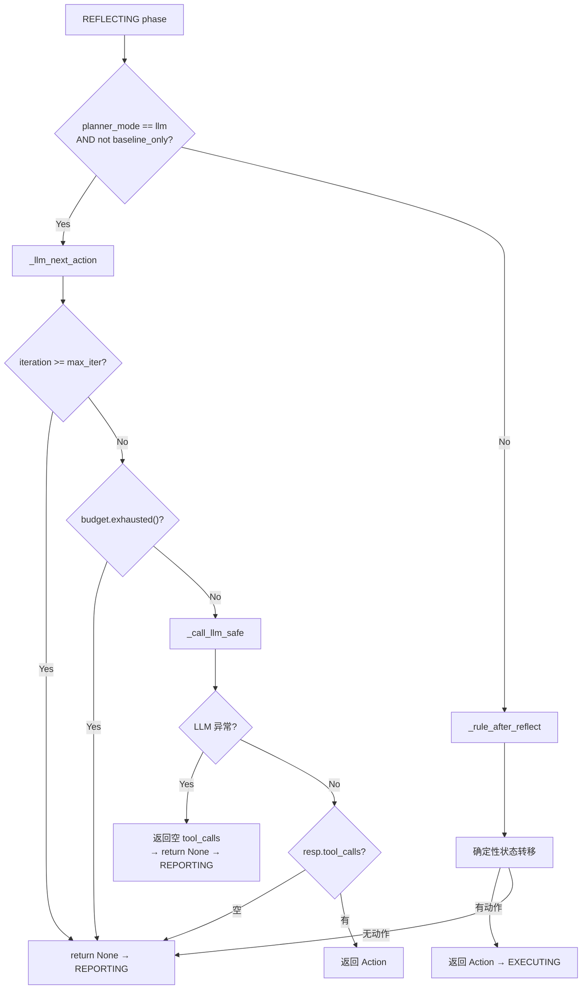
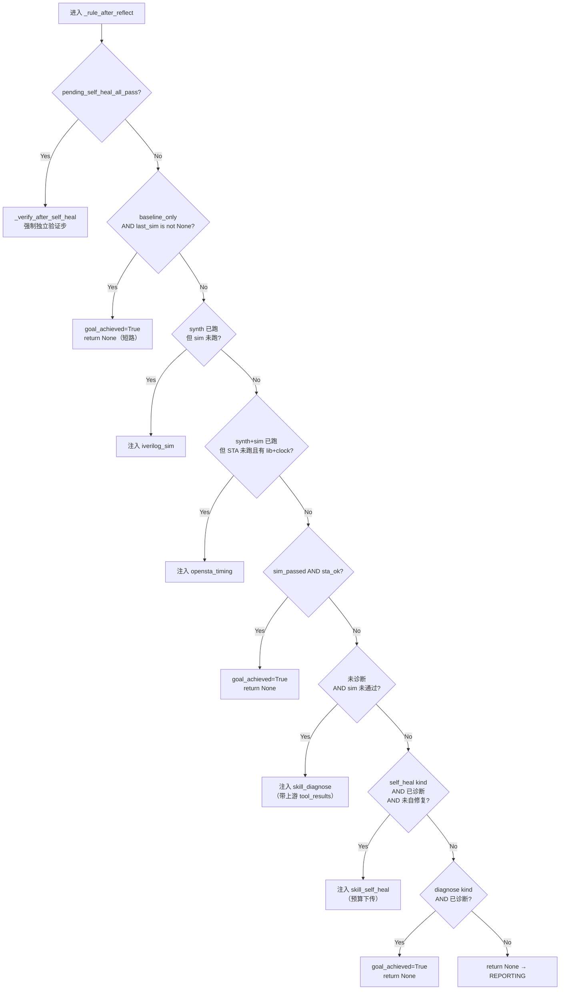
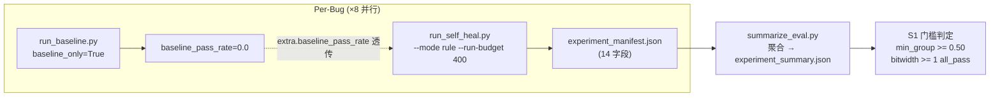

CPlanner 在生产默认下走 LLM ReAct 回环，但系统同时内置一套完整的**确定性规则引擎**作为降级路径。这条路径不仅在 LLM 异常时提供安全网，还作为全量实验的唯一执行引擎——baseline 实验通过 `baseline_only` 短路机制实现"只跑综合+仿真、不修复"的基线度量。本文深入解析双模架构的分流逻辑、规则引擎的状态机动态注入机制，以及 baseline→self_heal→summarize→S1 门槛的完整实验流水线。

## 双模架构：LLM 与 Rule 的分工哲学

CPlanner 的 `planner_mode` 由 `settings.toml [planner] mode` 控制，默认值为 `"llm"`（契约裁决 #7：保证 planner 真正组织工具迭代），`"rule"` 作为降级路径。两种模式共享同一套五相状态机（PLANNING → EXECUTING → REFLECTING → REPORTING → DONE），差异在于 **REFLECTING 相位的决策分支**：LLM 模式每次反射都调用 `_llm_next_action` 产生即时工具调用，规则模式则走 `_rule_after_reflect` 的确定性状态转移。

| 维度 | rule 模式 | LLM 模式（默认） |
|---|---|---|
| **决策来源** | `_rule_after_reflect` 确定性状态转移 | `_llm_next_action` 经 LLM ReAct 决策 |
| **初始 plan** | `Plan(actions=[synth], mode="rule")`，后续步动态注入 | `Plan(actions=[], mode="llm")`，空 plan |
| **迭代上限** | `planner_max_iterations`（默认 8） | 同左，双保险 |
| **墙钟** | 44-87s/bug（确定性，无 LLM 延迟） | ~550s，可能 budget_exhausted |
| **失败模式** | 几乎不失败（确定性流程） | 决策乱序（如先 self_heal 再 diagnose）浪费预算 |
| **适用场景** | 全量实验 / 快速验证 / 确定性兜底 | 演示 agentic 编排充分性 |

两种模式不是互斥的——它们共享 `Budget` 预算仲裁器、`PlannerState` 可变上下文、`ToolRegistry` 工具注册中心，以及相同的 `_execute_action` → `_reflect` 执行-反射循环。唯一区别是 **"下一步执行什么"的决策由谁做出**。rule 模式在 `_make_plan` 中生成初始 `Plan(actions=[Action("yosys_synth", ...)], mode="rule")`，后续每一步在 REFLECTING 相位由 `_rule_after_reflect` 动态计算；LLM 模式生成 `Plan(actions=[], mode="llm")`，每一步在 REFLECTING 相位由 LLM 即时决定。

Sources: [c_planner.py](../../src/eda_agent/planner/c_planner.py#L180-L213), [rule_planner.py](../../src/eda_agent/planner/rule_planner.py#L1-L44), [settings.toml](../../settings.toml)

## 降级触发：LLM 异常的安全网

LLM 模式下的降级路径有**三层保护**，确保任何异常都不会导致系统崩溃：

**第一层：`_call_llm_safe` 异常吞没**——当 LLM Provider 的 `chat()` 调用抛出任何异常（网络超时、API 限流、认证失败等），`_call_llm_safe` 捕获并返回一个 `tool_calls=[]` 的空 `LLMResponse`。主循环在 `_llm_next_action` 中检测到 `resp.tool_calls` 为空时返回 `None`，触发 phase 切换到 REPORTING，生成一份基于当前状态的报告（可能是 `failed` 或 `budget_exhausted`）。

**第二层：Budget 预算仲裁**——每次 phase 切换前，主循环调用 `budget.exhausted()` 检查是否已耗尽 `run_budget_s`（默认 600s）。若已耗尽且不在 REPORTING 相位，直接跳转到 REPORTING 并设置 `record.status = "budget_exhausted"`。`_llm_next_action` 内部也独立检查 `budget.exhausted()`，双重保险。

**第三层：迭代上限保护**——`_llm_next_action` 开头检查 `state.iteration >= self._settings.planner_max_iterations`（默认 8），超限则返回 `None`。rule 模式在 EXECUTING 相位也有相同的迭代上限检查。



整个 `execute` 方法被 `try/except` 包裹，即使上述三层保护全部失效（例如 `_reflect` 内部逻辑 bug），`_emergency_report` 也会兜底生成一份 `status="failed"` 的 `RunReport`，绝不向调用方抛出未捕获异常。

Sources: [c_planner.py](../../src/eda_agent/planner/c_planner.py#L537-L578), [c_planner.py](../../src/eda_agent/planner/c_planner.py#L86-L162), [budget.py](../../src/eda_agent/planner/budget.py#L1-L36)

## 规则引擎状态机与动态注入

规则模式的决策核心是 `_rule_after_reflect` 方法——它不是预设的静态 plan，而是**基于 `PlannerState` 的当前状态字段动态计算下一步动作**。这种方法确保了确定性（相同输入永远产生相同执行序列）同时保持了灵活性（每步执行后根据结果调整）。

### 优先级决策链

`_rule_after_reflect` 内部按优先级从高到低依次检查六个条件分支：



这个优先级链的设计有几个关键考量：

- **独立验证优先**（分支 0a）：`pending_self_heal_all_pass` 标志在 B 报 `all_pass` 后立即设置，但此时并不立即 `goal_achieved`——必须经过 C 的独立验证步（重新跑 iverilog_sim）确认后才设为 `goal_achieved`。这防止了 B 自评通过但实际未通过的情况。
- **baseline 短路**（分支 0b）：在 baseline_only 模式下，sim 跑完即设 `goal_achieved`，不注入任何诊断/修复/STA 步骤——baseline 实验的语义就是"只度量不修复"。
- **阶段补齐**（分支 1-2）：由于 rule 模式每次 REFLECTING 都会覆盖 `plan.actions` 为单元素列表，初始 plan 的后续阶段（sim、sta）需要在这里按状态判断补齐。
- **诊断前置**（分支 3-4）：仿真未通过时，必须先诊断再修复，不跳过诊断直接修复——这是 rule 模式区别于 LLM 模式决策乱序的核心约束。

### PlannerState：单一可变上下文

`PlannerState` 是贯穿整个 `execute` 调用的唯一可变上下文实例。`_reflect` 方法在每次 `_execute_action` 后更新其业务字段（`last_synth`、`last_sim`、`last_sta`、`last_diagnose`、`netlist_ref`、`best_rtl_ref` 等），而 `_rule_after_reflect` 读取这些字段做决策。`iteration` 的递增**只在 `_execute_action` 末尾**发生，确保单一计数出口。

| PlannerState 字段 | 写入时机 | 决策用途 |
|---|---|---|
| `last_synth` | `_reflect` 解析 yosys_synth 结果 | 分支 1-2 判断阶段补齐 |
| `last_sim` | `_reflect` 解析 iverilog_sim 结果 | 分支 0b/1/3 判断 sim 状态 |
| `last_sta` | `_reflect` 解析 opensta_timing 结果 | 分支 2/3 判断 STA 通过 |
| `last_diagnose` | `_reflect` 解析 skill_diagnose 结果 | 分支 4/5 判断诊断完成 |
| `netlist_ref` | `_reflect` 从 artifacts 匹配 netlist.v | `_resolve_args` 解析 ARTIFACT_FROM_STATE |
| `best_rtl_ref` | `_reflect` 解析 skill_self_heal fixed_rtl_ref | `_verify_after_self_heal` 替换 RTL |
| `pending_self_heal_all_pass` | `_reflect` 检测 convergence=="all_pass" | 分支 0a 触发独立验证 |
| `goal_achieved` | 各分支设置 | 主循环判断是否进入 REPORTING |
| `fatal` | `_reflect` 检测 error_code==EDA_INTERNAL | 主循环立即进入 REPORTING |
| `iteration` | `_execute_action` 末尾 | 迭代上限保护 |

Sources: [c_planner.py](../../src/eda_agent/planner/c_planner.py#L228-L321), [c_planner.py](../../src/eda_agent/planner/c_planner.py#L455-L494), [rule_planner.py](../../src/eda_agent/planner/rule_planner.py#L47-L81)

## Baseline 实验设计：baseline_only 短路机制

Baseline 实验的核心问题是：**给定一个含已知 bug 的 RTL，不修复时综合+仿真能否通过？** 预期答案恒为否（因为 RTL 有 bug），但这提供了 `baseline_pass_rate=0.0` 的量化基准，使得后续 self_heal 实验的修复效果有可对比的基线。

### 触发方式

Baseline 通过 `RunRequest.extra["baseline_only"]=True` 触发，优先级高于 `planner_mode`——即使 settings 配置为 `mode="llm"`，baseline_only 请求也强制走 rule 分支。这个设计在 CPlanner 的 REFLECTING 相位中显式判断：

```python
if (
    self._settings.planner_mode == "llm"
    and not request.extra.get("baseline_only")
):
    # LLM ReAct 回环
else:
    # rule 模式(含 baseline_only 短路)
```

### 三处短路点

baseline_only 在三个关键位置实现短路：

| 位置 | 方法 | 短路行为 |
|---|---|---|
| **PLANNING** | `_make_plan` | 返回 `Plan(actions=[yosys_synth, iverilog_sim], mode="rule")`——两步 plan，覆盖常规的单步初始 plan |
| **REFLECTING** | `_rule_after_reflect` | sim 跑完后 `goal_achieved=True`，`return None`——不注入 diagnose/self_heal/sta |
| **REPORTING** | `_finalize` | `status="ok"`（baseline 跑完即成功，不管 sim pass 与否）；`baseline_pass_rate = 1.0 if sim.passed else 0.0` |

### Baseline 脚本

`scripts/run_baseline.py` 封装了上述逻辑，构造 `RunRequest(kind="self_heal", extra={"baseline_only": True, "design_id": ..., "fault_type": ...})`，经 `run_pipeline` 执行，输出 JSON：

```json
{"baseline_run_id": "<id>", "baseline_pass_rate": 0.0, "sim_passed": false}
```

这个 `baseline_pass_rate` 随后在 self_heal 实验中通过 `request.extra["baseline_pass_rate"]` 透传，写入 `experiment_manifest.json` 的 `baseline_pass_rate` 字段，形成 baseline→self_heal 的完整度量链。

Sources: [c_planner.py](../../src/eda_agent/planner/c_planner.py#L128-L152), [c_planner.py](../../src/eda_agent/planner/c_planner.py#L182-L199), [c_planner.py](../../src/eda_agent/planner/c_planner.py#L237-L241), [c_planner.py](../../src/eda_agent/planner/c_planner.py#L622-L635), [run_baseline.py](../../scripts/run_baseline.py#L57-L82)

## 实验流水线：从 baseline 到 S1 门槛

完整的实验流水线由四个脚本和一个编排阶段构成，形成一条从"单个 bug 度量"到"系统级 S1 门槛判定"的数据管线。



### Manifest 落盘：14 字段终态快照

每个 self_heal run（非 baseline_only）在 `_finalize` 结束时落盘 `runs/<run_id>/experiment_manifest.json`，包含 14 个字段的完整实验终态。这个文件是 summarize 聚合的唯一数据源。

| 字段 | 来源 | 语义 |
|---|---|---|
| `run_id` | 当前 run | self_heal run 标识 |
| `baseline_run_id` | `extra["baseline_run_id"]` | 关联的 baseline run；None=未跑 |
| `design_id` | `extra["design_id"]` | inject bug 名（如 `counter_bitwidth`） |
| `fault_type` | `extra["fault_type"]` | 四类之一：bitwidth/comb_logic/syntax/timing_reset |
| `baseline_pass_rate` | `extra["baseline_pass_rate"]` | 基线通过率（bug 存在时 0.0） |
| `self_heal_pass_rate` | metrics | `1.0 if convergence=="all_pass" else 0.0` |
| `self_heal_convergence` | B skill 返回 | all_pass / regression / budget / max_iter |
| `self_heal_best_iter` | B skill 返回 | 首次达到 best_score 的迭代号 |
| `planner_iterations` | `state.iteration` | C 总迭代步数 |
| `llm_calls` | CountingProvider | LLM 调用次数 |
| `tokens_total` | CountingProvider | tokens_in + tokens_out |
| `wall_time_s` | `budget.elapsed_s()` | 墙钟耗时 |
| `candidates_at_best_score` | B 的 `best/meta.json` | best_score 对应的候选数 |
| `contract_version` | `CONTRACT_VERSION` | 契约版本锚点 |

### Summarize 聚合：按 fault_type 分桶

`scripts/summarize_eval.py` 扫描 `runs/*/experiment_manifest.json`，按 `fault_type` 分四桶（bitwidth/comb_logic/syntax/timing_reset），未知类型归 `other`。每桶计算 `total`、`passed`、`pass_rate`、`mean_iters`、`mean_best_iter`，最终产出 `overall_pass_rate` 和 `min_group_pass_rate`。

**S1 硬门槛**（契约 §7）：`min_group_pass_rate >= 0.50` **且** bitwidth 类至少 1 个 `all_pass`。`min_group_pass_rate` 取四类 pass_rate 的最小值——这确保系统不能在某类故障上完全失效。空类（无观测）不参与 min 计算，避免拖低整体。

### T54 全量实验编排

Phase 7 的 `.wf/phase7_t54_full.js` 并行启动 8 个 agent，每个 agent 调用 `run_self_heal.py --mode rule --run-budget 400` 跑一个 bug。所有 8 个 run 完成后，调用 `summarize_eval.py` 聚合，再由 Verify phase 判定 S1 门槛（6 个 healable=true 的 bug 全 all_pass）。

Sources: [c_planner.py](../../src/eda_agent/planner/c_planner.py#L659-L707), [summarize_eval.py](../../scripts/summarize_eval.py#L52-L111), [phase7_t54_full.js](../../.wf/phase7_t54_full.js#L45-L72), [run_self_heal.py](../../scripts/run_self_heal.py#L73-L115)

## 实验结果分析：8-bug 全量实验

T54 全量实验（rule 模式，GLM-5.2 thinking max，run_budget=400s）的结果记录在 `experiment_summary.json` 中：

| fault_type | total | passed | pass_rate | mean_iters | mean_best_iter |
|---|---|---|---|---|---|
| bitwidth | 2 | 2 | 1.0 | 5.0 | 2.0 |
| syntax | 2 | 2 | 1.0 | 5.0 | 2.0 |
| timing_reset | 2 | 2 | 1.0 | 5.0 | 2.0 |
| comb_logic | 2 | 1 | 0.5 | 5.0 | 0.5 |
| **overall** | **8** | **7** | **0.875** | — | — |

**S1 门槛判定**：`min_group_pass_rate = min(1.0, 1.0, 1.0, 0.5) = 0.50 >= 0.50 ✓`，bitwidth 类 2/2 all_pass ✓——**S1 全过**。

comb_logic 类的 0.5 通过率来自 `tiny_fsm_comb` 的 regression——这是数据集中**设计为不可修**的案例（`healable=false`），两态 FSM 的 S0 分支无条件 `next=S0` 导致 GLM-5.2 多轮 patch 未修对，触发 regression 死锁保护。T54 要求"≥1 失败案例"，此案例恰好满足。6 个 `healable=true` 的 bug 全部 `all_pass`（best_iter=2，wall_time 44-87s/bug），达成设计目标。

### rule vs LLM 模式对比结论

实验团队在对比测试中发现，LLM 模式在跑 `counter_bitwidth` 时出现了**决策乱序**：LLM 先调 `skill_self_heal` 再调 `skill_diagnose`（顺序错误），self_heal 拿不到诊断信息浪费了约 550s 预算最终 budget_exhausted。rule 模式因确定性状态转移强制 synth→sim→diagnose→self_heal→独立验证的固定顺序，不存在此问题。

最终决策是**两者互补**：全量实验用 rule 模式（确定性 + 快），演示 agentic 编排能力用 LLM 模式。这不是 rule "替代" LLM，而是针对不同评估维度选择合适的工具。

Sources: [experiment_summary.json](../../experiment_summary.json), [docs/03_实验与失败案例报告.md](../03_实验与失败案例报告.md#L1-L105), [phase7_t54_full.js](../../.wf/phase7_t54_full.js#L102-L151)

## 测试验证体系

实验流水线的正确性由 `tests/test_experiment_manifest.py` 和 `tests/test_planner_limits.py` 保障，均不需要真实 EDA 工具或 LLM API（使用 stub Tool + FakeLLMProvider）。

`test_experiment_manifest.py` 覆盖了五个核心场景：manifest 14 字段齐全与 extra 透传、baseline_only run 不落 manifest（无 self_heal 终态）、summarize 按 fault_type 聚合、regression 场景 manifest 仍落盘且 pass_rate=0.0、无 best/meta.json 时 candidates_at_best_score=None。

`test_planner_limits.py` 覆盖了边界保护：budget_exhausted 立即终止、rule 模式 max_iter 上限截断、fatal error_code 立即 REPORTING、iteration 单一计数出口无重复、异常兜底 _emergency_report。

Sources: [test_experiment_manifest.py](../../tests/test_experiment_manifest.py#L150-L231), [test_planner_limits.py](../../tests/test_planner_limits.py#L63-L101), [test_planner_limits.py](../../tests/test_planner_limits.py#L153-L173)

## 延伸阅读

- 规则引擎的状态转移细节和 LLM ReAct 回环的完整实现，参见 [五相状态机：PLANNING 到 DONE 的流转](09_五相状态机Planning到Done.md) 和 [LLM ReAct 回环：工具决策与历史回灌](10_LLMReAct回环工具决策.md)。
- 预算仲裁的双层机制（C 总预算 vs Skill 子预算），参见 [双层预算仲裁与迭代上限保护](13_双层预算仲裁与迭代上限.md)。
- B 报 all_pass 后的独立验证步逻辑，参见 [独立验证步：B 报 all_pass 后的第三方校验](12_独立验证步第三方校验.md)。
- 完整的 8-bug 设计矩阵和失败案例归档，参见 [故障注入清单与基准实验对比](27_故障注入清单与基准实验.md) 和 [实验聚合与通过率门槛（S1 门槛规则）](28_实验聚合通过率门槛S1.md)。