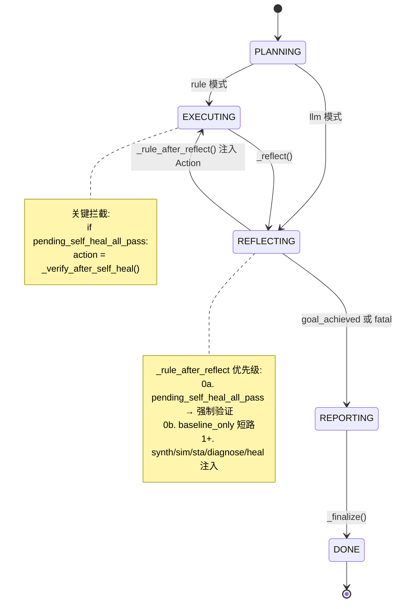
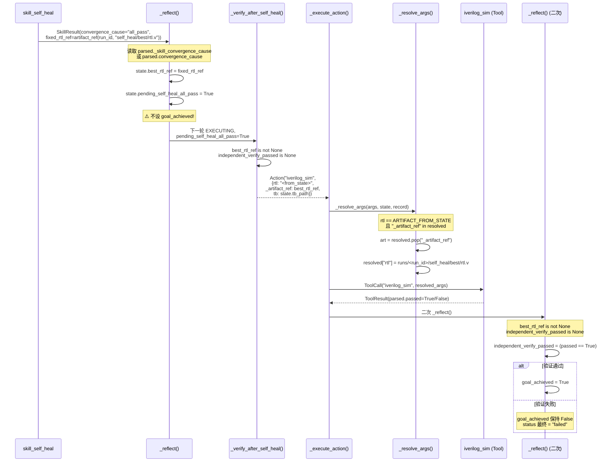
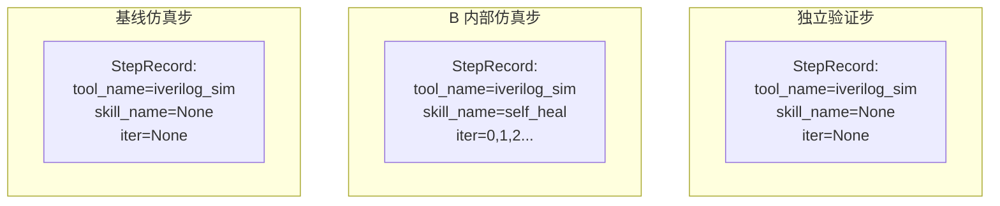

当组件 B（RTL 自修复闭环）的内部迭代收敛于 `all_pass` 时，CPlanner **不会立即**将整个 Run 标记为目标达成。系统在契约层面强制插入一次由 C 直接发起的 `iverilog_sim` 验证——使用 B 产出的最佳 RTL 文件、原 Testbench、由 C 调用 Registry 中注册的仿真工具——以第三方身份独立确认修复结果。这一机制是 agentic 可信度的关键防线：防止 B 内部仿真环境的偶然通过、LLM Patch 的隐性退化、或工件传递链路中的任何不一致被静默放过。

Sources: [CONTRACTS.md](../../CONTRACTS.md)

## 设计动因与契约定位

### 为什么需要独立验证

B 的自修复闭环在内部迭代中自行调用 `yosys_synth`、`iverilog_sim`（以及可选 `opensta_timing`）并判断 `synth_ok and sim_ok and sta_ok`。然而，B 的内部仿真与 C 层面的仿真存在三个潜在裂缝：**(1)** B 的版本栈管理可能在 patch 应用后残留旧快照路径，导致"看起来通过"的 RTL 并非最终落盘版本；**(2)** LLM Patch 可能引入了 B 内部诊断器未能检测到的行为变化（如修改了 always 块的敏感列表），在 B 自己的仿真中恰好通过，但换了调用环境后行为不同；**(3)** `artifact_ref` 工件引用链路在 `SkillResult → as_tool → ToolResult → _resolve_args` 的多层映射中可能被意外截断或变形。

CPlanner 作为编排大脑，拥有对 Registry、Runner 和整个 Run 生命周期的完全控制。由它发起的独立验证步绕过了 B 的所有内部逻辑——直接从 `runs/<run_id>/self_heal/best/rtl.v` 读取文件、传入原始 TB、由 C 的 `_execute_action` 走标准 Tool 调用流程。如果这一步失败，系统的最终状态将是 `failed`，**绝不静默通过**。

Sources: [c_planner.py](../../src/eda_agent/planner/c_planner.py#L234-L236), [CONTRACTS.md](../../CONTRACTS.md)

### 契约权威性

CONTRACTS.md v1.2 在两处显式将此机制升格为**非开放问题**（non-open question）的硬约束：

- 变更摘要第 26 条：「C 在 B 报 all_pass 后**强制追加独立 iverilog_sim 验证步**（非 open question）」
- §10 agentic 自检清单：「C 在 B 报 all_pass 后追加独立 iverilog_sim 验证步（第三方可信度）」

对应验收标准 C13（独立验证步存在）与 I5（独立验证步系统集成），两者均为"必过"级门槛。

Sources: [CONTRACTS.md](../../CONTRACTS.md), [CONTRACTS.md](../../CONTRACTS.md), [验收标准.md](../../验收标准.md), [验收标准.md](../../验收标准.md)

## 状态机嵌入：五相流程中的拦截点

独立验证步不是一个独立的相位，而是嵌入在 `EXECUTING → REFLECTING → REPORTING` 循环中的一个**条件拦截点**。理解其触发逻辑，需要从 CPlanner 的五相状态机入手。



在 rule 模式下，主循环的 `EXECUTING` 相位中存在一个关键的三级拦截逻辑。当 `_next_rule_action` 返回 `None`（即 `plan.actions` 为空）时，系统不是直接转入 REPORTING，而是检查 `state.pending_self_heal_all_pass` 标志位——若为 `True`，则调用 `_verify_after_self_heal` 生成验证 Action。

Sources: [c_planner.py](../../src/eda_agent/planner/c_planner.py#L110-L127)

### 拦截优先级链

`_rule_after_reflect` 方法内部的分支顺序经过精心设计，独立验证步占据**最高优先级位置（0a）**，确保它不会被后续分支误判为 `goal_achieved` 后短路掉：

| 优先级 | 分支 | 条件 | 产出 |
|---|---|---|---|
| **0a（最高）** | 独立验证 | `state.pending_self_heal_all_pass == True` | `_verify_after_self_heal()` → iverilog_sim |
| 0b | baseline 短路 | `baseline_only and last_sim is not None` | `goal_achieved = True`, 返回 None |
| 0c | 初始 plan 补齐 | synth 完成但 sim 未跑 | iverilog_sim（基线仿真） |
| 0d | STA 注入 | synth+sim 完成, lib+clock 可用 | opensta_timing |
| 1 | 目标达成 | `sim_passed and sta_ok` | `goal_achieved = True` |
| 2 | 诊断注入 | sim 失败且未诊断 | skill_diagnose |
| 3 | 自修复注入 | 已诊断且 kind=self_heal | skill_self_heal |
| 4 | diagnose 收尾 | kind=diagnose 且已诊断 | `goal_achieved = True` |

将独立验证步放在分支 1（`goal_achieved`）之前是关键设计：如果没有这个拦截，B 的 `all_pass` 会在 `_reflect` 中被发现后立即在分支 1 被误判为目标达成。通过在 `pending_self_heal_all_pass` 置位时从 `_reflect` 中**不设** `goal_achieved`，再由分支 0a 在下一轮 REFLECTING 时强制注入验证步，系统形成了一条不可绕过的校验通道。

Sources: [c_planner.py](../../src/eda_agent/planner/c_planner.py#L227-L321)

## 核心实现：三步联动机制

独立验证步的完整执行路径涉及 CPlanner 中三个方法的精确联动：`_reflect` 识别 B 的 all_pass 报告并设置状态标志、`_verify_after_self_heal` 构造验证 Action、`_resolve_args` 在执行时解析工件引用。以下用序列图展示它们的交互：



Sources: [c_planner.py](../../src/eda_agent/planner/c_planner.py#L454-L511)

### 第一步：_reflect 识别 B 的 all_pass 报告

`_reflect` 方法在每次 `_execute_action` 之后被调用，负责从最新的 ToolResult 中提取业务状态。当工具名为 `skill_self_heal` 时，它执行两个关键操作：

```python
elif name == "skill_self_heal":
    fixed = p.get("fixed_rtl_ref")
    if fixed and isinstance(fixed, dict):
        state.best_rtl_ref = fixed
    conv = p.get("convergence_cause") or p.get("_skill_convergence_cause")
    if conv == "all_pass":
        # 等独立验证步;不立即 goal_achieved
        state.pending_self_heal_all_pass = True
```

这里有两层兼容读取：B 的 SkillResult 经 `as_tool` 适配后，`convergence_cause` 同时存在于 `parsed["convergence_cause"]`（原始字段）和 `parsed["_skill_convergence_cause"]`（as_tool 补的元字段）。`_reflect` 用 `or` 短路优先读原始字段，保证语义准确。

`best_rtl_ref` 的赋值同样值得注意：它读取的是 `fixed_rtl_ref` 字段，其值是 `artifact_ref(run_id, "self_heal/best/rtl.v")` 的返回——一个 `{"run_id": str, "rel_path": str}` 形状的字典。这个字典将在后续被 `_resolve_args` 解析为实际文件路径。

Sources: [c_planner.py](../../src/eda_agent/planner/c_planner.py#L483-L493), [self_heal.py](../../src/eda_agent/skills/self_heal.py#L619-L621)

### 第二步：_verify_after_self_heal 构造验证 Action

当 `pending_self_heal_all_pass` 为 `True` 且 `independent_verify_passed` 尚为 `None`（即尚未执行过验证）时，`_verify_after_self_heal` 生成一个标准的 `iverilog_sim` Action：

```python
def _verify_after_self_heal(
    self, state: PlannerState, request: RunRequest
) -> Action | None:
    if state.independent_verify_passed is not None:
        return None  # 已验证
    if state.best_rtl_ref is None:
        return None
    return Action(
        "iverilog_sim",
        {
            "rtl": ARTIFACT_FROM_STATE,         # 占位符
            "_artifact_ref": state.best_rtl_ref,  # 工件引用
            "tb": state.tb_path,
        },
        "B 报 all_pass 后的第三方独立验证",
    )
```

三个关键字段构成的契约是：`rtl` 使用 `ARTIFACT_FROM_STATE`（即 `"<from_state>"`）作为占位标记，`_artifact_ref` 携带 B 的 `best_rtl_ref` 字典，`tb` 直接复用 `state.tb_path`（原始 Testbench，未经 B 修改）。`_artifact_ref` 以下划线前缀开头，属于 reserved 字段——它在 `_args_match_schema` 中被豁免 JSON Schema 校验，在 `_save_plan` 落盘时被剥离，不进入 LLM 可见的 Tool schema。

Sources: [c_planner.py](../../src/eda_agent/planner/c_planner.py#L495-L511), [contracts.py](../../src/eda_agent/contracts.py#L20-L21)

### 第三步：_resolve_args 解析工件引用为实际路径

在 `_execute_action` 将 Action 转化为 ToolCall 之前，`_resolve_args` 负责把 `ARTIFACT_FROM_STATE` + `_artifact_ref` 的占位组合解析为磁盘上的实际文件路径：

```python
if (
    resolved.get("rtl") == ARTIFACT_FROM_STATE
    and "_artifact_ref" in resolved
):
    art = resolved.pop("_artifact_ref")
    if isinstance(art, dict):
        resolved["rtl"] = self._resolve_artifact_path(art, record)
    else:
        resolved["rtl"] = art
```

`_resolve_artifact_path` 的解析规则是：**实际路径 = `runs/<run_id>/<rel_path>`**。对于 B 的 `best_rtl_ref = {"run_id": "<run_id>", "rel_path": "self_heal/best/rtl.v"}`，最终解析出的路径是 `runs/<run_id>/self_heal/best/rtl.v`。这个文件是 B 的自修复主循环在收敛后写入的 `best_rtl_text`，是 B 认为最佳版本的 RTL 文本。

解析完成后，`_artifact_ref` 从 `resolved` 中被 `pop` 移除，`rtl` 被替换为实际路径。这一步骤确保了 iverilog_sim Tool 收到的是一个干净的、指向真实文件的字符串参数，与任何基线仿真调用的参数形状完全一致。

Sources: [c_planner.py](../../src/eda_agent/planner/c_planner.py#L354-L391), [c_planner.py](../../src/eda_agent/planner/c_planner.py#L370-L380)

### 二次 _reflect：验证结果判定

验证仿真执行完毕后，`_execute_action` 再次调用 `_reflect`。此时 `iverilog_sim` 的 ToolResult 进入 `_reflect` 的 `elif name == "iverilog_sim"` 分支，触发独立验证的最终判定：

```python
elif name == "iverilog_sim":
    state.last_sim = p
    if (
        state.best_rtl_ref is not None
        and state.independent_verify_passed is None
    ):
        state.independent_verify_passed = p.get("passed") is True
        if state.independent_verify_passed:
            state.goal_achieved = True
```

判定条件 `best_rtl_ref is not None and independent_verify_passed is None` 精确区分了三类 `iverilog_sim` 调用：**(1)** 基线仿真（`best_rtl_ref is None`）——只更新 `last_sim`；**(2)** 独立验证仿真（`best_rtl_ref is not None and independent_verify_passed is None`）——更新 `last_sim` 并写入 `independent_verify_passed`；**(3)** 重复调用（`independent_verify_passed is not None`）——只更新 `last_sim`，不重复判定。

关键设计：当 `independent_verify_passed = True` 时，**立即**设 `goal_achieved = True`；当 `independent_verify_passed = False` 时，`goal_achieved` 保持 `False`，下一轮主循环将通过 `_rule_after_reflect` 走到分支 1（sim_passed 判定），此时 `sim_passed` 为 `False`，整个流程最终以 `status="failed"` 收尾。

Sources: [c_planner.py](../../src/eda_agent/planner/c_planner.py#L469-L478)

## PlannerState 关键状态字段

独立验证步的整个流程依赖于 `PlannerState` 中三个字段的精确协同。这些字段在 rule_planner.py 中定义，是 CPlanner 的可变上下文：

| 字段 | 类型 | 初始值 | 语义 | 写入时机 |
|---|---|---|---|---|
| `pending_self_heal_all_pass` | `bool` | `False` | B 报 all_pass 但**未**经 C 独立验证 | `_reflect` 检测到 convergence_cause=="all_pass" |
| `independent_verify_passed` | `bool \| None` | `None` | 独立验证结果；`None`=未跑，`True`/`False`=已判定 | `_reflect` 检测到验证 sim 的 passed 值 |
| `best_rtl_ref` | `dict[str,str] \| None` | `None` | B 的 `fixed_rtl_ref`（artifact_ref 形状） | `_reflect` 检测到 fixed_rtl_ref |

这三个字段构成了一个**三态状态机**，驱动验证步的生命周期：

```
初始态: pending=False, independent_verify=None, best_rtl=None
     ↓ (B 报 all_pass)
待验证态: pending=True, independent_verify=None, best_rtl={...}
     ↓ (_verify_after_self_heal 生成 Action, _execute_action 执行)
验证执行中: pending=True, independent_verify=None, best_rtl={...}
     ↓ (_reflect 判定 sim 结果)
已验证态: pending=True(不再被检查), independent_verify=True/False, best_rtl={...}
```

一旦 `independent_verify_passed` 被 `_reflect` 赋值，`_verify_after_self_heal` 的守卫条件 `if state.independent_verify_passed is not None: return None` 将确保**不会重复执行**验证步。

Sources: [rule_planner.py](../../src/eda_agent/planner/rule_planner.py#L55-L80)

## 工件引用解析：从 artifact_ref 到文件路径

独立验证步的核心挑战是：C 需要从 B 的 SkillResult 中提取"最佳 RTL 文件"的位置，并将其作为 `iverilog_sim` 的 `rtl` 参数传递。这个传递通过契约规定的 `artifact_ref` 工厂函数和 `ARTIFACT_FROM_STATE` 占位常量完成。

### artifact_ref 的生命周期

```mermaid
graph LR
    A["B 的 run 方法<br/>convergence='all_pass'<br/>best_rtl_text 写入 best/rtl.v"] --> B["artifact_ref(run_id,<br/>'self_heal/best/rtl.v')<br/>={'run_id':..., 'rel_path':...}"]
    B --> C["SkillResult.fixed_rtl_ref"]
    C --> D["as_tool 适配层<br/>透传到 ToolResult.artifacts"]
    D --> E["_reflect 读取<br/>parsed.fixed_rtl_ref"]
    E --> F["state.best_rtl_ref"]
    F --> G["_verify_after_self_heal<br/>Action.args._artifact_ref"]
    G --> H["_resolve_args<br/>pop('_artifact_ref')"]
    H --> I["_resolve_artifact_path<br/>runs/<run_id>/self_heal/best/rtl.v"]
    I --> J["iverilog_sim 收到<br/>rtl=实际文件路径"]
```



B 的 `run` 方法在收敛为 `all_pass` 后，将 `best_rtl_text`（迭代过程中 num_passed 最高的 RTL 文本）写入 `runs/<run_id>/self_heal/best/rtl.v`，同时构造 `fixed_ref = artifact_ref(run_id_s, "self_heal/best/rtl.v")` 放入 `SkillResult.final_parsed["fixed_rtl_ref"]` 和 `SkillResult.artifacts` 中。

Sources: [self_heal.py](../../src/eda_agent/skills/self_heal.py#L587-L647), [contracts.py](../../src/eda_agent/contracts.py#L24-L30)

### ARTIFACT_FROM_STATE 占位机制

`ARTIFACT_FROM_STATE = "<from_state>"` 是 contracts.py 导出的常量，被 `_rule_after_reflect` 和 `_verify_after_self_heal` 用于标记「此参数的值需由 C 在执行时从 PlannerState 中注入」。`_resolve_args` 识别到 `rtl == ARTIFACT_FROM_STATE` 且 args 中存在 `_artifact_ref` 键时，执行以下操作：

1. **弹出** `_artifact_ref`（reserved 字段，不应进入 Tool 调用）
2. **解析** artifact_ref dict 为实际路径（`runs/<run_id>/<rel_path>`）
3. **替换** `resolved["rtl"]` 为解析后的路径字符串

这一机制同样用于 opensta_timing 的 netlist 参数注入——区别在于 netlist 用的是 `state.netlist_ref`（yosys_synth 产出），而独立验证步用的是 `state.best_rtl_ref`（self_heal 产出）。

Sources: [c_planner.py](../../src/eda_agent/planner/c_planner.py#L354-L391), [contracts.py](../../src/eda_agent/contracts.py#L20-L21)

## 验证失败时的行为：不静默通过

独立验证步的最重要语义保证是：**验证失败时，系统的最终状态不会是 `ok`**。这是通过 `_reflect` 中「验证失败时不设 `goal_achieved`」与 `_finalize` 中的状态判定逻辑共同实现的。

### 验证失败的状态流转

当 B 报 `all_pass` 但独立验证的 `iverilog_sim` 返回 `passed=False` 时：

1. `_reflect` 执行：`state.independent_verify_passed = False`，**不**设 `goal_achieved`
2. 下一轮 `_rule_after_reflect`：`pending_self_heal_all_pass` 仍为 `True`，但 `_verify_after_self_heal` 的 `independent_verify_passed is not None` 守卫返回 `None`——不再重复验证
3. 主循环走到 `_finalize`
4. `_finalize` 状态判定：`goal_achieved` 为 `False` → `status = "failed"`

在 `_build_metrics` 中，`sim_passed` 取自 `state.last_sim`（即验证步的仿真结果），值为 `False`；`self_heal_convergence` 取自 `heal_parsed`（即 B 的 SkillResult parsed），值为 `"all_pass"`——这两个字段的**不一致性**本身就是重要的诊断信号：B 自报成功但第三方验证失败。

Sources: [c_planner.py](../../src/eda_agent/planner/c_planner.py#L469-L478), [c_planner.py](../../src/eda_agent/planner/c_planner.py#L624-L631), [c_planner.py](../../src/eda_agent/planner/c_planner.py#L708-L757)

### 成功/失败行为对比

| 维度 | 验证通过 | 验证失败 |
|---|---|---|
| `independent_verify_passed` | `True` | `False` |
| `goal_achieved` | `True`（在 `_reflect` 中立即设） | `False`（保持） |
| `RunReport.status` | `"ok"` | `"failed"` |
| `metrics.sim_passed` | `True` | `False` |
| `metrics.self_heal_convergence` | `"all_pass"` | `"all_pass"`（B 自报不变） |
| `metrics.self_heal_pass_rate` | `1.0` | `1.0`（按 B 自报算） |
| report.md 含 `all_pass` | 是 | 是 |
| iverilog_sim 调用次数 | ≥2（基线 + 验证） | ≥2（基线 + 验证） |

上表揭示了一个设计权衡：`self_heal_pass_rate` 始终基于 B 的 `convergence_cause` 计算（`1.0 if conv == "all_pass" else 0.0`），即使独立验证失败也是如此。这是因为 `self_heal_pass_rate` 度量的是 B 自身的修复能力，而 `sim_passed` 度量的是经过 C 验证后的最终可信状态。两者之间的差异恰恰标记了「B 认为修好了但 C 不信任」的场景。

Sources: [c_planner.py](../../src/eda_agent/planner/c_planner.py#L752-L754)

## 测试验证策略

### Stub 级 E2E 测试

`test_e2e_stub.py` 用 StubTool 模拟完整的 rule 模式闭环，验证独立验证步的两个核心场景：

**场景一：all_pass 触发验证且验证通过**（`test_e2e_self_heal_all_pass_triggers_independent_verify`）。iverilog_sim 的 StubTool 配置两次返回：第一次 `passed=False`（基线仿真失败），第二次 `passed=True`（独立验证通过）。测试断言 sim 被调用 ≥2 次、heal 被调用 1 次、status 为 `"ok"`、metrics 中 `sim_passed=True`。

**场景二：all_pass 触发验证但验证失败**（`test_e2e_independent_verify_failure_keeps_failed`）。iverilog_sim 两次都返回 `passed=False`（基线失败 + 独立验证也失败）。测试断言 `status="failed"`、`sim_passed=False`、report.md 仍然写入。

Sources: [test_e2e_stub.py](../../tests/test_e2e_stub.py#L67-L137)

### 真实 E2E 测试

`test_e2e_pipeline.py` 在有 EDA 工具和 LLM 的环境下，使用 `counter_bitwidth` 示例跑完整流程。测试通过检查 `run.json` 的 `steps` 数组中是否存在一个 `tool_name == "iverilog_sim"` 且 `skill_name is None`（非 B 内部步骤）的 StepRecord，来验证独立验证步被触发。当 B 收敛为 `all_pass` 时，进一步断言该独立验证步的 `status == "ok"` 且 `metrics.sim_passed is True`。

Sources: [test_e2e_pipeline.py](../../tests/test_e2e_pipeline.py#L207-L242)

### Stub 工件数据

测试中 B 的 all_pass 结果由 `self_heal_all_pass` 工厂函数构造，它返回一个带有 `convergence_cause="all_pass"` 和 `fixed_rtl_ref=artifact_ref("<run_id>", "self_heal/best/rtl.v")` 的 ToolResult。这个 `fixed_rtl_ref` 与真实 B 的输出形状完全一致，确保 `_reflect` 和 `_resolve_args` 在测试环境中走与生产环境相同的代码路径。

Sources: [_planner_helpers.py](../../tests/_planner_helpers.py#L112-L125)

## StepRecord 隶属关系：如何区分独立验证与 B 内部仿真

在 `run.json` 的 `steps` 数组中，独立验证步与 B 内部仿真步都是 `tool_name="iverilog_sim"`，但它们的 `skill_name` 字段不同。这一区分由 Runner 的 `append_step` 方法实现：



C 的 `_execute_action` 在调用 `append_step` 时传入 `skill_name=None, iter=None`（因为 C 直接调 Tool，不经过 Skill）。B 的 `_stage_sim` 在调用 `append_step` 时传入 `skill_name="self_heal", iter=iter_n`。验收标准 C13 的检查逻辑正是利用这一区分：「父 RunRecord.steps 含一个非 self_heal 的 iverilog_sim 步且 passed=True」——即筛选 `skill_name is None` 的仿真步骤。

Sources: [c_planner.py](../../src/eda_agent/planner/c_planner.py#L347-L349), [self_heal.py](../../src/eda_agent/skills/self_heal.py#L683-L694), [test_e2e_pipeline.py](../../tests/test_e2e_pipeline.py#L211-L220)

## 延伸阅读

独立验证步是 CPlanner 五相状态机中的一个条件拦截点，完整理解 C 的编排逻辑还需了解：

- [五相状态机：PLANNING 到 DONE 的流转](09_五相状态机Planning到Done.md) — 状态机的完整相位流转逻辑
- [RTL 自修复闭环（组件 B）：综合-仿真-诊断-Patch 迭代](15_RTL自修复闭环组件B.md) — B 的收敛判定与 `best_rtl_ref` 的产出过程
- [双层预算仲裁与迭代上限保护](13_双层预算仲裁与迭代上限.md) — 独立验证步消耗的预算来自 Run 级共享预算
- [契约驱动开发哲学：CONTRACTS.md 权威机制](04_契约驱动CONTRACTS权威机制.md) — v1.2 变更摘要中独立验证步的契约定位