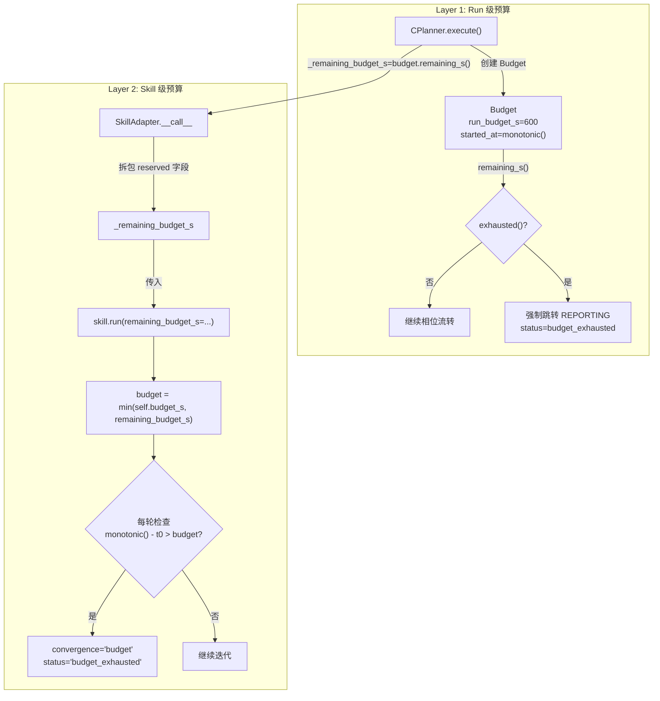
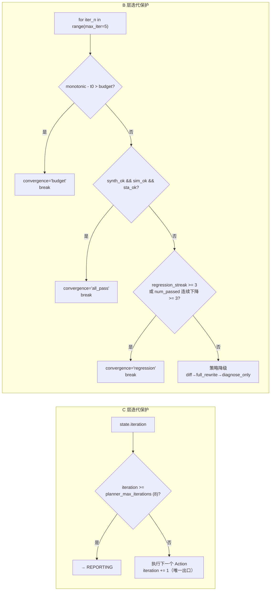

当 CPlanner 将诊断器（A）和自修复（B）作为 Skill 委托执行时，一个核心问题浮现：**如何防止单个 Skill 独占全部时间预算，导致编排层失去后续操作能力？** 本系统通过**双层预算仲裁**机制解决这一矛盾——Run 级全局预算与 Skill 级局部预算通过 `monotonic` 单调钟统一时间基，C 在每次相位切换时查询剩余预算并下传给 Skill，Skill 取自身预算与下传值的最小值作为硬约束。同时，迭代计数器在 C 与 B 两层独立工作，配合回归检测等收束信号，构成完整的多维停机保护体系。

## 预算配置体系

所有预算参数集中声明在 `BudgetSettings` 数据类中，通过 `settings.toml` 的 `[budget]` 段注入：

| 配置字段 | 默认值 | 语义 | 所属层 |
|---------|--------|------|--------|
| `run_budget_s` | 600s | C 与所有 Skill 共享的 Run 级上限 | Layer 1 |
| `skill_diagnose_budget_s` | 60s | A 诊断器子预算 | Layer 2 |
| `skill_self_heal_budget_s` | 480s | B 自修复子预算（留 120s 给 C 的综合/仿真/STA） | Layer 2 |
| `planner_max_iterations` | 8 | C 层工具调用次数上限 | 迭代保护 |
| `skill_max_iterations` | 5 | B 自修复迭代轮数上限 | 迭代保护 |

预算分配的设计逻辑在于**非对称配比**：B 的 480s 占总预算 80%，因为 RTL 修复是最耗时的环节（每轮含综合+仿真+诊断+LLM patch+语法预检）；A 仅 60s 是因为诊断器不迭代（`max_iterations=1`），且规则层匹配在毫秒级完成，60s 仅用于 LLM 归因兜底。C 自身保留 120s（600 - 480 - 60 = 60，加上各 Skill 未用尽的残余时间），足以完成初始综合、仿真、STA 以及独立验证步。

Sources: [settings.py](../../src/eda_agent/settings.py#L59-L66), [settings.toml](../../settings.toml)

## 双层预算架构

以下 Mermaid 图展示预算从 C 创建到 Skill 消费的完整传播路径：



预算传播的核心在于 C 在**每次注入 Skill 调用时**，实时查询 `budget.remaining_s()` 并作为 `_remaining_budget_s` 保留字段注入 Action.args。Skill 端不信任自己的独立预算——它取自身声明预算与 C 下传剩余值的最小值，确保即使 Skill 自身预算未耗尽，也不会超出 Run 级上限。

Sources: [budget.py](../../src/eda_agent/planner/budget.py#L1-L36), [c_planner.py](../../src/eda_agent/planner/c_planner.py#L301-L313)

### Budget 类：Run 级仲裁器

`Budget` 是一个极简但精确的时间预算器，仅 36 行代码，却承担整个系统的预算判定职责：

```python
class Budget:
    def __init__(self, run_budget_s: int, started_at: float) -> None:
        self._run_budget_s = float(run_budget_s)
        self._started_at = float(started_at)

    def remaining_s(self) -> float:
        """剩余秒数;下界 0.0"""
        consumed = self.elapsed_s()
        return max(0.0, self._run_budget_s - consumed)

    def exhausted(self) -> bool:
        """是否已耗尽(剩余 ≤ 0)"""
        return self.remaining_s() <= 0.0
```

三个关键设计决策值得注意。**第一**，使用 `time.monotonic()` 而非 `time.time()`——单调钟不受 NTP 校时或系统时钟回拨影响，保证预算判定的时间一致性。**第二**，`remaining_s()` 的下界强制为 `0.0`，防止负值预算泄漏到 Skill 层导致语义混乱。**第三**，`started_at` 由 C 在 `execute()` 入口用同一个 `monotonic()` 调用传入，确保 Budget 与 Skill 内部各自的 `monotonic()` 读数共享同一时间基。

Sources: [budget.py](../../src/eda_agent/planner/budget.py#L13-L36)

### C 主循环中的预算检查点

CPlanner 的五相状态机主循环中，预算检查是**相位切换的第一道关卡**，优先级高于所有业务逻辑：

```python
while phase != "DONE":
    if budget.exhausted() and phase != "REPORTING":
        record.status = "budget_exhausted"
        phase = "REPORTING"
    elif phase == "EXECUTING":
        if state.iteration >= self._settings.planner_max_iterations:
            phase = "REPORTING"
            continue
        ...
```

预算耗尽时，C 直接将 `record.status` 标记为 `budget_exhausted` 并跳转到 `REPORTING` 相位，**跳过**当前所有待执行动作。注意 `phase != "REPORTING"` 守卫确保预算耗尽不会阻止已经进入 REPORTING 的 Run 完成报告生成——否则预算恰好用完时连最终报告都写不出来。在 LLM 模式下，`_llm_next_action` 内部也独立检查 `budget.exhausted()`，返回 `None` 触发主循环自然收尾。

Sources: [c_planner.py](../../src/eda_agent/planner/c_planner.py#L97-L162), [c_planner.py](../../src/eda_agent/planner/c_planner.py#L537-L546)

## 预算下传机制：reserved 字段协议

预算从 C 到 Skill 的传递不是通过函数参数，而是通过 **reserved 字段注入协议**。这是一个刻意的设计选择——Skill 经由 `SkillAdapter` 包装成 `Tool` 后注册进 Registry，而 Tool 的调用契约只接受 `ToolCall`（包含 `name` + `args` dict）。预算因此以 `_remaining_budget_s` 这个下划线前缀字段嵌入 args dict 中。

### 注入端：C → Action.args

C 在构造 `skill_self_heal` 的 Action 时，将 `budget.remaining_s()` 注入 `_remaining_budget_s` 字段：

```python
return Action(
    "skill_self_heal",
    {
        "rtl": state.rtl_path,
        ...
        "_remaining_budget_s": budget.remaining_s(),
    },
    "自修复",
)
```

值得注意的是 B 自修复内部调用 A 诊断器时，同样将自身剩余预算下传给 A：

```python
diag_call = ToolCall(
    name="skill_diagnose",
    args={
        "tool_results": tool_results,
        "run_id": run_id,
        "_remaining_budget_s": budget_remaining,
    },
    caller="self_heal",
)
```

这意味着预算是**三级传播**：C → B → A（B 内部诊断），每一级取 `min(自身预算, 上游下传值)`。

Sources: [c_planner.py](../../src/eda_agent/planner/c_planner.py#L295-L315), [self_heal.py](../../src/eda_agent/skills/self_heal.py#L751-L759)

### 拆包端：SkillAdapter

`SkillAdapter.__call__` 负责从 `ToolCall.args` 中拆出 reserved 字段，作为 `skill.run()` 的位置参数下传：

```python
def __call__(self, call: ToolCall) -> ToolResult:
    args: dict[str, Any] = dict(call.args)
    remaining = args.pop("_remaining_budget_s", None)  # 消费并移除
    run_id = args.pop("run_id", None)
    inputs = args  # 剩余字段作为 skill inputs
    sr = self._skill.run(run_id=run_id, inputs=inputs, remaining_budget_s=remaining)
```

`pop` 操作确保 reserved 字段不会泄漏到 Skill 的 `inputs` dict 中，避免 Skill 业务逻辑意外读取预算值。同时，`_remaining_budget_s` 不进入 LLM 可见 schema——`registry.to_llm_tools` 会剥离所有下划线前缀字段。

Sources: [base.py](../../src/eda_agent/skills/base.py#L62-L71)

### 消费端：Skill 的预算取小逻辑

A 和 B 两个 Skill 采用**完全一致**的预算取小模式，这是契约规定的统一行为：

```python
# SelfHealSkill.run (self_heal.py:374-377)
if remaining_budget_s is None:
    budget = self.budget_s
else:
    budget = min(self.budget_s, max(0.0, float(remaining_budget_s)))

# DiagnoseSkill.run (diagnose.py:582-585) — 完全一致
if remaining_budget_s is None:
    budget = self.budget_s
else:
    budget = min(self.budget_s, max(0.0, float(remaining_budget_s)))
```

Sources: [self_heal.py](../../src/eda_agent/skills/self_heal.py#L370-L377), [diagnose.py](../../src/eda_agent/skills/diagnose.py#L579-L585)

## None 与 0.0 的语义区分

这是整个预算系统中最微妙也最关键的设计决策。代码注释明确解释了问题：

> 区分 None 与 0.0：None 表示"用我自己的 budget_s"；具体数值（含 0.0）表示"就这么多预算"。避免 `0.0 or self.budget_s` 因 0.0 falsy 回退到 60s 的真值陷阱（违反双层预算仲裁：C 下传 0.0 表示无剩余，应立即 budget 收敛）。

如果使用 `remaining_budget_s or self.budget_s`，当 C 传入 `0.0` 时，`0.0` 在 Python 中是 falsy 值，`or` 短路会错误地回退到 Skill 自身预算（如 B 的 480s）。这意味着 C 已经耗尽预算、指示 Skill "你没有时间了"，但 Skill 却获得满额预算继续运行——双层预算仲裁的约束完全失效。显式的 `None` 检查彻底杜绝了这个陷阱。

| 入参 | `or` 短路写法（**错误**） | 显式 None 检查（**正确**） |
|------|------------------------|--------------------------|
| `None`（C 未传） | 回退到 self.budget_s ✓ | 回退到 self.budget_s ✓ |
| `0.0`（C 已耗尽） | **回退到 self.budget_s ✗** | 取 min(self.budget_s, 0.0) = 0.0 ✓ |
| `300.0`（C 部分剩余） | 取 300.0 ✓ | 取 min(self.budget_s, 300.0) ✓ |

Sources: [self_heal.py](../../src/eda_agent/skills/self_heal.py#L370-L377)

## 双层迭代上限保护

除时间预算外，系统还部署了两层独立的迭代计数器作为**第二维度**的停机保护。迭代上限与预算上限的关系是逻辑 OR——任一触发即终止。



### C 层：单一计数出口

C 层迭代计数的核心设计是**单一递增出口**——`state.iteration` 仅在 `_execute_action` 方法末尾自增，`_reflect` 永远不碰这个值：

```python
def _execute_action(self, action, state, record) -> ToolResult:
    ...
    state.history.append({"call": call, "result": result})
    state.iteration += 1  # 单一计数出口(_reflect 不碰)
    return result
```

测试 `test_iteration_single_counter_no_duplicate` 验证了这一保证：手动执行 3 个 Action + 3 次 reflect，断言 `state.iteration == 3` 且 `len(state.history) == 3`。这防止了"每次 reflect 意外再 +1 导致迭代计数翻倍、过早触发上限"的 bug。迭代上限检查在两个位置生效：EXECUTING 相位入口（rule 模式）和 `_llm_next_action` 开头（llm 模式），两者使用相同的 `planner_max_iterations` 阈值。

Sources: [c_planner.py](../../src/eda_agent/planner/c_planner.py#L323-L352), [test_planner_limits.py](../../tests/test_planner_limits.py#L122-L150)

### B 层：多维收敛信号

B 自修复的迭代循环比 C 复杂得多，因为它需要处理 patch 质量、策略降级、预算耗尽等多维度信号。主循环 `for iter_n in range(max_iter)` 内部依次检查五类停机条件：

| 检查顺序 | 条件 | convergence 值 | 含义 |
|---------|------|---------------|------|
| 1 | `monotonic() - t0 > budget` | `"budget"` | 预算耗尽，立即停止 |
| 2 | `synth_ok && sim_ok && sta_ok` | `"all_pass"` | 全部通过，收敛成功 |
| 3 | `regression_streak >= 3` | `"regression"` | 连续 3 轮 patch 失败 |
| 4 | `num_passed_dropped_streak >= 3` | `"regression"` | 连续 3 轮通过数下降 |
| 5 | 策略降级到 `diagnose_only` | `"regression"` | diff→full_rewrite→diagnose_only 耗尽 |
| 6 | 循环自然结束 | `"max_iter"` | 达到迭代上限但未收敛 |

条件 3 和 4 的回归检测是 B 独有的"防退化"机制。`regression_streak` 在 patch 未成功应用时自增、成功时归零；`num_passed_dropped_streak` 在 `num_passed < best_score` 时自增、否则归零。三连击即判定修复陷入死循环（regression deadlock），主动放弃避免浪费剩余预算。

Sources: [self_heal.py](../../src/eda_agent/skills/self_heal.py#L428-L585)

## 预算耗尽的终态流转

当预算或迭代上限触发时，系统的终态判定逻辑在 `_finalize` 方法中完成：

```python
def _finalize(self, record, state, request, budget) -> RunReport:
    ...
    if is_baseline:
        status = "ok"
    elif state.goal_achieved:
        status = "ok"
    elif record.status == "budget_exhausted" or budget.exhausted():
        status = "budget_exhausted"
    else:
        status = "failed"
```

终态判定优先级清晰：baseline 实验无论如何都是 `ok`；目标已达成是 `ok`；预算耗尽（无论从主循环还是 `_finalize` 复查）是 `budget_exhausted`；其余为 `failed`。注意 `budget.exhausted()` 的**复查**——即使主循环中预算恰好在 REPORTING 前用尽但 `record.status` 未被更新（例如 Report 生成阶段消耗了最后的时间），`_finalize` 仍能捕获并将其归类为 `budget_exhausted`。

在 Skill 内部，预算耗尽时 B 返回 `status="budget_exhausted"` 和 `error_code=EDA_BUDGET_EXHAUSTED`。`SkillAdapter` 将其映射为 `ToolResult.status="error"` 并覆写 `error_code`，C 的 `_reflect` 读到 `convergence_cause="budget"` 后不会设置 `goal_achieved`，最终由 `_finalize` 判定为 `budget_exhausted` 或 `failed`（取决于 Run 级预算是否也已耗尽）。

Sources: [c_planner.py](../../src/eda_agent/planner/c_planner.py#L607-L657), [self_heal.py](../../src/eda_agent/skills/self_heal.py#L609-L618), [base.py](../../src/eda_agent/skills/base.py#L84-L88)

## SkillResult.budget_used_s 的回传

Skill 执行完毕后，实际消耗的时间通过 `SkillResult.budget_used_s` 回传，`SkillAdapter` 将其映射为 `ToolResult.duration_s`。这一字段在 `_build_metrics` 中并不直接参与预算仲裁，但会被记录在实验 manifest 中用于事后分析：

```python
# self_heal.py — 返回时记录实际消耗
return SkillResult(
    ...
    budget_used_s=float(monotonic() - t0),
)

# base.py — 映射到 ToolResult
return ToolResult(
    ...
    duration_s=float(sr.budget_used_s),
    ...
)
```

`budget_used_s` 的价值在于**可追溯性**——实验 manifest 和 run.json 中记录了每个 Skill 实际消耗的秒数，便于事后分析预算分配是否合理（例如 B 是否应该在每轮综合+仿真后更频繁地检查剩余预算）。

Sources: [self_heal.py](../../src/eda_agent/skills/self_heal.py#L648-L660), [base.py](../../src/eda_agent/skills/base.py#L96-L107)

## 测试验证策略

预算与迭代保护系统的测试覆盖分为两个独立单元测试文件：

**`test_budget.py`** 专注于 `Budget` 类本身，使用 `monkeypatch` 控制 `time.monotonic()` 返回值，覆盖四种场景：正常计时、剩余归零、恰好耗尽（`remaining_s == 0` 时 `exhausted()` 为 `True`）、以及 `started_at` 与 `monotonic` 解耦的边界。

**`test_planner_limits.py`** 验证 C 层集成的边界行为：`run_budget_s=0` 时立即 `budget_exhausted` 且 `planner_iterations=0`；rule 模式 `max_iter=3` 时即使仿真持续失败也最多 3 步；`error_code=eda.internal`（severity=fatal）立即 REPORTING 且只执行 1 步；以及异常崩溃时 `_emergency_report` 兜底不抛给调用方。

Sources: [test_budget.py](../../tests/test_budget.py#L1-L70), [test_planner_limits.py](../../tests/test_planner_limits.py#L63-L119)

## 下一步阅读

理解了预算仲裁与迭代保护机制后，以下页面提供了相关上下文：

- [五相状态机：PLANNING 到 DONE 的流转](09_五相状态机Planning到Done.md) — Budget 检查点在状态机中的位置
- [RTL 自修复闭环（组件 B）：综合-仿真-诊断-Patch 迭代](15_RTL自修复闭环组件B.md) — B 内部迭代循环的完整实现
- [Skill 到 Tool 的适配层与 reserved 字段拆包](18_Skill到Tool适配层.md) — `_remaining_budget_s` 的拆包细节
- [版本栈回退与防退化机制](17_版本栈回退与防退化机制.md) — 回归检测与版本栈的配合