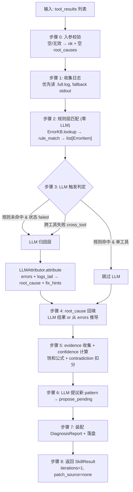
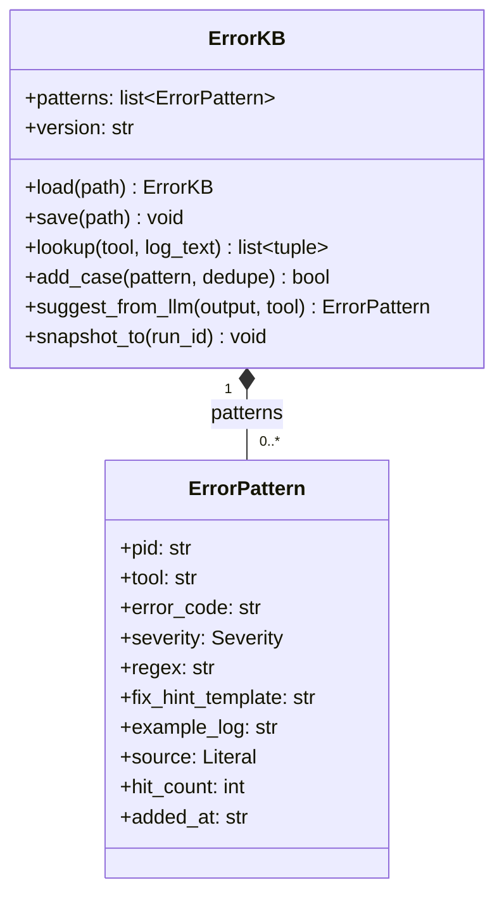
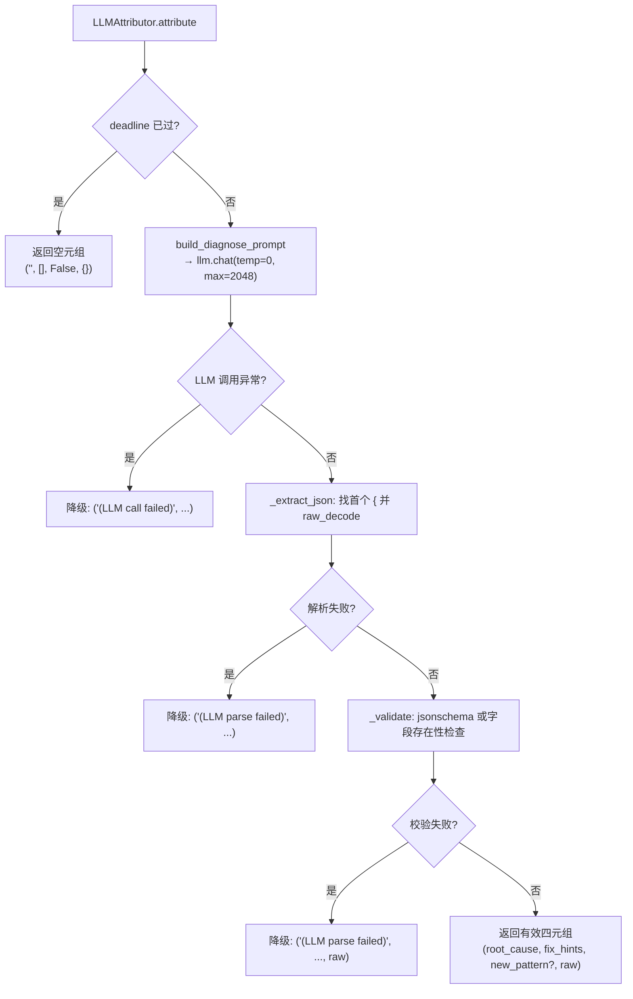

EDA 诊断器是系统 L2 Skills 层中的 **日志归因 skill**，以 `skill_diagnose` 为 Registry name 注册进 Tool Registry。它消费上游 EDA 工具（Yosys 综合、iverilog 仿真、OpenSTA 时序）产出的 `ToolResult`，将散落在日志文本中的错误抽取为结构化的 `ErrorItem`，产出一份包含根因（root_cause）、修复建议（fix_hints）和置信度（confidence）的 `DiagnosisReport`，供 [组件 B 自修复闭环](15_RTL自修复闭环组件B.md) 或 [组件 C CPlanner](10_LLMReAct回环工具决策.md) 消费。诊断器的设计哲学是**两层智能**：先用零 LLM 调用的正则规则层秒出常见错误，再在规则覆盖不足时按条件触发 LLM 归因层做跨条推理。这种分层策略既保证了可复现性（规则层确定性匹配），又保留了对未知错误的泛化能力（LLM 层自由推理）。

Sources: [组件A_诊断器.md](../../组件A_诊断器.md), [diagnose.py](../../src/eda_agent/skills/diagnose.py#L1-L13)

## 职责边界：做什么与不做什么

诊断器的职责可以精确概括为**"日志 → 归因 + 修复建议"**的一次性变换，不涉及任何 RTL 修改或工具执行。

| 维度 | 做什么 | 不做什么 |
|------|--------|----------|
| RTL 修改 | 输出 `fix_hints`（修复提示文本） | 不产 patch，不改 RTL（这是 B 的职责） |
| EDA 工具执行 | 只**消费**上游 `ToolResult` | 不重新跑综合/仿真/时序（避免与 B/C 工具编排重叠） |
| 迭代收敛 | 一次性归因：`iterations` 恒为 1 | 不做多轮迭代（是否再跑工具是 B/C 的决策） |
| 输入模态 | 只读文本日志（stdout/stderr/full.log） | 不读波形 VCD 截图（MVP 不做多模态） |
| 错误抽取 | 结构化 `ErrorItem`（code/severity/evidence/fix_suggestion） | 不发明上游工具的错误码，只归类 |

诊断器被两种调用方消费：**C → A**（CPlanner 在 plan-execute 循环中，若综合/仿真/时序任一非 ok，调 `skill_diagnose` 拿归因后再决定下一步）和 **B → A**（自修复闭环每轮迭代内，综合+仿真后调 `skill_diagnose` 拿到本轮 fix_hints 指导 patch 生成）。两种入口走同一个 `DiagnoseSkill.run` 实现。

Sources: [组件A_诊断器.md](../../组件A_诊断器.md)

## 两层架构：规则层与 LLM 归因层

诊断器的"智能"被刻意拆成两层，形成 **规则优先、LLM 兜底** 的级联结构。下面的时序图展示了从输入到输出的完整九步流水线：



**规则层（第 1 层）** 对每个 `(tool, log_text)` 组合跑 `ErrorKB.lookup`，对 KB 中所有匹配该 tool 的 pattern 逐条执行 `re.search`，命中的 pattern + match 对经 `_build_error_item` 函数装配为 `ErrorItem`。整个过程零 LLM 调用，确定性可复现，耗时通常在毫秒级（评测数据显示 p95 = 0.0001s）。

**LLM 归因层（第 2 层）** 的触发条件由三个布尔条件的组合决定，在实现中编码为单行表达式 `needs_llm = (len(errors) == 0 and any_failed) or cross_tool`。当规则层产出 errors 为空但上游工具状态非 ok（说明真有错但规则没覆盖），或失败工具来自多个不同 tool（需要跨工具因果推理），诊断器才把规则层结构化错误 + 日志上下文喂给 LLM。

Sources: [diagnose.py](../../src/eda_agent/skills/diagnose.py#L618-L631), [rule_metrics.json](../../data/logs_corpus/rule_metrics.json#L34-L36), [组件A_诊断器.md](../../组件A_诊断器.md)

## ErrorKB：错误模式知识库

`ErrorKB` 是诊断器规则层的知识载体，持久化为 `data/error_kb.json`，当前种子库包含 12 条 `ErrorPattern`，覆盖三个 EDA 工具的常见错误类型。



`ErrorPattern` 是 KB 的最小单元，其中 `regex` 字段使用 Python 命名分组抽取行号和信号名（如 `(?P<signal>\w+)`），`fix_hint_template` 支持 `{signal}` / `{line}` 格式化占位符。当正则命中后，`match.groupdict()` 的值会被 `.format()` 注入模板，产出人类可读的修复建议。种子库的 12 条模式按工具分布如下：

| 工具 | pid 前缀 | error_code | severity | 正则匹配目标 |
|------|----------|------------|----------|-------------|
| yosys_synth | synth.rtl_syntax_001 | synth.rtl_syntax | error | `ERROR: Syntax error in line (?P<line>\d+)` |
| yosys_synth | synth.multi_driver_001 | synth.multi_driver | error | `ERROR: Wire (?P<signal>\w+) has multiple drivers` |
| yosys_synth | synth.undefined_signal_001 | synth.undefined_signal | error | `ERROR: Identifier '(?P<signal>[^']+)' not found` |
| yosys_synth | synth.port_unconnected_001 | synth.port_unconnected | warn | `Warning: Found unconnected port (?P<port>\w+)` |
| yosys_synth | synth.module_not_found_001 | synth.module_not_found | error | `ERROR: Module (?P<module>[^']+)' not found` |
| iverilog_sim | sim.compile_failed_001 | sim.compile_failed | error | `(?P<file>[^:]+\.v):(?P<line>\d+): syntax error` |
| iverilog_sim | sim.assert_failed_001 | sim.assert_failed | error | `TEST_FAIL\s+(?P<signal>\S+)` |
| iverilog_sim | sim.mismatch_001 | sim.mismatch | error | `Mismatch at time (?P<time>\d+): got` |
| opensta_timing | sta.timing_violation_001 | sta.timing_violation | error | `VIOLATED\s+(?P<slack>-?\d+\.\d+)\s*slack` |
| opensta_timing | sta.setup_violation_001 | sta.setup_violation | error | `endpoint setup.*VIOLATED.*?(?P<slack>-\d+\.\d+)` |
| * (通配) | sim.subprocess_timeout_001 | sim.subprocess_timeout | error | `timed out after (?P<seconds>\d+)s` |
| * (通配) | synth.subprocess_timeout_001 | synth.subprocess_timeout | error | `subprocess timeout after (?P<seconds>\d+)s` |

`tool` 字段为 `"*"` 的 pattern 在 `lookup` 中对所有工具生效（`p.tool not in (tool, "*")` 过滤逻辑）。`add_case` 方法按 `(tool, error_code, regex)` 三元组去重，重复返回 `False`，保证 KB 不会被重复模式污染。

Sources: [error_kb.json](../../data/error_kb.json#L1-L149), [diagnose.py](../../src/eda_agent/skills/diagnose.py#L102-L268)

### KB 增长机制：三档来源管控

ErrorKB 设计了严格的三档增长机制，在"可积累"与"防 LLM 噪声污染"之间取得平衡。种子模式（`source="seed"`）由开发期人工编写，是初始覆盖的基线；LLM 提议模式（`source="llm_curated"`）在 LLM 归因过程中，如果 LLM 返回了 `new_pattern` 字段，会被构造成 `ErrorPattern` 对象写入 `runs/<run_id>/diagnose/propose_pending/<uuid8>.json`，**不自动入库**；人工确认模式（`source="human"`）由人工 review propose_pending 目录后确认入库，走 `add_case` 写回主库。

LLM 提议构造 `ErrorPattern` 时，pid 使用 `hashlib.sha256` 而非 Python 内置 `hash()`，因为 `hash()` 受 `PYTHONHASHSEED` 随机化影响，跨 run 不可比，违反契约 §2.6 的"跨 run 可比"语义要求。`suggest_from_llm` 方法仅构造对象，不自动入库——任何字段缺失（regex / error_code / fix_hint_template 任一为空）时返回 `None`。

Sources: [diagnose.py](../../src/eda_agent/skills/diagnose.py#L222-L254), [组件A_诊断器.md](../../组件A_诊断器.md)

## 规则层：零 LLM 的确定性匹配

规则层的核心是 `rule_match` 模块级函数，它接受 `(kb, tool, log_text)` 三元组，对 KB 中匹配该 tool 的所有 pattern 逐条执行正则搜索，返回 `list[ErrorItem]`。匹配命中的 pattern + match 对经 `_build_error_item` 装配为 `ErrorItem`——该函数提取 `match.groupdict()` 中的命名分组值，通过 `fix_hint_template.format(**g)` 填充模板产出人类可读的 message，同时将 match 的完整匹配文本（`match.group(0)`）作为 evidence 存入 `ErrorItem.evidence`。

`ErrorItem` 的 `namespace` 字段由 `namespace_of(error_code)` 自动派生（即 `code.split(".")[0]`），severity 直接取自 `ErrorPattern.severity`，不需要额外查表。这使得规则层产出的每条错误都是完全自描述的——消费方（B/C）可以直接读 `ErrorItem.code` 做 namespace 聚类，读 `ErrorItem.severity` 做优先级排序。

规则层的鲁棒性体现在两个防御性设计上：`ErrorKB.lookup` 对每条 pattern 的 `re.search` 包裹了 `try/except re.error`，单条正则编译失败不影响其他 pattern 匹配；`_build_error_item` 对 `fix_hint_template.format(**g)` 包裹了 `try/except (KeyError, IndexError)`，模板占位符与分组名不匹配时回退为原始模板字符串。

Sources: [diagnose.py](../../src/eda_agent/skills/diagnose.py#L276-L310), [errors.py](../../src/eda_agent/errors.py#L98-L138)

## LLM 归因层：JSON Schema 约束与优雅降级

当 `needs_llm` 为 `True` 且 `monotonic() < deadline` 时，诊断器实例化 `LLMAttributor`，将规则层产出的 errors（`asdict` 列表）与日志上下文喂给 LLM。LLM 调用使用 `temperature=0.0, max_tokens=2048` 保证确定性和 token 经济性。

### Prompt 构造

Prompt 由 `prompts_diagnose.py` 中的 `build_diagnose_prompt` 函数构造，采用 system + user 双消息结构。System prompt 明确要求 LLM 输出包含四个字段的 JSON 对象。每个工具的日志取末尾 `_LOG_TAIL_LEN=2000` 字符截断，防止 prompt 爆长。

```
system: "你是 EDA 诊断专家。给定结构化错误列表与工具日志，产出 JSON 对象，字段：
         root_cause(str), fix_hints(list[str]), needs_patch(bool),
         new_pattern(null 或 {regex,error_code,fix_hint_template})。
         只输出 JSON，不要解释。"
user:   json.dumps({"errors": [...], "logs_tail_per_tool": {tool_name: log_tail}})
```

### JSON Schema 校验与降级链路

LLM 返回的文本经过 `_extract_json`（找首个 `{` 并用 `JSONDecoder().raw_decode` 解析）和 `_validate`（jsonschema 校验或降级为关键字段存在性检查）两道关卡。校验通过后，`attribute` 方法返回四元组 `(root_cause, fix_hints, llm_found_new, raw_dict)`。



所有异常被 `LLMAttributor` 内部吞掉，降级返回非抛策略确保诊断器即使 LLM 不可用也能走纯规则层结果。降级时的 `root_cause` 字符串（如 `"(LLM call failed)"`）会被后续的 root_cause 回填逻辑覆盖或保留为报告中的显式降级标记。

Sources: [prompts_diagnose.py](../../src/eda_agent/skills/prompts_diagnose.py#L1-L49), [diagnose.py](../../src/eda_agent/skills/diagnose.py#L368-L468)

## DiagnoseSkill.run：九步主流程详解

`DiagnoseSkill.run` 是诊断器的核心编排方法，严格遵循契约 §2.3 的 `Skill.run` 签名。以下是每一步的精确语义：

**步骤 0 — 入参校验。** 检查 `tool_results` 是否为非空 list，每条是否为含 `tool` 和 `parsed` 字段的 dict。不合法时返回 `_empty_result`（status="ok" + 空 root_causes），而非抛异常——这让消费方（B/C）拿到合法结构降级，而非被诊断器阻断。

**步骤 1 — 日志收集。** `_collect_logs` 方法优先读 `runs/<run_id>/steps/<idx>_*/<tool>.full.log`（完整日志），找不到时 fallback 到 `tool_result.stdout`。日志搜索通过 glob 模式 `*_{tool_name}` 匹配 step 目录，按文件名排序后取最新（reversed 遍历）。

**步骤 2 — 规则层匹配。** 对每对 `(tool_name, log_text)` 调用 `rule_match`，聚合所有 ErrorItem。

**步骤 3 — LLM 触发判定。** 计算 `any_failed`（任一 tool_result 状态非 ok）和 `cross_tool`（失败工具数 > 1）。`needs_llm = (len(errors) == 0 and any_failed) or cross_tool`。同时检查 `monotonic() < deadline`——预算耗尽则跳过 LLM。

**步骤 4 — root_cause 回填。** 若 LLM 未触发或返回空 root_cause，从 errors 列表推导：`f"{len(errors)} 个错误，首要：{errors[0].message}"`。fix_hints 为空时取 errors 前三条的 `fix_suggestion` 或 `message`。

**步骤 5 — evidence + confidence 计算。** 收集所有 ErrorItem 的 evidence 字段（去重），再补入每个工具日志末尾若干非空行（上限 10 条）。然后计算 contradiction 和 confidence。

**步骤 6 — LLM 新 pattern 提议。** 若 `llm_found_new` 且 raw 非空，调用 `suggest_from_llm` 构造候选 `ErrorPattern`，写入 `propose_pending/` 目录。

**步骤 7 — 装配 DiagnosisReport + 落盘。** `ReportWriter` 写 `report.md`（人类可读）和 `report.json`（DiagnosisReport.to_parsed()）。`ErrorKB.snapshot_to` 写 `error_kb_snapshot.json`（本次诊断用的 KB 版本快照，保证可复现）。

**步骤 8 — 返回 SkillResult。** 恒定语义：`iterations=1, patch_source="none", convergence_cause="none", best_iter=-1`。

Sources: [diagnose.py](../../src/eda_agent/skills/diagnose.py#L538-L740)

## 预算处理：双层仲裁与零值陷阱防护

诊断器的预算处理体现了一个关键的防御性设计——**区分 None 与 0.0**。在 `run` 方法的入口处：

```python
if remaining_budget_s is None:
    budget = self.budget_s
else:
    budget = min(self.budget_s, max(0.0, float(remaining_budget_s)))
```

这一设计规避了 Python 的 falsy 真值陷阱：如果用 `budget = remaining_budget_s or self.budget_s`，当 CPlanner 下传 `0.0`（表示"无剩余预算"）时，`0.0` 是 falsy，会被 `or` 短路回退到 `self.budget_s`（默认 60s），使 LLM 照常调用——这违反了 [双层预算仲裁](13_双层预算仲裁与迭代上限.md) 的语义。测试用例 `test_run_skips_llm_when_budget_zero` 验证了这一边界：当 `remaining_budget_s=0.0` 且 `needs_llm=True`（cross_tool）时，LLM 必须不被调用，`fake.calls == 0`，`used_layers` 保持 `"rule"`。

Sources: [diagnose.py](../../src/eda_agent/skills/diagnose.py#L578-L585), [test_diagnose_skill.py](../../tests/test_diagnose_skill.py#L247-L273)

## confidence 公式：饱和项与 contradiction 惩罚

诊断器的 confidence 计算是契约 v1.2 锁死的确定性公式，**不接受 LLM 自填**——即使 LLMAttributor 的 prompt 要求给 confidence 值，实现中也完全忽略该字段。

```python
def compute_confidence(evidence: list[str], has_contradiction: bool) -> float:
    val = 0.5 + 0.1 * min(len(evidence), 5)
    if has_contradiction:
        val -= 0.2
    return max(0.0, min(1.0, val))
```

公式的三个关键特征由饱和上限 `_CONF_EVIDENCE_CAP = 5` 和 contradiction 阈值 `_JACCARD_CONTRADICTION = 0.3` 共同保证：

| evidence 条数 | 无矛盾 | 有矛盾 |
|:---:|:---:|:---:|
| 0 | 0.5 | 0.3 |
| 3 | 0.8 | 0.6 |
| 5 | 1.0 | 0.8 |
| 10（饱和） | 1.0 | 0.8 |

**饱和项** `min(len(evidence), 5)` 防止 6 条以上证据恒出 1.0 的退化；**contradiction 判定** 在 `used_layers in ("llm", "rule+llm")` 且 errors 非空时，对 LLM 的 root_cause 与 `errors[0].message` 做 Jaccard 分词相似度比较——低于 0.3 视为矛盾，扣 0.2。Jaccard 实现使用简单空格分词（`set(a.split()) & set(b.split())`），任一空串返回 0.0。

测试用例 `test_compute_confidence_four_levels_0_3_5_10` 断言了四组对比的单调非减性：`v0 < v3 < v5 == v10`。

Sources: [diagnose.py](../../src/eda_agent/skills/diagnose.py#L48-L82), [test_diagnose_skill.py](../../tests/test_diagnose_skill.py#L302-L338)

## needs_rtl_patch 派生：按 severity 不按 namespace

`needs_rtl_patch` 字段在契约 v1.2 中从可选升级为**强制字段**，其派生口径也从"按 namespace 前缀判"改为"按 severity 判"——这是修复 v1.1 的一个隐性断路器。早期按 namespace 前缀判断（如 `code.startswith("synth.")`）时，由于诊断器实际消费的错误码是 `eda.*` 别名（如 `eda.rtl_syntax`），会导致判断恒为 `False`，使得 B 自修复闭环永远收不到"需要修复"的信号。

修复后的逻辑简洁且正确：

```python
def _needs_patch_for(e: ErrorItem) -> bool:
    return e.severity in ("error", "fatal")

# needs_rtl_patch = any(_needs_patch_for(e) for e in self.errors)
```

`DiagnosisReport.to_parsed()` 中直接内联了这一逻辑：`needs_rtl_patch = any(e.severity in ("error", "fatal") for e in self.errors)`。测试用例 `test_needs_rtl_patch_derived_by_severity_not_namespace` 覆盖了三种场景：`severity=error` → True、`severity=warn` → False、空 errors → False。

Sources: [diagnose.py](../../src/eda_agent/skills/diagnose.py#L338-L359), [test_diagnose_skill.py](../../tests/test_diagnose_skill.py#L499-L526), [组件A_诊断器.md](../../组件A_诊断器.md)

## DiagnosisReport 与 13 字段 parsed schema

`DiagnosisReport` 是诊断器的内部强类型报告，`to_parsed()` 方法将其映射为契约 §2.2 要求的 13 字段 dict。这 13 个顶层 key 是**强制完整集**——多一个少一个都会导致测试断言失败：

```python
_REQUIRED_13_KEYS = {
    "_schema", "skill", "tool", "stage", "root_causes", "root_cause_summary",
    "severity", "fix_hints", "confidence", "needs_rtl_patch", "used_layers",
    "kb_hits", "summary",
}
```

其中 `_schema` 元字段内嵌 `contract_version`，**必须**通过 `from eda_agent.contracts import CONTRACT_VERSION` 引用，禁止裸字符串 `"0.1.0"`。测试 `test_no_bare_contract_version_string_in_diagnose_source` 直接扫描 `diagnose.py` 源码文本，断言 `'contract_version": "0.1.0"'` 和 `"'contract_version': '0.1.0'"` 均不出现。

`root_causes` 是**结构化权威字段**（装 `ErrorItem.asdict()` 列表），而 `root_cause_summary` 和 `summary` 仅是人类可读辅助。B/C 消费方读 `root_causes` 做判定，读 `summary` 仅入 report.md。`used_layers` 标识走了哪些层（`"rule"` / `"llm"` / `"rule+llm"`），用于度量规则覆盖率。

Sources: [diagnose.py](../../src/eda_agent/skills/diagnose.py#L318-L360), [test_diagnose_skill.py](../../tests/test_diagnose_skill.py#L466-L536)

## 错误码体系：diagnose namespace

诊断器自身产出的错误码属于 `diagnose` namespace（契约 §2.6 v1.2 正式登记），共 4 个：

| 规范码 | 兼容别名 | severity | 触发场景 |
|--------|----------|----------|----------|
| `diagnose.no_error_found` | — | warn | 工具失败但规则层+LLM 都没找出根因 |
| `diagnose.llm_call_failed` | `eda.llm_call_failed` | error | LLM 层调用失败 |
| `diagnose.kb_corrupted` | — | warn | error_kb.json 解析失败（降级为空 KB 继续跑） |
| `diagnose.args_invalid` | `eda.tool_args_invalid` | error | 输入不符 schema |

诊断器**消费**的错误码（产 ErrorItem 时填的 code）来自上游 Tool，实际取 `eda.*` 别名（如 `eda.rtl_syntax` / `eda.sim_assert_failed` / `eda.timing_violation`）。诊断器不发明上游工具的错误码，只做归类——这也解释了 `needs_rtl_patch` 为何改按 severity 判而非按 namespace 前缀判。severity↔code 对应关系由 `errors.py` 中的 `SEVERITY_BY_CODE` 查表统一管理，`severity_of()` 函数对未登记码默认返回 `"error"`（保守归错策略）。

Sources: [errors.py](../../src/eda_agent/errors.py#L46-L105), [组件A_诊断器.md](../../组件A_诊断器.md)

## as_tool 适配：Skill 到 Tool 的透明映射

诊断器通过 `skills/base.py` 中的 `SkillAdapter` 类包装为 `Tool Protocol`，注册名 `skill_diagnose`。适配器的核心职责是拆包 reserved 字段（`_remaining_budget_s` 和 `run_id`）、调用 `skill.run`、将 `SkillResult` 映射为 `ToolResult` 并补齐六个 `_skill_*` 元字段。

诊断器的恒定语义在 `SkillResult` 层面体现为：`patch_source="none"`、`convergence_cause="none"`、`best_iter=-1`、`iterations=1`。这些值通过 `as_tool` 映射后变成 `parsed["_skill_patch_source"]`、`parsed["_skill_convergence_cause"]` 等字段，让 CPlanner 在 plan-execute 循环中能够区分诊断器返回（不迭代不修复）与自修复闭环返回（可能 all_pass）。测试 `test_skill_diagnose_invokable_via_tool_call` 验证了通过 `ToolCall` 入口调用诊断器的完整链路。

Sources: [base.py](../../src/eda_agent/skills/base.py#L1-L115), [diagnose.py](../../src/eda_agent/skills/diagnose.py#L742-L745), [test_diagnose_skill.py](../../tests/test_diagnose_skill.py#L574-L596)

## 评测基线与规则覆盖率

基于 30 样本的语料评测（`with_llm=false`，纯规则层），诊断器的表现指标如下：

| 指标 | 值 | 门槛 | 达标 |
|------|:--:|:----:|:----:|
| A2 规则覆盖率 | 0.7778 | ≥ 0.4 | ✅ |
| A4 规则层 confidence 均值 | 0.6633 | ≥ 0.7 | ❌（接近） |
| A9 needs_patch 准确率 | 0.6667 | — | 14 TP / 0 FP / 10 FN / 6 TN |
| A8 p50 延迟 | 0.0s | ≤ 20.0s | ✅ |
| A8 p95 延迟 | 0.0001s | ≤ 60.0s | ✅ |

失败样本集中在 `novel` 桶（KB 未覆盖的新型错误）和 `grown` 桶（ErrorKB 扩展版新增但种子库未含的模式），根因主要是 `code_mismatch`（规则层产出的 error_code 与语料标注不一致）。这印证了两层架构的价值——规则层对 seed 蟹类覆盖率高、零延迟，但对 novel 类需要 LLM 层兜底。更多关于 ErrorKB 增量增长与覆盖率提升的细节，参见 [ErrorKB 错误知识库：模式匹配与增量增长](29_ErrorKB错误知识库.md)。

Sources: [rule_metrics.json](../../data/logs_corpus/rule_metrics.json#L1-L99)

## 产物工件与副作用

诊断器的全部副作用走 L0 工件存储（契约 §2.4），每次诊断产出以下文件：

```
runs/<run_id>/diagnose/
    report.md                          # 人类可读诊断报告（Markdown 表格）
    report.json                        # DiagnosisReport.to_parsed() 的 JSON 落盘
    error_kb_snapshot.json             # 本次诊断用的 ErrorKB 版本快照
    propose_pending/                   # LLM 提议的新 ErrorKB pattern（待人工 review）
        <uuid8>.json
```

`report.md` 由 `ReportWriter._render_md` 生成，包含 stage/severity/confidence/used_layers/contradision 元数据头部、Root Cause 段落、Root Causes errors 表格（code/severity/tool/message 四列）和 Fix Hints 列表。artifacts 列表通过 `artifact_ref(run_id, rel_path)` 工厂函数构造，包含 `report.md` 和 `report.json` 两个引用。诊断器不修改上游 Tool 的任何 artifact，不修改 RTL/TB。

Sources: [diagnose.py](../../src/eda_agent/skills/diagnose.py#L476-L522), [组件A_诊断器.md](../../组件A_诊断器.md)

## 进一步阅读

- [RTL 自修复闭环（组件 B）](15_RTL自修复闭环组件B.md) — 了解诊断器的 report 如何指导 B 的 patch 迭代
- [Skill 到 Tool 的适配层与 reserved 字段拆包](18_Skill到Tool适配层.md) — 深入 `SkillAdapter` 的映射机制
- [ErrorKB 错误知识库：模式匹配与增量增长](29_ErrorKB错误知识库.md) — KB 扩展策略与评测细节
- [双层预算仲裁与迭代上限保护](13_双层预算仲裁与迭代上限.md) — 理解 `remaining_budget_s` 的传递链路
- [契约驱动开发哲学：CONTRACTS.md 权威机制](04_契约驱动CONTRACTS权威机制.md) — 13 字段 schema 与 `_schema.contract_version` 的版本锚点协议