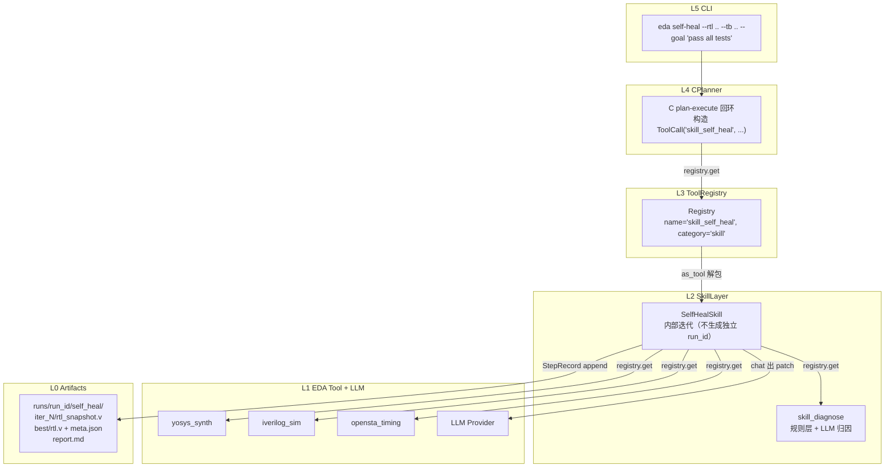
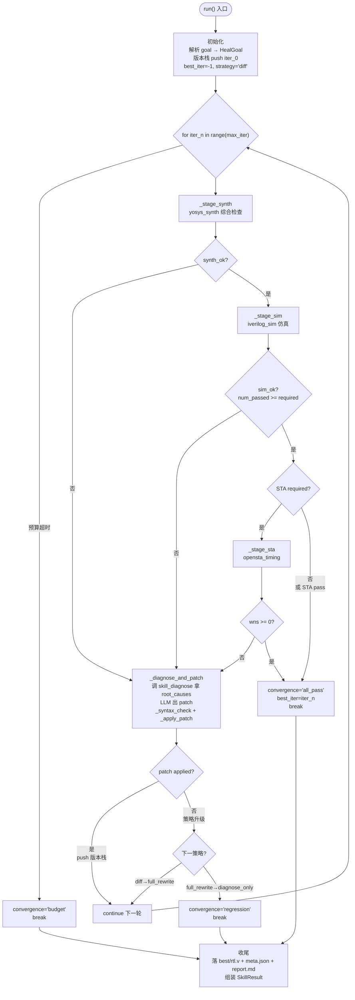
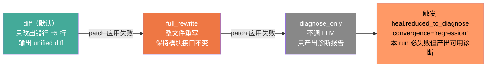

**SelfHealSkill**（注册名 `skill_self_heal`）是 EDA Agent 系统中唯一将"RTL 出错了"这件事收敛为一个完整自动化闭环的复合 Skill。它接收一份 RTL 源码 + 一份 Testbench + 一个修复目标，内部驱动 **综合 → 仿真 →（可选）时序分析 → 诊断 → LLM Patch → 重验证** 的多轮迭代，辅以版本栈回退、防退化死锁保护和三策略升级阶梯，直到全通过或耗尽预算。整个过程不生成独立 run_id，所有子步骤以 `StepRecord(skill_name="self_heal", iter=N)` 追加到父 RunRecord，保证调用方 C（CPlanner）或 CLI 能完整追溯每一轮迭代的输入与输出。

Sources: [self_heal.py](../../src/eda_agent/skills/self_heal.py#L1-L11), [组件B_自修复闭环.md](../../组件B_自修复闭环.md)

---

## 职责边界：做什么与不做什么

B 是一个 **L2 复合 Skill**——对外通过 `as_tool()` 注册进 L3 Registry，供 L4 CPlanner 或 L5 CLI 调用；对内只编排已有的 L1 EDA Tool（`yosys_synth` / `iverilog_sim` / `opensta_timing`）和 L2 A 诊断器（`skill_diagnose`），不重复造子进程逻辑。B 内部的 LLM 调用**仅用于出 Patch**（窄任务），不进入 ReAct 工具选择——工具发现和任务分解是 C 的职责。

| 不做的事 | 谁来做 | 理由 |
|:---|:---|:---|
| 不重写 yosys/iverilog/opensta 子进程封装 | L1 Tool 封装层 | B 只编排已有 Tool，遵循开闭原则 |
| 不自己产 ErrorItem 归因 | A 诊断器 | B 调 `skill_diagnose` 拿 `root_causes`，喂给 LLM 出 Patch |
| 不做 LLM tool-use 选择 | C（CPlanner） | B 是被 C 调用的 Tool，不反向编排 C |
| 不生成独立 run_id | Runner | B 的每轮子步骤以 StepRecord 追加到父 RunRecord |
| 不修架构级设计错误 | 人工 | B 对结构性错误降级为"只报诊断不自动改" |

Sources: [self_heal.py](../../src/eda_agent/skills/self_heal.py#L319-L360), [组件B_自修复闭环.md](../../组件B_自修复闭环.md)

---

## 五层架构中的调用关系

下图展示了 B 在 L0-L5 五层架构中的精确位置及其依赖方向。箭头严格自上而下——B 向下调用 L1 EDA Tool 和 L2 诊断器，向上被 CPlanner 或 CLI 调用，B 不知道调用方是谁。



一次典型的 `eda self-heal` 调用等于 C 发起 1 次 `skill_self_heal`，B 内部最多 `max_iter=5` 轮，每轮 ≤ 3 个 EDA Tool + ≤ 1 次 `skill_diagnose` + ≤ 1 次 LLM Patch 调用。

Sources: [bootstrap.py](../../src/eda_agent/tools/bootstrap.py#L74-L94), [组件B_自修复闭环.md](../../组件B_自修复闭环.md)

---

## 主迭代循环：综合 → 仿真 → 诊断 → Patch

### 整体流程

`SelfHealSkill.run()` 是整个闭环的入口。它接收 `run_id`、`inputs` 字典（含 `rtl`/`tb`/`goal`/`max_iter` 等字段）和 `remaining_budget_s`（由 `as_tool` 从 `_remaining_budget_s` reserved 字段拆包下传），在主循环中按固定顺序执行三个 Stage，任何一个失败就触发 `_diagnose_and_patch` 进行诊断和修复。



### Stage 编排方法

三个 `_stage_*` 方法**只负责构造 `ToolCall` + 调 Registry + 落 StepRecord**，不做业务判定。这种设计将"执行"与"判定"分离——成功与否的判断逻辑集中在 `run()` 主循环中。

| 方法 | 对应 Tool | 调用方式 | 落 StepRecord |
|:---|:---|:---|:---|
| `_stage_synth` | `yosys_synth` | `registry.get("yosys_synth")(call)` | `skill_name="self_heal", iter=iter_n` |
| `_stage_sim` | `iverilog_sim` | `registry.get("iverilog_sim")(call)` | `skill_name="self_heal", iter=iter_n` |
| `_stage_sta` | `opensta_timing` | `registry.get("opensta_timing")(call)` | `skill_name="self_heal", iter=iter_n` |

每轮中 STA 是否执行取决于三重条件：`goal.sta_required` 为 `True`、`lib` 和 `clock` 均提供、且综合已通过。当缺少 liberty 或时钟名时，STA 步骤自动跳过（优雅降级），不影响收敛判定。

Sources: [self_heal.py](../../src/eda_agent/skills/self_heal.py#L428-L506), [self_heal.py](../../src/eda_agent/skills/self_heal.py#L667-L713), [组件B_自修复闭环.md](../../组件B_自修复闭环.md)

---

## Goal 解析与通过判定

### HealGoal 数据结构

`_parse_goal()` 函数将自然语言 `goal` 字符串解析成可机器判定的 `HealGoal` 结构。MVP 支持两种目标模板，无法解析时返回 `None`（调用方报 `heal.unsupported_goal`）：

| goal 字符串 | pass_mode | num_required | sta_required |
|:---|:---|:---|:---|
| `"pass all tests"` | `"all"` | 0（运行时由 TB 协议行总数填入） | `False` |
| `"pass all tests and meet timing"` | `"all"` | 0 | `True` |
| `"pass 3 tests"` | `"at_least"` | 3 | `False` |
| `"pass all tests, no violation"` | `"all"` | 0 | `True` |
| `"make it work"` / `""` | — | — | — (返回 `None`) |

`_parse_goal` 内部通过正则 `_AT_LEAST_RE = re.compile(r"pass\s+(\d+)\s+test", re.IGNORECASE)` 匹配 `"pass N tests"` 模式。`sta_required` 由 goal 是否包含 `"timing"` 或 `"no violation"` 子串决定。含否定词的 goal（如 `"fail all tests"`）会被显式排除，避免反向语义误判。

### 仿真通过条件

仿真通过的判定逻辑（`sim_ok`）基于 iverilog_sim 的 `parsed` 结构化字段（**B 不解析裸文本**，只信 TB 协议行 `TEST_PASS` / `TEST_FAIL`）。关键边界处理是 `total=0` 的场景——当 TB 未打印协议行或编译失败时，`total=0` 且 `goal.pass_mode="all"` 会让 `required=0`，进而 `0 >= 0` 误判通过；此时 B 只信 `parsed["passed"] is True`（契约规定无 `TEST_PASS` 行时 `passed=None`），避免假阳性。

Sources: [self_heal.py](../../src/eda_agent/skills/self_heal.py#L50-L127), [self_heal.py](../../src/eda_agent/skills/self_heal.py#L444-L472)

---

## 诊断与 Patch 核心：_diagnose_and_patch

`_diagnose_and_patch` 是 B 的"智能核心"。它完成从"失败信号"到"可应用的 RTL 补丁"的全链路转换，包含五个关键步骤：

### Step 1：获取诊断根因

首轮若外部（CPlanner）预调过 `skill_diagnose`，B 通过 `inputs["diagnose"]`（seed）直接消费，不再重复调用。后续轮次（或无 seed 时），B 构造 `ToolCall(name="skill_diagnose", args={"tool_results": [...], "run_id":..., "_remaining_budget_s":...})` 经 Registry 调用 A 诊断器，获取 `root_causes` 列表。

### Step 2：fail_signals 兜底包装

当 `skill_diagnose` 返回空 `root_causes` 时，B 将 `iverilog_sim` 的 `fail_signals` 列表中的每个信号包装成结构化的 `ErrorItem`（使用 `ErrorItem.make(code="sim.fail_signal", ...)`），保证喂给 LLM 的输入始终是结构化的根因对象，而非裸字符串。这是契约 §2.6 的硬性约束。

### Step 3：定位出错行号

`_locate_lines()` 从 `root_causes` 的 `message` / `evidence` 字段中，用三种正则模式抽取出错行号，返回 `(line - 5, line + 5)` 的 ±5 行片段区间，用于缩小 LLM 的改动范围（防退化策略之一）。

| 正则模式 | 匹配示例 | 工具来源 |
|:---|:---|:---|
| `r":(\d+):\s*\d+"` | `file.v:42: 误差列号` | iverilog |
| `r":(\d+):"` | `file:42:` | 通用 |
| `r"\((\d+)\)"` | `error (10) here` | 嵌套表达式 |

### Step 4：LLM 出 Patch

根据当前策略构造 prompt，调用 `self._llm.chat(messages, temperature=0.0, max_tokens=4096)`。LLM 调用**不传 tools 参数**——B 的 LLM 调用只用于出 Patch，不涉及 tool-use 选择。LLM 异常会被捕获并降级为 `PatchOutcome(applied=False, rationale="llm failed: ...")`，不穿透到上层。

### Step 5：应用 + 语法预检

`_apply_patch` 应用补丁后，`_syntax_check` 使用 `iverilog -t null -o /dev/null` 对修改后的 RTL 做纯语法预检（不接 TB）。两者均通过时才将 `rtl_new` 写入 `snap_dir/rtl_snapshot.v` 并返回 `PatchOutcome(applied=True)`。任一失败则返回 `PatchOutcome(applied=False)`，触发主循环的策略升级。

Sources: [self_heal.py](../../src/eda_agent/skills/self_heal.py#L725-L859), [self_heal.py](../../src/eda_agent/skills/self_heal.py#L130-L169), [errors.py](../../src/eda_agent/errors.py#L52-L59)

---

## 三策略升级阶梯

B 使用一个**写死的策略升级阶梯**来控制 LLM 的改动自由度，降低退化风险。策略在 patch 应用失败时自动升级，每升级一档自由度增加一档，直至到达 `diagnose_only` 终态。



| 策略 | Prompt 特征 | _build_prompt 返回 | LLM 调用 | patch_source |
|:---|:---|:---|:---|:---|
| `diff` | 出错片段 + ±5 行 + 根因 JSON，要求"只改出错行，别动其他" | `[system, user]` | ✓ | `"llm_diff"` |
| `full_rewrite` | 完整 RTL + 根因 JSON，要求"整文件重写，保持接口不变" | `[system, user]` | ✓ | `"llm_full_rewrite"` |
| `diagnose_only` | — | `None` | ✗ | `"none"` |

`_extract_patch` 根据 strategy 从 LLM 响应中抽取 Patch 文本：diff 策略抽取以 `---`/`+++`/`@@`/`+`/`-` 开头的 unified diff 行；full_rewrite 策略剥除 markdown 围栏（```` ```verilog ... ``` ````）取 Verilog 全文。`_apply_patch` 对 full_rewrite 校验 `module` 和 `endmodule` 关键字存在性；对 diff 策略取 `+` 开头行的内容，替换 `target_lines` 指定的行区间。

升级逻辑硬编码在主循环中：`{"diff": "full_rewrite", "full_rewrite": "diagnose_only"}`。到达 `diagnose_only` 后，主循环立即设 `convergence="regression"` 并 `break`——本 run 必然失败，但产出了完整的诊断报告和轨迹供人工复核。

Sources: [self_heal.py](../../src/eda_agent/skills/self_heal.py#L176-L297), [self_heal.py](../../src/eda_agent/skills/self_heal.py#L560-L574), [组件B_自修复闭环.md](../../组件B_自修复闭环.md)

---

## 版本栈与防退化机制

### 版本栈（version_stack）

版本栈是一个 `list[str]`（元素为 RTL 文本），初始时 `version_stack = [rtl_text]`（原版 RTL）。每轮迭代使用 `version_stack[-1]`（栈顶）作为当前 RTL 输入。**只有在 patch 应用成功（`applied=True`）且语法预检通过时**，`rtl_new` 才被 push 入栈。patch 应用失败时不 push——天然回退到上一版本，下一轮继续对未修改的 RTL 重试更高策略。

### best_iter 追踪与平局计数

`best_iter` 是防退化机制的核心指标，判定唯一依据是 `num_passed`（仿真通过数）：

- **初始值**：`best_iter = -1`，`best_score = -1`（语义："无任何轮通过仿真"）
- **更新条件**：`num_passed > best_score and num_passed > 0`（避免 0 通过也更新）
- **平局处理**：`num_passed == best_score` 时不更新 `best_iter`（取**最早**达到 best_score 的轮），但 `candidates_at_best_score` 计数累加，写入 `best/meta.json` 供人工复核

### 防退化死锁保护

B 同时跟踪两个独立的退化信号：

| 退化信号 | 变量 | 触发条件 | 连续上限 |
|:---|:---|:---|:---|
| Patch 应用失败 | `regression_streak` | `outcome.applied is False` | 3 |
| 仿真通过数下降 | `num_passed_dropped_streak` | `best_score > 0 and num_passed < best_score` | 3 |

任一计数器达到 3，主循环立即设 `convergence="regression"` 并 break，避免在无法收敛的死循环中浪费预算。同时策略升级到 `diagnose_only` 也会直接 break（此时 `regression_streak` 尚未到 3，但策略已耗尽）。

### 收尾工件

无论收敛还是失败，主循环结束后都会落盘以下工件：

```
runs/<run_id>/self_heal/
    iter_0/rtl_snapshot.v          # 初始 RTL（无 patch，回退基准）
    iter_1/
        rtl_snapshot.v             # 该轮应用 patch 后的 RTL（仅 applied=True 时有新内容）
        rtl_patch.diff             # LLM 产的补丁文本
    iter_2/ ...
    best/
        rtl.v                      # best_iter 对应的 RTL（失败时为原版）
        meta.json                  # {best_iter, num_passed, convergence_cause, candidates_at_best_score}
    report.md                      # 人类可读：每轮概览 + 失败案例
```

Sources: [self_heal.py](../../src/eda_agent/skills/self_heal.py#L412-L423), [self_heal.py](../../src/eda_agent/skills/self_heal.py#L508-L586), [self_heal.py](../../src/eda_agent/skills/self_heal.py#L587-L660), [runner.py](../../src/eda_agent/runner.py#L198-L249)

---

## 双层预算仲裁

B 的预算管理遵循契约 §2.3 的双层仲裁机制，由 `as_tool()` 适配层和 `SelfHealSkill.run()` 协同实现。

**第一层——Skill 自有预算**：`SelfHealSkill.__init__` 从 `settings.skill_self_heal_budget_s`（默认 480 秒）注入 `self.budget_s`。

**第二层——C 下传的 run 级剩余预算**：CPlanner 在调用 B 时通过 `_remaining_budget_s` reserved 字段下传当前 run 的剩余预算（`run_budget_s = 600`，B 占 480 秒，留 120 秒给 C 自身的综合/仿真/STA 调用）。

B 入口处的预算仲裁逻辑：

```python
if remaining_budget_s is None:
    budget = self.budget_s           # C 未下传 → 用自有预算
else:
    budget = min(self.budget_s, max(0.0, float(remaining_budget_s)))
```

这里有一个关键的**真值陷阱防护**：`remaining_budget_s is None` 的判断必须用 `is None`，而非 `or`。因为 `0.0 or self.budget_s` 会因 `0.0` 是 falsy 值而错误回退到 `self.budget_s`——而 C 下传 `0.0` 的语义是"无剩余预算"，应当立即触发 budget 收敛。

主循环在每轮迭代开始时检查 `monotonic() - t0 > budget`，超时则设 `convergence="budget"` 并 break。最终 `SkillResult.budget_used_s` 记录实际消耗的秒数，供 C 更新 run 级剩余预算。

Sources: [self_heal.py](../../src/eda_agent/skills/self_heal.py#L369-L377), [self_heal.py](../../src/eda_agent/skills/self_heal.py#L428-L431), [settings.toml](../../settings.toml), [base.py](../../src/eda_agent/skills/base.py#L62-L71)

---

## SkillResult 输出与收敛语义

### 收敛原因（convergence_cause）

`convergence_cause` 是 SkillResult 上的智能证据字段，记录循环以何种方式终止：

| convergence_cause | 含义 | status | error_code |
|:---|:---|:---|:---|
| `"all_pass"` | 综合+仿真+（可选）STA 全通过 | `"ok"` | `None` |
| `"max_iter"` | 迭代次数耗尽，未全通过 | `"error"` | `heal.regression_deadlock` |
| `"regression"` | 连续退化死锁或策略降级到 diagnose_only | `"error"` | `heal.regression_deadlock` |
| `"budget"` | 预算耗尽 | `"budget_exhausted"` | `eda.budget_exhausted` |
| `"none"` | 入参校验失败（rtl/tb/goal），未进入主循环 | `"error"` | `heal.rtl_not_found` 等 |

### patch_source 记录语义

`patch_source` 记录**最后一次尝试的** Patch 来源（即使 `applied=False`）。仅当"全程一次 LLM 都没调"时才为 `"none"`。这确保能区分"LLM 给了 patch 但没通过仿真"（智能但不够好）和"根本没尝试 LLM"（流程缺陷）两种截然不同的失败模式。

### final_parsed 结构

`final_parsed` 自带 `_schema` 元字段（契约 §2.1 强制），经 `as_tool()` 映射为 `ToolResult.parsed` 后，额外追加六个 `_skill_*` 元字段（`_skill_status` / `_skill_iterations` / `_skill_trajectory` / `_skill_patch_source` / `_skill_convergence_cause` / `_skill_best_iter`），这些是 CPlanner 判定"迭代是真的、智能也是真的"的契约级证据。

| final_parsed 字段 | 类型 | 含义 |
|:---|:---|:---|
| `passed` | `bool` | `convergence_cause == "all_pass"` |
| `iterations` | `int` | 实际迭代轮数 |
| `best_iter` | `int` | 历史最佳轮（-1 = 无任何轮通过仿真） |
| `fixed_rtl_ref` | `dict \| None` | 成功时指向 `self_heal/best/rtl.v` |
| `convergence_cause` | `str` | 收敛原因 |
| `patch_source` | `str` | 最后一次 Patch 来源 |

Sources: [self_heal.py](../../src/eda_agent/skills/self_heal.py#L609-L660), [contracts.py](../../src/eda_agent/contracts.py#L115-L159), [base.py](../../src/eda_agent/skills/base.py#L72-L107)

---

## heal.* 错误码体系

B 拥有独立的 `heal` namespace（v1.2 已正式登记于契约 §2.6 namespace 表），定义了 7 个错误码。CPlanner 读 `error_code` 时按 namespace 聚类：namespace `"heal"` 走自修复语义，不与 `eda.*` 别名混淆。

| 错误码 | 触发场景 | severity |
|:---|:---|:---|
| `heal.unsupported_goal` | goal 字符串无法解析成 HealGoal | `error` |
| `heal.rtl_not_found` | `inputs["rtl"]` 路径不存在 | `error` |
| `heal.tb_not_found` | `inputs["tb"]` 路径不存在 | `error` |
| `heal.diagnose_failed` | 内部 skill_diagnose 返回 error 且无 root_causes | `error` |
| `heal.patch_syntax_invalid` | LLM Patch 语法校验失败，已耗尽策略降级 | `warn` |
| `heal.regression_deadlock` | 连续 N 轮退化触发死锁保护 | `warn` |
| `heal.reduced_to_diagnose` | 防退化降级：只产出诊断报告不自动改 | `info` |

B **不抛业务异常给上层**（契约 §2.5 精神）：所有失败路径走 `SkillResult.status="error"` + `error_code`，或 `"budget_exhausted"`。仅 schema 不匹配（`eda.schema_mismatch`）和 Runner 落盘 IO 错（`eda.internal`）两类异常允许穿透，由 CPlanner 兜底。

入参校验失败（rtl/tb/goal）通过 `_fail()` 方法早返——此路径不进入主循环，不落 skill 级工件，不调 `append_step`，由 CPlanner 兜底落 run 级 report + manifest。

Sources: [errors.py](../../src/eda_agent/errors.py#L52-L59), [self_heal.py](../../src/eda_agent/skills/self_heal.py#L936-L969), [组件B_自修复闭环.md](../../组件B_自修复闭环.md)

---

## _syntax_check：iverilog -t null 预检

`_syntax_check` 是 Patch 应用后的第一道防线。它将修改后的 RTL 写入临时文件，调用 `iverilog -t null -o /dev/null` 做纯语法检查（不接 TB，只检语法），通过返回码 `returncode == 0` 判定语法合法性。

该方法的实现支持 WSL2 路径转换（`_to_wsl_path` 将 Windows 路径 `D:\x\y` 转为 `/mnt/d/x/y`），与 `iverilog_sim.py` 的调用方式一致。超时和 OS 异常均被捕获并返回 `False`，临时文件在 `finally` 块中删除。配置参数（WSL 开关、超时秒数）从 `self._settings.eda` 读取。

这道预检的价值在于：LLM 生成的 Patch 可能语法正确但语义错误，也可能语法就完全无效（缺少分号、module/endmodule 不匹配等）。通过 `iverilog -t null` 预检，可以在不消耗完整综合+仿真周期的前提下快速过滤掉语法级垃圾，节省迭代预算。

Sources: [self_heal.py](../../src/eda_agent/skills/self_heal.py#L861-L900), [self_heal.py](../../src/eda_agent/skills/self_heal.py#L305-L311)

---

## 测试覆盖体系

B 的单测和端到端测试在 `tests/test_self_heal_skill.py` 中，按模块化分组覆盖了从纯函数到 e2e 真跑的全链路：

| 测试类 | 覆盖范围 | 依赖 |
|:---|:---|:---|
| `TestParseGoal` | goal 解析（all/at_least/timing/negative/empty） | 无 |
| `TestLocateLines` | 行号定位（file:line / (line) / no match） | 无 |
| `TestPatchExtract` | diff/full_rewrite Patch 提取 | 无 |
| `TestApplyPatch` | Patch 应用（full_rewrite/diff/无效） | 无 |
| `TestInputValidation` | rtl/tb/goal 入参校验 | FakeRegistry |
| `TestFailSignalsWrapping` | 空 root_causes 时 fail_signals 包装 | FakeRegistry + FakeLLM |
| `TestConsumeSeedDiagnose` | 首轮 seed 跳过 skill_diagnose 调用 | FakeRegistry + FakeLLM |
| `TestPatchSourceOnFailure` | LLM Patch applied 但 sim 仍 fail → patch_source 记录 | FakeRegistry + FakeLLM |
| `TestRollbackVersionStack` | patch 全失败 → 版本栈不 push → best_rtl 保持原版 | FakeRegistry + FakeLLM |
| `TestBestIterTiebreak` | 连续两轮 num_passed 相同 → candidates_at_best_score 累加 | FakeRegistry + FakeLLM |
| `test_e2e_run_pass` | counter_bitwidth 真 RTL → LLM full_rewrite → 收敛 all_pass | **真 L1 Tool** + FakeLLM |
| `test_e2e_trace_integrity` | runner.steps 含 self_heal 子步（skill_name + iter） | **真 L1 Tool** + FakeLLM |

e2e 测试（`test_e2e_run_pass`）标记了 `@pytest.mark.needs_eda`，仅在 yosys/iverilog/vvp 可用时运行。它验证了完整的闭环——从注入 `counter_bitwidth` 的位宽 bug（`reg [3:0]` → `reg [7:0]`），到 FakeLLM 给出 full_rewrite 修复文本，到真跑综合+仿真确认 `TEST_PASS`，最终 `convergence_cause="all_pass"`。

Sources: [test_self_heal_skill.py](../../tests/test_self_heal_skill.py#L1-L44), [test_self_heal_skill.py](../../tests/test_self_heal_skill.py#L748-L895)

---

## 相关阅读

- **上游**：[EDA 诊断器（组件 A）：规则层与 LLM 归因](14_EDA诊断器组件A规则层.md) — B 内部调用的 `skill_diagnose` 的完整实现
- **Patch 策略细节**：[三策略 LLM Patch：diff / full_rewrite / diagnose_only](16_三策略LLMPatch.md) — 三策略的 prompt 模板与 Patch 提取逻辑深度解析
- **回退机制**：[版本栈回退与防退化机制](17_版本栈回退与防退化机制.md) — 版本栈 push/pop 规则与 regression_deadlock 触发条件的完整推导
- **调用方**：[五相状态机：PLANNING 到 DONE 的流转](09_五相状态机Planning到Done.md) — CPlanner 如何构造 `ToolCall("skill_self_heal", ...)` 并消费 SkillResult
- **适配层**：[Skill 到 Tool 的适配层与 reserved 字段拆包](18_Skill到Tool适配层.md) — `as_tool()` 如何将 SkillResult 映射为 ToolResult
- **预算仲裁**：[双层预算仲裁与迭代上限保护](13_双层预算仲裁与迭代上限.md) — C 与 Skill 之间的预算下传与更新机制