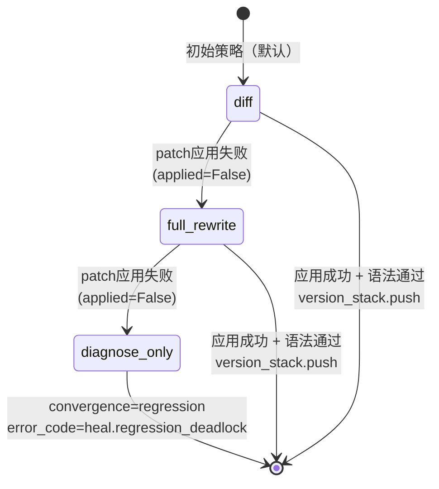
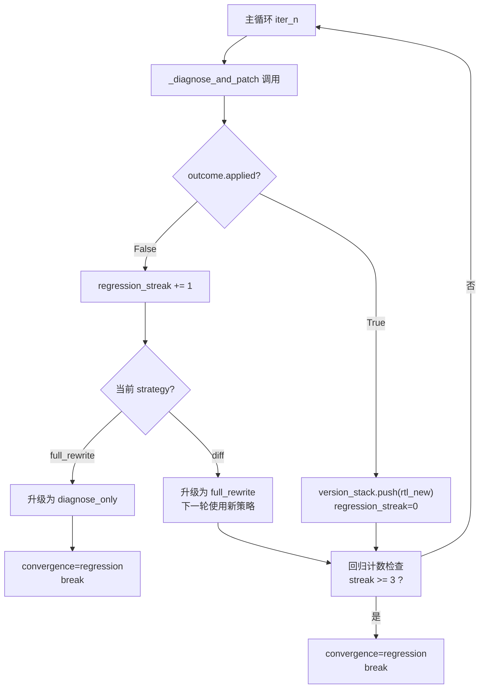

RTL 自修复闭环（组件 B）在每轮迭代中，当综合或仿真未通过时，会进入"诊断 → 生成 patch → 应用 patch → 语法预检"的修复子流程。该子流程的核心设计是一个**写死的策略升级阶梯**：默认从最小改动范围的 `diff` 出发，应用失败即升级到 `full_rewrite`，再失败则降级到 `diagnose_only`（放弃自动修改，仅产出诊断报告）。这一阶梯写死在代码中而非交给 LLM 决策，目的是**降低 LLM 自由度**——防止模型在复杂 RTL 上做出大范围、不可控的结构变更。

Sources: [组件B_自修复闭环.md](../../组件B_自修复闭环.md)

## 策略升级阶梯：总览

三种策略构成一条**单调升级**的有限状态机，每条转移边只在 patch 应用失败（`applied=False`）时触发。升级不可回退——一旦进入 `full_rewrite` 就不可能回到 `diff`，一旦到达 `diagnose_only` 就直接停机。



三策略的核心差异在于**prompt 构造方式**、**patch 提取逻辑**、**patch 应用方式**和**是否调用 LLM**，下表提供了全维度对比：

| 维度 | diff | full_rewrite | diagnose_only |
|------|------|-------------|---------------|
| **LLM 调用** | ✅ 调用 | ✅ 调用 | ❌ 不调用 |
| **Prompt 输入范围** | 出错片段 ±5 行 | 完整 RTL 全文 | N/A |
| **期望输出格式** | unified diff 行 | 完整 .v 文件 | N/A |
| **patch 应用方式** | 替换 `target_lines` 区间 | 整文件替换 | 不应用 |
| **成功校验** | `+` 行存在 + `iverilog -t null` | 含 `module`+`endmodule` + `iverilog -t null` | N/A |
| `patch_source` 值 | `llm_diff` | `llm_full_rewrite` | `none` |
| **失败后果** | 升级到 full_rewrite | 升级到 diagnose_only | convergence=regression |

Sources: [self_heal.py](../../src/eda_agent/skills/self_heal.py#L179-L217), [组件B_自修复闭环.md](../../组件B_自修复闭环.md)

## 策略一：diff —— 局部精确修复

`diff` 是默认入口策略，设计哲学是"最小改动面"。它从诊断器返回的 `root_causes` 中提取行号信息，定位出错代码片段，仅将 **±5 行的局部窗口**喂给 LLM，要求模型输出 unified diff 格式的补丁。

### 行号定位机制

在构造 prompt 之前，系统通过 `_locate_lines` 函数从 `root_causes` 的 `message` 和 `evidence` 字段中抽取行号。该函数内置三组正则模式，适配 yosys 与 iverilog 不同的行号报告风格：

```python
_LINE_PATTERNS: tuple[re.Pattern[str], ...] = (
    re.compile(r":(\d+):\s*\d+"),   # iverilog: file.v:42: 误差列号
    re.compile(r":(\d+):"),          # 通用 file:line:
    re.compile(r"\((\d+)\)"),        # (line)
)
```

命中行号后返回 `(line - 5, line + 5)` 的 1-based 闭区间，作为后续 prompt 片段截取和 patch 应用的定位基准。未命中任何行号模式时返回 `None`，此时 diff 策略退化为将完整 RTL 喂给 LLM（但仍按 diff 策略提取和应用补丁）。

Sources: [self_heal.py](../../src/eda_agent/skills/self_heal.py#L134-L169)

### Prompt 构造

`_build_prompt` 函数在 `strategy == "diff"` 时构造如下消息序列。系统消息固定为"你是 Verilog 修复专家。根据诊断根因修复 RTL，保持模块接口不变。"，用户消息则包含三个关键部分：出错片段、根因 JSON、以及"只改出错行±5 行"的约束指令：

```
[DIFF 策略] 出错片段:
<target_lines区间内的RTL代码>

根因(JSON):[{"message":"...","fix_suggestion":"..."}]

只改出错行±5 行,别动其他。输出 unified diff 补丁(以 --- /+++ /@@ /+- 开头的行)。
```

当 `target_lines` 为 `None`（行号定位失败）时，snippet 直接使用完整 RTL 文本。这段代码中 `target_lines` 是 1-based 闭区间，切片时做了 0-based 转换与边界夹紧处理。

Sources: [self_heal.py](../../src/eda_agent/skills/self_heal.py#L191-L207)

### Patch 提取

`_extract_patch` 函数对 diff 策略的 LLM 响应做行级扫描。它从响应文本中寻找第一个以 `--- ` 或 `@@` 开头的行作为 diff 块起点，然后持续收集以 `---`、`+++`、`@@`、`+`、`-` 开头的行及空行。一旦遇到不符合 diff 语法的普通文本行，立即停止收集。这种"状态机式"提取能容忍 LLM 响应中的前后解释性文本，只截取真正的 unified diff 主体。

Sources: [self_heal.py](../../src/eda_agent/skills/self_heal.py#L229-L247)

### Patch 应用

`_apply_patch` 对 diff 策略采用一种**MVP 简化应用策略**：不解析完整的 unified diff 语法（如 hunk 的 `-/+` 配对、上下文行匹配），而是直接从 patch 中提取所有以 `+` 开头（但不是 `+++`）的行作为新增内容，然后整体替换 `target_lines` 指定的区间：

```python
# diff 策略 MVP: 取 patch 中所有 +/- 之后的纯 Verilog 行,替换 target_lines 区间。
add_lines = [line[1:] for line in patch_text.splitlines()
             if line.startswith("+") and not line.startswith("+++")]
if not has_add:
    return (rtl_text, False)  # 没有有效 + 行 → 未应用
# 区间替换
lines = rtl_text.splitlines()
new_lines = lines[:s] + add_lines + lines[e:]
```

如果没有任何有效的 `+` 行，则 `applied=False`，触发策略升级。当 `target_lines` 为 `None` 时，作为容错策略将 add_lines 追加到 RTL 末尾（实际场景极少走到此分支）。

Sources: [self_heal.py](../../src/eda_agent/skills/self_heal.py#L257-L297)

## 策略二：full_rewrite —— 整文件安全重写

当 diff 策略的 patch 应用失败（无有效 `+` 行或语法预检不通过）后，策略升级为 `full_rewrite`。此时不再约束 LLM 只改局部，而是将**完整 RTL**喂给模型，要求整文件重写。这一策略在两个关键环节与 diff 有本质区别。

### Prompt 构造差异

full_rewrite 的用户消息直接包含完整 RTL 文本，并明确指示"整文件重写，保持模块接口不变。输出完整 .v 文件全文（纯 Verilog，不要 markdown 包裹）"：

```
[FULL_REWRITE 策略] 完整 RTL:
<全部RTL代码>

根因(JSON):[...]

整文件重写,保持模块接口不变。输出完整 .v 文件全文(纯 Verilog,不要 markdown 包裹)。
```

注意，full_rewrite 的 prompt 不使用 `target_lines`——因为重写策略不涉及局部替换，行号定位在此策略中无意义。

Sources: [self_heal.py](../../src/eda_agent/skills/self_heal.py#L208-L215)

### Markdown 围栏剥离

尽管 prompt 要求"不要 markdown 包裹"，LLM 仍可能输出 ```` ```verilog ... ``` ```` 格式的围栏。`_extract_patch` 对 full_rewrite 策略通过 `_FENCE_RE` 正则模式自动剥离围栏：

```python
_FENCE_RE = re.compile(r"```(?:verilog|v|Verilog)?\s*\n(.*?)```", re.DOTALL)
```

该正则匹配 ```` ``` ```` 后可选跟随语言标识（verilog/v/Verilog），然后捕获到下一个 ```` ``` ```` 之间的所有内容。无论 LLM 是否加了围栏，提取结果都是纯 Verilog 文本。提取函数对 full_rewrite 策略恒返回 `is_full_rewrite=True`，这个布尔标志在后续 `_apply_patch` 中决定走整文件替换路径。

Sources: [self_heal.py](../../src/eda_agent/skills/self_heal.py#L220-L254)

### Patch 应用与安全校验

`_apply_patch` 在 `is_full_rewrite=True` 时，执行一个**轻量但关键**的结构完整性检查：只有当 patch 文本同时包含 `module` 和 `endmodule` 关键字时，才视为有效重写并替换全文：

```python
if is_full_rewrite:
    if "module" in patch_text and "endmodule" in patch_text:
        return (patch_text, True)
    return (rtl_text, False)  # 结构不完整 → 拒绝
```

这是一个故意保守的校验——它不做完整的语法解析（那是后续 `_syntax_check` 的职责），但能快速拦截 LLM 返回的纯垃圾文本（如解释性段落、无意义重复），避免将无效内容推入版本栈。测试 `TestPatchExtract.test_full_rewrite_no_fence` 验证了无围栏响应的正确提取，而 `TestApplyPatch.test_full_rewrite_invalid_no_module` 验证了缺乏 `module` 关键字的响应被拒绝。

Sources: [self_heal.py](../../src/eda_agent/skills/self_heal.py#L272-L275), [test_self_heal_skill.py](../../tests/test_self_heal_skill.py#L226-L249)

## 策略三：diagnose_only —— 诊断降级，放弃自动修改

`diagnose_only` 是阶梯终点，意味着"承认当前 LLM 无法产出可用的 patch"。这一策略的语义是**产出诊断报告但不自动修改 RTL**——系统仍然保留了完整的诊断信息（root_causes、fix_suggestion 等），供人工或更高级别系统决策。

### 关键特征：不调用 LLM

`_build_prompt` 在 `strategy == "diagnose_only"` 时直接返回 `None`，这是一个硬性的提前退出：

```python
def _build_prompt(strategy, rtl_text, root_causes, target_lines):
    if strategy == "diagnose_only":
        return None  # 不构造任何 prompt
```

`_diagnose_and_patch` 方法在收到 `messages is None` 时，立即返回一个 `patch_source="none"`、`applied=False` 的 `PatchOutcome`，不消耗任何 LLM token：

```python
messages = _build_prompt(strategy, rtl_text, root_causes, target_lines)
if messages is None:
    return PatchOutcome(
        iter_n=iter_n, diagnose_parsed=diag_parsed,
        patch_source="none", patch_text="",
        applied=False, ...
        rationale="diagnose_only: no patch",
    )
```

这意味着 diagnose_only 的诊断信息仍然来源于 `skill_diagnose` 的调用结果（如果首轮有外部注入的 seed 诊断则直接使用），只是不再尝试修复。

Sources: [self_heal.py](../../src/eda_agent/skills/self_heal.py#L186-L188), [self_heal.py](../../src/eda_agent/skills/self_heal.py#L793-L803)

## 升级流转：主循环中的策略状态机

策略升级并非在 `_diagnose_and_patch` 内部完成，而是在主循环 `run()` 中根据 `PatchOutcome.applied` 的布尔值驱动。以下代码段是整个升级机制的核心控制逻辑：



### 升级映射表的精确实现

主循环中的升级逻辑使用一个 hardcoded 的字典映射，确保阶梯的单调性：

```python
if outcome.applied:
    version_stack.append(rtl_new)
    regression_streak = 0
else:
    regression_streak += 1
    next_strategy = {
        "diff": "full_rewrite",
        "full_rewrite": "diagnose_only",
    }.get(strategy, "diagnose_only")
    if next_strategy == "diagnose_only":
        trajectory.append({"step": "reduced_to_diagnose", "iter": iter_n})
        convergence = "regression"
        break
    strategy = next_strategy
```

当 `next_strategy` 计算结果为 `"diagnose_only"` 时（即从 `full_rewrite` 再失败），循环立即 break 并设置 `convergence="regression"`。同时向 trajectory 追加一条 `"reduced_to_diagnose"` 事件作为审计证据。如果升级目标仍是 `full_rewrite`（从 `diff` 升级），则更新 `strategy` 变量后继续下一轮迭代。

Sources: [self_heal.py](../../src/eda_agent/skills/self_heal.py#L548-L578)

### 双重防退化保护

策略升级之外，主循环还维护两个独立的退化计数器，构成与策略升级并行的停机保护：

- **`regression_streak`**（应用失败计数）：patch 应用失败即 +1，成功则归零。≥3 时触发 `convergence="regression"`。注意，这个计数器在策略升级和 regression 死锁判定中被共用。
- **`num_passed_dropped_streak`**（仿真退化计数）：当 `best_score > 0` 且当前轮 `num_passed < best_score` 时 +1，否则归零。≥3 时同样触发 regression 停机。

这两个计数器独立工作，意味着即使每轮 patch 都成功应用（`regression_streak` 持续归零），但如果仿真通过数连续 3 轮下降，系统仍会主动停机。

Sources: [self_heal.py](../../src/eda_agent/skills/self_heal.py#L508-L578), [组件B_自修复闭环.md](../../组件B_自修复闭环.md)

## 语法预检：iverilog -t null 门控

无论 diff 还是 full_rewrite，patch 应用成功（`applied_ok=True`）后都要经过一道**语法预检**才最终判定 `applied=True`。这是版本栈的最后一道防线，防止语法错误的 RTL 进入迭代链。`_syntax_check` 方法将新 RTL 写入临时文件，然后调用 `iverilog -t null`（仅语法分析，不生成任何输出）：

```python
cmd = ["wsl.exe", "-d", "Ubuntu-24.04", "-e",
       settings.eda.iverilog_cmd, "-t", "null",
       "-o", "/dev/null", wsl_path]
# 或本机直跑:
cmd = [settings.eda.iverilog_cmd, "-t", "null",
       "-o", os.devnull, tmp_path]
r = subprocess.run(cmd, capture_output=True, text=True, timeout=timeout)
return r.returncode == 0
```

返回值为 0 即语法通过。`_diagnose_and_patch` 中只有 `applied_ok and syntax_ok` 同时为 True 时，才会将 `rtl_new` 写入 `snap_dir/rtl_snapshot.v` 和 `snap_dir/rtl_patch.diff`，并返回 `applied=True` 的 `PatchOutcome`。语法预检失败时返回的 `PatchOutcome` 仍记录 `patch_source`（最后一次尝试的来源），但 `applied=False`，触发主循环的策略升级逻辑。

Sources: [self_heal.py](../../src/eda_agent/skills/self_heal.py#L823-L900)

## patch_source 的追踪语义

`PatchOutcome.patch_source` 的取值遵循一个重要契约语义：它记录的是**最后一次 LLM 调用的策略来源**，而不仅仅是成功应用的来源。这意味着：

- 即使 LLM 被调用但 patch 应用失败，`patch_source` 仍为 `llm_diff` 或 `llm_full_rewrite`（取决于当时使用的策略）
- 只有在 diagnose_only（不调 LLM）或全程未触发 patch 流程时，`patch_source` 才为 `"none"`

主循环通过 `last_patch_source` 变量追踪，只要 `outcome.patch_source != "none"` 就更新该变量。最终 `SkillResult.patch_source` 携带这个值，供上层 CPlanner 判定迭代是否真正使用了 LLM 智能。测试 `TestPatchSourceOnFailure` 明确验证了"LLM patch 应用成功但仿真仍失败"时 `patch_source` 必须为非 `none` 值的契约。

Sources: [self_heal.py](../../src/eda_agent/skills/self_heal.py#L536-L537), [test_self_heal_skill.py](../../tests/test_self_heal_skill.py#L543-L602)

## 测试验证矩阵

测试套件通过精心设计的 FakeLLM 和 ScriptedTool 组合，完整覆盖了三策略升级阶梯的各条路径：

| 测试类 | LLM 注入 | 预期路径 | 验证点 |
|--------|---------|---------|--------|
| `TestPatchExtract` | N/A（纯函数） | diff 提取 + full_rewrite 提取 | unified diff 行提取、markdown 围栏剥离 |
| `TestApplyPatch` | N/A（纯函数） | diff 替换 + full_rewrite 替换 | 区间替换保留区间外行、`module` 关键字校验 |
| `TestRegressionDeadlock` | 3 轮全垃圾文本 | diff→full_rewrite→diagnose_only | convergence=regression、trajectory 含 `reduced_to_diagnose` |
| `TestPatchSourceOnFailure` | 合法 full_rewrite 但 sim 仍挂 | 应用了 patch，patch_source 非 none | applied=True 时 source 记录正确 |
| `TestRollbackVersionStack` | 3 轮全垃圾文本 | diff→full_rewrite→diagnose_only | best/rtl.v 保留原始 RTL（版本栈未 push） |
| `test_e2e_run_pass` | full_rewrite 修复文本 | counter_bitwidth → all_pass | 真 EDA 工具 + FakeLLM 端到端验证 |

其中 `TestRegressionDeadlock.test_three_strategy_escalation_to_regression` 是三策略阶梯最完整的端到端验证：它注入三段垃圾 LLM 响应（`["garbage1", "garbage2", "garbage3"]`），断言 diff 策略升级到 full_rewrite 再到 diagnose_only，最终 convergence 为 `regression`，error_code 为 `HEAL_REGRESSION_DEADLOCK`，且 trajectory 中包含 `"reduced_to_diagnose"` 步骤。

Sources: [test_self_heal_skill.py](../../tests/test_self_heal_skill.py#L476-L540), [test_self_heal_skill.py](../../tests/test_self_heal_skill.py#L605-L670)

## 工件产出与策略审计

三策略的执行过程在工件存储层留下完整轨迹。每轮迭代的 `snap_dir`（`runs/<run_id>/self_heal/iter_<n>/`）下，当 patch 应用成功时包含两个文件：

- `rtl_snapshot.v`：应用 patch 后的新 RTL 全文
- `rtl_patch.diff`：LLM 产出的 patch 原文（diff 格式或 full_rewrite 全文）

收尾阶段，`best/meta.json` 记录最佳迭代的 `num_passed`、`best_iter`、`convergence_cause` 和 `candidates_at_best_score`。即使 convergence 为 `regression`（三策略全部耗尽），系统仍会落盘 best 快照和 report.md——此时 `best_iter=-1`，best/rtl.v 写入原始 RTL，meta.json 标记 `convergence_cause=regression`。`report.md` 中逐迭代展示 strategy、applied、source 等审计字段，使整个策略升级过程完全可追溯。

Sources: [self_heal.py](../../src/eda_agent/skills/self_heal.py#L829-L847), [self_heal.py](../../src/eda_agent/skills/self_heal.py#L587-L607), [组件B_自修复闭环.md](../../组件B_自修复闭环.md)

## 设计决策：为何写死阶梯而非让 LLM 自选策略

三策略升级阶梯被刻意写死为代码中的字典映射，而非设计为一个让 LLM 自主决策"用哪种策略"的 meta-prompt。这一设计决策基于三个考量：

1. **降低 token 消耗**：如果让 LLM 先决策策略再生成 patch，每次迭代需要两次 LLM 调用。写死阶梯只需一次调用（diagnose_only 甚至零次）。
2. **消除决策不确定性**：LLM 在"选择策略"这一 meta 层面的表现不稳定，而"从精确到宽泛"是人类调试 RTL 的自然认知顺序，不需要模型重新发明。
3. **可审计性**：固定阶梯使策略升级路径完全可预测——给定相同的输入序列，升级轨迹必然一致。这对实验复现和实验复现的可信度至关重要。

Sources: [组件B_自修复闭环.md](../../组件B_自修复闭环.md)

---

**延伸阅读**：

- [RTL 自修复闭环（组件 B）：综合-仿真-诊断-Patch 迭代](15_RTL自修复闭环组件B.md) — 自修复闭环的主循环全貌
- [版本栈回退与防退化机制](17_版本栈回退与防退化机制.md) — version_stack 与 regression_streak 的深度解析
- [EDA 诊断器（组件 A）：规则层与 LLM 归因](14_EDA诊断器组件A规则层.md) — root_causes 与 fix_suggestion 如何驱动 patch prompt
- [Skill 到 Tool 的适配层与 reserved 字段拆包](18_Skill到Tool适配层.md) — SkillResult.patch_source 如何映射到 ToolResult.parsed