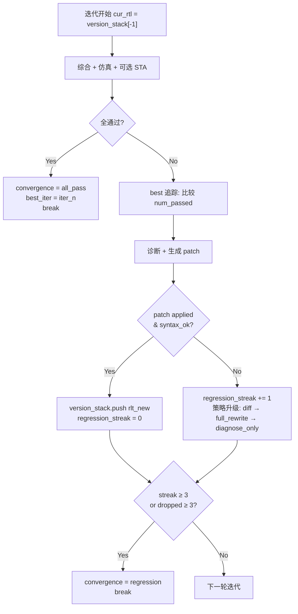

RTL 自修复闭环（组件 B）在迭代式修复过程中面临一个核心风险：**LLM 生成的 patch 可能让 RTL 质量变得比修复前更差**。版本栈（version_stack）与防退化（anti-degradation）机制正是为控制这一风险而设计——它以 `num_passed`（通过测试数）为唯一质量标尺，追踪历史最佳版本，在 patch 失败或质量回退时自动收束，确保最终输出的 RTL 永远不低于输入时的基线水平。本页深入解析该机制的数据结构、判定逻辑、收束路径与上层编排器（CPlanner）的联动方式。

## 版本栈的核心数据结构

版本栈的本质是一个内存中的 `list[str]`，每个元素是一份完整的 RTL 文本。它在 `SelfHealSkill.run()` 方法入口处初始化，随迭代过程动态增长。

初始化阶段将原始 RTL 读取后，同时写入 `iter_0/rtl_snapshot.v` 作为第 0 轮基准快照，并将该文本推入栈底。此后每一轮迭代的起始，主循环都通过 `version_stack[-1]` 取当前版本作为本轮综合与仿真的输入。这种设计保证了**栈顶永远是最新合法版本**，而栈底始终锚定原始 RTL。

与版本栈并行运行的是一组追踪变量，构成了防退化判定的数据底座：

| 变量 | 类型 | 初始值 | 语义 |
|------|------|--------|------|
| `version_stack` | `list[str]` | `[rtl_text]` | 栈顶为当前 RTL；patch 成功才 push |
| `best_iter` | `int` | `-1` | 历史最佳轮索引；`-1` = 无任何轮通过仿真 |
| `best_score` | `int` | `-1` | 历史最高 `num_passed` 值 |
| `best_rtl_text` | `str` | 原始 RTL | 最佳版本 RTL 全文，最终落 `best/rtl.v` |
| `candidates_at_best` | `int` | `0` | 达到 `best_score` 的迭代轮数计数 |
| `regression_streak` | `int` | `0` | 连续 patch 应用失败计数；≥3 触发死锁 |
| `num_passed_dropped_streak` | `int` | `0` | 连续 `num_passed` 下降计数；≥3 触发死锁 |

Sources: [self_heal.py](../../src/eda_agent/skills/self_heal.py#L405-L426)

## 主循环中的版本栈推进逻辑

每轮迭代遵循固定的三阶段流水线——**综合（yosys_synth）→ 仿真（iverilog_sim）→ 可选 STA（opensta_timing）**——然后进入诊断与 patch 环节。版本栈的 push/push-not 逻辑嵌入在 patch 判定之后，是防退化机制的执行核心。



关键设计决策在于 push 条件：只有当 `_diagnose_and_patch` 返回 `outcome.applied = True` 时，新 RTL 才被推入栈。`applied = True` 需要同时满足两个条件——patch 文本成功应用（包含有效 Verilog 内容）**以及** `_syntax_check` 通过（iverilog `-t null` 语法预检）。任一条件不满足，`version_stack` 保持不变，下一轮继续对同一份 RTL 重试，这构成了**隐式回退**语义。

Sources: [self_heal.py](../../src/eda_agent/skills/self_heal.py#L428-L578), [self_heal.py](../../src/eda_agent/skills/self_heal.py#L824-L859)

## best 追踪与平局计数

当某轮迭代未通过全部门槛但产生了仿真数据时，系统以 `num_passed`（通过测试数）为评分函数，执行 best 追踪。这一追踪贯穿整个循环，确保即使最终未能收敛到 `all_pass`，最终产物仍是历史最佳 RTL 而非最后一轮的退化版本。

best 追踪的判定逻辑分三个分支：

**严格提升**（`num_passed > best_score and num_passed > 0`）：更新 `best_score`、`best_iter`、`best_rtl_text`，重置 `candidates_at_best = 1`。这标志着发现了一个更优的修复方向。

**平局**（`num_passed == best_score and num_passed > 0`）：仅 `candidates_at_best += 1`，其余字段不变。平局计数的目的是为实验复现提供 tie-break 复核信息——当多条路径达到相同分数时，`candidates_at_best` 告诉评估者有多少轮次达到了同一水平。

**退化检测**（`best_score > 0 and num_passed < best_score`）：触发 `num_passed_dropped_streak += 1`。这是防退化的第一道防线——连续三轮退化将强制收束。

Sources: [self_heal.py](../../src/eda_agent/skills/self_heal.py#L508-L519)

## 三重防退化收束触发器

系统设计了三个相互独立的收束触发器，各自保护不同维度的退化风险：

### 触发器一：策略升级耗尽（Strategy Escalation Exhaustion）

LLM patch 施加采用**三策略递进**设计：`diff`（局部行替换）→ `full_rewrite`（整文件重写）→ `diagnose_only`（仅诊断不改）。每当一轮 patch `applied = False`，策略自动升级一级。当策略已到达 `diagnose_only` 仍无法产生有效 patch 时，系统认定 LLM 已无有效修复手段，立即设置 `convergence = "regression"` 并 break。

这一升级路径在 trajectory 中留下 `reduced_to_diagnose` 事件标记，供审计追溯。对应的错误码为 `heal.reduced_to_diagnose`（severity=info），语义是"防退化降级：本 run 只产出诊断报告，不自动改"。

Sources: [self_heal.py](../../src/eda_agent/skills/self_heal.py#L561-L574), [errors.py](../../src/eda_agent/errors.py#L53-L59)

### 触发器二：连续 Patch 失败死锁（regression_streak ≥ 3）

`regression_streak` 计数器追踪连续的 patch 应用失败（`applied = False`）次数。当连续三次失败时，说明当前策略序列下 LLM 无法产出可用的修复——即使 diff 和 full_rewrite 都试过了——继续迭代只会浪费预算。此时 `convergence` 设为 `"regression"` 并立即 break。

每当一轮 patch 成功应用（`applied = True`），`regression_streak` 被重置为 0，给予系统新的尝试机会。

Sources: [self_heal.py](../../src/eda_agent/skills/self_heal.py#L548-L560), [self_heal.py](../../src/eda_agent/skills/self_heal.py#L576-L578)

### 触发器三：通过率连续退化（num_passed_dropped_streak ≥ 3）

`num_passed_dropped_streak` 追踪连续轮次中 `num_passed` 低于历史最佳 `best_score` 的情况。即使 patch 成功应用且通过语法检查，如果修复后的 RTL 在仿真中通过测试数持续下降——说明 LLM 的修改方向是错的——系统也将在连续三次退化后收束。

这个触发器与触发器二的区别在于：触发器二捕捉的是"patch 产出阶段就失败"，触发器三捕捉的是"patch 产出成功但质量倒退"——后者更为隐蔽，因为应用了语法合法的 patch 却让设计质量恶化。

Sources: [self_heal.py](../../src/eda_agent/skills/self_heal.py#L509-L513), [self_heal.py](../../src/eda_agent/skills/self_heal.py#L576-L578)

## 收敛终态与 SkillResult 映射

主循环结束后（无论是 break 还是 `max_iter` 自然耗尽），系统进入收尾阶段。首先确定 `convergence_cause` 的最终值——如果循环自然结束且之前未被设为其他值，则为 `"max_iter"`（有 `best_iter >= 0`）或 `"none"`（从未有任何轮通过仿真）。

五种收敛终态的完整映射关系如下：

| convergence_cause | SkillResult.status | error_code | 语义 |
|-------------------|--------------------|------------|------|
| `all_pass` | `ok` | `None` | 综合通过 + 仿真通过 + STA（若需要）通过 |
| `max_iter` | `error` | `heal.regression_deadlock` | 迭代上限耗尽，未收敛 |
| `regression` | `error` | `heal.regression_deadlock` | 防退化触发器收束 |
| `budget` | `budget_exhausted` | `eda.budget_exhausted` | 时间预算耗尽 |
| `none` | `error` | `heal.regression_deadlock` | 无任何轮通过仿真 |

收尾阶段始终落盘三个工件：`best/rtl.v`（`best_rtl_text` 全文）、`best/meta.json`（含 `best_iter`、`num_passed`、`convergence_cause`、`candidates_at_best_score`）和 `report.md`（含完整 trajectory）。即使最终未能收敛，`best_rtl_text` 仍保证是历史最佳版本。

Sources: [self_heal.py](../../src/eda_agent/skills/self_heal.py#L584-L660), [errors.py](../../src/eda_agent/errors.py#L52-L59)

## 每轮快照与工件目录结构

版本栈本身存在于内存，但每一轮的 RTL 快照与 patch diff 都以文件形式落盘到磁盘，为事后审计与版本间 diff 提供物理证据。目录结构严格遵循契约 §2.4 的权威定义：

```
runs/<run_id>/self_heal/
    iter_0/
        rtl_snapshot.v     # 原始 RTL（回退基准）
        rtl_patch.diff     # None（初始轮无 patch）
    iter_1/
        rtl_snapshot.v     # 第 1 轮当前 RTL
        rtl_patch.diff     # 该轮 LLM 产出的 patch 文本
    iter_2/
        ...
    best/
        rtl.v              # best_rtl_text（历史最佳版本）
        meta.json          # {best_iter, num_passed, convergence_cause, candidates_at_best_score}
    report.md              # 人类可读报告（含 trajectory）
```

`iter_0` 的 `rtl_snapshot.v` 具有特殊地位——它是版本栈的栈底锚点，也是所有回退操作的最终安全网。每轮的 `rtl_snap_path` 在循环开始时写入 `cur_rtl`（即 `version_stack[-1]`），patch 应用成功后被 `_diagnose_and_patch` 覆写为 `rtl_new`，这样下一轮的 `rtl_snap_path.write_text(cur_rtl)` 记录的就是更新后的版本。

Sources: [self_heal.py](../../src/eda_agent/skills/self_heal.py#L407-L438), [self_heal.py](../../src/eda_agent/skills/self_heal.py#L587-L647), [CONTRACTS.md](../../CONTRACTS.md)

## CPlanner 对回归结果的处理

当 `skill_self_heal` 作为 Tool 被 CPlanner 调用后，CPlanner 的 `_reflect` 方法解析返回的 `parsed` 字段，执行两层联动：

**convergence == "all_pass"**：CPlanner 设置 `state.pending_self_heal_all_pass = True`，记录 `state.best_rtl_ref`（即 `fixed_rtl_ref`），但**不立即**设置 `goal_achieved`。它会在 `_rule_after_reflect` 中注入一个独立的 `iverilog_sim` 验证步，用 `best_rtl_ref` 指向的修复后 RTL 重新跑仿真。只有当独立验证也通过时，才设置 `state.goal_achieved = True`。这是契约 §2.3 v1.2 的硬规则——"B 报 all_pass 后强制追加独立 iverilog_sim 验证步"。

**convergence != "all_pass"**（含 regression / max_iter / budget / none）：CPlanner 不设 `pending_self_heal_all_pass`，`best_rtl_ref` 保持 `None`，整个 run 以 `failed` 或 `budget_exhausted` 状态收尾。但 B 仍然产出了 `best/rtl.v` 和 `report.md`，这些工件通过 `SkillResult.artifacts` 暴露给 CPlanner，可供后续分析。

CPlanner 的 `_build_metrics` 方法从 heal_parsed 中提取 `convergence_cause` 和 `best_iter`，最终写入 `experiment_manifest.json` 的 `self_heal_convergence` 和 `self_heal_best_iter` 字段，供跨 run 实验对比使用。

Sources: [c_planner.py](../../src/eda_agent/planner/c_planner.py#L454-L493), [c_planner.py](../../src/eda_agent/planner/c_planner.py#L660-L757)

## 单元测试验证矩阵

版本栈回退与防退化机制有完整的单元测试覆盖，核心场景如下表所示：

| 测试类 | 场景 | 关键断言 |
|--------|------|----------|
| `TestRollbackVersionStack` | LLM 始终给垃圾 → patch 全 applied=False | `convergence=regression`；`best/rtl.v` 等于原始 RTL（版本栈未推进） |
| `TestRegressionDeadlock` | LLM 垃圾 → diff→full_rewrite→diagnose_only | `convergence=regression`；trajectory 含 `reduced_to_diagnose` |
| `TestBestIterTiebreak` | 多轮 `num_passed=2` 不收敛 | `candidates_at_best_score ≥ 2`（平局计数累加） |
| `TestPatchSourceOnFailure` | LLM 合法 patch 但 sim 仍失败 | `patch_source ∈ (llm_full_rewrite, llm_diff)`（非 none） |
| `TestBudgetExhausted` | `budget_s=0.0` | `convergence=budget`；`status=budget_exhausted` |
| `TestConsumeSeedDiagnose` | 首轮即 all_pass + seed | `convergence=all_pass`；diagnose 未被调用 |

`TestRollbackVersionStack` 是版本栈机制最直接的验证：当所有 patch 都 applied=False 时，`best_rtl_text` 始终保留为原始 RTL（版本栈从未 push），最终落盘的 `best/rtl.v` 与输入文件内容完全一致。这证明了**防退化机制的底线保证——修复失败时，用户拿回的 RTL 至少与输入同等质量**。

Sources: [test_self_heal_skill.py](../../tests/test_self_heal_skill.py#L605-L671), [test_self_heal_skill.py](../../tests/test_self_heal_skill.py#L476-L541)

## 进一步阅读

- [三策略 LLM Patch：diff / full_rewrite / diagnose_only](16_三策略LLMPatch.md) —— 详细解析三策略的 prompt 构造、patch 提取与应用逻辑
- [RTL 自修复闭环（组件 B）：综合-仿真-诊断-Patch 迭代](15_RTL自修复闭环组件B.md) —— 组件 B 的全貌与闭环流程
- [双层预算仲裁与迭代上限保护](13_双层预算仲裁与迭代上限.md) —— budget 收束路径如何与版本栈回退协同
- [独立验证步：B 报 all_pass 后的第三方校验](12_独立验证步第三方校验.md) —— CPlanner 如何对 B 的 all_pass 结果做二次校验
- [RunRecord 落盘与完整轨迹追溯](25_RunRecord落盘轨迹追溯.md) —— 每轮快照与 StepRecord 的隶属关系