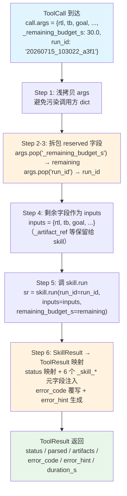
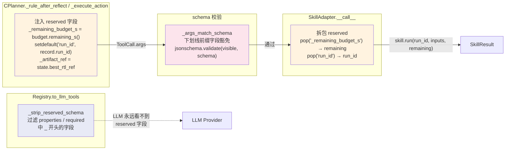

在五层分层架构中，L2 的两个 Skill（A 诊断器 `skill_diagnose`、B 自修复 `skill_self_heal`）是能够内部迭代、组合多个 L1 Tool 的高级能力。但 L4 的 CPlanner 和 L3 的 ToolRegistry 只认一个统一接口——`Tool Protocol`（`name` / `description` / `schema` / `__call__`）。**`as_tool` 适配层就是跨越这一抽象鸿沟的桥梁**：它把任意 `Skill` 包装成 `Tool`，同时负责 reserved 字段（`_remaining_budget_s` / `run_id`）的拆包下传、`SkillResult → ToolResult` 的语义映射，以及六个 `_skill_*` 元字段的注入。本页深入解析这条适配管道的全貌——从契约定义到运行时拆包，从 schema 透传到 LLM 可见性剥离。

## as_tool 适配层的契约定位

CONTRACTS.md §2.3 明确规定了 `as_tool` 的适配契约。设计原则是：Skill 对外注册为 Tool（走 §2.1 的 `Tool` 接口），对内继承 `Skill` 基类以复用迭代控制、预算管理、子 run 落盘逻辑。`as_tool` 是两者的缝合点。

实现文件 `skills/base.py` 的模块文档直接引用了契约行号（§2.3, contracts.py 行 152-159 权威注释），并声明了一条硬规则：**不在适配层重定义任何契约类型**——`Skill` / `SkillResult` / `Tool` / `ToolCall` / `ToolResult` / `artifact_ref` / `CONTRACT_VERSION` 一律 `from eda_agent.contracts import`，满足验收 C2 的"单一来源"要求。

Sources: [CONTRACTS.md](../../CONTRACTS.md), [base.py](../../src/eda_agent/skills/base.py#L1-L9)

## SkillAdapter：适配层的唯一实现类

`SkillAdapter` 是 `skills/base.py` 中的核心类，持有原始 `Skill` 实例的引用，实现 `Tool Protocol` 的全部四个成员。公开工厂函数 `as_tool(skill)` 返回 `SkillAdapter(skill)`，该实例通过 Python 的 `runtime_checkable` 协议满足 `isinstance(t, Tool)` 检查。

```python
class SkillAdapter:
    def __init__(self, skill: Skill) -> None:
        self._skill = skill

    @property
    def name(self) -> str:
        return self._skill.name          # 透传 skill.name

    @property
    def description(self) -> str:
        return self._skill.description   # 透传 skill.description

    @property
    def schema(self) -> dict[str, Any]:
        own = getattr(self._skill, "schema", None)
        if own:
            return own                   # 优先用 skill 自带 schema
        return {                         # 兜底：构造最小空 schema
            "name": self._skill.name,
            "description": self._skill.description,
            "input_schema": {"type": "object", "properties": {}},
        }
```

**schema 透传策略**是适配层的一个关键设计决策：`SkillAdapter.schema` 不做任何过滤，原样透传 skill 自带的 schema（其中可能包含 reserved 字段）。reserved 字段的剥离职责归属 `registry.to_llm_tools` 的 `_strip_reserved_schema`，避免"适配层过滤一次、registry 再过滤一次"的双处维护问题。当 skill 没有 `schema` 属性时（如测试中的 Fake Skill），适配器回退到最小空 schema。

Sources: [base.py](../../src/eda_agent/skills/base.py#L24-L59), [\_\_init\_\_.py](../../src/eda_agent/skills/__init__.py#L1-L10)

## __call__ 的六步拆包流水线

`SkillAdapter.__call__` 是整个适配层最核心的方法。它接收 `ToolCall`（CPlanner 构造），输出 `ToolResult`（回灌 CPlanner），中间完成 reserved 字段拆包、skill 调用、结果映射三件事。以下用流程图展示完整的六步管道：



**拆包的本质**是类型转换：`ToolCall.args` 是一个扁平 dict，CPlanner 把 reserved 字段混入其中（通过 `dict.update` 或 `setdefault`）。`SkillAdapter.__call__` 在调用 `skill.run` 之前，用 `args.pop("_remaining_budget_s", None)` 和 `args.pop("run_id", None)` 把它们从扁平 dict 中取出，映射到 `Skill.run` 的命名参数。剩余的 key-value 对原封不动作为 `inputs` dict 下传给 skill。

值得注意的是 **`_artifact_ref` 字段不被 as_tool 拆包**。这是因为它由 CPlanner 的 `_resolve_args` 在调用 `tool(call)` 之前就已解析完毕（把 `ARTIFACT_FROM_STATE` 占位符替换为实际文件路径），到达 `as_tool.__call__` 时该字段已经不存在或已被消费。as_tool 的拆包特权仅限于 `_remaining_budget_s` 与 `run_id`。

Sources: [base.py](../../src/eda_agent/skills/base.py#L62-L107)

## SkillResult → ToolResult 映射表

Step 6 是适配层最复杂的映射逻辑。`SkillResult` 有 10 个字段，`ToolResult` 有 10 个字段，但两者的语义模型不同——`SkillResult` 携带迭代语义（`iterations`、`convergence_cause`、`best_iter`），`ToolResult` 只有三态 status 和扁平 parsed。映射规则如下表：

| SkillResult 字段 | 映射规则 | ToolResult 字段 | 说明 |
|---|---|---|---|
| `status: "ok"` | 直接映射 | `status = "ok"` | ok 保持 |
| `status: "error"` | 直接映射 | `status = "error"` | error 保持 |
| `status: "budget_exhausted"` | **降级为 error** | `status = "error"` | ToolResult 只有 ok/error/timeout 三态 |
| `error_code: None` + status=`budget_exhausted` | **覆写** | `error_code = "eda.budget_exhausted"` | 即使原 error_code 为 None 也强制覆写 |
| `error_code: "heal.regression_deadlock"` + status=`error` | 透传 | `error_code = "heal.regression_deadlock"` | 非 budget 场景原样透传 |
| `final_parsed` | 浅拷贝 + 补 6 字段 | `parsed` | 不覆盖已有 `_schema` |
| `artifacts` | `list(sr.artifacts)` | `artifacts` | 元素已是 `artifact_ref()` 形状 |
| `budget_used_s` | 直接取 | `duration_s` | skill 无子进程，无 exit_code/stdout/stderr |
| — | 恒 None | `exit_code` | skill 不产生子进程退出码 |
| — | 恒空串 | `stdout` / `stderr` | skill 无子进程输出 |

**六个 `_skill_*` 元字段**是适配层注入的"智能证据"，让 CPlanner 在只看 `ToolResult.parsed` 的情况下也能获取 skill 的内部迭代细节：

| 注入字段 | 来源 SkillResult 字段 | 语义 |
|---|---|---|
| `parsed["_skill_status"]` | `sr.status` | 原始三态（含 `budget_exhausted`，未被 status 降级覆盖） |
| `parsed["_skill_iterations"]` | `sr.iterations` | 实际迭代轮数（A 恒 1，B 由 settings 注入） |
| `parsed["_skill_trajectory"]` | `sr.trajectory` | 每步 `{"step", "status", "iter", "detail"}` 列表 |
| `parsed["_skill_patch_source"]` | `sr.patch_source` | `llm_full_rewrite` / `llm_diff` / `rule_based` / `none` |
| `parsed["_skill_convergence_cause"]` | `sr.convergence_cause` | `all_pass` / `max_iter` / `regression` / `budget` / `none` |
| `parsed["_skill_best_iter"]` | `sr.best_iter` | 历史最佳轮；-1 = 无任何轮通过仿真 |

CPlanner 的 `_reflect` 方法正是通过读取这些 `_skill_*` 元字段来判断 skill 的执行结果（如 `p.get("_skill_convergence_cause") == "all_pass"` 触发独立验证步），而非依赖 `ToolResult.status` 的粗粒度三态。

**error_hint 的生成条件**：当 `error_code is not None` 或 `sr.status != "ok"` 时，生成一句话提示 `f"skill {self._skill.name} status={sr.status}"`，便于 LLM 和日志快速追溯失败原因。ok 状态下 `error_hint` 为 None。

Sources: [base.py](../../src/eda_agent/skills/base.py#L73-L107), [contracts.py](../../src/eda_agent/contracts.py#L116-L159)

## reserved 字段的完整生命周期

reserved 字段不是孤立存在的——它们从 CPlanner 注入、经 ToolCall 传递、在 `as_tool.__call__` 拆包、在 schema 校验时豁免、在 LLM 可见 schema 中剥离。理解这条完整生命周期是掌握适配层的关键。



### 注入端：CPlanner

CPlanner 在两处注入 reserved 字段。第一处是 `_rule_after_reflect` 中构造 `skill_self_heal` 的 Action 时，把 `budget.remaining_s()` 直接写进 args：

```python
return Action(
    "skill_self_heal",
    {
        "rtl": state.rtl_path,
        "tb": state.tb_path,
        "diagnose": state.last_diagnose,
        "max_iter": state.max_iter,
        "goal": state.goal,
        "lib": state.lib_path,
        "clock": state.clock_name,
        "top_module": state.top_module,
        "_remaining_budget_s": budget.remaining_s(),   # ← reserved 注入
    },
    "自修复",
)
```

第二处是 `_verify_after_self_heal` 中构造独立验证步的 Action 时，注入 `_artifact_ref` 用于把 B 的 `best/rtl.v` 路径注入到 `iverilog_sim` 的 `rtl` 参数。

第三处——也是最关键的——在 `_execute_action` 中，通过 `resolved_args.setdefault("run_id", record.run_id)` 为**所有 Tool 调用**（不限于 skill）统一注入父 `run_id`。`setdefault` 的语义是"不覆盖"：如果上游（LLM 或 rule）已传入 `run_id`，则保留原值。

### 拆包端：SkillAdapter.__call__

到达 `as_tool.__call__` 时，`call.args` 可能包含 `_remaining_budget_s` 和 `run_id`（由 CPlanner 注入），也可能不包含（如测试中直接构造 ToolCall 的场景）。`pop` 方法带默认值 `None`，确保不传时也不抛异常。

### 校验端：CPlanner._args_match_schema

CPlanner 在调用 `tool(call)` 之前做 jsonschema 校验，但对下划线前缀字段**豁免**：

```python
def _args_match_schema(self, args, schema) -> bool:
    visible = {k: v for k, v in args.items() if not k.startswith("_")}
    # ...只校验 visible...
```

这意味着 `_remaining_budget_s` 和 `_artifact_ref` 即便出现在 args 中，也不会因不在 schema 的 required 列表中而校验失败。

### LLM 可见性剥离：registry.to_llm_tools → _strip_reserved_schema

当 CPlanner 把工具列表发给 LLM Provider 时，`to_llm_tools` 调用 `_strip_reserved_schema`，从 `properties` 和 `required` 两个键中移除所有以 `_` 开头的字段：

```python
def _strip_reserved_schema(schema):
    out = dict(schema)
    props = schema.get("properties")
    if isinstance(props, dict):
        out["properties"] = {k: v for k, v in props.items() if not k.startswith("_")}
    required = schema.get("required")
    if isinstance(required, list):
        out["required"] = [r for r in required if not str(r).startswith("_")]
    return out
```

这保证了 LLM 在 tool-use 决策时永远不会"看到"或尝试填充 reserved 字段。

Sources: [c_planner.py](../../src/eda_agent/planner/c_planner.py#L299-L380), [registry.py](../../src/eda_agent/registry.py#L57-L93), [base.py](../../src/eda_agent/skills/base.py#L62-L69)

## 两个 Skill 的 schema 声明对比

每个 Skill 在自己的类定义中声明 args schema，`as_tool` 透传给 Registry。两个 Skill 的 schema 字段集有明显差异：

| 维度 | skill_diagnose | skill_self_heal |
|---|---|---|
| **业务字段** | `tool_results`（array） | `rtl`, `tb`, `diagnose`, `max_iter`, `goal`, `lib`, `clock`, `top_module`（8 字段） |
| **reserved 字段** | `_remaining_budget_s` | `_remaining_budget_s` |
| **隐含 reserved** | `run_id`（由 as_tool 拆包，不在 schema 中声明） | `run_id`（同上） |
| **required** | `["tool_results"]` | `["rtl", "tb", "max_iter", "goal"]` |
| **max_iterations** | 1（恒定，不迭代） | settings.skill_max_iterations（默认 5） |
| **budget_s** | settings.skill_diagnose_budget_s | settings.skill_self_heal_budget_s |

**`run_id` 不出现在任何 Skill 的 schema properties 中**，但它在运行时一定存在于 `ToolCall.args`（由 CPlanner 的 `setdefault` 保证）。这是一个刻意的设计：`run_id` 是进程级上下文，由 CPlanner 统一注入，不应暴露给 LLM 或写进校验 schema。`as_tool` 只负责把它从 args 中 pop 出来传给 `skill.run`。

self_heal 的 args schema 共 9 个 properties（8 业务 + 1 reserved `_remaining_budget_s`），这是 CONTRACTS.md v1.2 的扩展结果——v1.1 只有 `{rtl, tb}` 两字段，导致 `goal`/`lib`/`clock` 等参数永不触发的死路。测试 `test_self_heal_as_tool_schema.py` 精确断言了这 9 个字段的存在。

Sources: [diagnose.py](../../src/eda_agent/skills/diagnose.py#L557-L569), [self_heal.py](../../src/eda_agent/skills/self_heal.py#L342-L360), [test_self_heal_as_tool_schema.py](../../tests/test_self_heal_as_tool_schema.py#L31-L41)

## 预算传递的 None vs 0.0 陷阱

reserved 字段 `_remaining_budget_s` 的拆包不仅仅是取出值——还涉及一个微妙的语义区分。`SkillAdapter.__call__` 把 `pop` 出来的值（可能是 `None` 或具体浮点数）直接传给 `skill.run(remaining_budget_s=remaining)`。两个 Skill 在 `run` 方法中对这个值采用**完全相同**的处理逻辑：

```python
# None 表示"用我自己的 budget_s"；具体数值（含 0.0）表示"就这么多预算"
if remaining_budget_s is None:
    budget = self.budget_s
else:
    budget = min(self.budget_s, max(0.0, float(remaining_budget_s)))
```

**为什么不能用 `remaining_budget_s or self.budget_s`？** 因为 Python 中 `0.0` 是 falsy。如果 CPlanner 下传 `0.0` 表示"无剩余预算"（应跳过 LLM 调用、立即 budget 收敛），但 `0.0 or self.budget_s` 会因短路求值回退到 `self.budget_s`（如 60 秒），违反双层预算仲裁的语义。这个陷阱在 `diagnose.py` 和 `self_heal.py` 中都有显式注释标注（行 579-585 与行 370-377），是代码考古中的关键防回归知识点。

Sources: [diagnose.py](../../src/eda_agent/skills/diagnose.py#L578-L586), [self_heal.py](../../src/eda_agent/skills/self_heal.py#L369-L377)

## 注册流程：bootstrap.py 中的 as_tool 调用

`build_registry` 工厂函数负责在进程启动时把所有 Tool 注册进 ToolRegistry。L1 EDA Tool（Yosys / iverilog / OpenSTA）直接注册；L2 Skill 则先经 `as_tool` 包装再注册：

```python
# A 诊断器
diag = DiagnoseSkill(kb=ErrorKB.load(settings.error_kb_path), llm=provider, ...)
registry.register(ToolEntry(
    tool=as_tool(diag),           # ← SkillAdapter 包装
    name="skill_diagnose",
    category="skill",
    schema=diag.schema["input_schema"],
    parsed_schema_ref={"name": "skill_diagnose", "version": "0.1.0"},
))

# B 自修复（必须在 diag 注册之后，因为 B 持有 registry 引用调 skill_diagnose）
heal = SelfHealSkill(registry=registry, llm=provider, ...)
registry.register(ToolEntry(
    tool=as_tool(heal),           # ← SkillAdapter 包装
    name="skill_self_heal",
    category="skill",
    schema=heal.schema["input_schema"],
    parsed_schema_ref={"name": "skill_self_heal", "version": "0.1.0"},
))
```

**注册顺序有依赖**：B 自修复的构造参数包含 `registry`（它内部会调用已注册的 `skill_diagnose`），因此必须在 diag 注册之后才能构造。`ToolEntry.category` 统一标记为 `"skill"`，便于 Registry 的 `list(category="skill")` 查询。

注意 `ToolEntry.schema` 存的是 `skill.schema["input_schema"]`（仅 input_schema 部分），而 `SkillAdapter.schema` 属性返回的是完整的 `{"name", "description", "input_schema"}` dict。CPlanner 的 `_args_match_schema` 从 `tool.schema["input_schema"]` 取校验 schema，两处 shape 对齐。

Sources: [bootstrap.py](../../src/eda_agent/tools/bootstrap.py#L54-L94)

## 测试验证：六个核心断言

`test_skill_as_tool.py` 用一个 `_FakeSkill` 实现 `Skill Protocol`（不依赖任何真实 skill），系统性地验证适配层的每一个语义：

| 测试函数 | 验证要点 |
|---|---|
| `test_as_tool_returns_tool_and_basic_mapping` | `isinstance(t, Tool)` 成立；reserved 字段被正确 pop（`_remaining_budget_s` / `run_id` 不在 `inputs` 中）；六个 `_skill_*` 元字段注入正确；`_schema` 未被覆盖 |
| `test_as_tool_budget_exhausted_overrides_error_code` | `status="budget_exhausted"` → `ToolResult.status="error"` + `error_code="eda.budget_exhausted"`（即使原 error_code 为 None 也覆写） |
| `test_as_tool_error_status_passes_through_error_code` | `status="error"` + `error_code="heal.regression_deadlock"` → 原样透传，不覆写 |
| `test_as_tool_schema_fallback_when_skill_has_no_schema` | 无 `schema` 属性时回退到最小空 schema |
| `test_as_tool_args_without_reserved_defaults_to_none` | 不传 reserved 字段时 `run_id=None`、`remaining=None`，不抛异常 |

`test_self_heal_as_tool_schema.py` 补充验证 `SelfHealSkill.as_tool()` 的 schema 完整性，特别是 `to_llm_tools` 后 `_remaining_budget_s` 被剥离的断言（通过手动构造 ToolRegistry + `to_llm_tools()` 验证）。

Sources: [test_skill_as_tool.py](../../tests/test_skill_as_tool.py#L1-L212), [test_self_heal_as_tool_schema.py](../../tests/test_self_heal_as_tool_schema.py#L1-L82)

## 深入阅读

- 适配层包装的 Skill 内部如何迭代与做版本栈回退，见 [RTL 自修复闭环（组件 B）：综合-仿真-诊断-Patch 迭代](15_RTL自修复闭环组件B.md)
- CPlanner 如何决定调用时机与独立验证步，见 [五相状态机：PLANNING 到 DONE 的流转](09_五相状态机Planning到Done.md)
- `_remaining_budget_s` 下传的双层预算仲裁机制，见 [双层预算仲裁与迭代上限保护](13_双层预算仲裁与迭代上限.md)
- 适配后的 Tool 如何统一注册进 Registry，见 [统一工具注册中心与开闭原则](19_统一工具注册中心.md)
- 契约层的权威定义（SkillResult / ToolResult / as_tool 映射表），见 [契约驱动开发哲学：CONTRACTS.md 权威机制](04_契约驱动CONTRACTS权威机制.md)