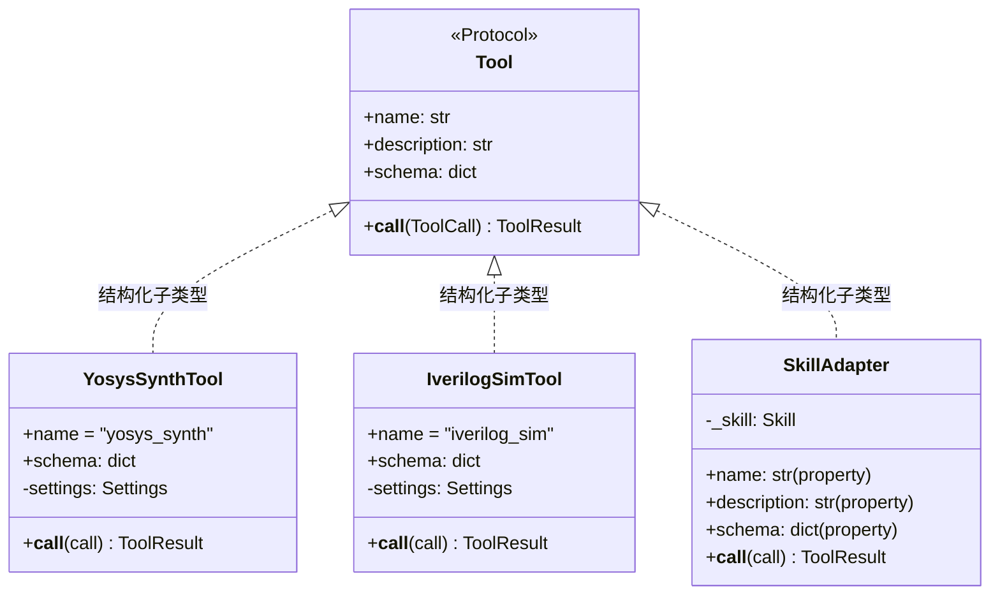
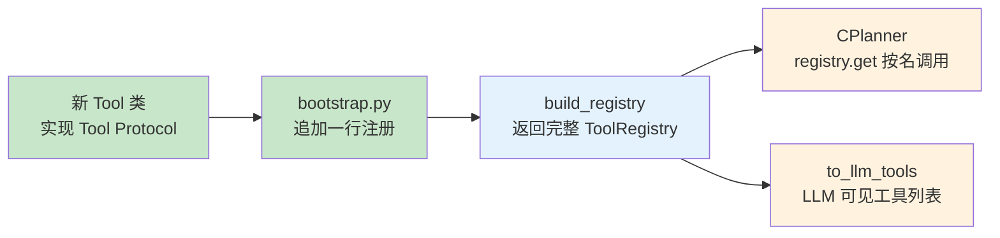
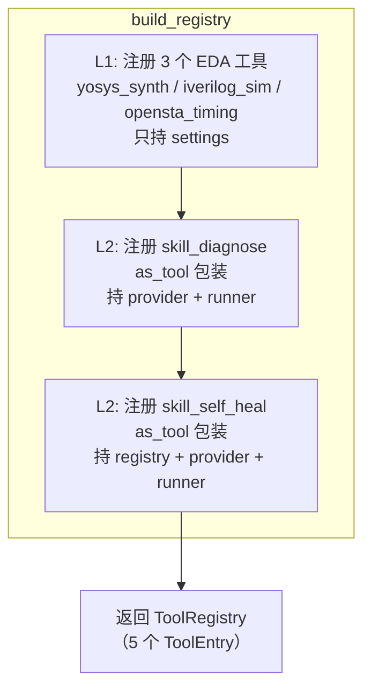
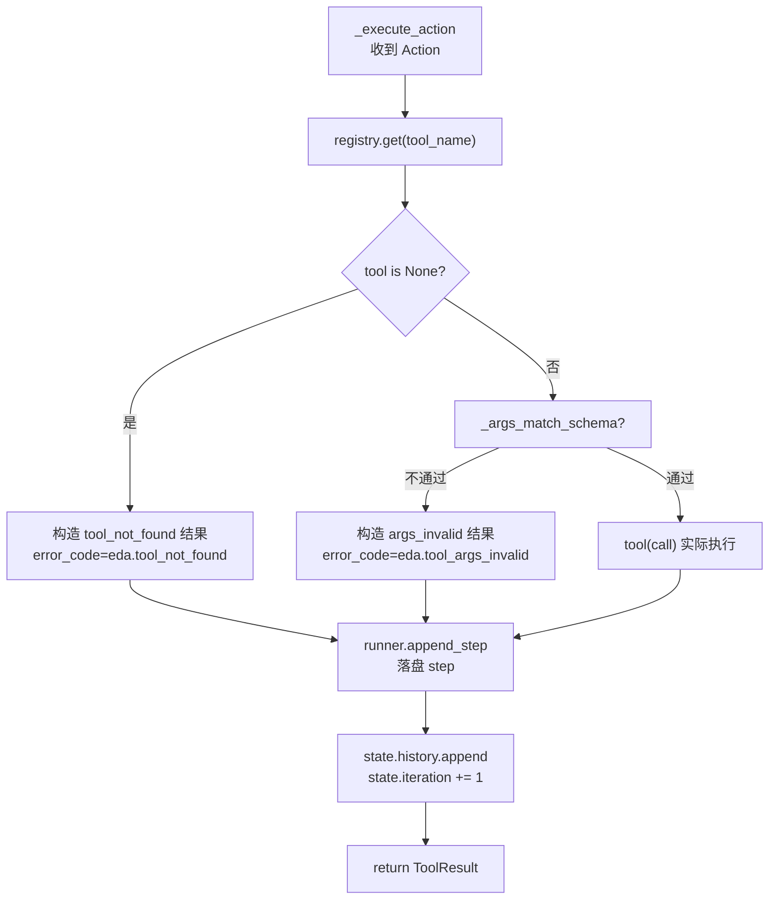

在 Agentic EDA 系统的五层架构中，Tool Registry（L3）是连接编排大脑 CPlanner（L4）与底层 EDA 工具封装（L1）及智能技能（L2）的**唯一桥梁**。它将所有可被调用的能力——无论是跑 yosys 综合的子进程工具，还是内部多轮迭代的自修复 skill——统一抽象为同一套 `Tool` 接口，让 CPlanner 无需感知底层差异，只通过名称查找即可完成调度。本文深入解析 Registry 的注册机制、Tool Protocol 约束、reserved 字段剥离策略，以及它如何彻底践行开闭原则：**加新工具不改核心**。

Sources: [CONTRACTS.md](../../CONTRACTS.md), [registry.py](../../src/eda_agent/registry.py#L1-L6)

## Tool Protocol：注册中心的最小契约

注册中心的一切设计都围绕 `Tool` Protocol 展开。这是一个 `@runtime_checkable` 的结构化协议，任何对象只要声明 `name`、`description`、`schema` 三个属性并实现 `__call__(ToolCall) -> ToolResult`，就自动满足 `Tool` 类型约束——无需继承、无需注册装饰器。



`ToolCall` 和 `ToolResult` 是所有工具调用与返回的不可协商数据结构。`ToolCall` 携带工具名、参数字典（含 reserved 字段）、调用方标识；`ToolResult` 产出三态 `status`（ok/error/timeout）、结构化 `parsed`（必须含 `_schema` 元字段）、`artifacts` 列表（元素必须经 `artifact_ref()` 工厂构造）。这套统一信封确保 CPlanner 解析任何工具的返回值时使用完全相同的代码路径。

Sources: [contracts.py](../../src/eda_agent/contracts.py#L65-L108), [contracts.py](../../src/eda_agent/contracts.py#L73-L98)

## ToolEntry 与 ToolRegistry：注册发现中心

### ToolEntry 数据载体

`ToolEntry` 是注册中心的基本存储单元。它包裹实际的 `Tool` 实例，并补充注册元数据：

| 字段 | 类型 | 作用 |
|---|---|---|
| `tool` | `Tool` | 可调用对象（实现 `__call__`） |
| `name` | `str` | 全局唯一标识，如 `"yosys_synth"` |
| `category` | `str` | 开放分类标签，推荐前缀见下文 |
| `schema` | `dict` | args 的 JSON Schema（含 reserved 字段） |
| `parsed_schema_ref` | `dict` | `{"name": ..., "version": "0.1.0"}` |
| `display_category` | `str \| None` | 可选，UI 分组用 |

Sources: [registry.py](../../src/eda_agent/registry.py#L15-L26)

### ToolRegistry 核心方法

注册中心内部用一个 `dict[str, ToolEntry]` 作为唯一存储，提供以下 API：

```python
registry.register(entry)        # 注册（重名覆盖，后注册者赢）
registry.get(name) -> Tool|None # 按名取 Tool（找不到返回 None，不抛）
registry.get_entry(name)        # 按名取完整 ToolEntry
registry.list(category=None)    # 全列或按 category 过滤
registry.names()                # 所有 name 的列表
registry.to_llm_tools()         # 转成 LLM provider 可消费的工具描述列表
```

**找不到返回 None** 是一个刻意的设计决策——不抛异常。调用方（CPlanner）据此自行构造 `eda.tool_not_found` 的 `ToolResult` 回灌 LLM，作为 ReAct 回环的正常一步，而非中断执行。这保证 LLM 幻觉调用（例如编造一个不存在的工具名）不会导致整个 pipeline 崩溃。

**重名覆盖**策略同样经过深思：后注册者赢。这使得测试可以用 stub 工具替换真实实现，而无需修改被测代码。测试用例 `test_reregister_overwrites` 明确验证了这一行为。

Sources: [registry.py](../../src/eda_agent/registry.py#L29-L55), [test_registry.py](../../tests/test_registry.py#L64-L69)

## 开闭原则的工程兑现

开闭原则（OCP）要求：**对扩展开放，对修改关闭**。在此系统中，它有三层含义：

### 第一层：category 开放枚举

`ToolEntry.category` 类型是 `str`，而非 `Literal["synth", "sim", ...]`。源码注释明确推荐前缀但不做编译期约束：

```
synth / sim / sta / pnr / layout / drc / skill / util
```

新增一个 category 值（如 `"formal"`）不需要修改 `registry.py` 的任何类型定义，完全开放。

Sources: [registry.py](../../src/eda_agent/registry.py#L25-L26)

### 第二层：注册中心零修改扩展

添加一个新 EDA 工具到系统中的完整代码改动仅涉及**两处**：

1. **新建 Tool 文件**（如 `tools/klayout_drc.py`），实现 `Tool` Protocol
2. **在 `bootstrap.py` 的 `l1_tools` 列表中追加一行** `(KLayoutDRCTool(settings), "klayout_drc", "drc")`

`ToolRegistry` 类本身、`CPlanner` 的调度逻辑、`to_llm_tools()` 的转换——全部零修改。新工具立即可被 CPlanner 按名称调用、被 LLM 看见。



Sources: [bootstrap.py](../../src/eda_agent/tools/bootstrap.py#L37-L52), [registry.py](../../src/eda_agent/registry.py#L25-L26)

### 第三层：Skill 无缝注册

Skill（A 诊断器、B 自修复）比 L1 工具复杂得多——它们内部多轮迭代、持有 LLM provider 和 runner、需要注入剩余预算。但通过 `as_tool()` 适配层，它们被包装成满足 `Tool` Protocol 的对象后，注册方式与 L1 工具完全一致：同样构造 `ToolEntry`、同样调 `registry.register()`、CPlanner 同样用 `registry.get()` 取出。

唯一差异是 L2 Skill 的构造需要额外注入 `provider` 和 `runner`，这些参数在 `build_registry` 的函数签名中早已预留。

Sources: [bootstrap.py](../../src/eda_agent/tools/bootstrap.py#L54-L94), [skills/base.py](../../src/eda_agent/skills/base.py#L110-L115)

### 显式注册 vs 装饰器扫描

系统刻意选择**显式注册**（在 `build_registry` 中逐行 `registry.register(...)`）而非装饰器自动扫描。源码注释给出理由：*"避免装饰器扫描的隐式性"*。显式注册使整个工具清单集中在一个文件一目了然，新成员可以快速看到系统当前注册了哪些工具，调试时也无需追踪装饰器的扫描路径。

Sources: [bootstrap.py](../../src/eda_agent/tools/bootstrap.py#L1-L8)

## build_registry 工厂：进程级唯一构造入口

`build_registry(provider, runner, settings)` 是整个系统**唯一的** Registry 构造函数，由进程启动时调用一次。其签名三参数固定（契约硬规则），内部按层级顺序注册：



注册顺序有硬约束：`skill_self_heal` 构造时需要持有 `registry` 引用（B 内部要调 L1 Tool 和 `skill_diagnose`），因此 `skill_diagnose` 必须在 `skill_self_heal` 之前注册。这在 `build_registry` 中通过代码顺序自然保证。

| 层级 | 工具名 | category | 依赖 | 注入 |
|---|---|---|---|---|
| L1 | `yosys_synth` | `synth` | 无 | `settings` |
| L1 | `iverilog_sim` | `sim` | 无 | `settings` |
| L1 | `opensta_timing` | `sta` | 无 | `settings` |
| L2 | `skill_diagnose` | `skill` | `settings`, `provider`, `runner` | `kb`, `llm`, `runner` |
| L2 | `skill_self_heal` | `skill` | `registry`, `provider`, `runner` | `registry`, `llm`, `runner` |

Sources: [bootstrap.py](../../src/eda_agent/tools/bootstrap.py#L24-L96), [test_build_registry.py](../../tests/test_build_registry.py#L25-L34)

## reserved 字段剥离：LLM 可见 schema 的净化

### 问题背景

某些工具参数由 CPlanner 内部注入，不应暴露给 LLM。典型例子是 `_remaining_budget_s`（剩余预算秒数）和 `_artifact_ref`（工件引用路径）。如果这些字段出现在 LLM 可见的工具描述中，LLM 可能尝试自己填写它们，导致预算仲裁或工件解析混乱。

### 双重剥离机制

系统通过两个协同环节确保 reserved 字段不泄漏到 LLM 视野：

**环节一：`_strip_reserved_schema` 在 `to_llm_tools()` 输出时剥离。** 该函数处理 `properties` 和 `required` 两个 JSON Schema 键，过滤掉所有以下划线开头的键名。空 schema 退化为基础骨架 `{"type": "object", "properties": {}}`。

```python
def _strip_reserved_schema(schema: dict) -> dict:
    if not schema:
        return {"type": "object", "properties": {}}
    out = dict(schema)
    props = schema.get("properties")
    if isinstance(props, dict):
        out["properties"] = {k: v for k, v in props.items()
                             if not k.startswith("_")}
    required = schema.get("required")
    if isinstance(required, list):
        out["required"] = [r for r in required
                           if not str(r).startswith("_")]
    return out
```

**环节二：CPlanner 的 `_args_match_schema` 在校验时豁免下划线前缀。** CPlanner 用 `jsonschema.validate` 校验 LLM 返回的参数前，先过滤掉 `args` 中所有 `_` 开头的键，使 reserved 字段不受 required 约束。这意味着即使 LLM 没有提供 `_remaining_budget_s`，也不会触发校验失败——因为 CPlanner 自己会注入。

| 环节 | 位置 | 作用 |
|---|---|---|
| `to_llm_tools` | `registry.py` | LLM 看不到 reserved 字段 |
| `_args_match_schema` | `c_planner.py` | reserved 字段豁免校验 |
| `SkillAdapter.__call__` | `skills/base.py` | reserved 字段从 `call.args.pop` 拆包 |

Sources: [registry.py](../../src/eda_agent/registry.py#L57-L93), [c_planner.py](../../src/eda_agent/planner/c_planner.py#L393-L407), [skills/base.py](../../src/eda_agent/skills/base.py#L62-L71)

## CPlanner 消费 Registry：优雅降级的工具调用

CPlanner 的 `_execute_action` 方法展示了 Registry 的核心消费模式——一个三段式判断，确保任何异常状态都不中断主循环：



无论哪条路径——工具不存在、参数不合法、或正常执行——都会产出 `ToolResult` 并落入 `steps/<idx>/` 目录、记入 `state.history`、递增迭代计数。这种**不中断的回灌**机制是 ReAct 回环稳健运行的基础：LLM 看到工具不存在的错误信息后，可以在下一轮自行修正调用目标。

Sources: [c_planner.py](../../src/eda_agent/planner/c_planner.py#L323-L352), [c_planner.py](../../src/eda_agent/planner/c_planner.py#L409-L452)

## to_llm_tools：Provider 无关的工具描述序列

在 LLM 模式下，CPlanner 每次构建 LLM 请求时调用 `registry.to_llm_tools()` 获取工具清单。输出是一个 provider 无关的中间格式，由 LLM Provider 层再翻译为 Anthropic / OpenAI 原生格式：

```python
{
    "name": "yosys_synth",
    "description": "综合 Verilog RTL 到网表...",
    "input_schema": {"type": "object", "properties": {"rtl": {"type": "string"}, ...}}
}
```

三个关键保证：**名称一致性**（`name` 与 Registry 内部 key 一致，LLM 幻觉调用由 `registry.get` 返回 None 拦截）；**description 来自 Tool Protocol**（`entry.tool.description`，非 ToolEntry 冗余字段）；**input_schema 已剥离 reserved 字段**。

Sources: [registry.py](../../src/eda_agent/registry.py#L57-L75), [c_planner.py](../../src/eda_agent/planner/c_planner.py#L547-L548)

## SkillAdapter：Skill 到 Tool 的透明适配

`SkillAdapter` 是开闭原则在 L2 层的最终兑现者。任何实现了 `Skill` Protocol 的对象，经 `as_tool()` 一次性包装后，即可注册进 Registry，与 L1 工具完全同质：

- **属性代理**：`name`、`description`、`schema` 通过 `@property` 代理到内部 skill
- **参数拆包**：`__call__` 中先浅拷贝 `call.args`，再 `pop` 出 `_remaining_budget_s` 和 `run_id`，剩余字段作为 skill inputs
- **结果映射**：`SkillResult` → `ToolResult`，补充六个 `_skill_*` 元字段（`_skill_status`、`_skill_iterations`、`_skill_trajectory`、`_skill_patch_source`、`_skill_convergence_cause`、`_skill_best_iter`）
- **错误码覆写**：`budget_exhausted` 映射为 `eda.budget_exhausted`，其余透传

这意味着未来新增一个 Skill（例如 DRC 自动修复），只需实现 `Skill` Protocol、调 `as_tool()` 包装、在 `build_registry` 中注册一行——Registry 和 CPlanner 完全无需修改。

Sources: [skills/base.py](../../src/eda_agent/skills/base.py#L24-L107), [contracts.py](../../src/eda_agent/contracts.py#L135-L159)

## 验收测试覆盖

Registry 的正确性由两组测试守护。`test_registry.py` 验证注册中心的纯接口行为：注册/获取/列表/覆盖/to_llm_tools 剥离。`test_build_registry.py` 验证 `build_registry` 工厂产出的完整 Registry 含 5 个 ToolEntry，每个都满足 Tool Protocol，category 和 parsed_schema_ref 符合预期。

| 测试文件 | 验收项 | 核心断言 |
|---|---|---|
| `test_registry.py` | A3/A_registry/I11 | get 返回 Tool 实例；找不到返回 None；重名覆盖；reserved 剥离 |
| `test_build_registry.py` | T19/T26/T36 | 5 个工具全部注册；category 正确；Protocol 满足 |

Sources: [test_registry.py](../../tests/test_registry.py#L1-L109), [test_build_registry.py](../../tests/test_build_registry.py#L1-L108)

## 延伸阅读

- 了解三个具体 EDA 工具的封装细节：[Yosys 综合工具与 stat-json 解析](20_Yosys综合工具stat-json解析.md)、[iverilog 仿真与 TB 打印协议](21_iverilog仿真TB协议.md)、[OpenSTA 时序分析封装与优雅降级](22_OpenSTA时序分析封装.md)
- 了解 Skill 如何被适配为 Tool：[Skill 到 Tool 的适配层与 reserved 字段拆包](18_Skill到Tool适配层.md)
- 了解 CPlanner 如何消费 Registry：[五相状态机：PLANNING 到 DONE 的流转](09_五相状态机Planning到Done.md)、[LLM ReAct 回环：工具决策与历史回灌](10_LLMReAct回环工具决策.md)
- 扩展新 EDA 工具的完整步骤指南：[扩展新 EDA 工具的完整指南](31_扩展新EDA工具指南.md)