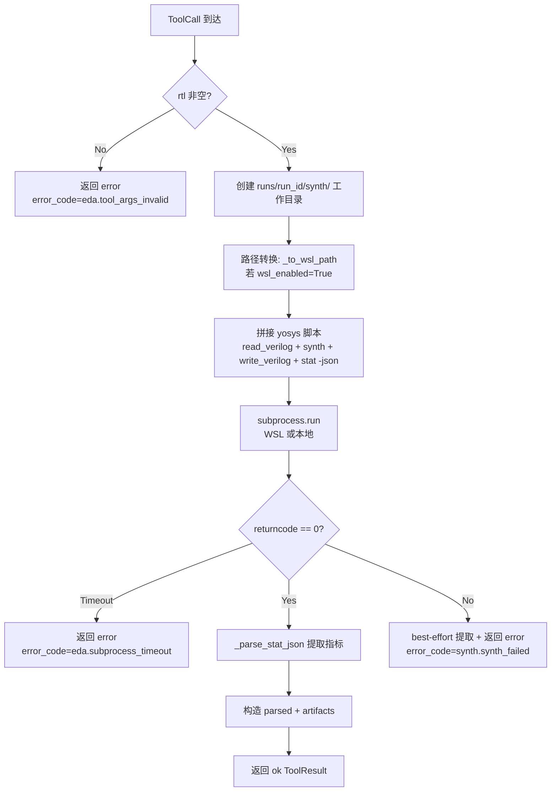
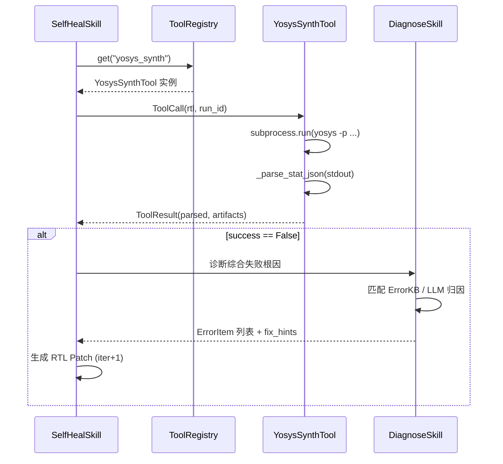

`YosysSynthTool` 是系统中 L1 层的第一个 EDA 工具封装，也是整条自修复流水线（综合→仿真→诊断→Patch）的起点。它将开源综合器 Yosys 的命令行调用包装为符合 `Tool` Protocol 的可调用对象，通过 `stat -json` 输出精确提取网表的结构化指标（cell 数、wire 数、端口数），并以 `ToolResult` 格式回传给上层编排器。本页聚焦其脚本构造策略、stat-json 解析算法、跨 WSL 路径转换以及下游消费契约，揭示 前置 Gate 实测中沉淀的工程细节。

Sources: [yosys_synth.py](../../src/eda_agent/tools/yosys_synth.py#L1-L13), [CONTRACTS.md](../../CONTRACTS.md)

## 整体架构：从 ToolCall 到 ToolResult

YosysSynthTool 是一个**无状态的纯函数式封装**——不持有 `LLMProvider`、不持有 `Runner`，仅持有 `Settings`（提供 yosys 二进制路径、WSL 开关、超时秒数）。CPlanner 或 SelfHealSkill 通过 `registry.get("yosys_synth")` 获取实例后，以 `ToolCall` 为入参、`ToolResult` 为出参完成一次调用。整个 `__call__` 方法按九个阶段顺序推进，每一步都对应一个明确的契约义务。



图中的决策分支覆盖了三条错误路径（参数缺失、超时、综合失败）和一条成功路径。值得强调的是，**即使 yosys 返回非零退出码，解析仍会尽力进行**——`stat-json` 可能部分输出，`num_cells` 等字段作为诊断证据仍有价值。

Sources: [yosys_synth.py](../../src/eda_agent/tools/yosys_synth.py#L115-L311)

## yosys 脚本构造：四段式流水线与重定向禁忌

YosysSynthTool 拼接的 yosys 命令是一行 `-p` 脚本，用分号串联四个 pass：

```
read_verilog <rtl>; synth [-top <top_module>]; write_verilog <netlist>; stat -json
```

其中 `synth` 的 `-top` 参数是可选的——当 `top_module` 为空时，yosys 自行推断顶层模块。`write_verilog` 将门级网表写到 `runs/<run_id>/synth/netlist.v`，供下游 OpenSTA 时序分析复用。`stat -json` 是最后一段，它将综合统计信息以 JSON 格式输出到 **stdout**（非 stderr），这是 `_parse_stat_json` 函数的输入源。

前置 Gate 实测揭示了两个必须遵守的硬约束。第一，**禁止在脚本内部使用 `>` 重定向**：yosys 将 `>` 解释为 selection 语法的一部分（如 `-selection >%`），而非 shell 重定向。第二，**stat-json 在 stdout 末尾**，前面混有大量 synth pass 的日志文本，不能用简单的 `json.loads(stdout)` 解析。

以下是参数校验阶段的实现细节——当 `rtl` 为空字符串或缺失时，工具立即返回 `error` 级别的 `ToolResult`，`error_code` 取 `eda.tool_args_invalid`，`parsed` 中所有数值字段归零、`artifacts` 为空列表，但 `_schema` 元字段仍然完整构造，保证下游消费者可以安全读取版本锚点而不触发 `KeyError`。

Sources: [yosys_synth.py](../../src/eda_agent/tools/yosys_synth.py#L162-L170), [yosys_synth.py](../../src/eda_agent/tools/yosys_synth.py#L122-L150), [CONTRACTS.md](../../CONTRACTS.md)

## stat-json 解析算法：raw_decode 与 escaped identifier

`_parse_stat_json` 是整个工具封装中技术密度最高的函数，它被设计为模块级纯函数以便脱离 EDA 环境独立测试。算法分三步：首先用 `text.find("{")` 定位 stdout 中第一个左花括号的位置，跳过前面的 synth 日志；然后从该位置开始，用 `json.JSONDecoder().raw_decode()` 进行增量解析；`raw_decode` 的关键行为是**遇到合法 JSON 闭合括号 `}` 后立即停止**，忽略后续文本（如 yosys 在 JSON 块后可能再打印的日志）。如果 stdout 中没有 `{` 或解析失败，函数返回 `None` 而非抛出异常，保证调用链不被中断。

```python
def _parse_stat_json(text: str) -> dict[str, Any] | None:
    if not text:
        return None
    idx = text.find("{")
    if idx < 0:
        return None
    try:
        obj, _ = json.JSONDecoder().raw_decode(text[idx:])
        return obj
    except (json.JSONDecodeError, ValueError):
        return None
```

解析出的 JSON 对象的 `modules` 字段是一个字典，键名带有 yosys **escaped identifier** 前缀反斜杠（如 `\counter`）。`_strip_yosys_id` 函数负责剥离这一前缀。模块选择策略是：如果调用方指定了 `top_module`，则在所有模块键中逐一匹配剥离后的名称；如果匹配失败或未指定 `top_module`，则取字典的第一个键作为 chosen module。

stat-json 模块字段中包含 `num_cells` 和 `num_wires`，可直接读取。但 **`num_ports` 不在模块字段中**——这是 前置 Gate 实测确认的一个 yosys 行为细节。YosysSynthTool 对此的处理是：从 stdout 文本中用正则 `Number of ports:\s*(\d+)` best-effort 抓取该行，找不到则保守置零并在代码注释中明确说明原因。而 `cell_area` 字段——在无 liberty 库提供的场景下 stat-json 中不包含面积信息——固定返回 `None`。

| parsed 字段 | 数据来源 | 类型 | 无数据时默认值 |
|---|---|---|---|
| `num_cells` | stat-json `modules[key].num_cells` | `int` | 0 |
| `num_wires` | stat-json `modules[key].num_wires` | `int` | 0 |
| `num_ports` | stdout 文本 `Number of ports:` 行 | `int` | 0 |
| `cell_area` | stat-json（需 liberty） | `float \| None` | `None` |
| `module_name` | stat-json module key（strip 后） | `str` | `""` |
| `success` | `proc.returncode == 0` | `bool` | — |
| `warnings` | stdout+stderr 正则 `^Warning:.*$` | `list[str]` | `[]` |
| `errors` | stdout+stderr 正则 `^ERROR.*$` | `list[str]` | `[]` |

Sources: [yosys_synth.py](../../src/eda_agent/tools/yosys_synth.py#L55-L71), [yosys_synth.py](../../src/eda_agent/tools/yosys_synth.py#L225-L264), [test_yosys_tool.py](../../tests/test_yosys_tool.py#L21-L60)

## 跨 WSL 路径转换：Windows 原生开发环境支持

系统设计在 Windows 主机上运行，但 EDA 工具（yosys / iverilog / OpenSTA）运行在 WSL2 的 Ubuntu-24.04 中。`_to_wsl_path` 函数负责将 Windows 风格路径（如 `D:\project\rtl\counter.v`）转换为 WSL 可识别的 `/mnt/d/project/rtl/counter.v` 格式：盘符小写、去冒号、反斜杠转正斜杠。对于无盘符的相对路径，函数原样返回（WSL 在其当前工作目录下解析）。

当 `settings.eda.wsl_enabled` 为 `True`（这是 Win11 主机上的默认值）时，命令前缀变为 `["wsl.exe", "-d", "Ubuntu-24.04", "-e", "yosys", "-p", script]`；为 `False` 时直接调用 `["yosys", "-p", script]`。此设计使得同一份代码无需改动即可在纯 Linux CI 环境中运行（设 `wsl_enabled=False` 即可）。YosysSynthTool 将 RTL 路径和网表输出路径都经过 `_to_wsl_path` 转换，确保 yosys 在 WSL 内能正确找到文件并写出产物。

值得注意的是，`_to_wsl_path` 在三个工具文件（`yosys_synth.py`、`iverilog_sim.py`、`opensta_timing.py`）中各自独立定义了一份——这是 L1 工具封装层有意保持的独立性：每个工具文件零外部依赖、可独立审计，代价是少量代码重复。

Sources: [yosys_synth.py](../../src/eda_agent/tools/yosys_synth.py#L40-L52), [yosys_synth.py](../../src/eda_agent/tools/yosys_synth.py#L152-L179), [iverilog_sim.py](../../src/eda_agent/tools/iverilog_sim.py#L47-L57), [settings.py](../../src/eda_agent/settings.py#L43-L51)

## 错误码体系与超时保护

YosysSynthTool 的三条错误路径对应三个不同的 `error_code`，它们遵循契约 §2.6 的二段式 namespace 规范。参数校验失败使用框架级别名码 `eda.tool_args_invalid`；子进程超时使用 `eda.subprocess_timeout`；综合本身的失败（returncode ≠ 0）使用领域规范码 `synth.synth_failed`。后者在 `errors.py` 的 `SEVERITY_BY_CODE` 表中登记为 `error` 级别，被 DiagnoseSkill 的 `needs_rtl_patch` 派生规则捕获（severity 为 `error` 或 `fatal` 时触发 RTL 补丁判定）。

超时保护通过 `settings.eda.tool_timeout_s`（默认 120 秒）控制。`subprocess.run` 捕获 `TimeoutExpired` 异常后，构造 `error` 级别的 `ToolResult`，`error_hint` 为 `"subprocess timeout after 120s"`，`parsed` 中 `errors` 列表填充 `"timeout after 120s"` 字符串，`duration_s` 记录实际耗时。

| 错误场景 | error_code | namespace | severity | parsed.success |
|---|---|---|---|---|
| rtl 参数缺失 | `eda.tool_args_invalid` | `eda` | `error` | `False` |
| 子进程超时 | `eda.subprocess_timeout` | `eda` | `error` | `False` |
| yosys 退出码非零 | `synth.synth_failed` | `synth` | `error` | `False` |
| 综合成功 | `None` | — | — | `True` |

Sources: [yosys_synth.py](../../src/eda_agent/tools/yosys_synth.py#L181-L218), [yosys_synth.py](../../src/eda_agent/tools/yosys_synth.py#L290-L298), [errors.py](../../src/eda_agent/errors.py#L18-L28), [errors.py](../../src/eda_agent/errors.py#L90-L94)

## 产出工件：netlist.v 与 synth.json

成功的综合调用产出两个工件引用，通过 `artifact_ref()` 工厂函数构造。第一个是综合后的门级网表 `synth/netlist.v`——它是 OpenSTA 时序分析的输入，也是自修复流程中判断 RTL 是否可综合的依据。第二个是结构化的 `synth/synth.json`——YosysSynthTool 在解析完 stat-json 后将其完整落盘，供后续诊断步骤或 STA 步骤复用，避免重复调用 yosys。

工件落盘的代码位于 `__call__` 的第 7 阶段。如果 `stat_obj` 不为 `None`（即 stdout 中成功解析到 JSON），则用 `json.dumps` 以 `indent=2` 格式化写入 `work_dir / "synth.json"`。写盘操作包裹在 `try/except OSError` 中——即使落盘失败（如磁盘满、权限问题），也不阻塞主流程返回 `ToolResult`，因为 `parsed` 中已包含解析出的结构化数据。

工具的工作目录结构为 `runs/<run_id>/synth/`，其下包含 `netlist.v`、`synth.json` 两个文件。`run_id` 从 `ToolCall.args` 中获取，默认值为 `"run"`；SelfHealSkill 调用时传入实际 run_id，确保产物归入正确的 run 目录。

Sources: [yosys_synth.py](../../src/eda_agent/tools/yosys_synth.py#L152-L159), [yosys_synth.py](../../src/eda_agent/tools/yosys_synth.py#L251-L288), [contracts.py](../../src/eda_agent/contracts.py#L24-L30)

## 下游消费：SelfHealSkill 与 DiagnoseSkill 的接口

YosysSynthTool 的 `parsed` 输出被两个 L2 Skill 消费。**SelfHealSkill**（组件 B）在 `_stage_synth` 方法中构造 `ToolCall(name="yosys_synth", args={"rtl": rtl_path, "run_id": run_id})`，通过 `registry.get("yosys_synth")(call)` 执行调用，并用 `runner.append_step` 记录步骤。综合结果中的 `success` 字段用于决定是否继续进入仿真阶段；若综合失败，SelfHealSkill 直接调用 DiagnoseSkill 分析根因并生成 Patch。

**DiagnoseSkill**（组件 A）维护了一张 `_TOOL_STAGE` 映射表，将 `"yosys_synth"` 映射到 stage `"synth"`。当诊断器收到 yosys 综合的 `ToolResult` 时，它从 `parsed.warnings` / `parsed.errors` 列表中提取诊断证据，结合 `parsed.script_used` 确认执行了哪条综合脚本，然后匹配 ErrorKB 知识库中的错误模式或请求 LLM 进行根因归因。`parsed.num_cells` 为零或 `parsed.success` 为 `False` 是触发 RTL 补丁判定的典型信号。



Sources: [self_heal.py](../../src/eda_agent/skills/self_heal.py#L668-L681), [diagnose.py](../../src/eda_agent/skills/diagnose.py#L530-L535), [yosys_synth.py](../../src/eda_agent/tools/yosys_synth.py#L266-L282)

## 测试策略：纯 Python 解析单测 + EDA 集成测试

YosysSynthTool 的测试分为两个独立层。**纯 Python 层**不需要任何 EDA 工具——`_parse_stat_json` 作为模块级函数可以直接对构造的 stdout 文本调用。三个核心测试用例覆盖了正常提取（含 JSON 块的混合文本提取 `num_cells==24`）、无 JSON 时返回 `None` 不抛异常、以及 `raw_decode` 忽略 JSON 闭合后的尾部文本行为。参数校验测试验证 `rtl` 空串时返回 `error` 且 `error_code == "eda.tool_args_invalid"`。

**EDA 集成层**标记 `@pytest.mark.needs_eda`，在临时目录写入一个 8-bit 计数器 `counter.v`，构造真实的 `ToolCall` 调用工具，断言 `result.is_ok()`、`parsed.num_cells >= 1`、`parsed.module_name == "counter"`，并验证 `artifacts` 恰好包含两个元素（netlist.v + synth.json）。集成测试通过 `_has_eda()` 辅助函数检测环境：WSL2 可用或本地 yosys 可用时才运行，否则跳过。

Sources: [test_yosys_tool.py](../../tests/test_yosys_tool.py#L19-L60), [test_yosys_tool.py](../../tests/test_yosys_tool.py#L65-L75), [test_yosys_tool.py](../../tests/test_yosys_tool.py#L96-L135)

## 延伸阅读

YosysSynthTool 是自修复流水线的起点，其产出的 netlist.v 被 [OpenSTA 时序分析封装与优雅降级](22_OpenSTA时序分析封装.md) 消费、其 parsed 诊断数据流向 [iverilog 仿真与 TB 打印协议（TEST_PASS/TEST_FAIL）](21_iverilog仿真TB协议.md) 和 [EDA 诊断器（组件 A）：规则层与 LLM 归因](14_EDA诊断器组件A规则层.md)。理解本页的 stat-json 解析逻辑和 ToolResult 结构是阅读 [RTL 自修复闭环（组件 B）：综合-仿真-诊断-Patch 迭代](15_RTL自修复闭环组件B.md) 的前置知识。如需了解 YosysSynthTool 如何被注册进 Registry 供 CPlanner 发现，参见 [统一工具注册中心与开闭原则](19_统一工具注册中心.md)。