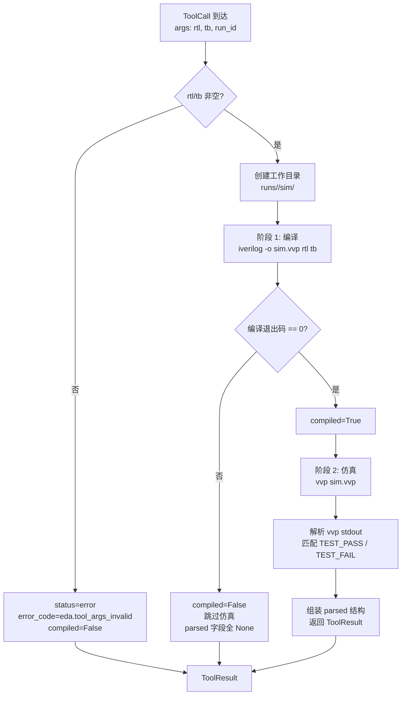

iverilog 是开源 Verilog 仿真器，但**无任何原生结构化输出能力**——既不提供 `--dump-json` 也不支持 AST 导出，只能产出裸 stdout/stderr 文本。本系统的设计决策是通过一套**自定义 TB 打印协议**，将"解析裸文本"收敛为"解析自己定义的固定标记行"，从而在不可控的仿真器输出中建立一个可控的结构化信息出口。`IverilogSimTool` 封装了 iverilog 编译（`iverilog -o`）和仿真执行（`vvp`）两个子进程阶段，解析 TB 输出的 `TEST_PASS` / `TEST_FAIL` 标记行，并以契约化的 `ToolResult.parsed` 结构向上层（自修复闭环、诊断器、CPlanner）传递仿真判定结果。

Sources: [iverilog_sim.py](../../src/eda_agent/tools/iverilog_sim.py#L1-L15), [CONTRACTS.md](../../CONTRACTS.md)

## 设计动因：为什么需要 TB 打印协议

Yosys 综合工具支持 `stat -json` 产出结构化 JSON，OpenSTA 天然产出 `rpt` 格式报告，唯独 iverilog 的输出是纯文本诊断日志，没有任何机器友好的结构化接口。如果让上层组件直接对 vvp 的 stdout 做自由文本解析，每一条新 TB 的输出格式差异都会成为脆弱的耦合点。

TB 打印协议的核心思路是**将结构化职责推到 TB 侧**：TB 是系统自己编写的，因此可以约定在仿真结束时必须打印固定格式的标记行。Tool 侧只需用两条正则表达式匹配这些标记行，即可获得确定性的结构化结果。

```
TB 必须在结束时打印以下固定标记行（大小写敏感，行首无空格）：
    TEST_PASS <n>/<total>      例如 TEST_PASS 3/5
    TEST_FAIL <signal>         每个失败信号一行，例如 TEST_FAIL sum_out
```

Sources: [CONTRACTS.md](../../CONTRACTS.md)

## IverilogSimTool 的两阶段执行模型

`IverilogSimTool` 实现了 `Tool` Protocol，对外暴露 `name = "iverilog_sim"`、`__call__` 方法，其执行过程严格分为**编译阶段**和**仿真阶段**，前者的成功是后者执行的前提。



**编译失败**时（iverilog 返回非零退出码），`compiled` 字段为 `False`，仿真阶段被完全跳过，`passed` / `num_passed` / `num_failed` 全部为 `None`——这不是"仿真失败"，而是"未达到仿真阶段"。这个区分至关重要：编译失败意味着 RTL 存在语法错误，其诊断路径与功能仿真失败完全不同。对应的契约错误码为 `eda.sim_compile_failed`（severity=error），由诊断器的 ErrorKB 规则层捕获 iverilog 的 stderr 文本进行匹配。

Sources: [iverilog_sim.py](../../src/eda_agent/tools/iverilog_sim.py#L199-L277), [CONTRACTS.md](../../CONTRACTS.md), [errors.py](../../src/eda_agent/errors.py#L36-L39)

### 编译与仿真的子进程调用细节

编译命令格式为 `iverilog -o <output.vvp> <rtl> <tb>`，仿真命令为 `vvp <output.vvp>`。两个阶段共享同一个超时阈值 `settings.eda.tool_timeout_s`（默认 120 秒）。超时和 `OSError`（如二进制不存在）分别映射到不同的错误码：

| 异常类型 | error_code | status | 触发条件 |
|---|---|---|---|
| 参数为空 | `eda.tool_args_invalid` | `error` | rtl 或 tb 为空字符串 |
| 编译超时 | `eda.subprocess_timeout` | `timeout` | `subprocess.TimeoutExpired` |
| 编译调起失败 | `eda.subprocess_failed` | `error` | `OSError`（二进制不存在） |
| 仿真超时 | `eda.subprocess_timeout` | `timeout` | vvp 阶段超时 |
| 正常完成 | `None` | `ok` | 编译+仿真均完成 |

`_coerce` 辅助函数处理了 Windows 下 `TimeoutExpired` 残留的 bytes 类型 stdout/stderr，统一以 utf-8 + errors="replace" 解码，避免 GBK 编码崩溃。

Sources: [iverilog_sim.py](../../src/eda_agent/tools/iverilog_sim.py#L60-L69), [iverilog_sim.py](../../src/eda_agent/tools/iverilog_sim.py#L207-L264), [settings.py](../../src/eda_agent/settings.py#L43-L50)

### 跨 WSL 调用

当 `settings.eda.wsl_enabled = True`（默认值）时，iverilog 和 vvp 运行在 WSL2 环境中。`_to_wsl_path` 函数将 Windows 路径（如 `D:\runs\test\sim.vvp`）转换为 WSL 路径（`/mnt/d/runs/test/sim.vvp`）：盘符小写、去冒号、反斜杠转正斜杠。命令前缀统一为 `["wsl.exe", "-d", "Ubuntu-24.04", "-e", "<tool>", ...]`。相对路径或无盘符路径原样返回，由 WSL 的 cwd 解析。

Sources: [iverilog_sim.py](../../src/eda_agent/tools/iverilog_sim.py#L47-L57), [iverilog_sim.py](../../src/eda_agent/tools/iverilog_sim.py#L200-L206), [settings.py](../../src/eda_agent/settings.py#L44)

## TB 打印协议的解析逻辑

`_parse_tb_protocol` 是整个协议的核心解析函数，它接收 vvp 的完整 stdout 文本，输出一个包含五个字段的字典。两条正则表达式定义了标记行的精确格式：

```python
_TEST_PASS_RE = re.compile(r"^TEST_PASS\s+(\d+)\s*/\s*(\d+)\s*$", re.MULTILINE)
_TEST_FAIL_RE = re.compile(r"^TEST_FAIL\s+(\S+)\s*$", re.MULTILINE)
```

这两个正则的**关键设计约束**是 `^` 锚定行首（配合 `re.MULTILINE`），确保标记行前面不能有空格——这是为了防止 TB 中普通的 `$display` 文本被误匹配为协议标记。大小写敏感意味着 `test_pass` 或 `Test_Pass` 不会被识别。

| 输入场景 | num_passed | total | num_failed | passed | fail_signals |
|---|---|---|---|---|---|
| `TEST_PASS 5/5` | 5 | 5 | 0 | `True` | `[]` |
| `TEST_PASS 3/5` + `TEST_FAIL sum_out` | 3 | 5 | 2 | `False` | `["sum_out"]` |
| 无任何标记行 | `None` | `None` | `None` | `None` | `[]` |
| 仅 `TEST_FAIL`（无 `TEST_PASS`） | `None` | `None` | `None` | `None` | `["sum_out", "carry"]` |

**协议违反**（未打印 `TEST_PASS` 行）是设计中明确处理的场景：`num_passed` / `num_failed` / `passed` 返回 `None` 而非抛异常，但 `fail_signals` 仍尽力解析。这种容错策略确保了即使 TB 编写不规范，系统也不会崩溃，而是将不确定性以 `None` 的形式传递给上层组件，由上层决定如何处理（自修复闭环中，`passed is None` 会被视为未通过，触发诊断→patch 流程）。

`passed` 的判定逻辑为 `num_passed > 0 and num_failed == 0`：必须至少有一个通过的用例，且零失败。多个 `TEST_PASS` 行出现时取第一个（协议约定只打印一次，容错处理）。

Sources: [iverilog_sim.py](../../src/eda_agent/tools/iverilog_sim.py#L40-L106), [test_iverilog_tool.py](../../tests/test_iverilog_tool.py#L22-L62)

## parsed 结构与 ToolResult 组装

`IverilogSimTool` 的 `parsed` 字段严格遵循契约 §2.2 的 schema 定义，所有字段命名使用 snake_case，布尔字段使用明确的语义命名：

```python
parsed = {
    "_schema": {"name": "iverilog_sim", "version": "0.1.0",
                "contract_version": CONTRACT_VERSION},
    "compiled": bool,              # iverilog 编译是否通过
    "passed": bool | None,         # 仿真是否全通过（None=编译失败未跑）
    "num_passed": int | None,      # TEST_PASS 行的 n
    "num_failed": int | None,      # total - num_passed
    "fail_signals": list[str],     # 所有 TEST_FAIL 行的 signal
    "vvp_stdout_tail": str,        # vvp 输出最后 2KB（快速失败定位）
}
```

`vvp_stdout_tail` 取 vvp stdout 的最后 2048 个字符（`_VVP_TAIL_LEN = 2048`），用于上层组件在不读完整日志的情况下快速定位失败原因。`artifacts` 固定声明为 `[artifact_ref(run_id, "sim/wave.vcd")]`，即使编译失败也保留此声明——这符合契约的"固定 artifact 声明"原则，下游消费者可据此知道产物路径约定。

Sources: [iverilog_sim.py](../../src/eda_agent/tools/iverilog_sim.py#L285-L310), [iverilog_sim.py](../../src/eda_agent/tools/iverilog_sim.py#L37-L38), [CONTRACTS.md](../../CONTRACTS.md)

## 上游消费：自修复闭环如何利用仿真结果

在 [RTL 自修复闭环](15_RTL自修复闭环组件B.md)中，`SelfHealSkill._stage_sim` 方法通过 Registry 获取 `iverilog_sim` 工具并调用，每轮迭代产出一个 `ToolResult`。闭环消费仿真结果的关键决策逻辑如下：

**通过判定**：`sim_ok` 的计算综合考虑了 `passed` 标志和 `num_passed >= required` 两个条件。当 `total == 0`（TB 未打印协议行或编译失败）且 goal 为 "pass all" 时，系统**只信任 `parsed["passed"] is True`**，避免 `0 >= 0` 的误判。

**分数追踪**：`best_score` 以 `num_passed` 为衡量标准，用于版本栈的"最佳轮"记录。当连续 3 轮 `num_passed` 下降时，触发 `convergence = "regression"` 提前终止。

**诊断回退**：当诊断器的 `root_causes` 为空但仿真有 `fail_signals` 时，self_heal 直接将每个 `fail_signal` 包装为 `ErrorItem(code="sim.fail_signal", severity="error")`，确保即使诊断器未能产出根因，仿真失败的信号名仍能传递给 LLM patch 策略。

Sources: [self_heal.py](../../src/eda_agent/skills/self_heal.py#L449-L472), [self_heal.py](../../src/eda_agent/skills/self_heal.py#L508-L519), [self_heal.py](../../src/eda_agent/skills/self_heal.py#L770-L788)

## 诊断器的 sim stage 映射

[EDA 诊断器](14_EDA诊断器组件A规则层.md) 通过 `_TOOL_STAGE` 映射表将 `iverilog_sim` 归类为 `"sim"` stage。诊断器读取 iverilog_sim 的 `ToolResult` 时，其 `parsed` 结构（`compiled`、`passed`、`fail_signals`）连同 stdout/stderr 文本一起传入规则匹配层（ErrorKB 正则）和 LLM 归因层，产出 `ErrorItem` 列表。

与仿真相关的错误码体系包括 `eda.sim_compile_failed`（编译失败）、`eda.sim_assert_failed`（功能断言失败）和 `sim.fail_signal`（TB 协议标记的失败信号）。这三者在 [错误码与 severity 对应表](../../CONTRACTS.md)中均映射为 `severity=error`，意味着诊断器的 `needs_rtl_patch` 派生规则会判定为 `True`，触发自修复的 patch 迭代。

Sources: [diagnose.py](../../src/eda_agent/skills/diagnose.py#L530-L535), [errors.py](../../src/eda_agent/errors.py#L94), [CONTRACTS.md](../../CONTRACTS.md)

## data/examples 中的 TB 协议实例

系统中所有基准 TB 都严格遵守打印协议，覆盖了三种典型的故障场景：

| 示例 | fault_type | TB 协议行为 | 预期仿真结果 |
|---|---|---|---|
| counter_reset | timing_reset | 复位值检查 → `TEST_FAIL reset_value` 或 `TEST_PASS 1/1` | bug RTL 触发 `TEST_FAIL` |
| adder_pipe_bitwidth | bitwidth | 溢出检查 → `TEST_FAIL sum_overflow` 或 `TEST_PASS 1/1` | bug RTL 触发 `TEST_FAIL` |
| counter_syntax | syntax | 计数值检查 → `TEST_FAIL count_value` 或 `TEST_PASS 1/1` | iverilog 编译失败，无仿真输出 |

以 `counter_reset` 的 TB 为例，其协议打印模式是典型的**渐进式检查 + 提前终止**结构：在每个检查点若条件不满足，立即 `$display("TEST_FAIL <signal>")` 并 `$finish` 退出；所有检查点通过后才打印 `TEST_PASS 1/1`。这种模式确保 `fail_signals` 永远只包含第一个命中的失败信号，而非全部潜在失败点。

Sources: [counter_reset/tb.v](../../data/examples/counter_reset/tb.v#L27-L46), [adder_pipe_bitwidth/tb.v](../../data/examples/adder_pipe_bitwidth/tb.v#L40-L46), [counter_syntax/tb.v](../../data/examples/counter_syntax/tb.v#L31-L37), [counter_reset/meta.json](../../data/examples/counter_reset/meta.json#L1-L8)

## 测试覆盖：从纯解析到端到端真跑

`test_iverilog_tool.py` 采用分层测试策略，将对 iverilog 二进制的依赖与解析逻辑完全解耦：

**纯解析单测（无 EDA 依赖）**直接调用模块级 `_parse_tb_protocol` 函数，覆盖了全通过、部分失败、无标记、仅失败标记四种场景。这些测试不依赖任何外部工具，在任何环境中都能运行。

**`@needs_eda` 真跑测试**使用 `COUNTER_V` 和 `COUNTER_TB` 内嵌 Verilog，通过 `monkeypatch.chdir` 切换到临时目录执行，验证编译通过、仿真通过、`num_passed=1`、`fail_signals=[]` 的完整链路。`_have_eda()` 函数根据 `wsl_enabled` 设置决定 skip 条件：WSL 模式下检查 `wsl.exe` 可见性；本机模式要求 `iverilog` 和 `vvp` 同时存在。

Sources: [test_iverilog_tool.py](../../tests/test_iverilog_tool.py#L22-L62), [test_iverilog_tool.py](../../tests/test_iverilog_tool.py#L68-L90), [test_iverilog_tool.py](../../tests/test_iverilog_tool.py#L96-L180)

## 注册与发现

`IverilogSimTool` 在 `build_registry` 工厂函数中以 `(IverilogSimTool(settings), "iverilog_sim", "sim")` 三元组注册到 `ToolRegistry`，category 标记为 `"sim"`。构造时只注入 `Settings`（含 WSL 配置和命令路径），不持有 LLM provider——这是 L1 子进程工具的统一约束，与 L2 Skill（持 provider + runner）形成鲜明对比。Registry 中的其他组件（self_heal、diagnose）通过 `registry.get("iverilog_sim")` 获取该工具实例并调用。

Sources: [bootstrap.py](../../src/eda_agent/tools/bootstrap.py#L38-L52), [bootstrap.py](../../src/eda_agent/tools/bootstrap.py#L24-L34)

---

**延伸阅读**：iverilog 的仿真结果如何驱动自修复迭代，参见 [RTL 自修复闭环（组件 B）](15_RTL自修复闭环组件B.md)；诊断器如何将仿真失败归类为 `sim` stage，参见 [EDA 诊断器（组件 A）](14_EDA诊断器组件A规则层.md)；同层的另外两个 EDA 工具封装，参见 [Yosys 综合工具与 stat-json 解析](20_Yosys综合工具stat-json解析.md) 和 [OpenSTA 时序分析封装与优雅降级](22_OpenSTA时序分析封装.md)。