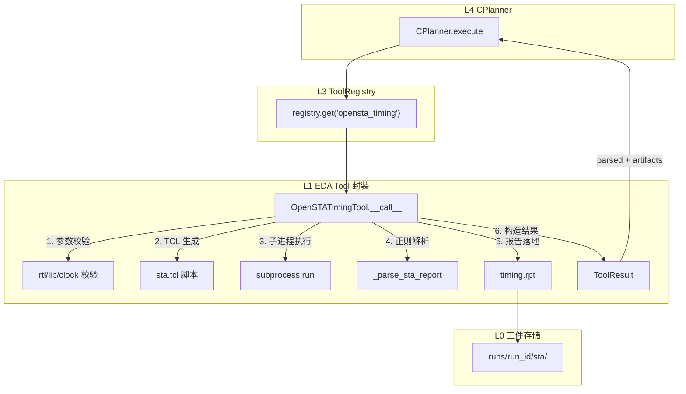
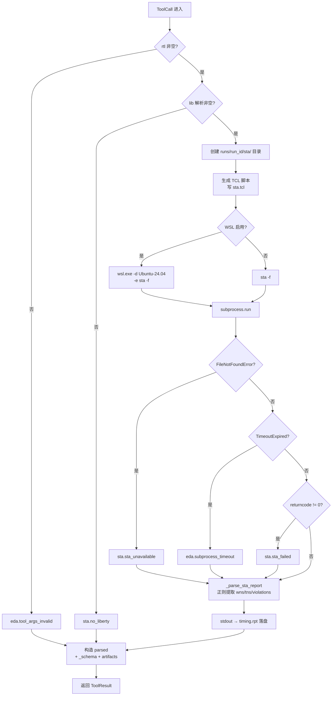

OpenSTA（Open Source Timing Analysis）是开源静态时序分析引擎，在 Agentic EDA 系统中被封装为 L1 层的 `OpenSTATimingTool`——一个实现 `Tool` Protocol 的子进程工具。本文深入剖析该工具如何动态生成 TCL 脚本、跨 WSL 调用 `sta` 二进制、以正则 best-effort 解析 wns/tns/violations，以及在二进制缺失、liberty 缺失、进程超时等场景下如何通过结构化错误码实现**优雅降级**——绝不抛出未捕获异常，始终返回带合法 `_schema` 的 `ToolResult`。

---

## 架构定位与设计哲学

`OpenSTATimingTool` 位于系统五层架构（L0–L5）的 **L1 EDA 工具封装层**，与 [Yosys 综合工具](20_Yosys综合工具stat-json解析.md) 和 [iverilog 仿真工具](21_iverilog仿真TB协议.md) 并列。三者共享相同的封装范式：持 `Settings`（不持 LLM provider）、实现 `Tool` Protocol、只产 `ToolResult`（不调 `runner.append_step`）。



该工具在 MVP 中被**强制上调为必做项**（CONTRACTS.md §11 裁决冲突 2），因为时序分析是 EDA 核心能力（综合/仿真/时序）之一，缺则无法满足"真实可跑组件"的要求。

Sources: [CONTRACTS.md](../../CONTRACTS.md), [contracts.py](../../src/eda_agent/contracts.py#L101-L107)

---

## 类结构与 Tool Protocol 实现

`OpenSTATimingTool` 是一个普通 Python 类，不继承抽象基类，而是通过 duck typing 满足 `Tool` Protocol 的结构化接口。Protocol 定义要求三个类属性（`name`、`description`、`schema`）和一个可调用方法（`__call__`），OpenSTATimingTool 全部具备。

| 属性 | 值 | 用途 |
|---|---|---|
| `name` | `"opensta_timing"` | Registry 注册键，LLM 可见的工具名 |
| `description` | `"OpenSTA 时序分析,解析 wns/tns/violations/critical path"` | `to_llm_tools()` 输出的工具描述 |
| `schema` | 包含 `input_schema` + `parsed` 的完整 JSON Schema | LLM 工具调用参数约束 + parsed 结构声明 |

`schema` 中的 `input_schema` 声明了五个参数，其中 `rtl` 为必填：

| 参数 | 类型 | 必填 | 默认值来源 |
|---|---|---|---|
| `rtl` | `string` | ✅ | — |
| `lib` | `string` | ❌ | `settings.eda.default_lib_path` |
| `clock_name` | `string` | ❌ | `None`（跳过 `create_clock`） |
| `top_module` | `string` | ❌ | `None`（`link` 不带参数） |
| `run_id` | `string` | ❌ | `"run"`（工件路径前缀） |

构造函数签名极简——仅注入 `Settings`，不注入 `LLMProvider` 或 `Runner`，这是 L1 子进程工具的统一约束。

Sources: [opensta_timing.py](../../src/eda_agent/tools/opensta_timing.py#L150-L205), [contracts.py](../../src/eda_agent/contracts.py#L101-L107)

---

## 九步执行流水线

`__call__` 方法实现了严格的线性执行流水线，每一步都有明确的防御性边界——失败即短路返回结构化错误，绝不穿透为未捕获异常。



**步骤 1–2：双重前置校验**。`rtl` 为空返回 `eda.tool_args_invalid`；`lib` 在 args 缺省且 `settings.eda.default_lib_path` 也为空时返回 `sta.no_liberty`——这两类校验失败的 `ToolResult` 仍携带完整的 `_empty_parsed`（带 `_schema`）和固定的 `artifacts`（`sta/timing.rpt`），保证下游 CPlanner 的 schema 校验逻辑不会短路。

**步骤 3–4：工作目录与 TCL 脚本生成**。每次调用都在 `runs/<run_id>/sta/` 下创建独立的工作目录，动态拼接 TCL 脚本：

```tcl
read_liberty <lib_path>
read_verilog <rtl_path>
link <top_module>          # 无 top_module 时仅 link
create_clock <clock_name>  # clock_name 为空时跳过此行
report_checks -fields {slew cap arc} -format full_clock
report_wns
report_tns
report_check_types -max_slew -max_cap -max_fanout
```

**步骤 5–6：子进程执行与三路异常捕获**。这是优雅降级的核心——`subprocess.run` 被包裹在 `try/except` 中，捕获三种异常并映射到对应的错误码。

**步骤 7–9：解析、落盘、结果构造**。无论 `sta` 成功还是失败，只要 `stdout` 非空，`_parse_sta_report` 都会尽力提取时序指标；`timing.rpt` 在 `stdout` 非空时写入磁盘（`OSError` 被静默忽略，因为报告是辅助工件）；最终 `parsed` 字典合并 `_schema` 元字段和解析结果。

Sources: [opensta_timing.py](../../src/eda_agent/tools/opensta_timing.py#L198-L355)

---

## 优雅降级与错误码体系

优雅降级是 `OpenSTATimingTool` 的核心设计哲学。无论遭遇何种异常，方法都必须返回一个包含合法 `_schema`、固定 `artifacts` 和明确 `error_code` 的 `ToolResult`——这使得 CPlanner 可以安全地消费任何结果，而无需额外的异常处理逻辑。

### 错误码映射表

| 错误场景 | error_code | severity | 触发条件 | 系统行为 |
|---|---|---|---|---|
| rtl 参数为空 | `eda.tool_args_invalid` | `error` | `args.get("rtl")` 为空串或缺失 | 不执行子进程，直接短路 |
| liberty 缺失 | `sta.no_liberty` | `warn` | `lib` 参数与 `default_lib_path` 均为空 | 不执行子进程，直接短路 |
| sta 二进制缺失 | `sta.sta_unavailable` | `error` | `subprocess.run` 抛 `FileNotFoundError` | 捕获异常，stdout 为空 |
| sta 运行失败 | `sta.sta_failed` | `error` | `returncode != 0` | 仍尝试解析 stdout |
| 子进程超时 | `eda.subprocess_timeout` | `error` | `subprocess.TimeoutExpired` | exit_code 置 None |
| 正常完成 | `None` | — | `returncode == 0` | 解析 + 落盘 |

`sta.no_liberty` 的 severity 被显式登记为 `warn` 而非 `error`——这是因为 liberty 缺失属于**配置缺失**而非**工具失败**：用户可能在 `RunRequest` 中不提供 `lib_path` 和 `clock_name`，此时系统设计上就应该跳过 STA，这是预期行为而非错误。

`sta.sta_unavailable` 和 `sta.sta_failed` 同为 `error` 级别，但语义不同：前者表示环境不可用（OpenSTA 未安装），后者表示工具存在但执行出错（如 netlist 与 liberty 不匹配）。CPlanner 按错误码的 **namespace 前缀**聚类（`sta.*` 走 STA 领域语义），而非做字符串全等比较。

Sources: [errors.py](../../src/eda_agent/errors.py#L88-L95), [opensta_timing.py](../../src/eda_agent/tools/opensta_timing.py#L43-L46), [opensta_timing.py](../../src/eda_agent/tools/opensta_timing.py#L207-L315)

### _empty_parsed 防御性构造

当参数校验在步骤 1 或步骤 2 短路时，`ToolResult.parsed` 由 `_empty_parsed` 静态方法构造。该方法返回一个结构完整的字典——所有解析字段为 `None`/`0`/`[]`，但 `_schema` 元字段完全合法。这保证了下游的 `_schema.contract_version` 校验不会因参数缺失而失败。

```python
{
    "_schema": {"name": "opensta_timing", "version": "0.1.0",
                "contract_version": "0.1.0"},
    "wns": None, "tns": None,
    "num_violating_endpoints": 0,
    "critical_path_delay_ns": None,
    "clock_name": <传入值或 None>,
    "violations": [],
    "script_used": ""  # 校验失败时为空串
}
```

Sources: [opensta_timing.py](../../src/eda_agent/tools/opensta_timing.py#L357-L376)

---

## 时序报告解析：正则 best-effort 策略

OpenSTA 的输出是面向人类可读的文本格式（非 JSON），因此 `_parse_sta_report` 采用了基于正则表达式的 **best-effort 解析**策略——匹配到就提取，匹配不到就保持 `None`/`[]`，**绝不抛异常**。该函数被设计为模块级（非类方法），便于在单元测试中直接喂入固定文本而无需实例化工具。

### 正则模式定义

| 正则常量 | 匹配目标 | 示例匹配 |
|---|---|---|
| `_WNS_RE` | `wns` 后跟浮点数 | `"wns -0.42"`、`"WNS  -0.5"` |
| `_TNS_RE` | `tns` 后跟浮点数 | `"tns -1.2"` |
| `_SLACK_RE` | `Slack:` 后跟 `(VIOLATED)` 标记 | `"Slack: -0.5 (VIOLATED)"` |
| `_ENDPOINT_RE` | `endpoint` 后跟标识符 | `"Endpoint: reg_out/D"` |
| `_PATH_DELAY_RE` | path delay 相关行 | `"data arrival time -0.5"` |
| `_VIOLATED_RE` | 独立的 `VIOLATED` 关键字 | 计数违例端点数 |

所有正则均使用 `re.IGNORECASE` 标志，容忍 OpenSTA 不同版本间的大小写差异。`_WNS_RE` 和 `_TNS_RE` 采用 `search`（取首个匹配），因为 `report_wns` / `report_tns` 命令各自只输出一个浮点值。

### 解析输出字段

```python
{
    "wns": -0.5,                    # 最差负松弛 (ns) | None
    "tns": -1.2,                    # 总负松弛 (ns) | None
    "num_violating_endpoints": 2,   # VIOLATED 出现次数
    "critical_path_delay_ns": -0.5, # 关键路径延迟 (ns) | None
    "violations": [                 # top 10，每条含三字段
        {"endpoint": "reg_out/D",
         "slack_ns": -0.5,
         "path": "Slack 行前后 80 字符片段"}
    ]
}
```

`violations` 列表的构建策略是：取前 10 个 `_SLACK_RE` 匹配项，逐个配对一个 `_ENDPOINT_RE` 匹配项（按下标对齐），`path` 字段取 Slack 行前后各 80 字符的文本片段——这种"best-effort 关联"在格式不规整时仍能返回有意义的定位信息。

Sources: [opensta_timing.py](../../src/eda_agent/tools/opensta_timing.py#L47-L147), [test_opensta_tool.py](../../tests/test_opensta_tool.py#L22-L68)

---

## 跨 WSL 调用与路径转换

当 `settings.eda.wsl_enabled` 为 `True`（默认值）时，所有 Windows 路径需要转换为 WSL 路径格式。`_to_wsl_path` 函数实现了这一转换，与 Yosys 和 iverilog 工具中的同名函数保持一致。

| 输入（Windows） | 输出（WSL） | 规则 |
|---|---|---|
| `D:\x\y\z.v` | `/mnt/d/x/y/z.v` | 盘符小写、去冒号、反斜杠转正斜杠 |
| `data/lib/sky130.lib` | `data/lib/sky130.lib` | 无盘符 → 仅替换斜杠 |
| `runs/abc/sta/sta.tcl` | `runs/abc/sta/sta.tcl` | 相对路径原样（正斜杠转换） |

WSL 模式下的命令构造为 `["wsl.exe", "-d", "Ubuntu-24.04", "-e", "sta", "-f", <tcl_wsl>]`，TCL 脚本本身仍写在 Windows 文件系统的 `runs/<run_id>/sta/sta.tcl`，但其路径通过 `_to_wsl_path` 转换后传入 `sta -f`。非 WSL 模式下直接使用本地 `sta` 二进制和原始路径。

Sources: [opensta_timing.py](../../src/eda_agent/tools/opensta_timing.py#L63-L76), [opensta_timing.py](../../src/eda_agent/tools/opensta_timing.py#L241-L273), [settings.toml](../../settings.toml)

---

## 注册与上游消费

### Registry 注册

`OpenSTATimingTool` 在 `build_registry` 工厂函数中被显式注册，category 为 `"sta"`，与 `yosys_synth`（`"synth"`）和 `iverilog_sim`（`"sim"`）并列。`build_registry` 的签名固定为三参数 `(provider, runner, settings)`——L1 子进程工具只消费 `settings`，`provider` 和 `runner` 是为 L2 Skill 预留的注入点。

Sources: [bootstrap.py](../../src/eda_agent/tools/bootstrap.py#L38-L52)

### CPlanner 中的条件调用

CPlanner 在端到端流程中**条件性调用** OpenSTA——仅当 `RunRequest.lib_path` 和 `RunRequest.clock_name` 均提供时才执行时序分析。这与契约 §2.0 中 `RunRequest` 的字段语义一致：`lib_path` 为 `None` 时 STA 跳过面积/时序检查，`clock_name` 为 `None` 时 STA 跳过。CPlanner 读取 `parsed["wns"]` 判断是否需要触发诊断与自修复（`wns < 0` 表示时序违例）。

Sources: [CONTRACTS.md](../../CONTRACTS.md), [contracts.py](../../src/eda_agent/contracts.py#L39-L48)

---

## 测试策略

单元测试覆盖三个维度，对齐契约 §2.1 + §2.2 的验证要求：

| 测试维度 | 测试函数 | EDA 依赖 | 验证要点 |
|---|---|---|---|
| **解析单测** | `test_parse_sta_report_extracts_wns_tns_violations` | 无 | 固定文本 → wns/tns/violations 正确提取 |
| **解析单测** | `test_parse_sta_report_empty_text_returns_none_empty` | 无 | 空文本 → 各字段 None/[] 不抛 |
| **解析单测** | `test_parse_sta_report_independent_float_line` | 无 | `"wns -0.42"` 独立行格式兼容 |
| **参数校验** | `test_missing_rtl_returns_args_invalid` | 无 | rtl 空 → `eda.tool_args_invalid` + artifacts 固定 |
| **参数校验** | `test_no_liberty_returns_sta_no_liberty` | 无 | lib 为空 → `sta.no_liberty` |
| **Protocol 契约** | `test_satisfies_tool_protocol` | 无 | `isinstance(tool, Tool)` 通过 |
| **真跑降级** | `test_real_sta_or_graceful_degrade` | `@needs_eda` | sta 装了 → ok/failed；未装 → `sta.*` 优雅 error |

真跑测试 `test_real_sta_or_graceful_degrade` 的关键设计是**双可接受结局**：当 `sta` 可用时验证 `status ∈ ("ok", "error")`（lib 不匹配导致 `sta.sta_failed` 也算合规）；当 `sta` 不可用时验证 `error_code.split(".")[0] == "sta"`——不崩、不抛、带合法 `_schema`。这种设计使得该测试在任何环境下都不会 fail。

Sources: [test_opensta_tool.py](../../tests/test_opensta_tool.py#L1-L184), [CONTRACTS.md](../../CONTRACTS.md)

---

## 三个 L1 工具的封装范式对比

| 维度 | YosysSynthTool | IverilogSimTool | OpenSTATimingTool |
|---|---|---|---|
| 二进制命令 | `yosys -p "..."` | `iverilog` + `vvp` | `sta -f <tcl>` |
| 脚本形式 | `-p` 内联命令 | 直接命令行 | TCL 脚本文件 |
| 解析方式 | `stat -json` 结构化 | TB 打印协议标记行 | 正则 best-effort |
| 失败码前缀 | `synth.synth_failed` | `sim.fail_signal` | `sta.sta_unavailable` / `sta.sta_failed` |
| liberty 依赖 | 可选（面积提取） | 不需要 | **必需**（无则 `sta.no_liberty`） |
| clock 依赖 | 不需要 | 不需要 | 可选（`create_clock` 条件行） |
| WSL 路径转换 | `_to_wsl_path` 同款 | `_to_wsl_path` 同款 | `_to_wsl_path` 同款 |

三个工具共享一致的异常处理骨架（`try/except FileNotFoundError` → `subprocess.TimeoutExpired` → `returncode` 检查），差异仅在错误码命名空间和解析策略。这种一致性降低了 CPlanner 消费结果的认知负担——所有 `ToolResult` 的结构完全同构。

Sources: [opensta_timing.py](../../src/eda_agent/tools/opensta_timing.py#L1-L22), [yosys_synth.py](../../src/eda_agent/tools/yosys_synth.py#L1-L13), [errors.py](../../src/eda_agent/errors.py#L30-L95)

---

## 下一步阅读

- **[统一工具注册中心与开闭原则](19_统一工具注册中心.md)** — 了解 `OpenSTATimingTool` 如何被注册、发现并通过 `to_llm_tools` 暴露给 LLM
- **[Yosys 综合工具与 stat-json 解析](20_Yosys综合工具stat-json解析.md)** — 对比同层工具的结构化 JSON 解析策略
- **[iverilog 仿真与 TB 打印协议](21_iverilog仿真TB协议.md)** — 对比同层工具的文本标记行解析策略
- **[EDA 诊断器（组件 A）：规则层与 LLM 归因](14_EDA诊断器组件A规则层.md)** — 了解诊断器如何消费 OpenSTA 的 `ToolResult` 并产出 `ErrorItem` 列表