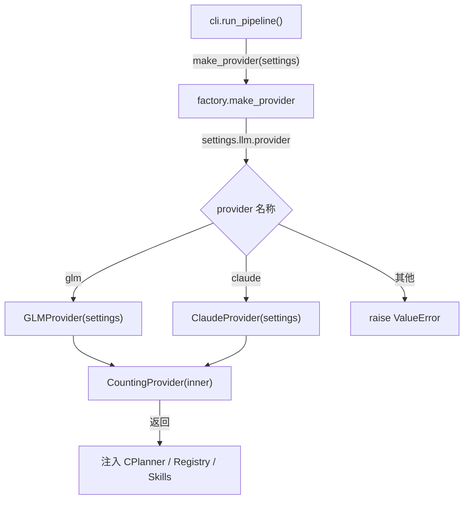

在 Agentic EDA 系统中，CPlanner 编排大脑和 A/B 智能技能层都依赖 LLM 进行推理决策——但它们**从不直接 import** `anthropic` 或 `openai` SDK。所有 LLM 调用统一经过 `LLMProvider` Protocol 抽象，由具体 provider 实现负责将统一中间格式翻译为各厂商 SDK 的原生调用形状。这一设计使得系统可以在智谱 GLM 与 Anthropic Claude 之间无感切换，仅需改动 `settings.toml` 中一行配置。本文将逐层剖析该抽象协议的定义、两个具体后端的翻译策略差异、工厂模式的强制装饰机制，以及各消费方如何统一接入。

## 协议定义：LLMProvider 与核心数据结构

### 三层契约结构

LLM Provider 抽象的权威定义位于 `contracts.py` §2.5，由三个不可分割的结构体组成：`Message`（输入消息）、`LLMResponse`（模型输出）、`LLMProvider`（调用协议）。三者构成一个**封闭的中间格式**——上游消费方只操作 `Message` 列表和 `LLMResponse`，下游 provider 实现负责在中间格式与厂商 SDK 格式之间双向翻译。

```mermaid
graph LR
    subgraph 上游消费方
        CP["CPlanner._call_llm_safe"]
        DG["DiagnoseSkill.LLMAttributor"]
        SH["SelfHealSkill._diagnose_and_patch"]
    end

    subgraph 统一中间格式 contracts.py §2.5
        MSG["Message<br/>role/content/tool_call_id"]
        RSP["LLMResponse<br/>text/tool_calls/tokens"]
        PROTO["LLMProvider Protocol<br/>provider_name + chat()"]
    end

    subgraph 具体后端实现
        GLM["GLMProvider<br/>OpenAI SDK"]
        CLD["ClaudeProvider<br/>Anthropic SDK"]
    end

    CP --> MSG
    DG --> MSG
    SH --> MSG
    MSG --> PROTO
    PROTO --> RSP
    RSP --> CP
    PROTO --> GLM
    PROTO --> CLD
```

`Message` 是一个 frozen dataclass，其设计意图是**将多模态和 tool_use 结构排除在 content 之外**——`content` 字段仅承载纯文本，assistant 的工具调用结构只走 `LLMResponse.tool_calls` 字段回传。`tool_call_id` 在 `role="tool"` 时必填，用于关联 assistant 先前发起的 tool_calls.id，形成完整的 tool-use 回环闭合。

`LLMProvider` 被标注为 `@runtime_checkable Protocol`，这意味着任何具备 `provider_name: str` 属性和正确签名 `chat()` 方法的对象都能通过 `isinstance(x, LLMProvider)` 检查——这是 `CountingProvider` 装饰器能透明代理的关键机制。`chat()` 方法接收消息列表、可选工具描述（JSON Schema 格式来自 Registry）、temperature 和 max_tokens，返回统一的 `LLMResponse`。值得注意的是 `LLMResponse.tool_calls` 的元素形状被锁定为 `{"id": str|None, "name": str, "args": dict}`——`id` 的 Optional 是刻意设计：Claude 原生返回 tool_use.id，而 OpenAI 兼容端点若无则由 provider 层生成 uuid 保证唯一性。

Sources: [contracts.py](../../src/eda_agent/contracts.py#L209-L252), [CONTRACTS.md](../../CONTRACTS.md)

### base.py 的 re-export 约束

`base.py` 是一个极薄的重导出模块——它仅从 `contracts` 导入 `Message`、`LLMResponse`、`LLMProvider` 三个符号，**禁止重定义同名结构**。这是契约验收 C2 的硬性要求：`base.py` 导出的符号必须与 `contracts.py` 中的定义是同一对象（`is` 检查通过），任何重定义行为都会被测试 `test_base_reexports_same_symbols_as_contracts` 拦截。所有调用方统一通过 `from eda_agent.llm.base import Message, LLMResponse, LLMProvider` 获取符号，确保单一权威来源。

Sources: [base.py](../../src/eda_agent/llm/base.py#L1-L12), [test_llm_base.py](../../tests/test_llm_base.py#L43-L47)

## 双后端翻译策略：GLM vs Claude

### 翻译差异全景对比

智谱 GLM 和 Anthropic Claude 在 API 形状上存在三处根本差异，provider 层必须将其消化在内部翻译逻辑中，使上游消费方完全不感知：

| 翻译维度 | GLMProvider (OpenAI 兼容) | ClaudeProvider (Anthropic 原生) |
|---|---|---|
| **system 消息** | 保留在 messages 数组中（OpenAI 支持 system 角色） | 拆出到顶层 `system` 字符串参数（Anthropic 不支持 messages 内 system 角色） |
| **tool 结果消息** | `{"role":"tool","content":...,"tool_call_id":...}` | `{"role":"user","content":[{"type":"tool_result","tool_use_id":...,"content":...}]}` |
| **tools 描述格式** | `[{"type":"function","function":{"name","description","parameters"}}]` | `[{"name","description","input_schema"}]`（字段名直接透传） |
| **响应 text 提取** | `choices[0].message.content` | 遍历 content blocks，拼接 type="text" 的 `.text` |
| **响应 tool_calls 提取** | `choices[0].message.tool_calls[i].function`（arguments 需 JSON 解析） | 遍历 content blocks，提取 type="tool_use" 的 `.id/.name/.input` |
| **usage 字段名** | `prompt_tokens` / `completion_tokens` | `input_tokens` / `output_tokens` |

两种 provider 都实现了相同的三步翻译流水线：`_translate_messages` → `_translate_tools` → SDK 调用 → `_translate_response`。工具描述翻译时两者都采用相同的**降级策略**：优先取 `input_schema`，缺则退 `schema` 别名，再缺给空 object（满足 SDK 必填要求）。这一降级链确保 Registry 输出的中间格式即使字段名不规范也能优雅处理。

Sources: [glm_provider.py](../../src/eda_agent/llm/glm_provider.py#L86-L171), [claude_provider.py](../../src/eda_agent/llm/claude_provider.py#L70-L139)

### GLMProvider 的 OpenAI 兼容封装

`GLMProvider` 是系统的**默认后端**（`settings.llm.provider = "glm"`）。它不使用智谱原生 SDK，而是复用 OpenAI Python SDK 的 `OpenAI(api_key=..., base_url=...)` 客户端——智谱 GLM-5.2 全兼容 OpenAI 接口，仅需将 `base_url` 指向 `open.bigmodel.cn/api/coding/paas/v4`，`api_key` 从环境变量 `GLM_API_KEY` 读取。API key 缺失时构造阶段即抛 `RuntimeError` 并提示填 `.env`，避免运行时神秘失败。

GLM-5.2 的两个特有能力——**思考模式**（`thinking.type=enabled`）和**推理努力档**（`reasoning_effort=max`）——通过 OpenAI SDK 的 `extra_body` 参数透传。这是因为 SDK 会对非标准字段做校验拒绝，`extra_body` 是官方提供的 escape hatch。这两个参数使 GLM-5.2 在 EDA 诊断和 RTL 修复场景中发挥最大推理能力。

```python
# GLMProvider.chat 的 extra_body 透传（非标准字段绕过 SDK 校验）
extra_body: dict[str, Any] = {}
if self._settings.llm.glm_thinking:
    extra_body["thinking"] = {"type": "enabled"}
if self._settings.llm.glm_reasoning_effort:
    extra_body["reasoning_effort"] = self._settings.llm.glm_reasoning_effort
if extra_body:
    kwargs["extra_body"] = extra_body
```

在响应翻译方面，GLMProvider 需要处理 OpenAI 格式的一个特有细节：`tool_calls[i].function.arguments` 是 **JSON 字符串**而非 dict，必须 `json.loads()` 解析。翻译逻辑用 try/except 包裹解析过程，失败时降级为空 dict 而非崩溃——保证上游始终拿到结构化的 `args` 字典。

Sources: [glm_provider.py](../../src/eda_agent/llm/glm_provider.py#L1-L172), [settings.py](../../src/eda_agent/settings.py#L30-L39), [.env.example](../../.env.example)

### ClaudeProvider 的 Anthropic 原生封装

`ClaudeProvider` 作为**备用后端**（`settings.llm.provider = "claude"`），直接使用 Anthropic 官方 SDK 的 `anthropic.Anthropic(api_key=...)` 客户端，API key 从 `ANTHROPIC_API_KEY` 环境变量读取。其翻译逻辑最核心的分歧在于 **system 消息处理**：Anthropic API 不允许 messages 数组中出现 `role="system"` 的消息，因此 ClaudeProvider 在 `_translate_messages` 中将所有 system 消息的内容提取、用 `\n\n` 拼接，放到顶层 `system` 关键字参数传给 SDK。如果不存在 system 消息，则不传 `system` 参数（SDK 不接受空值语义）。

tool 结果消息的翻译同样截然不同：统一中间格式的 `Message(role="tool", content=..., tool_call_id=...)` 在 Anthropic 世界中被翻译为 `{"role":"user","content":[{"type":"tool_result","tool_use_id":...,"content":...}]}`——即伪装成 user 角色消息，content 变为包含 `tool_result` block 的数组。这种适配完全隐藏在 provider 层内部，上游 CPlanner 构造回灌消息时只需用统一的 `Message` 结构。

响应翻译方面，ClaudeProvider 遍历 `resp.content` 的 content blocks：`type="text"` 的 block 拼入 `text` 字段；`type="tool_use"` 的 block 直接映射为 `{"id": b.id, "name": b.name, "args": b.input}`——注意 Anthropic 的 `b.input` 已经是 dict（不像 OpenAI 需 JSON 解析），无需额外处理。usage 直接读 `resp.usage.input_tokens` / `resp.usage.output_tokens`。

Sources: [claude_provider.py](../../src/eda_agent/llm/claude_provider.py#L1-L139)

## 工厂模式与 CountingProvider 强制装饰

### make_provider 的单入口设计

所有 provider 实例化**必须**经过 `make_provider(settings)` 工厂函数——这是契约 §2.5 的硬性约束。工厂按 `settings.llm.provider` 字段选择具体实现（`"glm"` → `GLMProvider`，`"claude"` → `ClaudeProvider`，其余抛 `ValueError`），然后**强制**用 `CountingProvider(inner)` 包装后返回。这一设计确保无论系统中有多少个 provider 实例，每一次 LLM 调用都经过统一的计数器装饰——不依赖每个 provider 的自觉性。



工厂返回的 `CountingProvider` 实例随后被注入到三个位置：CPlanner 构造参数 `llm`、ToolRegistry（经 `build_registry`，供 skills 构造时获取）、以及间接供 A 诊断器和 B 自修复 skill 使用。由于 `CountingProvider` 实现了 `LLMProvider` Protocol（通过 `@runtime_checkable` 的鸭子类型检查），上游代码完全无感——它只看到一个带 `provider_name` 属性和 `chat()` 方法的对象。

Sources: [factory.py](../../src/eda_agent/llm/factory.py#L1-L30), [cli.py](../../src/eda_agent/cli.py#L30-L41)

### CountingProvider 的透明计数装饰

`CountingProvider` 是一个经典的装饰器模式实现：它包裹任意 `LLMProvider`，在每次 `chat()` 调用后累加三项计数（`llm_calls`、`tokens_in`、`tokens_out`），同时**完全透传**所有参数和返回值——不修改、不拦截、不增加任何业务语义。`provider_name` 通过 `@property` 代理到内层 provider，保证 `wrapped.provider_name == inner.provider_name`。

计数累加器 `LLMStats` 是一个可变 dataclass，其实例在 `CountingProvider.__init__` 时创建一次，后续所有调用持续累加到**同一对象**（测试 `test_get_stats_returns_same_accumulating_object` 验证 `first is second`）。CPlanner 在 `_finalize` 阶段通过 `getattr(self._llm, "get_stats", None)` 探测——若 provider 是 `CountingProvider` 则读取统计，否则回退 0。这种 duck-typing 探测避免了对 Protocol 的侵入性扩展（Protocol 不定义 `get_stats` 方法）。

```python
# CPlanner._finalize 中的计数读取（duck-typing 探测）
stats_getter = getattr(self._llm, "get_stats", None)
stats = stats_getter() if callable(stats_getter) else None
llm_calls = stats.llm_calls if stats else 0
tokens_in = stats.tokens_in if stats else 0
tokens_out = stats.tokens_out if stats else 0
```

读取的计数值最终填入 `RunRecord.llm_calls / llm_tokens_in / llm_tokens_out` 和 `RunReport.metrics`，为实验可复现性和成本核算提供数据支撑。值得注意的是 `_finalize` 中的探测逻辑特意设计了回退分支——当直接注入未包装的 provider（如单元测试场景）时不会崩溃。

Sources: [counting.py](../../src/eda_agent/llm/counting.py#L1-L61), [c_planner.py](../../src/eda_agent/planner/c_planner.py#L615-L620), [test_llm_base.py](../../tests/test_llm_base.py#L50-L95)

## 消费方接入：CPlanner 与 Skills 的统一调用

### CPlanner 的安全调用包装

CPlanner 通过 `_call_llm_safe` 方法包装所有 LLM 调用——这是 ReAct 回环的**安全边界**。该方法用 try/except 包裹 `self._llm.chat()`，任何异常（网络超时、API 限流、认证失败等）都被捕获并返回一个**空 tool_calls 的降级 LLMResponse**，使主循环优雅转入 REPORTING 相位而非崩溃。降级响应的 `provider` 字段仍填入 `self._llm.provider_name`，保证 `RunRecord.provider_used` 的正确性。

LLM ReAct 回环的完整数据流为：CPlanner 构造 `Message` 列表（system prompt + task render + 历史工具结果回灌）→ 调用 `_call_llm_safe` → 从 `LLMResponse.tool_calls[0]` 提取工具名和参数 → 经 Registry 校验后执行 → 将 `ToolResult` 序列化为 `Message(role="tool")` 回灌。这套回环的闭合性依赖于 `ToolCall.llm_tool_call_id` 与 `Message.tool_call_id` 的精确映射——provider 层保证 `tool_calls[i].id` 的唯一性，CPlanner 将其透传到 `ToolCall.llm_tool_call_id`，再在回灌消息中填入同一个 id。

Sources: [c_planner.py](../../src/eda_agent/planner/c_planner.py#L536-L605)

### Skills 层的直接调用

A 诊断器（`LLMAttributor`）和 B 自修复（`SelfHealSkill`）通过构造时注入的 `self._llm` 直接调用 `chat()`——不经过 CPlanner 的安全包装，而是在各自层面做异常处理。`LLMAttributor.attribute()` 在 LLM 调用异常时返回降级元组 `("(LLM call failed)", [], False, {})`，使诊断器回退到纯规则层结果。`SelfHealSkill._diagnose_and_patch()` 在 LLM 异常时返回 `PatchOutcome(patch_source="none", applied=False)`，触发策略升级（diff → full_rewrite → diagnose_only）。

两个 skill 的调用签名略有不同：A 诊断器调 `self._llm.chat(msgs, temperature=0.0, max_tokens=2048)`——max_tokens 限制为 2048（归因输出较短）；B 自修复调 `self._llm.chat(messages, temperature=0.0, max_tokens=4096)`——max_tokens 放宽到 4096（完整 RTL 重写需要更多输出空间）。两者都不传 `tools` 参数（skill 层不做工具调用，只做文本生成），而 CPlanner 会传 `tools=registry.to_llm_tools()` 供 LLM 决策下一步工具调用。

Sources: [diagnose.py](../../src/eda_agent/skills/diagnose.py#L427-L468), [self_heal.py](../../src/eda_agent/skills/self_heal.py#L805-L859)

## 切换后端的操作路径

将 LLM 后端从 GLM 切换到 Claude 仅需三步操作，不涉及任何代码修改：

1. **配置 `settings.toml`**：将 `[llm]` 段的 `provider` 改为 `"claude"`
2. **设置 API key**：在 `.env` 文件中填入 `ANTHROPIC_API_KEY=<your-key>`
3. **运行**：系统自动选择 `ClaudeProvider`，其余流程完全无感

切换后，`RunRecord.provider_used` 自动记录为 `"claude"`，`config_snapshot.llm.provider` 同步更新，保证实验对比中 provider 维度的可追溯性。工厂模式确保切换不影响 `CountingProvider` 装饰——无论内层是哪个 provider，计数语义完全一致。

Sources: [settings.toml](../../settings.toml), [.env.example](../../.env.example), [factory.py](../../src/eda_agent/llm/factory.py#L20-L29)

## 测试覆盖策略

LLM Provider 抽象层的测试采用**零网络依赖**策略——两个 provider 的单测都用 `types.SimpleNamespace` 构造 fake response，monkeypatch 替换 SDK 的 `create` 方法，捕获实际传给 SDK 的 kwargs 做断言。这种策略使测试可以在无 API key、无网络的环境下运行，同时精确验证翻译逻辑的正确性。

测试覆盖矩阵按"翻译维度 × provider"组织，确保每处翻译差异都有对应的断言用例：

| 测试文件 | 覆盖范围 | 关键验证点 |
|---|---|---|
| [test_glm_provider.py](../../tests/test_glm_provider.py) | GLM 翻译 + 工厂 glm 分支 | system 消息保留、tool→role="tool"、tools→function 数组、arguments JSON 解析、无 key 报错 |
| [test_llm_provider.py](../../tests/test_llm_provider.py) | Claude 翻译 + 工厂 claude 分支 | system→顶层参数、tool→tool_result block、tools→input_schema 直传、temperature 默认走 settings |
| [test_llm_base.py](../../tests/test_llm_base.py) | re-export + CountingProvider | 符号同一性（`is`）、Protocol 检查通过、计数累加正确、get_stats 返回同一对象 |

Sources: [test_glm_provider.py](../../tests/test_glm_provider.py#L1-L205), [test_llm_provider.py](../../tests/test_llm_provider.py#L1-L210), [test_llm_base.py](../../tests/test_llm_base.py#L1-L95)

## 延伸阅读

- **[CountingProvider 装饰器与调用计量](24_CountingProvider调用计量.md)**：深入剖析装饰器模式的计数累加机制与 `LLMStats` 在 `RunRecord` 中的消费路径。
- **[LLM ReAct 回环：工具决策与历史回灌](10_LLMReAct回环工具决策.md)**：CPlanner 如何构建 `Message` 列表、解析 `tool_calls` 并将 `ToolResult` 回灌 LLM，形成完整的 tool-use 闭环。
- **[配置系统与 settings.toml 结构](08_配置系统与settings结构.md)**：`LLMSettings` dataclass 的完整字段定义与 `.env` 环境变量加载机制。
- **[Skill 到 Tool 的适配层与 reserved 字段拆包](18_Skill到Tool适配层.md)**：Skills 如何通过 `as_tool()` 适配为 Tool 并注入 LLM 可见的 tools schema。