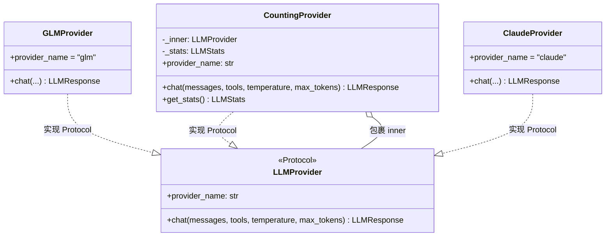
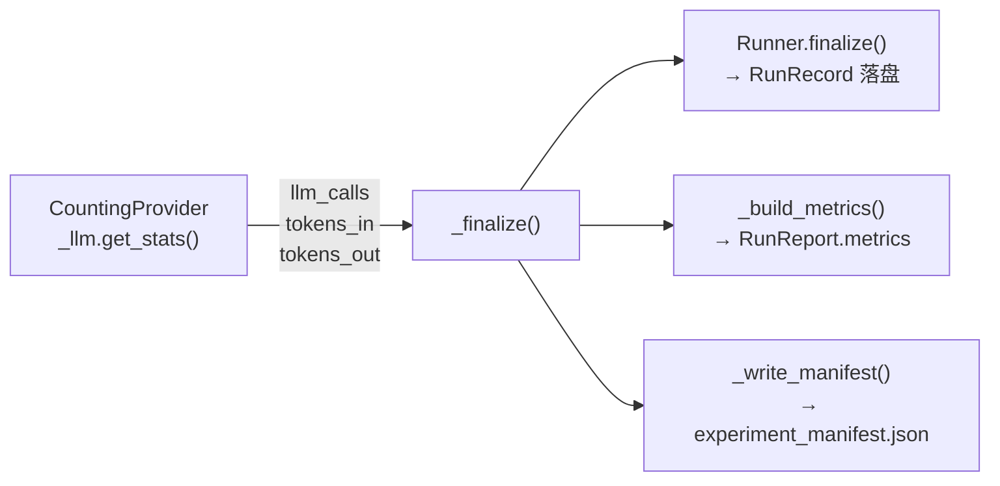

在 Agentic EDA 系统中，每一次 LLM 调用都意味着真实的时间和 Token 开销。系统需要精确追踪这些调用——不是因为记账本身有趣，而是因为 **`RunRecord` 的三个标准字段（`llm_calls`、`llm_tokens_in`、`llm_tokens_out`）直接决定实验对比的可复现性**，而实现方不可能也不应该依赖"每个 provider 自觉计数"。`CountingProvider` 就是为这一问题提供的架构级答案：一个**透明装饰器**，包裹任意 `LLMProvider` 实现，在不引入新抽象的前提下完成统一计数，并在一次 run 结束后被 `CPlanner` 读取，填入落盘轨迹。

## 设计动机：为什么不用"provider 自己计数"

设想三种替代方案及其缺陷：

| 方案 | 问题 |
|------|------|
| 每个 provider（Claude/GLM）各自在 `chat()` 里自增计数器 | 逻辑重复，新加 provider 极易遗漏，违反开闭原则 |
| CPlanner 在每次调用 `llm.chat()` 前后手动计数 | 调用点分散在 ReAct 回环、B 自修复迭代、A 诊断 LLM 归因等多处，极易漏算 |
| 用 AOP/monkey-patch 拦截 `chat()` | 隐式性强，调试困难，不适合 2 人团队 |

`CountingProvider` 选择的是**装饰器模式**——它在 `make_provider()` 工厂里被强制套在每个真实 provider 外层，所有业务代码拿到的 `LLMProvider` 实例实际上就是一个 `CountingProvider`。业务代码无感知，计数自动发生。

Sources: [CONTRACTS.md](../../CONTRACTS.md)（§2.5 计数器统一） · [counting.py](../../src/eda_agent/llm/counting.py#L1-L8)

## 核心数据结构：LLMStats

`LLMStats` 是一个极简的 `@dataclass`，仅持三个整型字段，全部默认为零：

```python
@dataclass
class LLMStats:
    llm_calls: int = 0
    tokens_in: int = 0
    tokens_out: int = 0
```

这三个字段与 `RunRecord` 的标准字段一一对应。`tokens_in` 和 `tokens_out` 的值来源于 LLM 响应中的 `LLMResponse.tokens_in` / `LLMResponse.tokens_out`——这些值由各 provider 实现从 SDK 响应中提取（Claude 走 `resp.usage.input_tokens` / `resp.usage.output_tokens`；GLM 走 OpenAI 格式的 `prompt_tokens` / `completion_tokens`），再由 `CountingProvider` 累加。

Sources: [counting.py](../../src/eda_agent/llm/counting.py#L16-L22) · [contracts.py](../../src/eda_agent/contracts.py#L221-L229)

## 装饰器实现：CountingProvider

`CountingProvider` 是 `LLMProvider` Protocol 的**透明装饰器**。它的全部逻辑可以概括为一句话：**透传调用、累加计数、暴露读取器**。



### 构造与属性委托

```python
class CountingProvider:
    def __init__(self, inner: LLMProvider) -> None:
        self._inner = inner
        self._stats = LLMStats()

    @property
    def provider_name(self) -> str:
        return self._inner.provider_name
```

构造时接收任意 `LLMProvider` 实例存为 `_inner`，并创建一个 `_stats` 累加器。`provider_name` 属性直接**委托**给内部 provider——这意味着无论底层是 `"glm"` 还是 `"claude"`，外界看到的 `provider_name` 始终反映真实的后端标识。这一设计保证了 `CPlanner` 在 `execute()` 中调用 `self._llm.provider_name` 拿到的值能正确写入 `RunRecord.provider_used`。

Sources: [counting.py](../../src/eda_agent/llm/counting.py#L25-L39) · [c_planner.py](../../src/eda_agent/planner/c_planner.py#L88-L95)

### chat() 透传与累加

```python
def chat(self, messages, tools=None, temperature=0.0, max_tokens=4096) -> LLMResponse:
    resp = self._inner.chat(messages, tools=tools,
                            temperature=temperature, max_tokens=max_tokens)
    self._stats.llm_calls += 1
    self._stats.tokens_in += resp.tokens_in
    self._stats.tokens_out += resp.tokens_out
    return resp
```

`chat()` 的签名与 `LLMProvider.chat()` **完全一致**，参数原封不动透传给 `_inner.chat()`。拿到 `LLMResponse` 后，三项计数各自 `+=`，最后**原样返回**响应对象。关键设计点：

- **计数发生在调用成功之后**——如果 `_inner.chat()` 抛出异常（如 API 超时），计数器不会自增，异常向上传播由 `_call_llm_safe` 统一处理为 `eda.llm_call_failed`。
- **`get_stats()` 返回的是同一个对象实例**，字段在多次调用间持续累加，而非每次返回快照副本。这一点由测试明确锁定。

Sources: [counting.py](../../src/eda_agent/llm/counting.py#L41-L60) · [test_llm_base.py](../../tests/test_llm_base.py#L74-L87)

## 工厂强制包装：make_provider()

`CountingProvider` 的有效性建立在**"所有业务代码拿到的 LLM 实例必然是包装过的"**这一前提之上。这个前提由 `make_provider()` 工厂函数保证：

```python
def make_provider(settings: Settings) -> LLMProvider:
    name = settings.llm.provider
    if name == "glm":
        inner = GLMProvider(settings)
    elif name == "claude":
        inner = ClaudeProvider(settings)
    else:
        raise ValueError(f"unknown llm provider: {name}")
    return CountingProvider(inner)   # ← 强制包装
```

工厂函数的返回类型标注为 `LLMProvider`（Protocol），但**实际返回的永远是 `CountingProvider` 实例**。契约 §2.5 明确规定：工厂必须返回 `CountingProvider` 包装，`RunRecord` 的计数依赖此装饰。`__init__.py` 将 `CountingProvider` 和 `LLMStats` 一并 re-export，供上层 import。

Sources: [factory.py](../../src/eda_agent/llm/factory.py#L20-L30) · [__init__.py](../../src/eda_agent/llm/__init__.py#L1-L11)

## 消费端：CPlanner 如何读取计数

`CountingProvider` 的计数最终在 `CPlanner._finalize()` 中被消费，填入三处产物：



`_finalize()` 的读取逻辑使用 **duck-typing** 而非硬类型断言：

```python
stats_getter = getattr(self._llm, "get_stats", None)
stats = stats_getter() if callable(stats_getter) else None
llm_calls = stats.llm_calls if stats else 0
tokens_in = stats.tokens_in if stats else 0
tokens_out = stats.tokens_out if stats else 0
```

这种 `getattr` + `callable` 的防御式写法意味着：如果未来有人绕过工厂直接传入裸 provider（没有 `get_stats` 方法），系统不会崩溃，只是计数归零。三个计数值随后被传递给：

- **`Runner.finalize()`**：写入 `run.json` 的 `llm_calls` / `llm_tokens_in` / `llm_tokens_out` 字段。
- **`_build_metrics()`**：填充 `RunReport.metrics` 标准字段集（15 字段之一）。
- **`_write_manifest()`**：写入 `experiment_manifest.json` 的 `llm_calls` 和 `tokens_total`（= `tokens_in + tokens_out`）字段，供实验聚合脚本 `summarize_eval.py` 汇总。

Sources: [c_planner.py](../../src/eda_agent/planner/c_planner.py#L608-L657) · [runner.py](../../src/eda_agent/runner.py#L156-L184)

## Protocol 鸭子类型验证

`CountingProvider` 并未显式声明 `class CountingProvider(LLMProvider)`——它通过**结构化鸭子类型**隐式满足 `LLMProvider` Protocol。Protocol 的 `@runtime_checkable` 装饰器使得 `isinstance()` 检查在运行时生效：

```python
# contracts.py 中定义的 Protocol
@runtime_checkable
class LLMProvider(Protocol):
    provider_name: str
    def chat(self, messages, tools=None, temperature=0.0, max_tokens=4096) -> LLMResponse: ...
```

测试 `test_counting_provider_passes_runtime_protocol_check` 明确验证：`isinstance(CountingProvider(fake), LLMProvider)` 返回 `True`。这保证了 `CPlanner` 的构造参数 `llm: LLMProvider` 在类型层面不会对 `CountingProvider` 实例产生任何障碍。

Sources: [contracts.py](../../src/eda_agent/contracts.py#L232-L242) · [test_llm_base.py](../../tests/test_llm_base.py#L50-L59)

## 测试验证矩阵

`tests/test_llm_base.py` 使用一个 `_FakeProvider`（固定返回 `tokens_in=10, tokens_out=5` 的 LLMResponse）来验证 `CountingProvider` 的全部行为约定：

| 测试函数 | 验证点 | 预期 |
|---------|--------|------|
| `test_base_reexports_same_symbols_as_contracts` | `base.py` 是 re-export，不重定义 | `ReExportedMessage is Message`（同一对象） |
| `test_counting_provider_passes_runtime_protocol_check` | 装饰器满足 Protocol | `isinstance(wrapped, LLMProvider) == True` |
| `test_provider_name_is_delegated_to_inner` | `provider_name` 委托 | `wrapped.provider_name == "fake"` |
| `test_counts_accumulate_over_repeated_calls` | 多次调用后累加 | 3 次调用 → `llm_calls=3, tokens_in=30, tokens_out=15` |
| `test_get_stats_returns_same_accumulating_object` | `get_stats()` 返回同一实例 | `first is second`，且第二次读取时已含 2 次调用计数 |
| `test_llm_stats_default_zero` | `LLMStats` 默认值 | 全零 |

Sources: [test_llm_base.py](../../tests/test_llm_base.py#L1-L95)

## 一图总览：从工厂到落盘的完整链路

```mermaid
flowchart TD
    subgraph 初始化
        S["Settings"] -->|"settings.llm.provider"| F["make_provider()"]
        F -->|"构造 inner"| GP["GLMProvider"]
        F -->|"构造 inner"| CP["ClaudeProvider"]
        GP --> CC["CountingProvider"]
        CP --> CC
    end

    subgraph 运行期
        CC -->|"chat() 透传 + 累加"| C2["CPlanner\n(ReAct 回环)"]
        C2 -->|"A/B Skill 内部\n也通过同一 provider 调用"| SK["DiagnoseSkill\nSelfHealSkill"]
        CC -.->|"每次 chat 后\nllm_calls++\ntokens_in +=\ntokens_out +="| SS["_stats: LLMStats"]
    end

    subgraph 收尾
        C2 -->|"getattr get_stats()"| SS
        SS --> RR["Runner.finalize()\n→ run.json"]
        SS --> MM["_write_manifest()\n→ experiment_manifest.json"]
    end
```



整个计量体系的本质是：**一处装饰（工厂），全局生效**。无论是 CPlanner 的 ReAct 回环、诊断器的 LLM 归因、还是自修复的 patch 生成——只要调用链最终经过同一个 `CountingProvider` 实例的 `chat()`，计数就会被自动累加。这正是契约 §2.5 "计数器统一"所要求的"一处实现，不靠每个 provider 自觉"。

## 延伸阅读

- **[LLM Provider 抽象协议与多后端支持](23_LLMProvider抽象协议.md)**：`CountingProvider` 所包裹的 `GLMProvider` 和 `ClaudeProvider` 如何翻译统一的 `Message` / `tools` 格式为各 SDK 原生形状。
- **[RunRecord 落盘与完整轨迹追溯](25_RunRecord落盘轨迹追溯.md)**：`CountingProvider` 的计数最终如何写入 `run.json` 的 `llm_calls` / `llm_tokens_in` / `llm_tokens_out` 字段。
- **[实验聚合与通过率门槛（S1 达标规则）](28_实验聚合通过率门槛S1.md)**：`experiment_manifest.json` 中的 `llm_calls` 和 `tokens_total` 如何被 `summarize_eval.py` 聚合。
- **[五相状态机：PLANNING 到 DONE 的流转](09_五相状态机Planning到Done.md)**：`_finalize()` 阶段（REPORTING 相）在哪里读取计数并产出终态报告。