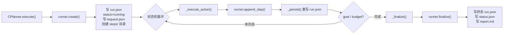
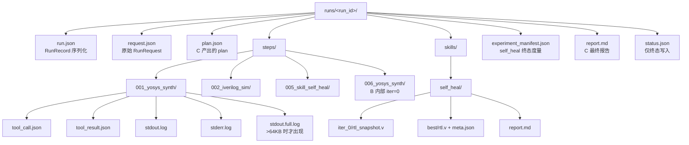
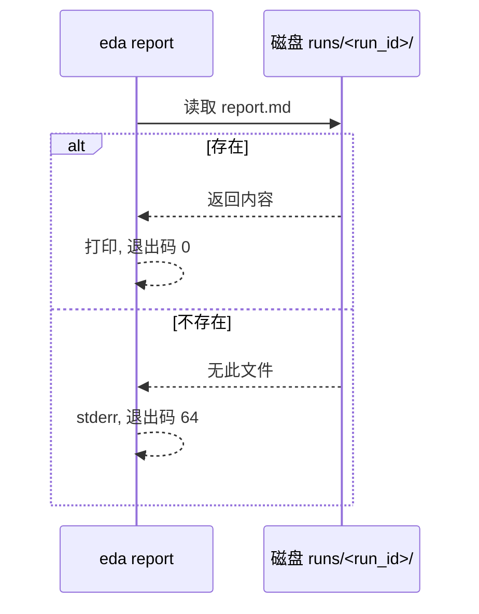

RunRecord 是 Agentic EDA 系统的 L0 工件存储核心——每一次用户请求从创建到终结的全生命周期轨迹，都被增量地、原子性地持久化到 `runs/<run_id>/` 目录树中。它不仅满足"实验记录 / 失败案例"的可追溯要求，更提供了跨进程可读、跨组件可引用、崩溃可自愈的完整追溯能力。本页深入解析 RunRecord 的数据结构、落盘时机、目录拓扑、日志裁剪策略、Skill 子步嵌入机制，以及僵尸 Run 自愈逻辑。

Sources: [runner.py](../../src/eda_agent/runner.py#L1-L14)

## RunRecord 数据模型：契约级字段与版本锚点

RunRecord 与 StepRecord 是定义在 `contracts.py` 中的两个核心 dataclass，严格对齐 CONTRACTS.md §2.4。RunRecord 承载 run 级元数据（run_id、status、config_snapshot 等），StepRecord 承载每一步工具调用的索引、路径、耗时和 Skill 隶属标记。

RunRecord 的关键字段包括 **status**（四态：`running` → `ok` / `failed` / `budget_exhausted`）、**steps**（StepRecord 列表，含 Skill 内部每一步）、**llm_calls / llm_tokens_in / llm_tokens_out**（经 CountingProvider 统一计数）、以及 **config_snapshot**（实验可复现性的完整环境快照）。其中 `contract_version` 必须从 `from eda_agent.contracts import CONTRACT_VERSION` 引用，禁止裸字符串——这是集成两端做 schema 漂移检测的唯一锚点。

StepRecord 的核心设计在于 **skill_name / iter 两个可选字段**。当 CPlanner 直接调用工具时，这两个字段为 `None`；当工具属于 B（skill_self_heal）的内部迭代时，`skill_name="self_heal"` 且 `iter=0,1,2,...` 标记该步属于 Skill 的第几轮。这一设计让父 RunRecord.steps 成为一条**扁平但带 Skill 语义标记的完整时间线**，避免了 RunRecord 嵌套爆炸，同时保留了迭代结构的可追溯性。

| 字段 | 类型 | 语义 | 写入时机 |
|---|---|---|---|
| `run_id` | str | `YYYYmmdd_HHMMSS_<4hex>` | `create()` |
| `status` | Literal[4] | running → 终态 | 每次 `_persist()` |
| `steps` | list[StepRecord] | 全局递增序号 | 每次 `append_step()` |
| `contract_version` | str | 版本锚点 | `create()` |
| `config_snapshot` | dict | 实验可复现快照 | `create()` |
| `llm_calls` | int | LLM 调用计数 | `finalize()` |
| `total_duration_s` | float | 壁钟时间 | `finalize()` |

Sources: [contracts.py](../../src/eda_agent/contracts.py#L162-L206), [CONTRACTS.md](../../CONTRACTS.md)

## 落盘三阶段生命周期：create → append_step → finalize

RunRecord 的落盘严格遵循三阶段模式。CPlanner 在 `execute()` 入口调用 `runner.create()` 初始化记录，在五相状态机的每次工具执行后调用 `runner.append_step()` 增量追加 StepRecord，最终在 `_finalize()` 阶段调用 `runner.finalize()` 写入终态。整个过程中，**`_persist()` 方法在每次状态变更时全量重写 `run.json`**，保证进程在任何时刻被杀死，磁盘上的 `run.json` 都是一份自洽的快照。

`create()` 方法生成 `run_id`，创建 `runs/<run_id>/steps/` 目录树，构造初始 RunRecord（status="running"），落盘 `request.json`（RunRequest 的 asdict），然后立即调用 `_persist()` 写入首版 `run.json`。这里有一个关键设计：**run_id 使用 `secrets.token_hex(2)` 生成 4 位十六进制后缀**，在保证时间戳排序性的同时提供同一秒内多 run 的唯一性。

`finalize()` 方法是终态的唯一写入点。它更新 status、llm 计数和 total_duration_s，重写 `run.json`，然后**额外写入 `status.json`**——后者只在终态出现，`running` 态永不写 status.json。这一约定是僵尸 Run 自愈机制的判定基础。

Sources: [runner.py](../../src/eda_agent/runner.py#L107-L184), [c_planner.py](../../src/eda_agent/planner/c_planner.py#L87-L162)

## 目录拓扑：单次 Run 的完整工件树

CONTRACTS.md §2.4 定义了唯一权威的目录树结构。理解这棵树的结构，是阅读任何一次 run 轨迹的前提。

StepRecord 目录的命名规则为 **`<3位序号>_<tool_name>/`**（如 `001_yosys_synth`），序号从 1 开始，在父 RunRecord.steps 中全局递增。B 的内部迭代子步**不生成独立 run_id**，而是继续追加到父目录的 steps/ 下，序号接续递增。这意味着一个 5 轮迭代的 self_heal run，其 steps/ 目录下可能有 20+ 个子目录——C 直接调用的入口步（skill_name=None）与 B 内部的每轮综合/仿真/诊断步（skill_name="self_heal", iter=0~4）交替排列。

Sources: [CONTRACTS.md](../../CONTRACTS.md), [runner.py](../../src/eda_agent/runner.py#L198-L249)

## append_step 实现：ToolCall/ToolResult 序列化与 stdout/stderr 裁剪

`append_step()` 是 Runner 中最复杂的方法，它负责把一次 ToolCall/ToolResult 对完整落盘为 StepRecord。其核心流程包括：计算序号、创建 step 子目录、序列化 tool_call.json 与 tool_result.json、裁剪 stdout/stderr 并落盘、构造 StepRecord 并追加到父 RunRecord.steps、最后 `_persist()` 重写 run.json。

**stdout/stderr 的 64KB 裁剪策略**是设计中的精妙之处。当原始日志 ≤64KB（_CLIP_HEAD=32768 + _CLIP_TAIL=32768），原样落盘到 `stdout.log`，不生成 `.full.log`。当超过 64KB，保留头部 32KB 和尾部 32KB，中段替换为标记行 `[...N lines truncated, see stdout.full.log]`，同时把完整原文写入 `stdout.full.log`。这一策略保证了诊断器（A 组件）能始终拿到尾部的关键错误行（Verilog 编译器错误通常在末尾），同时避免 `run.json` 因内嵌超大字符串而膨胀。A 组件读取 evidence 时**优先读 `.full.log` 文件**，不依赖内存里的裁剪串。

| 日志文件 | 生成条件 | 内容 |
|---|---|---|
| `stdout.log` | 总是 | 裁剪版（≤64KB）或原文（≤64KB） |
| `stderr.log` | 总是 | 同上 |
| `stdout.full.log` | 原文 > 64KB | 完整原文 |
| `stderr.full.log` | 原文 > 64KB | 完整原文 |

`_to_jsonable()` 辅助函数处理 dataclass 到 dict 的序列化转换，`asdict()` 递归把 ToolCall/ToolResult 的嵌套 dataclass 字段展开为纯 JSON 可序列化结构，保证 `json.dumps` 不报错。

Sources: [runner.py](../../src/eda_agent/runner.py#L52-L71), [runner.py](../../src/eda_agent/runner.py#L198-L249)

## Skill 子步嵌入：B 自修复的轨迹如何融入父 RunRecord

B（skill_self_heal）是一个内部迭代的 Skill：它会在一个循环中反复执行综合→仿真→诊断→patch，每轮可能调用 3~4 个子工具。按照契约 §2.4 的规则，**B 不为每次迭代生成独立 run_id**——否则会导致 RunRecord 嵌套爆炸。取而代之的是，B 通过构造时注入的 `self._runner` 引用，将每一轮的子工具调用以 `append_step(parent_run_id, call, result, skill_name="self_heal", iter=n)` 的形式追加到父 RunRecord.steps。

这一机制在 SelfHealSkill 的 `_stage_synth()`、`_stage_sim()`、`_stage_sta()` 和 `_diagnose_and_patch()` 中实现。每个 stage helper 构造 `ToolCall`（caller="self_heal"），从 registry 取 Tool 执行，然后调用 `self._runner.append_step(run_id, call, res, skill_name="self_heal", iter=iter_n)`。Skill 构造时的 runner 注入由 `build_registry(provider, runner, settings)` 完成，消除了 v1.1 中 B 子步无法落 StepRecord 的集成断点。

下表对比了 CPlanner 直接调用与 Skill 内部调用的 StepRecord 差异：

| 调用方 | skill_name | iter | caller | 语义 |
|---|---|---|---|---|
| CPlanner `_execute_action` | None | None | "planner" | C 状态机直接编排的工具调用 |
| SelfHealSkill `_stage_synth` | "self_heal" | 0,1,2,... | "self_heal" | B 第 N 轮的综合子步 |
| SelfHealSkill `_diagnose_and_patch` | "self_heal" | 0,1,2,... | "self_heal" | B 第 N 轮的诊断子步 |

**独立验证步**是 v1.2 引入的特殊 StepRecord。当 B 报告 `convergence_cause="all_pass"` 后，CPlanner **不立即标记 goal_achieved**，而是设置 `state.pending_self_heal_all_pass=True`，然后在下一个循环中强制注入一个独立的 `iverilog_sim` 调用（skill_name=None），用 B 产出的 best/rtl.v 做第三方校验。这一步的 StepRecord 在 steps/ 目录中表现为一个 `NNN_iverilog_sim/` 目录，skill_name=None，与 B 内部的仿真子步形成清晰的区分。

Sources: [self_heal.py](../../src/eda_agent/skills/self_heal.py#L667-L713), [c_planner.py](../../src/eda_agent/planner/c_planner.py#L323-L352), [CONTRACTS.md](../../CONTRACTS.md)

## config_snapshot：实验可复现性的环境指纹

`config_snapshot` 是 RunRecord 中承载实验可复现信息的 dict 字段，由 `make_config_snapshot()` 函数在 `create()` 时构造并注入。它记录了本次 run 的完整运行环境，使得两个 run 之间的差异可以被归因到具体的环境变量变化而非随机性。

config_snapshot 包含五个维度：**llm**（provider、model、temperature、max_tokens）、**eda**（yosys_version、iverilog_version、opensta_version，由 CPlanner 在真跑工具后填充，Phase1/工具未就绪时为空 dict）、**contract_version**（= CONTRACT_VERSION）、**settings_hash**（settings.toml 的 SHA-256 前 12 位）、**planner_mode**（"llm" 或 "rule"）。

`settings_hash()` 函数读取 settings.toml 文件的原始字节，计算 SHA-256 摘要并截取前 12 位。文件缺失时返回空串（表示用默认 Settings，无可复现哈希）。这个哈希值让开发者可以快速判断两次 run 是否使用了相同的配置文件，是 provider 切换实验对比的核心依据。

Sources: [runner.py](../../src/eda_agent/runner.py#L81-L104), [settings.py](../../src/eda_agent/settings.py#L146-L157)

## status.json 与僵尸 Run 自愈

`status.json` 是一个**仅终态写入**的轻量标记文件，内容为 `{"run_id": ..., "status": "ok"/"failed"/...}`。它的存在与否是僵尸 Run 自愈机制的判定基础：`running` 态的 run 永远不写 status.json——如果磁盘上看到 status.json，说明 run 已经正常终结；如果 run.json 中 status 仍为 "running" 但没有 status.json，且 created_at 距今超过阈值，则判定为崩溃（僵尸）。

`scavenge_zombies()` 方法在进程启动时被调用（CLI 入口 `run_pipeline` 的第一行）。它扫描 `runs/` 目录下所有子目录，读取每个 `run.json`，筛选 status=="running" 的记录，计算 `created_at` 距今的时间差，超过 `run_budget_s * 2`（默认 1200 秒）的标记为 "failed"。标记操作包括：**重写 run.json 的 status 字段为 "failed"**，并写入 status.json，后者额外包含 `crash: True`、`reason: "zombie_scavenged"`、`age_s`、`threshold_s` 和 `scavenged_at` 等调试字段。

这一机制保证了**对比实验 diff 两个 run 目录时不会因僵尸 run 误判**——如果上次实验因进程崩溃留下了一个 running 态的 run，下次实验启动时会自动清理它，不会污染聚合统计。

Sources: [runner.py](../../src/eda_agent/runner.py#L251-L300), [cli.py](../../src/eda_agent/cli.py#L30-L41), [CONTRACTS.md](../../CONTRACTS.md)

## experiment_manifest.json：单 Run 实验度量终态

当 self_heal 类型的 run 进入终态（非 baseline_only），CPlanner 的 `_finalize()` 会额外调用 `_write_manifest()` 落盘 `experiment_manifest.json`。这是一个包含 **14 个标准字段**的实验度量文件，是实验聚合层（[实验聚合与通过率门槛](28_实验聚合通过率门槛S1.md)）的输入。

manifest 的写入使用**原子写**策略：先写入 `experiment_manifest.json.tmp`，然后通过 `os.replace()` 原子性地重命名为正式文件名。这保证了即使写入过程中进程崩溃，也不会留下一个半写的损坏文件。

| 字段 | 来源 | 语义 |
|---|---|---|
| `run_id` | 本次 run | 唯一标识 |
| `baseline_run_id` | `request.extra` | 基线 run 的 run_id（透传） |
| `design_id` | `request.extra` | 设计标识（如 "counter_bitwidth"） |
| `fault_type` | `request.extra` | 故障类型（syntax/comb_logic/timing_reset/bitwidth） |
| `baseline_pass_rate` | `request.extra` | 基线通过率（0.0 或 1.0） |
| `self_heal_pass_rate` | `metrics` | convergence=="all_pass" → 1.0，否则 0.0 |
| `self_heal_convergence` | `metrics` | all_pass/max_iter/regression/budget/none |
| `candidates_at_best_score` | `self_heal/best/meta.json` | 达到 best_score 的最早轮（tie-break 复核） |
| `contract_version` | CONTRACT_VERSION | 版本锚点 |

值得注意的是 `candidates_at_best_score` 字段：CPlanner 从 B 落盘的 `runs/<run_id>/self_heal/best/meta.json` 读取。如果 B 因 budget_exhausted 或其他原因未能落盘 best/meta.json，该字段为 `None`——测试用例明确验证了这一边界行为。

Sources: [c_planner.py](../../src/eda_agent/planner/c_planner.py#L659-L706), [CONTRACTS.md](../../CONTRACTS.md), [test_experiment_manifest.py](../../tests/test_experiment_manifest.py#L150-L200)

## 跨进程读取：load_record 与 eda report 子命令

Runner 提供了 `load_record(run_id)` 方法，从磁盘读取 `run.json` 并反序列化为 dict。这支持了跨进程场景：`eda report <run_id>` 子命令直接从 `runs/<run_id>/report.md` 读取并打印最终报告，退出码为 0（存在）或 64（不存在）。虽然 report 子命令读取的是 report.md 而非 run.json，但 `load_record` 为未来的工具（如 MCP server 或外部分析脚本）提供了结构化访问入口。

`get_record(run_id)` 方法则从内存中的 `_records` 字典读取——这只在**同一进程内**有效（CPlanner 状态机运行期间）。`_records` 是一个 `dict[str, RunRecord]`，在 `create()` 时写入，在 `append_step()` / `finalize()` 时更新其引用。

Sources: [runner.py](../../src/eda_agent/runner.py#L186-L194), [cli.py](../../src/eda_agent/cli.py#L101-L107)

## 轨迹完整性保证：崩溃兜底与异常报告

CPlanner 的 `execute()` 方法包裹在 try-except 中。当任何未捕获异常发生时，`_emergency_report()` 被调用，它通过 `runner.finalize()` 将 RunRecord 标记为 "failed"，返回一个 `report_path=""` 的 emergency RunReport（summary 包含异常类型和完整 traceback）。这保证了即使系统崩溃，磁盘上的 run.json 也会以终态写入，不会留下一个永远 running 的僵尸目录。

正常终态路径中，`_finalize()` 方法会依次：从 CountingProvider 读取 LLM 计数（非 CountingProvider 时回退 0）、判定终态 status（baseline_only 跑完即 ok / goal_achieved → ok / budget 耗尽 → budget_exhausted / 否则 → failed）、构造 15 字段 metrics、落盘 `report.md`（含 Steps 表格）、调用 `runner.finalize()`、最后按需落盘 `experiment_manifest.json`。

一条 trajectory 是否完整的判定标准：**父 RunRecord.status 为终态（ok/failed/budget_exhausted）且磁盘上存在对应的 status.json**。status.json 的缺失意味着进程在 finalize 之前崩溃，该 run 将在下次启动时被 scavenge_zombies 标记为 failed。

Sources: [c_planner.py](../../src/eda_agent/planner/c_planner.py#L607-L657), [c_planner.py](../../src/eda_agent/planner/c_planner.py#L811-L827), [runner.py](../../src/eda_agent/runner.py#L156-L184)

## 相关页面

- **[僵尸 Run 自愈机制](26_僵尸Run自愈机制.md)** — 深入 scavenge_zombies 的阈值计算与 status.json 标记协议
- **[版本锚点与工件引用协议](07_版本锚点与工件引用协议.md)** — artifact_ref 工厂函数与 CONTRACT_VERSION 的跨组件一致性保证
- **[实验聚合与通过率门槛](28_实验聚合通过率门槛S1.md)** — experiment_manifest.json 如何被聚合为 experiment_summary.json
- **[配置系统与 settings.toml 结构](08_配置系统与settings结构.md)** — config_snapshot 中 settings_hash 的来源
- **[RTL 自修复闭环（组件 B）](15_RTL自修复闭环组件B.md)** — B 的内部迭代如何通过 append_step 嵌入父 RunRecord