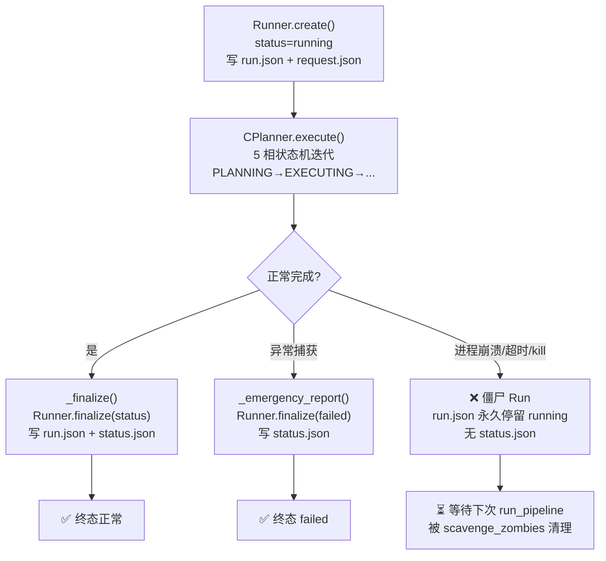

在 Agentic EDA 系统的实验场景中（如 8 个 bug 并行自修复实验），每个 Run 在创建时即被标记为 `running` 状态并落盘。如果进程因超时终止、OOM 崩溃或被外部 kill 而未能执行正常的终态写入，该 Run 的 `run.json` 将永久停留在 `running`——成为一个**僵尸 Run**。本页深入解析系统如何通过 `scavenge_zombies()` 机制在每次新 Run 启动时自动扫描并清理这些僵尸记录，确保实验数据的一致性与可追溯性。

Sources: [runner.py](../../src/eda_agent/runner.py#L1-L14)

## 问题本质：终态写入的原子性缺口

理解僵尸 Run 的成因，需要先梳理 Run 的完整生命周期。一次 `run_pipeline()` 调用涉及三个关键写入阶段，中间任一阶段因进程异常而断裂，就会产生僵尸。



CPlanner 的 `execute()` 方法用 `try/except` 包裹了整个状态机循环，理论上所有异常都会被 `_emergency_report()` 捕获并写入 `failed` 终态。然而，当异常发生在 Python 解释器之外——例如 bash 工具超时强杀进程、操作系统 OOM Killer 直接终止 Python、或用户手动 Ctrl+C 时——`try/except` 无法拦截，`finalize()` 永远不会被调用。

Sources: [c_planner.py](../../src/eda_agent/planner/c_planner.py#L87-L162), [runner.py](../../src/eda_agent/runner.py#L123-L184)

### 并行实验场景的放大效应

系统的核心实验（T54 全量自修复实验）通过 `.wf/phase7_t54_full.js` 编排，将 8 个 bug 并行分发到独立 agent，每个 agent 调用 `run_self_heal.py --run-budget 400`。这意味着同一 `runs/` 目录下同时存在 8 个 `running` 状态的 Run 目录。如果其中一个 agent 的 bash 工具因 600 秒超时被强杀，该 Run 就会变为僵尸。

Sources: [phase7_t54_full.js](../../.wf/phase7_t54_full.js#L1-L77)

## 自愈机制核心：scavenge_zombies()

僵尸清理的逻辑完全封装在 `Runner.scavenge_zombies()` 方法中，在每次 `run_pipeline()` 入口被同步调用。

### 调用时机

```python
def run_pipeline(request: RunRequest, settings: Settings) -> RunReport:
    provider = make_provider(settings)
    runner = Runner(runs_dir="runs", settings=settings)
    runner.scavenge_zombies(settings.run_budget_s)   # ← 每次 Run 启动前先扫僵尸
    registry = build_registry(provider=provider, runner=runner, settings=settings)
    planner = CPlanner(registry=registry, llm=provider, runner=runner, settings=settings)
    return planner.execute(request)
```

调用点位于 `run_pipeline()` 的第二行——在 `build_registry()` 和 `CPlanner` 构造之前。这个位置的选择有明确的语义：**先清理历史遗留，再创建新 Run**，保证新 Run 诞生在一个干净的目录环境中。

Sources: [cli.py](../../src/eda_agent/cli.py#L30-L41)

### 扫描算法

`scavenge_zombies()` 的扫描逻辑遵循三个过滤条件，逐层收窄候选集：

| 过滤步骤 | 条件 | 目的 |
|---|---|---|
| 目录过滤 | `run_dir.is_dir()` | 跳过非目录文件 |
| 文件过滤 | `run.json` 存在且可解析 | 跳过损坏/未初始化的目录 |
| 状态过滤 | `status == "running"` | 只清理未终结的 Run |
| 时间过滤 | `age > threshold` | 避免误杀正在进行中的 Run |

```python
def scavenge_zombies(self, run_budget_s: float) -> int:
    threshold = run_budget_s * 2
    now = datetime.now(timezone.utc)
    n = 0
    for run_dir in self._runs_dir.iterdir():
        if not run_dir.is_dir():
            continue
        run_json = run_dir / "run.json"
        if not run_json.exists():
            continue
        # ... 读取并检查 status / created_at ...
        if age > threshold:
            # 标记为 failed 并写入 status.json
            n += 1
    return n
```

整个方法返回清理的僵尸数量，但不做任何日志输出或告警——这是一个**静默自愈**过程，不干扰主流程。

Sources: [runner.py](../../src/eda_agent/runner.py#L253-L300)

### 阈值设计：run_budget_s × 2

僵尸判定的核心阈值是 `run_budget_s * 2`，即 Run 预算的两倍。默认配置下：

| 配置场景 | `run_budget_s` | 僵尸阈值（2×） | 语义 |
|---|---|---|---|
| 默认 settings.toml | 600s | 1200s（20 分钟） | 标准实验预算 |
| T54 实验脚本 `--run-budget 400` | 400s | 800s（~13 分钟） | 并行实验压缩预算 |
| CLI `--run-budget 300` | 300s | 600s（10 分钟） | 快速实验 |

两倍乘数是一个**安全冗余设计**。一次正常 Run 即使触发预算耗尽，也需要额外时间完成 REPORTING 阶段（写 report.md、experiment_manifest.json、status.json）。如果阈值恰好等于 `run_budget_s`，一个正在收尾的正常 Run 可能被误判为僵尸。两倍冗余确保：**只有在预算耗尽后仍然残留足够长时间（另一整个预算周期）的 Run，才被确认为僵尸**。

Sources: [runner.py](../../src/eda_agent/runner.py#L253-L258), [settings.py](../../src/eda_agent/settings.py#L59-L65)

## 清理产物：status.json 的崩溃元数据

当 `scavenge_zombies()` 判定一个 Run 为僵尸时，它会执行两个写操作：

1. **更新 `run.json`**：将 `status` 字段从 `"running"` 改写为 `"failed"`
2. **写入 `status.json`**：落盘一份包含完整崩溃诊断信息的 JSON

正常终态的 `status.json` 只有两个字段：

```json
{"run_id": "20260715_103022_a3f1", "status": "ok"}
```

而僵尸清理产出的 `status.json` 携带六个诊断字段，标记了崩溃性质和清理时间：

```json
{
    "run_id": "20260715_103022_a3f1",
    "status": "failed",
    "crash": true,
    "reason": "zombie_scavenged",
    "age_s": 945.3,
    "threshold_s": 800,
    "scavenged_at": "2026-07-15T10:46:12.456789+00:00"
}
```

| 字段 | 类型 | 含义 |
|---|---|---|
| `crash` | `true` | 布尔标记，区分正常 failed 与崩溃 failed |
| `reason` | `"zombie_scavenged"` | 固定字面量，便于 grep 与程序化过滤 |
| `age_s` | `float` | 僵尸存活秒数（created_at 至 scavenged_at） |
| `threshold_s` | `int` | 当次清理使用的阈值（`run_budget_s * 2`） |
| `scavenged_at` | `ISO8601` | 清理操作的 UTC 时间戳 |

`crash: true` 与 `reason: "zombie_scavenged"` 的组合使开发者或脚本能够一眼区分"逻辑失败"（RTL 修复未通过仿真导致的 `failed`）与"进程崩溃"（超时/OOM 导致的 `failed`）。在对比实验的 diff 场景中，这一区分至关重要——避免将崩溃 Run 误计为正常实验的失败。

Sources: [runner.py](../../src/eda_agent/runner.py#L278-L298), [runner.py](../../src/eda_agent/runner.py#L156-L184)

## 对实验聚合的影响

僵尸 Run 对实验聚合管线（`summarize_eval.py`）的影响被天然隔离。聚合脚本只扫描 `runs/<run_id>/experiment_manifest.json` 文件——而 manifest 仅由 CPlanner 的 `_write_manifest()` 在 `_finalize()` 中原子写入（`os.replace` tmp→final）。僵尸 Run 从未到达 `_finalize()`，因此不会有 manifest 文件，自然被聚合脚本跳过。

然而，如果僵尸 Run 的 `run.json` 停留在 `running` 状态未被清理，它会在以下场景造成干扰：

- **手动 diff 对比**：开发者对比两个 `runs/` 目录时，`running` 状态的 Run 会混淆分析
- **磁盘清理决策**：自动化脚本可能因 `running` 状态而保留本应归档的僵尸目录
- **状态一致性审计**：跨 Run 的状态分布统计出现虚假的 `running` 计数

`scavenge_zombies()` 通过在新 Run 启动前先清理僵尸，确保了上述场景的状态一致性。

Sources: [summarize_eval.py](../../scripts/summarize_eval.py#L34-L49), [c_planner.py](../../src/eda_agent/planner/c_planner.py#L659-L706)

## 完整生命周期对比

下表对比了正常 Run 与僵尸 Run 在关键阶段的行为差异：

| 维度 | 正常 Run | 僵尸 Run |
|---|---|---|
| **create()** | status=running, 写 run.json + request.json | 相同 |
| **执行过程** | CPlanner 5 相状态机正常流转 | 进程在任意阶段中断 |
| **终态写入** | `_finalize()` → `finalize(ok/failed/budget_exhausted)` | 未到达 |
| **异常路径** | `_emergency_report()` → `finalize(failed)` | 未到达（进程级崩溃） |
| **run.json 最终 status** | `ok` / `failed` / `budget_exhausted` | 初始 `running` → 被 scavenge 改为 `failed` |
| **status.json** | `{"run_id", "status"}` | `{"run_id", "status", "crash", "reason", "age_s", "threshold_s", "scavenged_at"}` |
| **experiment_manifest.json** | 14 字段实验清单（仅 self_heal kind） | 不存在（从未写入） |
| **report.md** | 完整步骤报告 | 不存在（从未写入） |
| **被聚合脚本处理** | 是 | 否（无 manifest → 跳过） |

Sources: [runner.py](../../src/eda_agent/runner.py#L156-L184), [runner.py](../../src/eda_agent/runner.py#L253-L300), [c_planner.py](../../src/eda_agent/planner/c_planner.py#L607-L657), [c_planner.py](../../src/eda_agent/planner/c_planner.py#L811-L827)

## 设计权衡与边界

### 静默设计：不输出日志

`scavenge_zombies()` 返回清理数量但不打印任何日志。这一设计是有意为之：在并行实验场景中（8 个 agent 同时调用 `run_pipeline()`），如果每个都输出清理日志，会产生大量噪音。开发者若需排查僵尸，可直接查看 `status.json` 中的 `reason: "zombie_scavenged"` 标记。

### 时间解析容错

`_parse_iso()` 辅助函数将 `created_at` 字符串解析为 `datetime` 对象。它显式处理了 ISO8601 的 `Z` 后缀（替换为 `+00:00` 以兼容 `datetime.fromisoformat`），并在解析失败时返回 `None`——此时该 Run 被安全跳过，不会因时间格式异常而中断清理流程。

Sources: [runner.py](../../src/eda_agent/runner.py#L312-L319)

### 不回收磁盘空间

`scavenge_zombies()` 仅修改元数据（run.json 的 status + 新增 status.json），不删除任何文件或目录。僵尸 Run 的 `steps/` 子目录、工具输出日志等全部保留。这确保了即使僵尸 Run 也能用于事后调查——崩溃前执行的综合、仿真步骤的完整 I/O 记录仍然可追溯。

### 跨进程安全

`scavenge_zombies()` 的设计天然兼容并行场景：8 个 agent 进程共享同一 `runs/` 目录，但每个进程的 `scavenge_zombies()` 调用只修改自己创建之前的僵尸（通过 `created_at` 时间戳过滤）。正在 `running` 且未超阈值的 Run 不会被误杀，因为它们满足 `age <= threshold` 的条件。

## 关联阅读

- **[双层预算仲裁与迭代上限保护](13_双层预算仲裁与迭代上限.md)** — `run_budget_s` 如何决定僵尸阈值的上限，以及 Budget 仲裁器与 Run 生命周期的关系
- **[RunRecord 落盘与完整轨迹追溯](25_RunRecord落盘轨迹追溯.md)** — 正常 Run 的完整落盘策略，包括 step-level 增量写入
- **[实验聚合与通过率门槛（S1 达标规则）](28_实验聚合通过率门槛S1.md)** — 僵尸 Run 如何通过 manifest 缺失被天然排除在聚合之外