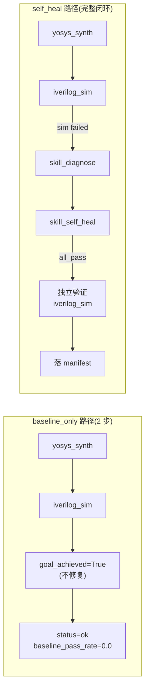

故障注入清单是 EDA Agent System 实验评估体系的基石——它以 8 个精心设计的 RTL 缺陷案例，覆盖 4 类典型数字电路故障模式，为自修复闭环提供了一套可量化、可复现、可聚合的基准测试集。本页深入解析故障清单的数据结构、基准实验与自修复实验的对比机制，以及实验结果如何通过 `fault_type` 聚合产出 S1 达标判定。

Sources: [fault_manifest.json](../../data/fault_manifest.json#L1-L69)

## 故障注入清单：数据结构与设计矩阵

### fault_manifest.json 顶层结构

故障清单以单一 JSON 文件描述全部 8 个注入缺陷，每个 bug 条目包含六个核心字段：`name`（设计标识）、`fault_type`（故障分类）、`healable`（可修复标注）、`top_module`（顶层模块名）、`ground_truth_patch`（标准答案修复方案）、`description`（故障详细描述）。文件遵循 `version` 版本控制，当前为 `0.1.0`。

Sources: [fault_manifest.json](../../data/fault_manifest.json#L1-L11)

### 四类故障 × 两个案例的均衡矩阵

清单的核心设计原则是 **四类故障各两个案例**，确保每类故障类型在聚合统计中具有等权重。两个案例之间通常区分难度——例如 `counter_bitwidth` 是简单的 4 位寄存器需扩展到 8 位，而 `adder_pipe_bitwidth` 涉及流水线加法器输出端口的完整位宽修正。每个 bug 还以 `healable` 布尔值标注预期可修复性，用于区分"系统应修好"与"数据集设计的不可修案例"。

| 故障类型 | 案例 1 | 案例 2 | healable 标注 |
|---|---|---|---|
| **bitwidth**（位宽不足） | `counter_bitwidth`（4-bit→8-bit） | `adder_pipe_bitwidth`（8-bit→9-bit） | 均为 `true` |
| **syntax**（语法错误） | `counter_syntax`（`alwayss` 拼写错误） | `adder_pipe_syntax`（非法运算符 `+*`） | 均为 `true` |
| **timing_reset**（时序/复位） | `counter_reset`（复位值 0xFF） | `tiny_fsm_reset`（复位状态 S1） | `true` / `false` |
| **comb_logic**（组合逻辑缺陷） | `adder_pipe_comb`（case 缺 default） | `tiny_fsm_comb`（状态转移死锁） | `true` / `false` |

6 个 `healable=true` 构成"良好线"——系统应全部修复成功；2 个 `healable=false`（`tiny_fsm_comb` 与 `tiny_fsm_reset`）则满足"至少 1 个失败案例"的比赛要求，代表数据集设计的能力上限。

Sources: [fault_manifest.json](../../data/fault_manifest.json#L1-L69)

### 每个案例的目录结构

每个故障案例在 `data/examples/<name>/` 下包含三个文件，构成自包含的实验单元：

```
data/examples/counter_bitwidth/
├── rtl.v      # 注入缺陷的 RTL 源码
├── tb.v       # 配套测试平台（正确设计）
└── meta.json  # 单 case 元数据（与 fault_manifest 字段一致）
```

`meta.json` 是 `fault_manifest.json` 中对应条目的独立副本，包含 `name`、`fault_type`、`healable`、`top_module`、`ground_truth_patch`、`description` 六个字段，使每个案例目录可独立引用。

Sources: [meta.json](../../data/examples/counter_bitwidth/meta.json#L1-L9)

## 四类故障的 RTL 注入模式

### bitwidth：寄存器/端口位宽不足

以 `counter_bitwidth` 为例，计数器输出声明为 `reg [3:0] count`（4 位），但测试平台期望 8 位计数器能计数到 200。4 位寄存器在 15 处回绕，导致仿真断言 `count !== i[7:0]` 失败。标准修复为 `reg [3:0] count → reg [7:0] count`。`adder_pipe_bitwidth` 类似但更复杂——不仅寄存器需从 `[7:0]` 扩展到 `[8:0]`，输出端口也需同步加宽。

Sources: [counter_bitwidth/rtl.v](../../data/examples/counter_bitwidth/rtl.v#L1-L14), [adder_pipe_bitwidth/rtl.v](../../data/examples/adder_pipe_bitwidth/rtl.v#L1-L16)

### syntax：编译期语法错误

语法类故障最直接——RTL 无法通过 iverilog 编译。`counter_syntax` 将关键字 `always` 误拼为 `alwayss`，导致整体编译失败（exit≠0）。`adder_pipe_syntax` 使用了非法运算符 `a +* b`，修复为标准 `a + b`。这类故障的特征是综合与仿真均无法执行，`baseline_pass_rate` 必为 0.0。

Sources: [counter_syntax/rtl.v](../../data/examples/counter_syntax/rtl.v#L1-L18), [adder_pipe_syntax/rtl.v](../../data/examples/adder_pipe_syntax/rtl.v#L1-L4)

### timing_reset：复位值/复位状态错误

`counter_reset` 将同步复位值设为 `8'hFF` 而非 `8'd0`，导致计数器从 255 起步而非 0。`tiny_fsm_reset` 将 FSM 复位状态错误地设为 `S1` 而非 `S0`，使复位后输出 `out=1` 而非预期的 `0`。这类故障的特点是电路功能逻辑本身正确，仅复位初始状态偏移。

Sources: [counter_reset/rtl.v](../../data/examples/counter_reset/rtl.v#L1-L14), [tiny_fsm_reset/rtl.v](../../data/examples/tiny_fsm_reset/rtl.v#L14-L16)

### comb_logic：组合逻辑结构缺陷

`adder_pipe_comb` 的 `case(sel)` 缺少 `default` 分支，综合工具推断出 latch——当 `sel=2` 或 `sel=3` 时输出保持旧值而非归零，修复为补 `default: y = 9'd0;`。`tiny_fsm_comb` 更隐蔽：S0 状态的下一状态逻辑无条件赋值 `next=S0`，而非条件转移 `in?S1:S0`，导致 FSM 永久卡在 S0，被标注为 `healable=false`。

Sources: [adder_pipe_comb/rtl.v](../../data/examples/adder_pipe_comb/rtl.v#L1-L17), [tiny_fsm_comb/rtl.v](../../data/examples/tiny_fsm_comb/rtl.v#L24-L29), [fault_manifest.json](../../data/fault_manifest.json#L53-L59)

## 基准实验流程：baseline_only 模式

### 设计目标与触发机制

基准实验的核心目的是 **验证注入缺陷在"不修复"状态下确实导致测试失败**（预期 `baseline_pass_rate=0.0`）。它通过 `RunRequest.extra["baseline_only"]=True` 触发，在 CPlanner 的五相状态机中走一条精简的 2 步路径，完全绕过诊断、自修复和时序分析。

Sources: [phase5_experiments.js](../../.wf/phase5_experiments.js#L44-L52)

### CPlanner 中的 baseline 路径

在 `_make_plan` 阶段，`baseline_only` 标志以最高优先级短路：直接返回一个固定的 2-Action Plan（`yosys_synth` + `iverilog_sim`），模式强制为 `"rule"`（不经过 LLM 决策）。这确保基准实验的执行路径完全确定性。

```python
if request.extra.get("baseline_only"):
    return Plan(
        actions=[
            Action("yosys_synth", {"rtl": ..., "top_module": ...}, "基线综合"),
            Action("iverilog_sim", {"rtl": ..., "tb": ...}, "基线仿真"),
        ],
        mode="rule",
    )
```

在 `_rule_after_reflect` 阶段，当 `baseline_only=True` 且 `state.last_sim is not None`（仿真已执行）时，直接设置 `state.goal_achieved=True` 并返回 `None`——不注入 `skill_diagnose`、`skill_self_heal` 或 `opensta_timing`。

在 `_finalize` 阶段，baseline run 的 `status` 恒为 `"ok"`（跑完即成功，不管仿真是否通过）。`baseline_pass_rate` 从 `sim.passed` 派生：`True→1.0`，否则 `0.0`。

Sources: [c_planner.py](../../src/eda_agent/planner/c_planner.py#L181-L199), [c_planner.py](../../src/eda_agent/planner/c_planner.py#L237-L241), [c_planner.py](../../src/eda_agent/planner/c_planner.py#L622-L625)

### run_baseline.py 脚本

基准实验脚本 `scripts/run_baseline.py` 封装了上述流程，接受 `--rtl`、`--tb`、`--top-module`、`--design-id`、`--fault-type` 五个必选参数。它构造 `RunRequest(kind="self_heal", extra={"baseline_only": True, ...})`，经 `run_pipeline` 执行后输出三字段 JSON：

```json
{
  "baseline_run_id": "run_xxx",
  "baseline_pass_rate": 0.0,
  "sim_passed": false
}
```

退出码遵循统一映射：`0=ok`、`1=failed`、`2=budget_exhausted`。脚本不经子进程跑 EDA——全部通过 `run_pipeline → CPlanner → ToolRegistry` 链路。

Sources: [run_baseline.py](../../scripts/run_baseline.py#L57-L82)

### baseline_only 与 self_heal 路径对比



Baseline 路径的 Action 数固定为 2，不落 `experiment_manifest.json`（只有 self_heal run 才落盘）。

Sources: [c_planner.py](../../src/eda_agent/planner/c_planner.py#L181-L241), [summarize_eval.py](../../scripts/summarize_eval.py#L34-L49)

## 自修复实验与 experiment_manifest

### experiment_manifest.json：14 字段实验记录

当 `request.kind=="self_heal"` 且 `not baseline_only` 时，CPlanner 在 `_finalize` 末尾调用 `_write_manifest`，将 self_heal run 的完整终态数据落盘到 `runs/<run_id>/experiment_manifest.json`。该文件是后续聚合统计的唯一数据源，包含以下 14 个字段：

| 字段 | 类型 | 说明 |
|---|---|---|
| `run_id` | str | 当前 self_heal run 标识 |
| `baseline_run_id` | str \| None | 关联的 baseline run（从 `extra` 透传） |
| `design_id` | str | 注入缺陷标识（如 `counter_bitwidth`） |
| `fault_type` | str | 故障分类（四类之一或 `unknown`） |
| `baseline_pass_rate` | float \| None | 基准通过率（未跑 baseline 则为 None） |
| `self_heal_pass_rate` | float | 自修复后通过率（`all_pass`→1.0，否则 0.0） |
| `self_heal_convergence` | str \| None | 收敛原因（`all_pass`/`regression`/`max_iter`/`budget`） |
| `self_heal_best_iter` | int \| None | 最优迭代号（首次 `all_pass` 的迭代） |
| `planner_iterations` | int | CPlanner 总迭代步数 |
| `llm_calls` | int | LLM API 调用次数 |
| `tokens_total` | int | LLM 输入+输出 token 总和 |
| `wall_time_s` | float | 总墙钟耗时（秒） |
| `candidates_at_best_score` | int \| None | 最优分数对应候选数（从 B 的 `best/meta.json` 读取） |
| `contract_version` | str | 契约版本号（`CONTRACT_VERSION`） |

`_write_manifest` 使用原子写入（`tmp+os.replace`）确保落盘一致性。`design_id` 和 `fault_type` 缺失时回退到 `"unknown"`——这会导致聚合时归入 `"other"` 桶，无法按 `fault_type` 统计。

Sources: [c_planner.py](../../src/eda_agent/planner/c_planner.py#L659-L706)

### run_self_heal.py 脚本

自修复实验脚本 `scripts/run_self_heal.py` 与 baseline 脚本的关键区别在于 `extra` 不设 `baseline_only`，但必须传入 `design_id` 和 `fault_type` 使 manifest 字段完整。它还支持 `--max-iter`（覆盖 B 自修复最大迭代）、`--mode`（覆盖 planner 模式）和 `--run-budget`（覆盖总预算秒数）。

Sources: [run_self_heal.py](../../scripts/run_self_heal.py#L73-L111)

### baseline → self_heal 的串联

完整的实验流程是先跑 baseline，再把 baseline 结果透传给 self_heal run。self_heal 的 `RunRequest.extra` 需包含 `baseline_run_id` 和 `baseline_pass_rate`，使 manifest 能记录"修复前通过率 → 修复后通过率"的对比链。

Sources: [phase5_experiments.js](../../.wf/phase5_experiments.js#L100-L113)

## 实验聚合与 S1 达标判定

### summarize_eval.py 聚合逻辑

聚合脚本扫描 `runs/*/experiment_manifest.json`，按 `fault_type` 分桶（四类已知类型 + `other`），对每类统计 `total`、`passed`（`self_heal_pass_rate==1.0` 计数）、`pass_rate`、`mean_iters`（`planner_iterations` 均值）、`mean_best_iter`（最优迭代均值）。空类不参与 `min_group_pass_rate` 计算。

Sources: [summarize_eval.py](../../scripts/summarize_eval.py#L52-L111)

### S1 硬门槛

比赛定义的 S1 硬门槛有两条：(1) `min_group_pass_rate >= 0.50`（最弱故障类通过率不低于 50%）；(2) `bitwidth` 类至少 1 个 `all_pass`。`summarize_eval.py` 本身不判定门槛——只产出数据，门槛由人工或后续脚本判定。

Sources: [phase5_experiments.js](../../.wf/phase5_experiments.js#L87-L98)

### 实验结果快照

下表展示 `experiment_summary.json` 中记录的实际实验结果：

| fault_type | total | passed | pass_rate | mean_iters | mean_best_iter |
|---|---|---|---|---|---|
| bitwidth | 2 | 2 | **1.0** | 5.0 | 2.0 |
| syntax | 2 | 2 | **1.0** | 5.0 | 2.0 |
| timing_reset | 2 | 2 | **1.0** | 5.0 | 2.0 |
| comb_logic | 2 | 1 | **0.5** | 5.0 | 0.5 |
| **overall** | **8** | **7** | **0.875** | — | — |

- `min_group_pass_rate = min(1.0, 1.0, 1.0, 0.5) = 0.50 ≥ 0.50` ✓
- `bitwidth` 类 2/2 `all_pass` ✓
- **S1 硬门槛全通过**

`comb_logic` 类的 0.5 通过率来自 `tiny_fsm_comb` 的 `regression` 失败——该案例被标注为 `healable=false`，是数据集设计的能力上限，非系统缺陷。

Sources: [experiment_summary.json](../../experiment_summary.json)

## 失败案例深度归因：tiny_fsm_comb regression

`tiny_fsm_comb` 是 8 个案例中唯一 `self_heal_pass_rate=0.0` 的失败案例。其故障根因是两态 FSM 的 S0 分支无条件赋值 `next=S0`，正确的下一状态逻辑应为 `next = in ? S1 : S0`。LLM Patch 引擎（GLM-5.2）多轮尝试未能修正这一条件转移逻辑，触发 regression 死锁保护——当 `num_passed` 下降时版本栈自动回退，最终收敛原因为 `regression`（`best_iter=-1`）。

这一失败案例的意义在于：(1) 满足 T54 "≥1 失败案例"的比赛要求；(2) 证明了 regression 保护机制的有效性——系统不会因为失败修复而恶化原始设计；(3) 揭示了 FSM 组合逻辑修复的技术挑战，为后续 ErrorKB 扩展提供了方向。

Sources: [03_实验与失败案例报告.md](../03_实验与失败案例报告.md#L62-L69), [fault_manifest.json](../../data/fault_manifest.json#L53-L59)

## rule 模式 vs LLM 模式的实验对比

实验中存在两种 planner 模式，在故障清单验证中表现出显著差异：

| 维度 | rule 模式 | LLM 模式（默认） |
|---|---|---|
| **决策路径** | 确定性：synth → sim → diagnose → self_heal → 独立验证 | LLM ReAct 每步决策，可能出现工具调用乱序 |
| **墙钟耗时** | 44–87s/bug | ~550s，常因 budget_exhausted 终止 |
| **可复现性** | 高（无随机性） | 低（LLM 输出不确定） |
| **失败模式** | 几乎不失败（确定性状态机） | 决策乱序（如先 self_heal 再 diagnose）浪费预算 |
| **适用场景** | 全量实验、快速验证 | 演示 agentic 编排充分性 |

全量 8-bug 实验采用 rule 模式（确定性 + 快速），LLM 模式仅用于演示 agentic 能力。两者互补而非互斥——rule 模式是可靠兜底。

Sources: [03_实验与失败案例报告.md](../03_实验与失败案例报告.md#L27-L36)

## 延伸阅读

- 了解 S1 达标规则与聚合门槛的完整定义：[实验聚合与通过率门槛](28_实验聚合通过率门槛S1.md)
- 了解自修复闭环如何消费故障清单的 RTL/TB：[RTL 自修复闭环（组件 B）](15_RTL自修复闭环组件B.md)
- 了解规则引擎降级路径如何支撑 rule 模式实验：[规则引擎降级路径与 baseline 实验](11_规则引擎降级与baseline实验.md)
- 了解 ErrorKB 如何为故障诊断提供模式匹配：[ErrorKB 错误知识库](29_ErrorKB错误知识库.md)