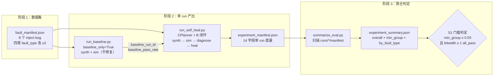

实验聚合机制是 Agentic EDA 系统"实验证据 / 指标对比"的量化骨架。它将分散在 `runs/` 目录中的单次 self-heal 运行轨迹，自动聚合成一个可直接判读的通过率报告，并用一条**单一硬门槛**规则回答最根本的问题："自修复能力够不够格？"。本文档解析从单 run manifest 落盘到聚合 summary 产出的完整数据流，以及 S1 通过规则的设计逻辑。

Sources: [CONTRACTS.md](../../CONTRACTS.md)

## 数据流全景：从故障注入到门槛判定

整个实验聚合管线由三个阶段串联，每个阶段的产出物都是下一阶段的输入。



数据流的起点是 `data/fault_manifest.json`——它登记了 8 个 inject bug，按 `fault_type` 均分为四类（bitwidth、comb_logic、syntax、timing_reset），每类至少 2 个。对于每个 bug，先跑一次 baseline run（只综合 + 仿真，不修复），拿到的 `baseline_pass_rate` 作为"不修复时的通过率"基线；再跑一次完整的 self_heal run，CPlanner 编排综合 → 仿真 → 诊断 → 自修复 → 独立验证的完整闭环。两种 run 的终态都落盘为 `experiment_manifest.json`（14 字段），最后由 `summarize_eval.py` 扫描所有 manifest 聚合成 `experiment_summary.json`，用 S1 门槛规则判定是否达标。

Sources: [fault_manifest.json](../../data/fault_manifest.json#L1-L68), [CONTRACTS.md](../../CONTRACTS.md)

## experiment_manifest.json：单 run 实验度量（14 字段）

每个 self_heal run 在 `_finalize` 阶段落盘一份 `experiment_manifest.json`，作为实验聚合的最小输入单元。该文件由 CPlanner 的 `_write_manifest` 方法在 `runs/<run_id>/experiment_manifest.json` 原子写入（tmp + `os.replace`），仅在 `request.kind == "self_heal"` 且非 `baseline_only` 时触发。

| 字段 | 类型 | 来源 | 语义 |
|---|---|---|---|
| `run_id` | str | record.run_id | 当前 self_heal run 的唯一标识 |
| `baseline_run_id` | str \| None | request.extra["baseline_run_id"] | 基线 run 的 ID；None 表示未跑 baseline |
| `design_id` | str | request.extra["design_id"]（缺则 "unknown"） | inject bug 名称，如 "counter_bitwidth" |
| `fault_type` | str | request.extra["fault_type"]（缺则 "unknown"） | 故障类型（bitwidth/comb_logic/syntax/timing_reset） |
| `baseline_pass_rate` | float \| None | request.extra["baseline_pass_rate"] | 基线通过率（bug 存在时预期 0.0） |
| `self_heal_pass_rate` | float | `1.0 if conv=="all_pass" else 0.0` | 自修复通过率（二元判定） |
| `self_heal_convergence` | str \| None | metrics.self_heal_convergence | 收敛原因（all_pass/regression/budget/max_iter） |
| `self_heal_best_iter` | int \| None | metrics.self_heal_best_iter | 达到最佳分数的最早迭代轮次 |
| `planner_iterations` | int | metrics.planner_iterations | C 状态机执行的总步数 |
| `llm_calls` | int | CountingProvider.get_stats() | LLM 调用次数 |
| `tokens_total` | int | tokens_in + tokens_out | LLM 总 token 消耗 |
| `wall_time_s` | float | budget.elapsed_s() | 从 run 开始到终态的墙钟秒数 |
| `candidates_at_best_score` | int \| None | best/meta.json（B 落盘） | 达到 best_score 时的候选 patch 数（tie-break 复核） |
| `contract_version` | str | CONTRACT_VERSION 常量 | 契约版本锚点（固定 "0.1.0"） |

一个关键设计决策是：**manifest 的落盘不依赖收敛与否**。即使 self_heal run 发生 regression（convergence != all_pass），manifest 仍被写入，只是 `self_heal_pass_rate` 记为 0.0。这确保聚合统计能覆盖失败案例，不会因"跑挂了就不记录"而选择性失真。`candidates_at_best_score` 字段从 `runs/<run_id>/self_heal/best/meta.json` 读取——如果 B 闭环未落盘该文件（如 budget_exhausted 早停），则该字段为 `None`，manifest 其余 13 字段仍正常写入。

Sources: [c_planner.py](../../src/eda_agent/planner/c_planner.py#L646-L706), [CONTRACTS.md](../../CONTRACTS.md)

### self_heal_pass_rate 的二元判定逻辑

`self_heal_pass_rate` 不是连续概率值，而是一个严格的二元量化：`convergence_cause == "all_pass"` 时为 `1.0`，其他所有情况（regression、budget、max_iter、None）均为 `0.0`。这个判定在 `_build_metrics` 方法中完成：

```python
"self_heal_pass_rate": 1.0 if conv == "all_pass" else 0.0
```

其中 `conv` 从 B 自修复的 `skill_self_heal` parsed 输出中取 `convergence_cause`（或别名 `_skill_convergence_cause`）。这意味着只有 B 报告"全部测试通过"的 run 才会计入聚合的 passed 分子。`baseline_pass_rate` 在 self_heal run 中从 `request.extra` 透传（不是 self_heal run 自己派生的），确保 baseline 和 self_heal 两次 run 的数据正确关联。

Sources: [c_planner.py](../../src/eda_agent/planner/c_planner.py#L726-L755)

## experiment_summary.json：聚合层与分桶统计

`summarize_eval.py` 扫描 `runs/*/experiment_manifest.json`，按 `fault_type` 分桶聚合，输出一个全局 summary。聚合逻辑是纯函数 `summarize(manifests)`，不读盘、不依赖外部状态，便于测试直接 import 复用。

### 聚合输出 schema

```json
{
  "overall_pass_rate": 0.875,
  "min_group_pass_rate": 0.5,
  "by_fault_type": {
    "bitwidth":      {"total": 2, "passed": 2, "pass_rate": 1.0, "mean_iters": 5.0, "mean_best_iter": 2.0},
    "syntax":        {"total": 2, "passed": 2, "pass_rate": 1.0, "mean_iters": 5.0, "mean_best_iter": 2.0},
    "timing_reset":  {"total": 2, "passed": 2, "pass_rate": 1.0, "mean_iters": 5.0, "mean_best_iter": 2.0},
    "comb_logic":    {"total": 2, "passed": 1, "pass_rate": 0.5, "mean_iters": 5.0, "mean_best_iter": 0.5}
  },
  "total_runs": 8,
  "total_passed": 7
}
```

`overall_pass_rate` 是全部 manifest 中 `self_heal_pass_rate == 1.0` 的比例。`min_group_pass_rate` 取所有 `by_fault_type.*.pass_rate` 的最小值——这个字段是 S1 门槛的核心输入。

Sources: [experiment_summary.json](../../experiment_summary.json), [summarize_eval.py](../../scripts/summarize_eval.py#L52-L111)

### 分桶规则与边界处理

聚合函数有三个值得注意的边界处理：

**未知 fault_type 归 "other" 桶**：只有四个已知类型（`bitwidth`、`comb_logic`、`syntax`、`timing_reset`）会被分到独立桶，其余归入 `"other"`。这防止 CLI 直接调用（未传 `extra.design_id/fault_type`）产生的 `fault_type="unknown"` 污染四个正规桶的统计。`run_self_heal.py` 脚本在调用时强制传入 `--design-id` 和 `--fault-type`，正是为了确保 manifest 字段完整、分桶正确。

**空桶不拖低 min_group_pass_rate**：如果某类 fault_type 在 `runs/` 中没有任何 manifest（如只跑了 bitwidth 类的 bug），该类不参与 `min()` 计算。这意味着 `min_group_pass_rate` 只反映实际有观测的故障类别的最差表现，不会被未覆盖的类别虚假拉低到 0.0。

**零 manifest 的极端情况**：当 `runs/` 目录完全为空时，`overall_pass_rate = 0.0`（合理：零成功 / 零运行 = 无通过），但 `min_group_pass_rate = 1.0`（合理：无观测群体不拖低）。这个设计避免空环境误报门槛不达标。

Sources: [summarize_eval.py](../../scripts/summarize_eval.py#L57-L111), [test_experiment_manifest.py](../../tests/test_experiment_manifest.py#L362-L384)

## S1 通过规则：单一硬门槛的精确定义

契约 v1.2 将自修复通过率门槛锁死为**单一硬门槛**，消除了 v1.1 三套口径分叉的问题。规则定义如下：

> 在 `fault_manifest.json` 登记的 N≥8 个 inject bug 中（summarize_eval.py 聚合时含 `healable=false` 的不可修案例作分母以反映真实难度，不按 healable 字段过滤），按 `fault_type` 分组取最小通过率 ≥ 0.50，且 bitwidth 类至少 1 个 `convergence_cause = "all_pass"`。

这个规则由两个**合取条件**组成，缺一不可：

| 条件 | 表达式 | 语义 |
|---|---|---|
| 最小组通过率门槛 | `min_group_pass_rate >= 0.50` | 每个故障类别至少修复一半 |
| bitwidth 强制通过 | `by_fault_type.bitwidth.passed >= 1` | bitwidth 类必须有至少一个 all_pass |

第一个条件防止系统只修好容易类别（如 syntax）却在难类别（如 comb_logic）上全军覆没——通过取**各类别 pass_rate 的最小值**，系统无法通过"偏科"达标。第二个条件是对 bitwidth 类的额外强制要求，因为位宽错误是最基本、最确定的 RTL 缺陷类型，修复它是系统能力的底线证明。

Sources: [CONTRACTS.md](../../CONTRACTS.md), [验收标准.md](../../验收标准.md), [验收标准.md](../../验收标准.md)

### healable=false 作为分母的设计逻辑

S1 门槛的一个关键设计决策是：**不按 `healable` 字段过滤分母**。`fault_manifest.json` 中有两个设计标注为 `healable=false` 的 bug（`tiny_fsm_comb` 和 `tiny_fsm_reset`），它们被故意设为"人类也难以用 <5 行 diff 修复"的难题。将它们纳入分母，意味着 `min_group_pass_rate` 反映的是包含不可修案例在内的**真实修复难度**，而非"只挑能修的算通过率"的选择性数据。

以实际实验为例：`comb_logic` 类有 2 个 bug，其中 `adder_pipe_comb`（healable=true）修复成功，`tiny_fsm_comb`（healable=false）修复失败（convergence=regression），`pass_rate = 1/2 = 0.5`，恰好等于门槛值。这个 0.5 是真实的难度边界，不是数据注水。

Sources: [fault_manifest.json](../../data/fault_manifest.json#L13-L18), [fault_manifest.json](../../data/fault_manifest.json#L53-L59), [docs/03_实验与失败案例报告.md](../03_实验与失败案例报告.md#L64-L69)

## summarize_eval.py 的职责边界：只产出数据，不判定门槛

一个容易被误解的设计决策是：`summarize_eval.py` **不判定门槛**，退出码始终为 0，只负责扫描 + 聚合 + 输出 `experiment_summary.json`。门槛判定由人工或外部脚本基于 summary 数据进行。

这个职责分离遵循 Unix 哲学：工具做一件事（数据聚合），判定逻辑由消费方决定。如果聚合脚本同时兼任裁判，会导致"修改门槛阈值就要改脚本逻辑"的耦合，以及退出码语义的二义性（是扫描失败还是门槛不达标？）。脚本在 stdout 打印精简结果供 CI 日志直接查看，完整 summary 写入 JSON 文件供后续工具链消费。

```bash
# 聚合命令（退出码恒为 0）
python scripts/summarize_eval.py --runs-dir runs --out experiment_summary.json

# 输出示例（stdout）
{"total_runs": 8, "total_passed": 7, "overall_pass_rate": 0.875, "min_group_pass_rate": 0.5}
wrote experiment_summary.json
```

Sources: [summarize_eval.py](../../scripts/summarize_eval.py#L1-L19), [summarize_eval.py](../../scripts/summarize_eval.py#L137-L154)

## 实际实验结果与 S1 通过验证

T54 全量实验对 `fault_manifest.json` 中全部 8 个 inject bug 跑了完整的 baseline + self_heal 对比（rule 模式，确定性快速验证）。聚合结果如下：

| fault_type | total | passed | pass_rate | mean_iters | mean_best_iter | 达标 |
|---|---|---|---|---|---|---|
| bitwidth | 2 | 2 | 1.0 | 5.0 | 2.0 | ✓ (≥ 1 all_pass) |
| syntax | 2 | 2 | 1.0 | 5.0 | 2.0 | ✓ |
| timing_reset | 2 | 2 | 1.0 | 5.0 | 2.0 | ✓ |
| comb_logic | 2 | 1 | 0.5 | 5.0 | 0.5 | ✓ (= 0.50 边界) |
| **overall** | **8** | **7** | **0.875** | — | — | — |

**S1 门槛验证**：
- `min_group_pass_rate` = min(1.0, 1.0, 1.0, 0.5) = **0.50 ≥ 0.50** ✓
- `by_fault_type.bitwidth.passed` = 2 ≥ 1 ✓

两个合取条件均满足，S1 通过。唯一的失败案例是 `tiny_fsm_comb`（comb_logic 类，healable=false），其 convergence 为 `regression`——GLM 在多轮 patch 后触发 regression 死锁保护（num_passed 下降），属于合规的失败案例（满足契约要求的"≥1 失败案例"）。

Sources: [experiment_summary.json](../../experiment_summary.json), [docs/03_实验与失败案例报告.md](../03_实验与失败案例报告.md#L11-L25)

## 测试覆盖策略

实验聚合的测试分为两层，分别覆盖单 run manifest 产出和聚合函数正确性。

**第一层：manifest 落盘验证**（stub + FakeLLM，不需 EDA/LLM）测试用 `StubTool` 模拟 yosys/iverilog/diagnose/self_heal 工具链，验证 `_write_manifest` 在以下场景的正确行为：self_heal 成功（convergence=all_pass → pass_rate=1.0）、self_heal 失败（convergence=regression → pass_rate=0.0 但 manifest 仍落盘）、baseline_only run 不落 manifest、以及 `candidates_at_best_score` 从 best/meta.json 正确读取（无 meta.json 时为 None）。

**第二层：聚合函数验证**（纯函数，不依赖 run）直接 import `summarize_eval.summarize` 验证聚合逻辑：单类 manifest 聚合（bitwidth.total ≥ 1）、未知 fault_type 归 other 桶、空 manifest 列表返回合理默认（total_runs=0 / min_group=1.0）。这些测试不需要 EDA 工具或 LLM API key，确保聚合逻辑的回归保护不依赖环境。

Sources: [test_experiment_manifest.py](../../tests/test_experiment_manifest.py#L1-L12), [test_experiment_manifest.py](../../tests/test_experiment_manifest.py#L207-L231), [test_experiment_manifest.py](../../tests/test_experiment_manifest.py#L362-L384)

## 实验脚本工具链

三个脚本各司其职，串联从数据集到门槛判定的完整管线：

| 脚本 | 职责 | 关键参数 | 退出码 |
|---|---|---|---|
| `run_baseline.py` | 跑 baseline-only plan（synth+sim 不修复） | `--rtl --tb --top-module --design-id --fault-type` | 0(ok)/1(failed)/2(budget) |
| `run_self_heal.py` | 跑完整 self_heal 闭环，落 manifest 14 字段 | 同上 + `--mode rule\|llm --max-iter --run-budget` | 0(ok)/1(failed)/2(budget) |
| `summarize_eval.py` | 扫描 runs/*/manifest 聚合成 summary | `--runs-dir --out` | 恒为 0（不判门槛） |

`run_baseline.py` 和 `run_self_heal.py` 都复用 `run_pipeline` 入口（不经子进程），确保所有实验走同一代码路径（CPlanner → ToolRegistry），实验结果可复现。`run_self_heal.py` 强制传 `--design-id` 和 `--fault-type`，避免 manifest 字段为 "unknown" 导致聚合分桶失败。

Sources: [run_baseline.py](../../scripts/run_baseline.py#L1-L18), [run_self_heal.py](../../scripts/run_self_heal.py#L1-L27), [summarize_eval.py](../../scripts/summarize_eval.py#L125-L134)

## 关联阅读

- 实验聚合的源数据来自 [故障注入清单与基准实验对比](27_故障注入清单与基准实验.md)，该页详述 fault_manifest.json 的 8 bug 设计矩阵与 healable 标注逻辑
- 单 run 的完整轨迹落盘由 [RunRecord 落盘与完整轨迹追溯](25_RunRecord落盘轨迹追溯.md) 定义，manifest 是轨迹的"量化摘要"
- self_heal run 的收敛判定（all_pass / regression / budget / max_iter）在 [RTL 自修复闭环（组件 B）：综合-仿真-诊断-Patch 迭代](15_RTL自修复闭环组件B.md) 中详述，convergence_cause 是 manifest 的核心字段之一
- CPlanner 的 _finalize 阶段和 _build_metrics 方法定义在 [五相状态机：PLANNING 到 DONE 的流转](09_五相状态机Planning到Done.md) 中
- baseline_only 短路逻辑和独立验证步在 [独立验证步：B 报 all_pass 后的第三方校验](12_独立验证步第三方校验.md) 中解析