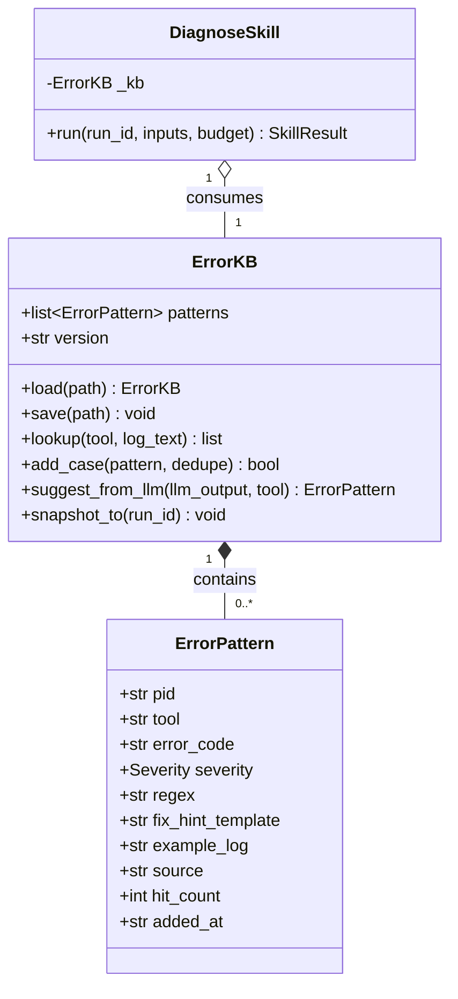
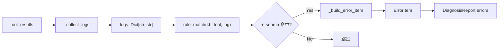
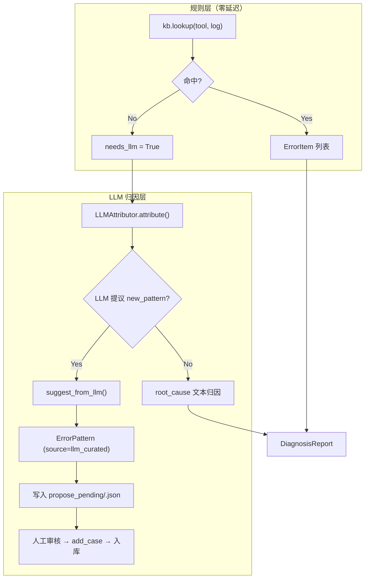

ErrorKB 是 EDA Agent 系统中**诊断器（组件 A）的核心知识基座**——一个基于正则表达式的错误模式库，将 EDA 工具日志中的结构化错误文本映射为规范化的错误码、修复建议与严重等级。它实现了"**规则层零延迟命中** + **LLM 归因增量增长**"的双层架构：首批种子模式覆盖常见综合/仿真/时序错误，运行时 LLM 提议的新模式经人工审核后可增量入库，形成自演化的错误诊断知识体系。

Sources: [error_kb.json](../../data/error_kb.json#L1-L149), [diagnose.py](../../src/eda_agent/skills/diagnose.py#L98-L269)

---

## 数据模型：ErrorPattern 结构与命名约定

每条错误模式是一个不可变的 `ErrorPattern` 数据类，由七个业务字段加三个元数据字段组成。**正则字段**使用 Python `re` 命名分组（如 `(?P<signal>\w+)`、`(?P<line>\d+)`）从原始日志中捕获变量，**修复模板字段**（`fix_hint_template`）通过 Python `str.format()` 将命名分组的值直接填入人可读的修复建议文本中。

| 字段 | 类型 | 说明 | 示例 |
|---|---|---|---|
| `pid` | `str` | 模式唯一标识符，格式 `<tool_ns>.<short_name>_<seq>` | `synth.rtl_syntax_001` |
| `tool` | `str` | 关联工具名；`"*"` 表示跨工具通配 | `yosys_synth` / `iverilog_sim` / `*` |
| `error_code` | `str` | 规范二段式错误码 `<namespace>.<code>` | `synth.multi_driver` |
| `severity` | `Literal["info","warn","error","fatal"]` | 严重等级，决定 `needs_rtl_patch` 派生 | `error` |
| `regex` | `str` | Python 正则，命名分组抽取变量 | `ERROR: Wire (?P<signal>\w+) has multiple drivers` |
| `fix_hint_template` | `str` | 修复建议模板，`{var}` 占位符由命名分组填充 | `信号 {signal} 被多个 always 块驱动...` |
| `example_log` | `str` | 示例日志文本，用于自检 `re.search` 必须命中 | `ERROR: Wire data_out has multiple drivers.` |
| `source` | `Literal["seed","llm_curated","human"]` | 模式来源追踪 | `seed` |
| `hit_count` | `int` | 命中计数器（预留，MVP 未自增） | `0` |
| `added_at` | `str` | 添加时间戳（预留） | `""` |

关键设计决策：`pid` 不用 Python 内置 `hash()`（受 `PYTHONHASHSEED` 随机化，跨 run 不可比），而用 `sha256` 前 8 位确保确定性。`source` 字段的三值枚举构成了**溯源链路**：`seed` 是人工初始化的种子模式，`llm_curated` 是 LLM 提议并经审核的模式，`human` 是人工直接添加的模式。

Sources: [diagnose.py](../../src/eda_agent/skills/diagnose.py#L102-L120), [error_kb.json](../../data/error_kb.json#L4-L15)

---

## 种子模式覆盖矩阵：三大 EDA 领域 × 12 条种子

种子 KB（`data/error_kb.json`）包含 **12 条模式**，覆盖系统封装的三大 EDA 工具的全部典型错误场景。下表展示各工具的覆盖分布：

| 工具 | 模式数量 | 覆盖的错误类型 | severity 分布 |
|---|---|---|---|
| `yosys_synth` | 5 | RTL 语法错误、多驱动冲突、未声明信号、端口未连接、模块未找到 | error×4 + warn×1 |
| `iverilog_sim` | 3 | 编译失败、断言失败、波形不匹配 | error×3 |
| `opensta_timing` | 2 | 时序违例、Setup 违例 | error×2 |
| `*`（通配） | 2 | 仿真子进程超时、综合子进程超时 | error×2 |

通配模式 `tool="*"` 的设计允许跨工具匹配，例如子进程超时模式（`pid=sim.subprocess_timeout_001` 与 `synth.subprocess_timeout_001`）会被所有工具的日志文本扫描到。这种设计避免了在综合和仿真两个命名空间中重复注册完全相同的超时检测逻辑。

Sources: [error_kb.json](../../data/error_kb.json#L4-L147)

### 扩展 KB：LLM 策展的增量模式

`data/error_kb_expanded.json` 在种子的 12 条基础上新增了 **6 条 `llm_curated` 模式**，模拟"LLM 归因 → 人工审核 → 入库"的增量增长闭环产出：

| 新增 pid | tool | error_code | regex | source |
|---|---|---|---|---|
| `synth.latch_inferred_001` | `yosys_synth` | `synth.latch_inferred` | `latch inferred for reg (?P<signal>\w+)` | `llm_curated` |
| `synth.case_full_001` | `yosys_synth` | `synth.case_default` | `case has no default in module (?P<module>\w+)` | `llm_curated` |
| `sim.x_output_001` | `iverilog_sim` | `sim.x_output` | `TEST_FAIL\s+(?P<signal>\w+) with X` | `llm_curated` |
| `sim.zero_delay_race_001` | `iverilog_sim` | `sim.zero_delay_race` | `Race condition detected.*zero-delay` | `llm_curated` |
| `sta.hold_violation_001` | `opensta_timing` | `sta.hold_violation` | `endpoint hold.*VIOLATED.*?(?P<slack>-\d+\.\d+)` | `llm_curated` |

Sources: [error_kb_expanded.json](../../data/error_kb_expanded.json#L148-L209)

---

## ErrorKB 类：六方法生命周期管理

`ErrorKB` 类是错误知识库的运行时载体，提供从加载、查询、增量到落盘的完整生命周期管理。其核心架构可以用以下关系图概括：



### load：防御性反序列化

`ErrorKB.load()` 是进程启动时的唯一入口，实现三级降级：文件不存在返回空 KB、JSON 解析失败返回空 KB（不抛异常，由调用方记录 `diagnose.kb_corrupted`）、单条 pattern 字段缺失跳过该条但不整体崩溃。这种"尽力而为"的加载策略确保 KB 损坏不会阻断诊断流程——最差情况下降级为纯 LLM 归因模式。

Sources: [diagnose.py](../../src/eda_agent/skills/diagnose.py#L135-L169)

### lookup：正则引擎与通配过滤

`lookup()` 方法是匹配核心。其过滤逻辑为：对于每条 pattern，若 `p.tool not in (tool, "*")` 则跳过；否则执行 `re.search(p.regex, log_text)`，命中则将 `(pattern, match)` 元组加入结果列表。返回的 `re.Match` 对象保留了命名分组的捕获值，供下游 `_build_error_item` 填充模板。

```python
# 匹配流程伪代码
for pattern in self.patterns:
    if pattern.tool not in (tool, "*"):
        continue
    try:
        m = re.search(pattern.regex, log_text)
    except re.error:
        continue      # 坏正则不阻断，跳过
    if m is not None:
        out.append((pattern, m))
```

正则编译错误（`re.error`）被静默跳过而非抛出，因为一条坏正则不应使整个 KB 不可用。`log_text` 为空字符串时直接返回空列表，避免无意义遍历。

Sources: [diagnose.py](../../src/eda_agent/skills/diagnose.py#L189-L208)

### add_case：三元组去重入库

`add_case()` 按 `(tool, error_code, regex)` 三元组判断重复。三元组完全相同的模式视为重复，返回 `False`。值得注意的是 `pid` 和 `fix_hint_template` 不参与去重判定——这意味着同一条错误检测逻辑可以有多种修复建议变体（只要 tool+code+regex 不同），但不可能出现同一条检测逻辑的冗余副本。

Sources: [diagnose.py](../../src/eda_agent/skills/diagnose.py#L210-L220)

### suggest_from_llm：LLM 提议构造器

`suggest_from_llm()` 从 LLM 输出的 JSON 结构中提取 `new_pattern` 对象，构造 `source="llm_curated"` 的 ErrorPattern。关键行为：**构造不入库**——返回 pattern 对象但 `self.patterns` 列表不变。调用方决定是否写入 `propose_pending/` 目录待人工审核。缺失任一关键字段（`regex`/`error_code`/`fix_hint_template`）时返回 `None`。

Sources: [diagnose.py](../../src/eda_agent/skills/diagnose.py#L222-L254)

### snapshot_to：运行时快照

`snapshot_to(run_id)` 将当前 KB 全量序列化到 `runs/<run_id>/diagnose/error_kb_snapshot.json`，确保每次诊断 run 的 KB 状态可追溯——即使后续 KB 发生变化，历史 run 的快照仍可复现当时的匹配行为。

Sources: [diagnose.py](../../src/eda_agent/skills/diagnose.py#L256-L268)

---

## 模式匹配流水线：从日志到 ErrorItem

模式匹配的完整流水线由 `rule_match()` 和 `_build_error_item()` 两个模块级函数实现，构成了诊断器的**规则层**（零 LLM 调用路径）。



`_build_error_item` 的模板填充逻辑：首先提取 `match.groupdict()` 获取命名分组的值，然后尝试 `pattern.fix_hint_template.format(**g)` 进行变量替换。如果模板中的 `{var}` 在分组中没有对应捕获（`KeyError`/`IndexError`），则回退到原始模板字符串，不抛异常。构造的 `ErrorItem` 同时设置 `message` 和 `fix_suggestion` 为格式化后的文本，`evidence` 为 `match.group(0)`（即正则命中的完整文本片段）。

Sources: [diagnose.py](../../src/eda_agent/skills/diagnose.py#L276-L310)

### ErrorItem 输出字段映射

| ErrorPattern 字段 | → | ErrorItem 字段 | 转换说明 |
|---|---|---|---|
| `error_code` | → | `code` | 直接传递 |
| `error_code` | → | `namespace` | 经 `namespace_of()` 派生（`code.split(".")[0]`） |
| `severity` | → | `severity` | 直接传递 |
| `fix_hint_template` | → | `message` | `str.format(**match.groupdict())` |
| `fix_hint_template` | → | `fix_suggestion` | 同 `message` |
| `match.group(0)` | → | `evidence[0]` | 正则命中的原始文本 |
| 无 | → | `tool` | 调用方传入的 tool_name |

Sources: [diagnose.py](../../src/eda_agent/skills/diagnose.py#L276-L298)

---

## 增量增长闭环：propose_pending 机制

ErrorKB 的核心设计哲学是"**规则层优先，LLM 补盲，人工把关增量**"。增量增长闭环的工作流程如下：



**关键安全边界**：LLM 提议的新模式**绝不自动入库**。`suggest_from_llm()` 返回 pattern 对象后，DiagnoseSkill 调用 `_write_propose_pending()` 将其序列化到 `runs/<run_id>/diagnose/propose_pending/<uuid>.json`。该目录中的每个 JSON 文件是一个待审核的模式候选，人工或自动化审计通过后方可调用 `add_case()` 持久化到主 KB 文件。

测试用例 `test_run_proposes_pending_pattern_when_llm_suggests` 明确验证了这一不变量：LLM 提议新模式后，`propose_pending/` 目录中出现对应 JSON 文件，但"重新查 KB 仍无此 pattern"。

Sources: [diagnose.py](../../src/eda_agent/skills/diagnose.py#L695-L700), [diagnose.py](../../src/eda_agent/skills/diagnose.py#L850-L859), [test_diagnose_skill.py](../../tests/test_diagnose_skill.py#L276-L299)

### propose_pending 文件格式

每个待审核文件的内容即 `asdict(ErrorPattern)` 的完整序列化：

```json
{
  "pid": "llm.a3f8b2c1",
  "tool": "yosys_synth",
  "error_code": "synth.glitch",
  "severity": "error",
  "regex": "glitch on (?P<sig>\\w+)",
  "fix_hint_template": "guard signal {sig}",
  "example_log": "",
  "source": "llm_curated",
  "hit_count": 0,
  "added_at": ""
}
```

`pid` 前缀 `llm.` 明确标识来源为 LLM 提议，后跟 `sha256(f"{tool}|{error_code}|{regex}")[:8]` 的确定性哈希，确保相同提议跨 run 产生相同 pid。

Sources: [diagnose.py](../../src/eda_agent/skills/diagnose.py#L242-L254)

---

## LLM 提议的 Schema 约束

LLM 归因层的输出由 `_LLM_SCHEMA`（JSON Schema）严格约束。`new_pattern` 字段是增量增长的唯一输入通道，其 schema 定义为 `anyOf: [null, {object with regex/error_code/fix_hint_template}]`——LLM 可以选择不提议（返回 `null`），或提议一个必须包含三个必填字段的对象。

```json
{
  "type": "object",
  "properties": {
    "root_cause": {"type": "string"},
    "fix_hints": {"type": "array", "items": {"type": "string"}},
    "needs_patch": {"type": "boolean"},
    "new_pattern": {
      "anyOf": [
        {"type": "null"},
        {
          "type": "object",
          "properties": {
            "regex": {"type": "string"},
            "error_code": {"type": "string"},
            "fix_hint_template": {"type": "string"}
          },
          "required": ["regex", "error_code", "fix_hint_template"]
        }
      ]
    }
  },
  "required": ["root_cause", "fix_hints", "needs_patch", "new_pattern"]
}
```

校验通过 `jsonschema.validate()` 执行；当 `jsonschema` 库不可用时退化为关键字段存在性检查。校验失败时 LLM 归因器返回 `("(LLM parse failed)", [], False, {})`，诊断器回退到纯规则层结果。

Sources: [diagnose.py](../../src/eda_agent/skills/diagnose.py#L368-L424)

---

## 诊断器 9 步流程中 ErrorKB 的角色

`DiagnoseSkill.run()` 方法的 9 步流程中，ErrorKB 直接参与其中 3 步：

| 步骤 | 描述 | ErrorKB 操作 |
|---|---|---|
| 步骤 2 | 规则层匹配 | 对每个 `(tool, log_text)` 调用 `rule_match(kb, tool, log)`，累计 `ErrorItem` |
| 步骤 6 | LLM 提议新 pattern | 若 `llm_found_new`，调用 `kb.suggest_from_llm(raw, tool)` 构造候选，写入 `propose_pending/` |
| 步骤 7 | 装配报告 | 调用 `kb.snapshot_to(run_id)` 落盘当前 KB 快照 |

步骤 2 的触发条件是**无条件**的——每次诊断都先跑规则层。步骤 3 的 LLM 触发条件是 `needs_llm = (len(errors) == 0 and any_failed) or cross_tool`，即规则层未命中但有失败信号，或跨工具失败需要 LLM 归因。

Sources: [diagnose.py](../../src/eda_agent/skills/diagnose.py#L618-L720)

---

## 评测体系：corpus 三桶结构与 KB 覆盖率

诊断器的评测通过 `scripts/eval_diagnose.py` 对 `data/logs_corpus/corpus.jsonl` 执行，corpus 设计为三个桶以评估 KB 的不同能力维度：

| 桶 | 语义 | 样本数 | expected_pattern_id | KB 来源 | 评测目标 |
|---|---|---|---|---|---|
| **seed** | 种子 KB 直接覆盖 | 13 | 非空 | `error_kb.json` 的 `example_log` | A2 规则覆盖率 |
| **grown** | 扩展 KB（LLM 策展）覆盖 | 5 | 非空 | `error_kb_expanded.json` | KB 增量生长效果 |
| **novel** | KB 未覆盖（需 LLM 归因） | 12 | 空串 | 无对应 pattern | LLM fallback 能力 |

### 规则层评测结果（--no-llm 模式）

基于 `data/error_kb.json`（12 条种子模式）的纯规则层评测结果（`rule_metrics.json`）：

| 指标 | 值 | 门槛 | 通过 |
|---|---|---|---|
| A1_top1_weighted | 0.2533 | ≥ 0.60 | ❌ |
| A2_rule_coverage | 0.7778 (14/18) | ≥ 0.40 | ✅ |
| A4_rule_conf_mean | 0.6633 (30) | ≥ 0.70 | ❌ |
| A9_needs_patch_acc | 0.6667 (tp=14, fp=0, fn=10, tn=6) | — | — |

A2 规则覆盖率达 77.78%，说明种子+扩展 KB 在 seed/grown 桶中的命中率良好。A1 低分主因是 root_cause 维得分为 0——规则层只产 `fix_hint_template` 格式化文本，不含 ground_truth 标注的自然语言关键词。

Sources: [rule_metrics.json](../../data/logs_corpus/rule_metrics.json#L1-L99), [eval_report.md](../../data/logs_corpus/eval_report.md#L1-L47)

### LLM 层评测结果（--with-llm 模式）

加入 GLM LLM 归因层后，全量指标通过：

| 指标 | 值 | 门槛 | 通过 |
|---|---|---|---|
| A1_top1_weighted | 0.7067 | ≥ 0.60 | ✅ |
| A2_rule_coverage | 1.0 (18/18) | ≥ 0.40 | ✅ |
| A3_llm_conf_mean | 0.7818 (11) | ≥ 0.60 | ✅ |
| A4_rule_conf_mean | 0.8211 (19) | ≥ 0.70 | ✅ |
| fallback_rate | 0.3667 | — | 11/30 触发 LLM |

LLM 层将 A1 从 0.2533 提升到 0.7067（+178%），核心贡献在 root_cause 维（0.0 → 0.7667）——LLM 的自然语言归因能力补齐了规则层在语义描述维度的短板。

Sources: [eval_report.md](../../data/logs_corpus/eval_report.md#L12-L22)

---

## Confidence 公式：evidence 饱和与矛盾惩罚

诊断报告的 `confidence` 字段不由 LLM 自由填充，而是由 `compute_confidence()` 函数**写死计算**，确保跨 run 可比：

```
val = 0.5 + 0.1 × min(len(evidence), 5) − 0.2 × has_contradiction
clip 到 [0.0, 1.0]
```

evidence 来源包括：（1）每条 ErrorItem 的 `evidence` 列表（即 `match.group(0)` 命中片段），（2）日志中的关键非空行。evidence 上限 10 条，但 confidence 计算在 5 条后饱和。**矛盾检测**使用 Jaccard 相似度：当 `used_layers` 含 LLM 且规则层命中存在时，LLM 的 `root_cause` 文本与 `errors[0].message` 的关键词 Jaccard < 0.3 时判定为矛盾，扣 0.2。

| evidence 数 | 无矛盾 | 有矛盾 |
|---|---|---|
| 0 | 0.5 | 0.3 |
| 3 | 0.8 | 0.6 |
| 5+ | 1.0 | 0.8 |

Sources: [diagnose.py](../../src/eda_agent/skills/diagnose.py#L48-L68), [diagnose.py](../../src/eda_agent/skills/diagnose.py#L71-L82)

---

## 配置与注入路径

ErrorKB 的文件路径通过 `Settings.data.error_kb_path` 配置，默认值为 `data/error_kb.json`。在 `build_registry()` 工厂中，DiagnoseSkill 的构造时通过 `ErrorKB.load(settings.error_kb_path)` 完成加载——这是 ErrorKB 在整个系统中**唯一的实例化点**。

```python
# src/eda_agent/tools/bootstrap.py
diag = DiagnoseSkill(
    kb=ErrorKB.load(settings.error_kb_path),  # ← 唯一加载点
    llm=provider,
    runner=runner,
    settings=settings,
)
```

评测脚本 `eval_diagnose.py` 提供独立的 `--kb` 参数，允许指定不同的 KB 文件进行对照实验（如 `error_kb.json` vs `error_kb_expanded.json`）。`build_corpus.py` 校验脚本同样接受 `--kb` 参数用于验证 corpus 中 seed/grown 桶样本的 `expected_pattern_id` 在 KB 中存在且正则命中。

Sources: [bootstrap.py](../../src/eda_agent/tools/bootstrap.py#L56-L64), [settings.py](../../src/eda_agent/settings.py#L70), [eval_diagnose.py](../../scripts/eval_diagnose.py#L618-L664)

---

## 错误码命名空间体系

ErrorKB 中的 `error_code` 字段遵循系统的二段式命名空间规范。诊断器的 error_code 与 `errors.py` 中登记的 namespace 体系对齐：

| namespace | 领域 | 典型 error_code | severity 默认 |
|---|---|---|---|
| `synth` | Yosys 综合 | `synth.rtl_syntax`, `synth.multi_driver` | `error` |
| `sim` | iverilog 仿真 | `sim.compile_failed`, `sim.assert_failed` | `error` |
| `sta` | OpenSTA 时序 | `sta.timing_violation`, `sta.setup_violation` | `error` |
| `diagnose` | 诊断器自身 | `diagnose.no_error_found`, `diagnose.kb_corrupted` | `warn` |

`severity_of()` 函数提供 code → severity 的查表兜底：`SEVERITY_BY_CODE` 字典中已登记的返回精确值，未登记的默认 `"error"`（保守归错）。`sta.no_liberty` 是唯一的例外——它是配置缺失而非失败，映射为 `"warn"`。

Sources: [errors.py](../../src/eda_agent/errors.py#L63-L105)

---

## 原子写与故障恢复

`ErrorKB.save()` 采用**原子写策略**：先写入 `.tmp` 临时文件，再通过 `os.replace()` 原子替换目标文件。这确保了在写入过程中断电或进程异常时，目标文件要么是完整的旧版本、要么是完整的新版本，不会出现半写损坏。`save()` 方法接受显式 path，`None` 时静默跳过——这避免了"误写回加载路径"的风险。

加载侧的防御策略与此呼应：`load()` 对 JSON 解析失败返回空 KB 而非抛异常，调用方检测到空 KB 后记录 `diagnose.kb_corrupted`（severity=warn）并自动降级到纯 LLM 归因。测试用例 `test_error_kb_load_corrupted_returns_empty` 验证了这一行为。

Sources: [diagnose.py](../../src/eda_agent/skills/diagnose.py#L134-L188), [test_diagnose_skill.py](../../tests/test_diagnose_skill.py#L419-L423)

---

## 测试覆盖矩阵

ErrorKB 相关测试集中在 `tests/test_diagnose_skill.py`，覆盖以下能力维度：

| 测试分组 | 测试函数 | 验证点 |
|---|---|---|
| 规则层命中 | `test_rule_match_hits_and_builds_error_item` | 正则命中 + 命名分组填充 |
| 模板回退 | `test_build_error_item_without_groups_uses_template_as_is` | 无分组时模板原样使用 |
| 通配匹配 | `test_error_kb_lookup_wildcard_tool_matches` | `tool="*"` 跨工具命中 |
| 去重入库 | `test_error_kb_add_case_dedupes_by_tool_code_regex` | 三元组去重逻辑 |
| 持久化 | `test_error_kb_save_load_roundtrip` | save→load 完整往返 |
| 缺失文件 | `test_error_kb_load_missing_file_returns_empty` | 文件不存在返回空 KB |
| 损坏文件 | `test_error_kb_load_corrupted_returns_empty` | JSON 解析失败返回空 KB |
| LLM 提议 | `test_error_kb_suggest_from_llm_returns_pattern_or_none` | 字段校验 + source 标记 |
| 快照落盘 | `test_error_kb_snapshot_to_drops_file` | snapshot_to 正确写文件 |
| LLM 增量 | `test_run_proposes_pending_pattern_when_llm_suggests` | propose_pending 写入 + 不自动入库 |

Sources: [test_diagnose_skill.py](../../tests/test_diagnose_skill.py#L388-L463)

---

## 延伸阅读

- **诊断器完整架构**：规则层与 LLM 归因的详细交互流程见 [EDA 诊断器（组件 A）：规则层与 LLM 归因](14_EDA诊断器组件A规则层.md)
- **自修复如何消费诊断结果**：DiagnosisReport 的 13 字段 parsed 如何驱动 Patch 迭代见 [RTL 自修复闭环（组件 B）](15_RTL自修复闭环组件B.md)
- **LLM Prompt 构造**：诊断器如何将日志和错误列表组装给 LLM 见 [三策略 LLM Patch](16_三策略LLMPatch.md)
- **评测门槛与 corpus 构建**：A1-A11 验收指标体系见 [实验聚合与通过率门槛](28_实验聚合通过率门槛S1.md)
- **故障注入与基准对比**：corpus 中 novel 桶对应的真实 bug 场景见 [故障注入清单与基准实验对比](27_故障注入清单与基准实验.md)