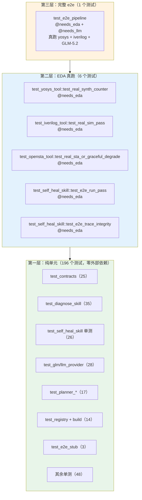
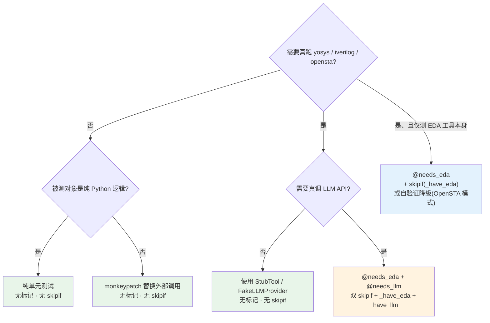

本文档系统阐述 EDA Agent System 的测试框架设计——从 203 个测试函数的分层组织，到 `needs_eda` / `needs_llm` 两个自定义标记的声明、探测与降级策略。你将理解为什么这个项目能在 **有无 EDA 工具、有无 LLM API Key** 的各种环境下都保持"零硬失败"，以及如何为自己的新测试选择正确的依赖层级。

---

## 测试金字塔：三层依赖隔离

项目测试体系遵循一个核心原则：**纯 Python 单测永不被环境依赖阻塞**。通过两个维度将 203 个测试函数划分为三层，每层在不同环境下均可独立运行。



这个金字塔的关键设计在于：**每层的测试都能在该层依赖不满足时优雅降级**，而非整体崩溃。第一层 196 个测试在裸 Python 环境即可全绿；第二层在无 EDA 工具时自动 skip；第三层需要真实 GLM_API_KEY 才触发——三层之间不存在"上层失败拖垮下层"的耦合。

Sources: [01_测试报告.md](../01_测试报告.md#L8-L39), [pyproject.toml](../../pyproject.toml)

---

## 标记注册：pyproject.toml 声明

两个自定义标记在 `pyproject.toml` 的 `[tool.pytest.ini_options]` 中集中声明。这是 pytest 的标准机制：未注册的标记会产生 `PytestUnknownMarkWarning`，而此处显式注册确保了标记的合法性与文档化。

| 标记名称 | 含义 | 涉及测试数 | 探测条件 |
|---|---|---|---|
| `needs_eda` | 需要 yosys / iverilog / opensta 安装 | 6 个 | WSL2 模式查 `wsl.exe`；非 WSL 查本机工具二进制 |
| `needs_llm` | 需要 `GLM_API_KEY` 环境变量（非占位符） | 1 个 | `GLM_API_KEY` 非空、非占位符、长度 ≥ 20 |

标记声明本身只做注册，**真正的 skip 逻辑由每个测试文件中的辅助函数实现**。这是一种刻意的分散设计——不同测试文件对"EDA 是否可用"的判定逻辑可能不同（例如 iverilog 需要同时检查 `iverilog` 和 `vvp`，而 yosys 只需检查一个命令），集中化反而会引入不必要的复杂度。

Sources: [pyproject.toml](../../pyproject.toml)

---

## needs_eda 探测策略

### WSL2 优先 + 本机兜底

项目运行在 Windows 上，EDA 工具通常装在 WSL2 中。每个 `@needs_eda` 测试文件都定义了自己的 `_have_eda()` 辅助函数，按 `settings.toml` 中 `wsl_enabled` 的配置决定探测路径：

```python
# 典型模式（test_iverilog_tool.py）
def _have_eda() -> bool:
    s = Settings()
    if s.eda.wsl_enabled:
        return shutil.which("wsl.exe") is not None
    return (
        shutil.which(s.eda.iverilog_cmd) is not None
        and shutil.which(s.eda.vvp_cmd) is not None
    )
```

这里的核心逻辑是：**如果启用了 WSL 模式，只需要确认 `wsl.exe` 可见**——因为实际调用通过 WSL 子壳中转，工具的具体可用性由运行时 `subprocess` 层处理。非 WSL 模式则直接检查本机 PATH 上是否有对应二进制文件。

不同工具的探测精度略有差异，这是根据工具特性量身定制的：

| 测试文件 | 探测函数 | 检查的二进制 | 策略特点 |
|---|---|---|---|
| `test_iverilog_tool.py` | `_have_eda()` | WSL: `wsl.exe`；本机: `iverilog` + `vvp` | 需要编译器 + 仿真器两个二进制 |
| `test_yosys_tool.py` | `_has_eda()` | WSL: `wsl.exe`；本机: `yosys` | 单一二进制即可 |
| `test_opensta_tool.py` | `_sta_available()` | WSL: `wsl.exe`；本机: `sta` | 单一二进制；**且允许降级测试** |
| `test_self_heal_skill.py` | `_have_eda()` | WSL: `wsl.exe`；本机: `iverilog` + `vvp` + `yosys` | 需要综合 + 仿真双工具 |
| `test_e2e_pipeline.py` | `_have_eda()` | 同 self_heal_skill | 完整 e2e 需要所有 EDA 工具 |

Sources: [test_iverilog_tool.py](../../tests/test_iverilog_tool.py#L145-L150), [test_yosys_tool.py](../../tests/test_yosys_tool.py#L96-L98), [test_opensta_tool.py](../../tests/test_opensta_tool.py#L126-L132), [test_self_heal_skill.py](../../tests/test_self_heal_skill.py#L737-L745), [test_e2e_pipeline.py](../../tests/test_e2e_pipeline.py#L36-L45)

### skipif 装饰器双层防护

每个 `@needs_eda` 测试都采用**标记 + skipif 双层防护**模式。标记用于选择性运行（`pytest -m needs_eda`），skipif 用于环境不具备时自动跳过：

```python
@pytest.mark.needs_eda
@pytest.mark.skipif(not _have_eda(), reason="需要 iverilog/vvp(WSL 或本机)")
def test_real_sim_pass(tmp_path: Path, monkeypatch: pytest.MonkeyPatch) -> None:
    ...
```

OpenSTA 测试有一个特殊设计：它 **不需要 skipif**，而是测试自身验证"优雅降级"——即使 `sta` 不存在，工具也应返回 `sta.sta_unavailable` 错误而非崩溃。这使得该测试在无 EDA 环境下仍可运行，只是验证不同的断言分支：

```python
@pytest.mark.needs_eda
def test_real_sta_or_graceful_degrade(tmp_path: Path) -> None:
    ...
    if not _sta_available():
        # sta 二进制必然缺失 → 必须优雅 error，不该 ok 也不该崩
        assert result.status == "error"
        assert result.error_code.split(".", 1)[0] == "sta"
    else:
        # sta 可用：ok 或 sta.sta_failed；都接受，只要不抛
        assert result.status in ("ok", "error")
```

这种"双重结局"设计体现了系统对 [OpenSTA 时序分析封装与优雅降级](22_OpenSTA时序分析封装.md)原则的端到端验证。

Sources: [test_iverilog_tool.py](../../tests/test_iverilog_tool.py#L153-L154), [test_opensta_tool.py](../../tests/test_opensta_tool.py#L135-L183)

---

## needs_llm 探测策略

### GLM_API_KEY 智能校验

`needs_llm` 标记的探测逻辑比 `needs_eda` 更严格——它不仅检查环境变量是否存在，还排除了常见的占位符模式：

```python
def _have_llm() -> bool:
    key = os.environ.get("GLM_API_KEY", "").strip()
    if not key:
        return False
    if "your-" in key.lower() or "here" in key.lower() or len(key) < 20:
        return False
    return True
```

三层过滤确保 `.env.example` 模板中的占位值（如 `your-zhipu-api-key-here`）不会误触发真实 API 调用。只有当用户填入了合法的智谱 API Key（通常 ≥ 32 字符）时，e2e 全链测试才会真跑——**会产生实际 API 费用**。

该探测仅在 `test_e2e_pipeline.py` 中使用，因为它是唯一需要真实 LLM patch 生成能力的测试。其他涉及 LLM 的测试（如 `test_glm_provider.py`、`test_llm_provider.py`）全部使用 monkeypatch 替换 SDK 的 `create` 方法，**不产生任何网络请求**。

Sources: [test_e2e_pipeline.py](../../tests/test_e2e_pipeline.py#L48-L67)

### 双标记叠加的唯一测试

`test_e2e_pipeline.py::test_counter_bitwidth_baseline_then_self_heal` 是全项目唯一同时携带 `@needs_eda` 和 `@needs_llm` 的测试，也是唯一使用 `@needs_llm` 的测试。它需要双重 skipif 保护：

```python
@pytest.mark.needs_eda
@pytest.mark.needs_llm
@_skip_if_no_eda
@_skip_if_no_llm
def test_counter_bitwidth_baseline_then_self_heal(...):
    ...
```

其中 `_skip_if_no_eda` 和 `_skip_if_no_llm` 在模块级别定义为预构建的 `skipif` 标记，便于复用。这个测试执行完整闭环：baseline 诊断 → LLM 多轮 patch（GLM-5.2 thinking + reasoning_effort=max）→ 独立验证仿真，典型耗时约 500 秒，因此日常 CI 通过 `--deselect tests/test_e2e_pipeline.py` 主动排除。

Sources: [test_e2e_pipeline.py](../../tests/test_e2e_pipeline.py#L103-L107), [01_测试报告.md](../01_测试报告.md#L67-L73)

---

## Stub 架构：无依赖闭环测试

### StubTool + FakeLLMProvider 双重替身

项目的 stub 策略集中在 `tests/_planner_helpers.py` 中，为 [五相状态机：PLANNING 到 DONE 的流转](09_五相状态机Planning到Done.md)的测试提供了完整闭环——**无需任何真实 EDA 工具或 LLM API**。

`StubTool` 按调用顺序消费预设的 `ToolResult` 列表，消费完后可选择循环最后一个结果（`loop_last=True`），避免测试必须预知 Planner 恰好会发起几次调用：

| Stub 工厂 | 用途 | 关键字段 |
|---|---|---|
| `synth_ok()` | yosys 综合成功 | `success=True, num_cells=42` |
| `sim_result(passed, ...)` | iverilog 仿真结果 | `passed, num_passed, num_failed` |
| `diagnose_needs_patch()` | 诊断器需要 patch | `needs_rtl_patch=True` |
| `self_heal_all_pass()` | 自修复全通过 | `convergence_cause="all_pass"` |

`FakeLLMProvider` 同理，按预设队列返回 `LLMResponse`，支持 `raise_on_call` 以测试降级路径。这两个替身使 `test_e2e_stub.py` 中的三个测试覆盖了完整的 Planner 闭环逻辑（包括独立验证步触发、验证失败保持 failed、基线通过跳过 heal），**全程零外部依赖**。

Sources: [_planner_helpers.py](../../tests/_planner_helpers.py#L29-L67), [test_e2e_stub.py](../../tests/test_e2e_stub.py#L1-L65)

### self_heal_skill 内部 FakeLLM

`test_self_heal_skill.py` 定义了自己的 `FakeLLM` 类（与 `_planner_helpers.py` 中的 `FakeLLMProvider` 不同）。这个版本更轻量，按注入的 reply 序列循环返回，用于测试 B 自修复的三策略 patch 逻辑：

```python
class FakeLLM:
    provider_name = "fake"
    def __init__(self, replies: list[str] | None = None) -> None:
        self._replies = list(replies) if replies else [""]
    def chat(self, messages, tools=None, ...):
        self.calls += 1
        text = self._replies[min(self._idx, len(self._replies) - 1)]
        self._idx += 1
        return LLMResponse(text=text, tool_calls=[], ...)
```

关键设计：B 的 e2e 测试（`test_e2e_run_pass`）用 `FakeLLM` 注入修复后的完整 RTL，但仍然 **真跑 yosys + iverilog**（`@needs_eda`）。这隔离了 LLM 的不确定性（API 不可用、生成质量波动），同时保留了 EDA 工具链的真实性——**验证的是闭环机制，而非 LLM 能力**。

Sources: [test_self_heal_skill.py](../../tests/test_self_heal_skill.py#L50-L70), [test_self_heal_skill.py](../../tests/test_self_heal_skill.py#L750-L790)

---

## conftest.py：cwd 自愈机制

`tests/conftest.py` 只包含一个 autouse fixture `_restore_cwd`，但解决了一个隐蔽但致命的问题：**测试间 cwd 污染**。

```python
@pytest.fixture(autouse=True)
def _restore_cwd(_session_root: Path) -> None:
    yield
    try:
        if not Path.cwd().exists():
            import os
            os.chdir(str(_session_root))
    except OSError:
        import os
        os.chdir(str(_session_root))
```

多个测试使用 `os.chdir(tmp_path)`（而非 `monkeypatch.chdir`）切换工作目录。当 pytest 清理 `tmp_path` 后，全局 cwd 会指向已删除的目录，导致后续测试在创建文件时 hang 或崩溃。该 fixture 在每个测试的 teardown 阶段检测当前 cwd 是否仍存在，若不存在则恢复到 session 起始目录（项目根）。

这个 fixture 被设计为 **autouse + 仅在 teardown 恢复**（不主动 chdir），尊重测试内部自己的 cwd 决策，只在出问题时兜底——最小侵入原则。

Sources: [conftest.py](../../tests/conftest.py#L1-L37)

---

## 标记使用速查表

以下是所有 22 个测试文件的标记分布与依赖层级总览，帮助开发者快速定位"为什么某个测试在我的环境被 skip 了"：

| 测试文件 | 测试数 | 标记 | skip 条件 | 无 EDA 时行为 |
|---|---|---|---|---|
| `test_contracts.py` | 25 | — | 无 | 正常运行 |
| `test_diagnose_skill.py` | 35 | — | 无 | 正常运行（FakeLLM） |
| `test_self_heal_skill.py` | 28 | `needs_eda`（2 个） | `_have_eda()` 为 False | 26 个正常运行；2 个 skip |
| `test_glm_provider.py` | 11 | — | 无 | 正常运行（monkeypatch SDK） |
| `test_llm_provider.py` | 11 | — | 无 | 正常运行（monkeypatch SDK） |
| `test_registry.py` | 7 | — | 无 | 正常运行 |
| `test_build_registry.py` | 7 | — | 无 | 正常运行 |
| `test_experiment_manifest.py` | 7 | — | 无 | 正常运行 |
| `test_opensta_tool.py` | 7 | `needs_eda`（1 个） | 无 skipif（自验证降级） | 正常运行（验证 graceful error） |
| `test_iverilog_tool.py` | 7 | `needs_eda`（1 个） | `_have_eda()` 为 False | 6 个正常运行；1 个 skip |
| `test_planner_smoke.py` | 6 | — | 无 | 正常运行（StubTool） |
| `test_planner_limits.py` | 5 | — | 无 | 正常运行（StubTool） |
| `test_action_exec.py` | 6 | — | 无 | 正常运行（StubTool） |
| `test_llm_base.py` | 6 | — | 无 | 正常运行 |
| `test_llm_planner.py` | 6 | — | 无 | 正常运行（FakeLLMProvider） |
| `test_cli_exit_codes.py` | 6 | — | 无 | 正常运行（monkeypatch 全链） |
| `test_self_heal_as_tool_schema.py` | 5 | — | 无 | 正常运行 |
| `test_skill_as_tool.py` | 5 | — | 无 | 正常运行 |
| `test_yosys_tool.py` | 5 | `needs_eda`（1 个） | `_has_eda()` 为 False | 4 个正常运行；1 个 skip |
| `test_budget.py` | 4 | — | 无 | 正常运行（monkeypatch time） |
| `test_e2e_stub.py` | 3 | — | 无 | 正常运行（StubTool 全链） |
| `test_e2e_pipeline.py` | 1 | `needs_eda` + `needs_llm` | 双 skipif | **默认 deselect**；需 GLM_API_KEY 才跑 |

**总计**：203 个测试函数 = 196 个纯单元（零依赖）+ 6 个 `@needs_eda` + 1 个 `@needs_eda + @needs_llm`。在无 EDA 无 API Key 的纯净环境下，运行 `pytest tests/ --deselect tests/test_e2e_pipeline.py` 可获得 **200 passed + 2 skipped** 的全绿基线。

Sources: [01_测试报告.md](../01_测试报告.md#L14-L39)

---

## 编写新测试的决策流程

当你要为新功能编写测试时，参照以下决策树选择正确的依赖层级和标记策略：



三条实操原则：

1. **能用 Stub 就不真跑**：`StubTool` 和 `FakeLLMProvider` 已覆盖绝大多数测试场景。只有当测试目标是"EDA 工具本身能否正确解析输出"或"LLM 能否生成有效 patch"时才需要真跑。
2. **EDA 测试要么 skip 要么自验证降级**：如果你的测试逻辑允许在无工具时验证降级路径（如 OpenSTA 模式），则不加 skipif；否则必须加 `@pytest.mark.skipif(not _have_eda(), ...)`。
3. **LLM 测试默认 monkeypatch**：只有 [端到端数据流：从用户需求到修复报告](06_端到端数据流与修复报告.md)的完整验证才需要真 API 调用，且必须加 `needs_llm` + 占位符过滤。

Sources: [test_opensta_tool.py](../../tests/test_opensta_tool.py#L135-L183), [test_e2e_pipeline.py](../../tests/test_e2e_pipeline.py#L48-L67), [_planner_helpers.py](../../tests/_planner_helpers.py#L29-L67)

---

## 辅助工具：check_no_subprocess.py

除了 pytest 测试套件外，项目还有一个独立运行的架构守卫脚本 `scripts/check_no_subprocess.py`。它通过 AST 遍历（而非 grep）检查 `planner/` 和 `cli.py` 中是否存在两条违规：

| 检查项 | 规则 | 违规示例 |
|---|---|---|
| C1：契约类型重定义 | `planner/` 与 `cli.py` 不得定义 `ToolCall`、`ToolResult`、`RunRequest` 等契约类型 | `class ToolCall:` 出现在 c_planner.py |
| C2：subprocess 泄漏 | `planner/` 与 `cli.py` 不得 import 或调用 `subprocess` 模块 | `import subprocess` 或 `subprocess.run(...)` |

C2 规则确保了 Planner 层只通过注入的 Tool 接口与外部世界交互，EDA 工具的子进程调用被严格封装在 [统一工具注册中心与开闭原则](19_统一工具注册中心.md)的 Tool 层。该脚本在 Phase 4（CPlanner 实现）后作为自动化验收使用，退出码 0 = 干净，1 = 发现违规。

Sources: [check_no_subprocess.py](../../scripts/check_no_subprocess.py#L1-L90)

---

## 延伸阅读

- **测试报告全貌**：`docs/01_测试报告.md` 记录了从 Phase 1 到 Phase 6 的测试数量演进轨迹与验收项覆盖映射。
- **Stub 组件细节**：如需理解 [Skill 到 Tool 的适配层与 reserved 字段拆包](18_Skill到Tool适配层.md)如何被测试覆盖，参考 `test_skill_as_tool.py` 和 `test_self_heal_as_tool_schema.py`。
- **扩展新工具**：为新 EDA 工具编写测试时，参考 [扩展新 EDA 工具的完整指南](31_扩展新EDA工具指南.md)了解如何复用 `_have_eda()` 模式和 `_ok_parsed()` 工厂。