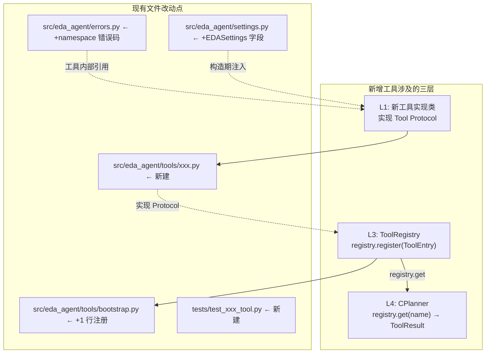
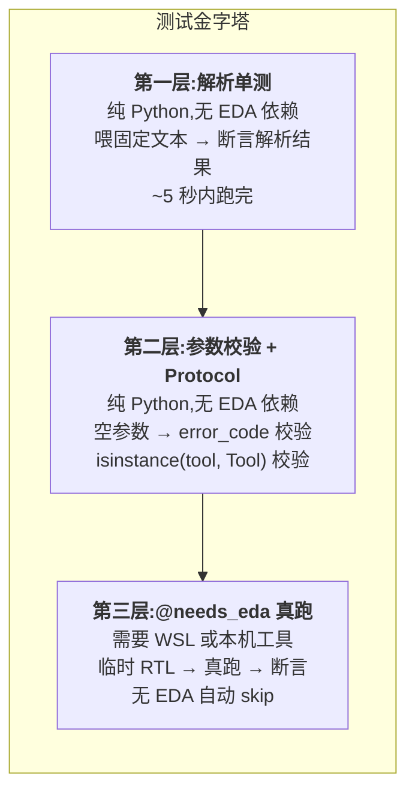
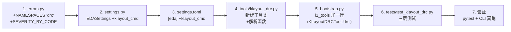

本页是面向中级开发者的实操教程，覆盖从理解 Tool Protocol 契约、编写工具类实现、声明 schema 与错误码，到注册进 Registry、编写分层测试的全部步骤。阅读完本文，你将能够独立为系统添加一个全新的 EDA 工具封装（如 KLayout DRC、nextpnr 布局布线），而无需修改任何核心模块。

---

## 一、开闭原则的架构根基

系统的分层架构确保了"加新工具不改核心"这一设计目标。所有 EDA 工具封装位于 L1 层，它们对外实现 `Tool Protocol`，通过 L3 的 `ToolRegistry` 统一注册发现，供 L4 的 CPlanner 按名调用。新工具只需实现 Protocol、在 `bootstrap.py` 中加一行 `registry.register(...)`，即可被 LLM 通过 `to_llm_tools()` 发现并调用。



核心原则是**显式注册**而非装饰器扫描——在 `bootstrap.py` 中集中调用 `registry.register(...)`，一目了然，避免隐式性带来的调试负担。category 是开放字符串（推荐前缀 `synth / sim / sta / pnr / layout / drc / skill / util`），加新值无需改 `contracts.py` 或 `registry.py`。

Sources: [CONTRACTS.md](../../CONTRACTS.md), [registry.py](../../src/eda_agent/registry.py#L1-L55)

---

## 二、Tool Protocol：必须实现的四个成员

`Tool` 是 `@runtime_checkable Protocol`，你的工具类只需满足以下四个成员即可通过 `isinstance(tool, Tool)` 校验：

| 成员 | 类型 | 说明 |
|---|---|---|
| `name` | `str` | 工具唯一标识，如 `"klayout_drc"`；与 Registry 注册名一致 |
| `description` | `str` | 一句话描述，会作为 LLM 可见的工具说明 |
| `schema` | `dict[str, Any]` | 包含 `name`、`description`、`parsed`（输出形状）、`input_schema`（输入 JSON Schema） |
| `__call__` | `(ToolCall) -> ToolResult` | 执行入口，接收 `ToolCall`、返回 `ToolResult` |

Protocol 的定义在 `contracts.py` 中仅 4 行签名，但 `ToolResult` 的约束极其严格。以下是完整对照：

```python
# contracts.py L101-L107 — Protocol 签名
@runtime_checkable
class Tool(Protocol):
    name: str
    description: str
    schema: dict[str, Any]
    def __call__(self, call: ToolCall) -> ToolResult: ...
```

Sources: [contracts.py](../../src/eda_agent/contracts.py#L101-L107), [CONTRACTS.md](../../CONTRACTS.md)

---

## 三、ToolResult：每一个字段都有契约约束

你的 `__call__` 必须返回一个完整构造的 `ToolResult`。以下是全部字段及其语义：

| 字段 | 类型 | 契约要求 | 常见填法 |
|---|---|---|---|
| `status` | `"ok" \| "error" \| "timeout"` | 三态强制，无 `warning` | 成功→`ok`；失败→`error`；超时→`timeout` |
| `exit_code` | `int \| None` | 子进程退出码；skill 无子进程则 `None` | `proc.returncode` 或校验失败时 `None` |
| `stdout` | `str` | 原文输出（Runner 会做 64KB 裁剪） | `proc.stdout or ""` |
| `stderr` | `str` | 同上 | `proc.stderr or ""` |
| `parsed` | `dict[str, Any]` | **必须含 `_schema` 元字段** | 见下方详解 |
| `artifacts` | `list[dict[str,str]]` | 元素必须是 `artifact_ref(...)` 返回 | `[artifact_ref(run_id, "xxx/result.rpt")]` |
| `duration_s` | `float` | 耗时秒 | `time.monotonic()` 差值 |
| `tool` | `str` | 产生结果的工具名 | 与 `self.name` 一致 |
| `error_code` | `str \| None` | 二段式 `namespace.code` | 成功→`None`；失败→领域码 |
| `error_hint` | `str \| None` | 一行人类可读提示 | 成功→`None`；失败→简述 |

### 3.1 `parsed._schema` 元字段（强制）

每个 `parsed` dict 的第一个 key 必须是 `_schema`，内容固定为：

```python
"_schema": {
    "name": "your_tool_name",         # 与 self.name 一致
    "version": "0.1.0",               # 工具自身版本
    "contract_version": CONTRACT_VERSION,  # 从 contracts 导入，禁止裸字符串
},
```

集成方（CPlanner、诊断器）读 `parsed` 时必须先校验 `_schema.name` 与 `_schema.contract_version`，不匹配则抛 `eda.schema_mismatch`。**所有组件引用 `contract_version` 必须 `from eda_agent.contracts import CONTRACT_VERSION`，禁止裸字符串**。

### 3.2 `artifact_ref` 工厂函数（强制）

`artifacts` 列表的元素**禁止裸 str 路径，禁止裸 dict 字面量**，必须由工厂函数构造：

```python
from eda_agent.contracts import artifact_ref
artifacts = [artifact_ref(run_id, "drc/report.json")]
# → [{"run_id": "20260715_103022_a3f1", "rel_path": "drc/report.json"}]
```

即使工具失败，也按契约固定声明预期的 artifact 路径（如 iverilog 即使编译失败也声明 `sim/wave.vcd`）。

Sources: [contracts.py](../../src/eda_agent/contracts.py#L73-L94), [CONTRACTS.md](../../CONTRACTS.md)

---

## 四、Schema 声明：三段式结构

每个 Tool 类必须声明一个 `schema` 类属性，包含三个子段。以 `YosysSynthTool` 为范例模板：

```python
schema: dict[str, Any] = {
    # ① 元信息段（与 name/description 同步）
    "name": "yosys_synth",
    "description": "综合 Verilog RTL 到网表, stat -json 解析 cell/wire 数",

    # ② parsed 段：声明 ToolResult.parsed 的结构化输出形状
    "parsed": {
        "type": "object",
        "properties": {
            "success": {"type": "boolean"},
            "num_cells": {"type": "integer"},
            # ...
        },
    },

    # ③ input_schema 段：声明 ToolCall.args 的输入形状（供 LLM 调用用）
    "input_schema": {
        "type": "object",
        "properties": {
            "rtl": {"type": "string"},
            "top_module": {"type": "string"},
            "run_id": {"type": "string"},
        },
        "required": ["rtl"],
    },
}
```

### 4.1 关键约定

- `input_schema` 中**下划线前缀字段（`_remaining_budget_s` / `_artifact_ref`）不进 LLM 可见 schema**——`registry.to_llm_tools()` 会自动剥离这些 reserved 字段，你的工具类无需关心。
- `required` 列表只声明非 reserved 必填参数。`run_id` 虽然常见于 `properties`，但通常不进 `required`（有默认值 `"run"`）。
- `parsed` 段的 `properties` 就是你的结构化输出声明——诊断器和 CPlanner 据此理解返回值。

Sources: [yosys_synth.py](../../src/eda_agent/tools/yosys_synth.py#L84-L110), [iverilog_sim.py](../../src/eda_agent/tools/iverilog_sim.py#L116-L140), [registry.py](../../src/eda_agent/registry.py#L57-L93)

---

## 五、错误码：namespace 登记与领域码

新工具必须在 `errors.py` 的 `NAMESPACES` 元组中声明自己的 namespace（如果不存在的话），并在工具文件中定义具体的二段式错误码常量。

### 5.1 现有 namespace 登记表

```python
NAMESPACES: tuple[str, ...] = (
    "eda", "synth", "sim", "sta", "drc", "pnr",
    "llm", "diagnose", "heal",
)
```

### 5.2 添加新 namespace（如 `drc`）的步骤

**步骤 1** — 在 `errors.py` 的 `NAMESPACES` 元组中加入 `"drc"`（如已存在则跳过）。

**步骤 2** — 在 `SEVERITY_BY_CODE` 字典中登记你的错误码与 severity：

```python
SEVERITY_BY_CODE: dict[str, Severity] = {
    # ...现有码...
    "drc.violation": "error",
    "drc.lvs_mismatch": "error",
}
```

**步骤 3** — 在工具文件顶部定义错误码常量（参照 `opensta_timing.py` 的做法）：

```python
# opensta_timing.py L43-L45 的范例
_STA_UNAVAILABLE_CODE = "sta.sta_unavailable"
_STA_FAILED_CODE = "sta.sta_failed"
_STA_NO_LIBERTY_CODE = "sta.no_liberty"
```

### 5.3 工具内部参数校验错误码

参数校验失败（如必填参数缺失）统一使用框架级常量 `EDA_TOOL_ARGS_INVALID`（值 = `"eda.tool_args_invalid"`），从 `errors.py` 导入：

```python
from eda_agent.errors import EDA_TOOL_ARGS_INVALID

if not rtl:
    return ToolResult(
        status="error",
        ...
        error_code=EDA_TOOL_ARGS_INVALID,
        error_hint="rtl required",
    )
```

Sources: [errors.py](../../src/eda_agent/errors.py#L17-L95), [opensta_timing.py](../../src/eda_agent/tools/opensta_timing.py#L43-L45), [CONTRACTS.md](../../CONTRACTS.md)

---

## 六、Settings 扩展：为新工具添加配置

如果你的工具需要配置二进制路径或超时时间，需在 `settings.py` 的 `EDASettings` 中添加字段，并在 `settings.toml` 的 `[eda]` 段中声明默认值。

### 6.1 EDASettings 扩展

```python
# settings.py — 现有字段范例（L43-L50）
@dataclass
class EDASettings:
    wsl_enabled: bool = True
    yosys_cmd: str = "yosys"
    iverilog_cmd: str = "iverilog"
    vvp_cmd: str = "vvp"
    opensta_cmd: str = "sta"
    tool_timeout_s: int = 120
    default_lib_path: str = "data/lib/sky130_xx.lib"
    # 新增字段示例：
    # klayout_cmd: str = "klayout"
```

`EDASettings` 是普通 dataclass，`load_settings()` 的 `_section()` 辅助函数会自动只取 dataclass 认识的字段、忽略 toml 中的额外 key，所以加新字段不会破坏现有配置。

### 6.2 settings.toml 扩展

```toml
[eda]
# 现有字段 ...
klayout_cmd = "klayout"    # 新增
```

Sources: [settings.py](../../src/eda_agent/settings.py#L43-L50), [settings.toml](../../settings.toml), [CONTRACTS.md](../../CONTRACTS.md)

---

## 七、WSL 路径转换与跨平台调用

当前系统的 EDA 工具运行在 WSL2 中（`settings.eda.wsl_enabled = True`）。所有现有工具都实现了同样的 `_to_wsl_path` 辅助函数，将 Windows 路径（`D:\x\y`）转换为 WSL 路径（`/mnt/d/x/y`）。新工具应当复制同样的模式。

### 7.1 路径转换函数

```python
# 三个现有工具中完全一致的实现（yosys_synth.py L40-L52 范例）
def _to_wsl_path(win_path: str) -> str:
    """Windows 路径转 WSL 路径:D:\\x\\y → /mnt/d/x/y。"""
    p = win_path.strip()
    if len(p) >= 2 and p[1] == ":" and p[0].isalpha():
        drive = p[0].lower()
        rest = p[2:].replace("\\", "/")
        if not rest.startswith("/"):
            rest = "/" + rest
        return f"/mnt/{drive}{rest}"
    return p.replace("\\", "/")
```

### 7.2 命令构造模式

```python
# 构造命令列表（iverilog_sim.py L200-L206 范例）
wsl = bool(self.settings.eda.wsl_enabled)

if wsl:
    cmd = [
        "wsl.exe", "-d", "Ubuntu-24.04", "-e",
        self.settings.eda.<your_cmd>,  # 从 settings 取
        <你的参数...>,
    ]
else:
    cmd = [self.settings.eda.<your_cmd>, <你的参数...>]
```

### 7.3 subprocess 调用模板

```python
# 统一编码处理（iverilog_sim.py L208-L211 范例）
try:
    proc = subprocess.run(
        cmd,
        capture_output=True,
        text=True,
        encoding="utf-8",
        errors="replace",
        timeout=self.settings.eda.tool_timeout_s,
    )
except subprocess.TimeoutExpired as e:
    # 构造 timeout ToolResult（见 opensta_timing.py L301-L309）
    ...
except FileNotFoundError:
    # 二进制缺失 → 优雅 error（见 opensta_timing.py L310-L315）
    ...
```

**关键要点**：`encoding="utf-8"` 和 `errors="replace"` 是强制配置，因为 Windows 默认 ANSI(gbk) 解码会在遇到非 ASCII 输出时崩溃。

Sources: [yosys_synth.py](../../src/eda_agent/tools/yosys_synth.py#L40-L52), [iverilog_sim.py](../../src/eda_agent/tools/iverilog_sim.py#L47-L57), [iverilog_sim.py](../../src/eda_agent/tools/iverilog_sim.py#L200-L230), [opensta_timing.py](../../src/eda_agent/tools/opensta_timing.py#L283-L315)

---

## 八、Bootstrap 注册：一行代码接入系统

工具类写完后，在 `bootstrap.py` 的 `build_registry()` 函数中加入注册。这是唯一的集中注册点，**不改 `registry.py` 或 `contracts.py`**。

### 8.1 L1 工具注册模板

```python
# bootstrap.py L37-L52 的现有模式
l1_tools = [
    (YosysSynthTool(settings), "yosys_synth", "synth"),
    (IverilogSimTool(settings), "iverilog_sim", "sim"),
    (OpenSTATimingTool(settings), "opensta_timing", "sta"),
    # ↓↓↓ 新工具加在这里 ↓↓↓
    (KLayoutDRCTool(settings), "klayout_drc", "drc"),
]
for tool, name, category in l1_tools:
    registry.register(
        ToolEntry(
            tool=tool,
            name=name,
            category=category,
            schema=tool.schema["input_schema"],
            parsed_schema_ref={"name": name, "version": _SCHEMA_VERSION},
        )
    )
```

### 8.2 ToolEntry 字段说明

| 字段 | 来源 | 说明 |
|---|---|---|
| `tool` | 新建的工具实例 | 持 `settings`，不持 `provider`（L1 规则） |
| `name` | 字符串 | 与 `tool.name` 一致，LLM 调用时用此名 |
| `category` | 开放字符串 | 推荐前缀 `synth/sim/sta/pnr/drc/...` |
| `schema` | `tool.schema["input_schema"]` | **取 `input_schema` 子段**，非整个 schema dict |
| `parsed_schema_ref` | `{"name": ..., "version": ...}` | 版本锚点，供 schema 漂移检测 |

**重要提醒**：`schema=tool.schema["input_schema"]` 只传 `input_schema` 子段。`registry.to_llm_tools()` 把 `input_schema` 作为 `input_schema` 输出给 LLM；`description` 从 `Tool.description` 属性直接读取。

Sources: [bootstrap.py](../../src/eda_agent/tools/bootstrap.py#L37-L52), [registry.py](../../src/eda_agent/registry.py#L15-L22), [CONTRACTS.md](../../CONTRACTS.md)

---

## 九、测试策略：三层测试金字塔

现有三个工具的测试文件展现了统一的测试分层策略。新工具必须覆盖所有三层：



### 9.1 第一层：解析函数单测

把解析逻辑抽取为模块级函数（如 `_parse_stat_json`、`_parse_tb_protocol`、`_parse_sta_report`），直接喂文本字符串断言：

```python
# test_yosys_tool.py L21-L49 的范例
def test_parse_stat_json_extracts_module_fields() -> None:
    stdout = '...yosys log...\n{"modules": {"\\\\counter": {"num_cells": 24, ...}}}'
    obj = _parse_stat_json(stdout)
    assert obj is not None
    assert obj["modules"]["\\counter"]["num_cells"] == 24
```

### 9.2 第二层：参数校验与 Protocol 测试

```python
# test_iverilog_tool.py L68-L90 的范例
def test_tool_satisfies_protocol():
    """IverilogSimTool 实例满足 Tool Protocol(runtime_checkable)。"""
    t = IverilogSimTool(Settings())
    assert t.name == "iverilog_sim"
    assert isinstance(t, Tool)
    assert t.schema["input_schema"]["required"] == ["rtl", "tb"]

def test_empty_args_rejected():
    """rtl/tb 空 → status=error / error_code=eda.tool_args_invalid。"""
    t = IverilogSimTool(Settings())
    res = t(ToolCall(name="iverilog_sim", args={"rtl": "", "tb": ""}))
    assert res.status == "error"
    assert res.error_code == "eda.tool_args_invalid"
    assert res.parsed["_schema"]["contract_version"] == CONTRACT_VERSION
```

### 9.3 第三层：`@needs_eda` 标记的真跑测试

真跑测试必须遵循统一的 skip 机制与双结局策略：

```python
# test_opensta_tool.py L126-L183 的范例

def _sta_available() -> bool:
    """本机或 WSL 有 sta 任一可用即视为可真跑。"""
    return bool(shutil.which("wsl.exe")) or bool(shutil.which("sta"))

@pytest.mark.needs_eda
def test_real_sta_or_graceful_degrade(tmp_path: Path) -> None:
    rtl_path = tmp_path / "counter.v"
    rtl_path.write_text(COUNTER_V, encoding="utf-8")

    tool = OpenSTATimingTool(settings)
    call = ToolCall(name="opensta_timing", args={"rtl": str(rtl_path), ...})
    result = tool(call)

    if not _sta_available():
        # 未装 → 必须优雅 error,不该崩
        assert result.status == "error"
        assert result.error_code.split(".", 1)[0] == "sta"
        assert result.parsed["_schema"]["name"] == "opensta_timing"
    else:
        # 装了 → ok 或可接受的失败,只要不抛
        assert result.status in ("ok", "error")
```

### 9.4 测试 checklist

| 检查项 | 说明 |
|---|---|
| 模块级解析函数 | 抽取为 `_parse_xxx(text)` 形式，便于无 EDA 纯单测 |
| 空文本容错 | 解析空文本返回 None / []，不抛异常 |
| `isinstance(tool, Tool)` | Protocol 满足性验证 |
| 空参数校验 | 必填参数缺失 → `status="error"`, `error_code=EDA_TOOL_ARGS_INVALID` |
| `_schema` 合规 | 校验失败时 `parsed._schema` 仍带 `contract_version = CONTRACT_VERSION` |
| artifact 固定声明 | 即使失败也声明预期的 artifact 路径 |
| `@needs_eda` 标记 | 真跑测试标记 `@pytest.mark.needs_eda` |
| 无 EDA 自动 skip | `_have_eda()` 返回 False 时 `pytest.skip` |
| 双结局策略 | 未装工具时验证优雅 error，不视为 fail |

Sources: [test_yosys_tool.py](../../tests/test_yosys_tool.py#L21-L49), [test_iverilog_tool.py](../../tests/test_iverilog_tool.py#L68-L90), [test_opensta_tool.py](../../tests/test_opensta_tool.py#L126-L183)

---

## 十、完整实操案例：添加 KLayout DRC 工具

将上述所有步骤串联为一个完整的实操流程：



### 10.1 新工具文件骨架（`src/eda_agent/tools/klayout_drc.py`）

```python
"""KLayoutDRCTool — KLayout DRC 检查(契约 §2.1 Tool Protocol)。

封装 klayout -b -r <drc_script>，解析 violations 数量。
跨 WSL 调用:settings.eda.wsl_enabled=True 时命令前缀
["wsl.exe","-d","Ubuntu-24.04","-e","klayout", ...]。
"""
from __future__ import annotations

import re
import subprocess
import time
from pathlib import Path
from typing import Any

from eda_agent.contracts import (
    CONTRACT_VERSION, ToolCall, ToolResult, artifact_ref,
)
from eda_agent.errors import (
    EDA_SUBPROCESS_TIMEOUT, EDA_TOOL_ARGS_INVALID,
)
from eda_agent.settings import Settings

# 领域错误码（参照 opensta_timing.py L43-L45 模式）
_DRC_UNAVAILABLE_CODE = "drc.klayout_unavailable"
_DRC_FAILED_CODE = "drc.failed"
_DRC_VIOLATION_CODE = "drc.violation"

# 解析正则（模块级,便于单测）
_VIOLATION_RE = re.compile(r"violations:\s*(\d+)", re.IGNORECASE)


def _to_wsl_path(win_path: str) -> str:
    """Windows 路径 → WSL 路径(同 yosys/iverilog/opensta)。"""
    p = win_path.strip()
    if len(p) >= 2 and p[1] == ":" and p[0].isalpha():
        drive = p[0].lower()
        rest = p[2:].replace("\\", "/")
        if not rest.startswith("/"):
            rest = "/" + rest
        return f"/mnt/{drive}{rest}"
    return p.replace("\\", "/")


def _parse_drc_report(text: str) -> dict[str, Any]:
    """从 klayout stdout 解析 DRC 违例数(模块级,便于单测)。"""
    out: dict[str, Any] = {"num_violations": 0, "violations": []}
    if not text:
        return out
    m = _VIOLATION_RE.search(text)
    if m:
        out["num_violations"] = int(m.group(1))
    return out


class KLayoutDRCTool:
    """Tool Protocol 实现:跑 KLayout DRC,解析违例数。"""

    name = "klayout_drc"
    description = "KLayout DRC 检查,解析违例数与详情"
    schema: dict[str, Any] = {
        "name": "klayout_drc",
        "description": "KLayout DRC 检查,解析违例数与详情",
        "parsed": {
            "type": "object",
            "properties": {
                "success": {"type": "boolean"},
                "num_violations": {"type": "integer"},
                "violations": {"type": "array", "items": {"type": "string"}},
                "script_used": {"type": "string"},
            },
        },
        "input_schema": {
            "type": "object",
            "properties": {
                "gds": {"type": "string"},
                "run_id": {"type": "string"},
            },
            "required": ["gds"],
        },
    }

    def __init__(self, settings: Settings) -> None:
        self.settings = settings

    def __call__(self, call: ToolCall) -> ToolResult:
        t0 = time.monotonic()
        tool = self.name
        gds = call.args.get("gds")
        run_id = call.args.get("run_id", "run")

        # ── 1. 参数校验 ──
        if not gds:
            return ToolResult(
                status="error", exit_code=None, stdout="", stderr="",
                parsed={
                    "_schema": {"name": tool, "version": "0.1.0",
                                "contract_version": CONTRACT_VERSION},
                    "success": False, "num_violations": 0,
                    "violations": [], "script_used": "",
                },
                artifacts=[artifact_ref(run_id, "drc/report.json")],
                duration_s=0.0, tool=tool,
                error_code=EDA_TOOL_ARGS_INVALID,
                error_hint="gds required",
            )

        # ── 2. 工作目录 + WSL 路径 ──
        work_dir = Path("runs") / str(run_id) / "drc"
        work_dir.mkdir(parents=True, exist_ok=True)
        wsl = bool(self.settings.eda.wsl_enabled)
        gds_w = _to_wsl_path(str(gds)) if wsl else str(gds)

        # ── 3. 构造命令 ──
        if wsl:
            cmd = ["wsl.exe", "-d", "Ubuntu-24.04", "-e",
                   self.settings.eda.klayout_cmd, "-b", "-r", gds_w]
        else:
            cmd = [self.settings.eda.klayout_cmd, "-b", "-r", str(gds)]

        # ── 4. 执行 ──
        try:
            proc = subprocess.run(
                cmd, capture_output=True, text=True,
                encoding="utf-8", errors="replace",
                timeout=self.settings.eda.tool_timeout_s,
            )
        except subprocess.TimeoutExpired:
            return ToolResult(
                status="timeout", ...,
                error_code=EDA_SUBPROCESS_TIMEOUT,
                error_hint=f"timeout after {self.settings.eda.tool_timeout_s}s",
            )
        except FileNotFoundError:
            return ToolResult(
                status="error", ...,
                error_code=_DRC_UNAVAILABLE_CODE,
                error_hint="klayout binary not found",
            )

        # ── 5. 解析 + 组装 ToolResult ──
        parsed_proto = _parse_drc_report(proc.stdout or "")
        success = proc.returncode == 0
        # ... 组装 parsed, artifacts, error_code ...

        return ToolResult(
            status="ok" if success else "error",
            exit_code=proc.returncode,
            stdout=proc.stdout or "",
            stderr=proc.stderr or "",
            parsed={...},
            artifacts=[artifact_ref(run_id, "drc/report.json")],
            duration_s=float(time.monotonic() - t0),
            tool=tool,
            error_code=None if success else _DRC_FAILED_CODE,
            error_hint=None if success else "klayout DRC failed",
        )


# Protocol 满足性断言（同 iverilog_sim.py L315）
from eda_agent.contracts import Tool
assert isinstance(KLayoutDRCTool(Settings()), Tool)
```

### 10.2 bootstrap.py 注册变更

在 `l1_tools` 列表中追加一行：

```python
l1_tools = [
    (YosysSynthTool(settings), "yosys_synth", "synth"),
    (IverilogSimTool(settings), "iverilog_sim", "sim"),
    (OpenSTATimingTool(settings), "opensta_timing", "sta"),
    (KLayoutDRCTool(settings), "klayout_drc", "drc"),  # ← 新增
]
```

### 10.3 注册后自动生效的路径

注册完成后，新工具会被以下机制自动消费：

1. **LLM 发现**：`registry.to_llm_tools()` 自动把 `klayout_drc` 的 `input_schema` + `description` 翻译为 LLM provider 的工具描述，LLM 可以自主决定调用它。
2. **CPlanner 调用**：CPlanner 通过 `registry.get("klayout_drc")` 取到 Tool 实例执行；若 LLM 幻觉调用了不存在的工具名，`registry.get` 返回 `None`，CPlanner 构造 `eda.tool_not_found` 的 ToolResult 回灌——不抛异常。
3. **诊断器消费**：`skill_diagnose` 的 `root_causes` 可以引用 `"drc.*"` namespace 的 ErrorItem，因为 namespace 聚类机制对开放 namespace 天然兼容。
4. **工件追溯**：ToolResult 的 `artifacts` 经 `Runner.append_step` 自动落盘到 `runs/<run_id>/steps/<idx>_klayout_drc/` 目录。

Sources: [bootstrap.py](../../src/eda_agent/tools/bootstrap.py#L37-L52), [contracts.py](../../src/eda_agent/contracts.py#L101-L107), [iverilog_sim.py](../../src/eda_agent/tools/iverilog_sim.py#L313-L315), [CONTRACTS.md](../../CONTRACTS.md)

---

## 十一、检查清单与常见陷阱

| 检查项 | 常见错误 | 正确做法 |
|---|---|---|
| `parsed._schema.contract_version` | 裸字符串 `"0.1.0"` | `from eda_agent.contracts import CONTRACT_VERSION` |
| `artifacts` 元素 | 裸 `{"run_id": ..., "rel_path": ...}` 字面量 | `artifact_ref(run_id, rel_path)` |
| `subprocess` 编码 | 省略 `encoding`/`errors` 参数 | `encoding="utf-8", errors="replace"` |
| `FileNotFoundError` | 未捕获导致进程崩溃 | 捕获 → 构造 `*_unavailable` 错误码的 ToolResult |
| `TimeoutExpired` | 未捕获或未设 timeout | 捕获 → `status="timeout"` + `EDA_SUBPROCESS_TIMEOUT` |
| 注册 `schema` 传值 | 传整个 `tool.schema` dict | 传 `tool.schema["input_schema"]` 子段 |
| 工具持有 `provider` | L1 工具构造时注入 LLMProvider | L1 工具只持 `settings`；`provider` 是 L2 Skill 的特权 |
| 测试 `@needs_eda` | 真跑测试不加标记 | `@pytest.mark.needs_eda` + `_have_eda()` skip 守卫 |
| `_to_wsl_path` | 新工具不复制此函数 | 从现有工具复制同一份实现（三份代码完全一致） |
| `category` 值 | 硬编码 Literal 类型 | 开放字符串，直接写 `"drc"` |

Sources: [errors.py](../../src/eda_agent/errors.py#L1-L95), [bootstrap.py](../../src/eda_agent/tools/bootstrap.py#L10-L18), [iverilog_sim.py](../../src/eda_agent/tools/iverilog_sim.py#L207-L230)

---

## 十二、后续阅读

完成工具扩展后，建议按以下顺序深入理解相关系统：

- [统一工具注册中心与开闭原则](19_统一工具注册中心.md) — Registry 的完整 API 与 reserved 字段剥离机制
- [Yosys 综合工具与 stat-json 解析](20_Yosys综合工具stat-json解析.md) — L1 工具封装的最佳范例
- [OpenSTA 时序分析封装与优雅降级](22_OpenSTA时序分析封装.md) — 工具未安装时的优雅 error 处理范式
- [测试框架与 needs_eda / needs_llm 标记策略](30_测试框架needs_eda标记策略.md) — 分层测试标记的完整说明
- [Skill 到 Tool 的适配层与 reserved 字段拆包](18_Skill到Tool适配层.md) — 如果新工具是 skill 而非子进程封装